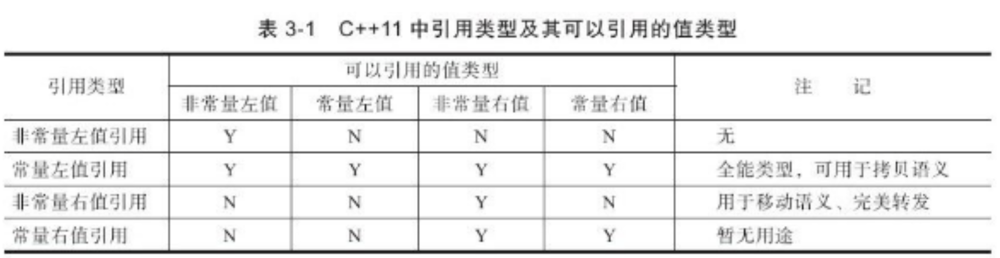

## 左值与右值的区分
在C++中，所有的值均被分为左值与右值之一。左值是指表达式结束后依然存在的**持久化对象**，右值是指表达式结束时就不再存在的**临时对象**。所有的具名变量或者对象都是左值，而右值不具名。有一个很简单的方法区别左值与右值，**观察是否可以对表达式进行取地址，如果能，则为左值，否则为右值。**
```C++
int func() {return func;}
int a = 1 + 2;
int b = func();
int c = a + b;
int d = c;
```
<!-- more -->
如上图所示，第2行的 a显然是左值，而(1 + 2)产生的临时变量值则为右值。同理第3行的b为左值，而func()的返回值同样是一个临时变量，为右值。第4行的c为左值，而(a+b)作为临时变量则为右值，而第5行中，d与c都为左值。套用上述的区别方法，a,b,c,d变量均可以进行取地址操作，而(1+2), func()返回值, (a+b)我们都无法取其地址。
如书中记载，在C++11中，右值分为**纯右值**与**将亡值**。纯右值指的就是我们上述所描述的各类临时变量。而将亡值则是c++11新增的和右值引用相关的表达式，这样的表达式通常时将要移动的对象、T&&函数返回值、std::move()函数的返回值等，将亡值与纯右值均为右值，使用没有任何区别。
## 左值引用与右值引用
在C++11前引用已经非常常见了，就是给变量取了一个别名，如下所示。
```C++
int b = 1;
int &a = b;
int &c = 2;   //编译错误!
```
需注意，在定义左值引用的同时，我们不能将右值绑定至左值引用上，如上面第3行代码所示。
而C++的右值引用同左值引用相似，则使用 && 来表示。
```C++
int func() {return 1;}
int && a = 1;
int && b = (1 + 2) * 3;
int && c = func();
int && d = a;    //编译错误!
```
同左值引用相同，在定义右值引用的同时，我们不能将左值绑定在右值引用上，如上面第5行所示。
也就是说，右值引用只能绑定右值，左值引用只能绑定左值。
若希望将一个左值绑定到右值引用，则可以使用**移动语义**`std::move()`将左值转换为右值，例如:
```C++
int a = 1;
int &&b = std::move(a);  //编译通过
```
但是注意，**使用移动移动语义转移对象a后，a不可再次被使用**!
除了普通引用，还有一类我们经常使用到的引用，**常量左值引用**。大家可以显而易见的发现，常量左值引用是个“万能”的引用类型。它可以接受非常量左值、常量左值、右值对其进行初始化。但是在它的存活时期中，它只能是可读的。我们常在函数参数中使用到它，如下所示。
```C++
void func(const string &str) {
	cout << str << endl;
}

int main(int argc, char *argv[]) {
	string s1("1234");
	const string s2("1234");
	func(s1);                  //非常量左值
	func(s2);                  //常量左值
	func(string("1234"));      //右值
	return 0;
}
```
在如上介绍中很容易可以得出一下结论(转载图片)：
