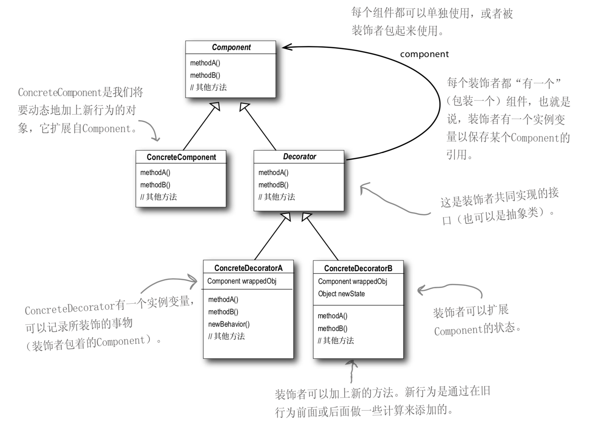

## 什么是装饰器模式
装饰器模式（Decorator）,动态地给一个对象添加一些额外的职责，就增加功能来说，装饰器模式比生成子类更为灵活；它允许向一个现有的对象添加新的功能，同时又不改变其结构。
## 类图

Component：接口，定义一个抽象接口，真实对象和装饰对象具有相同的接口，以便动态的添加职责。
ConcreteComponent：具体的对象。
Decorator：装饰类，继承了Component,从外类来扩展Component类的功能，并且持有一个构建引用，进行请求转发。
ConcreteDecorator：具体装饰类，用于给实际对象添加职责。

## 代码实现
现在考虑这样一个场景，现在有一个煎饼摊，人们去买煎饼（Pancake）,有些人要加火腿（Ham）的，有些人要加鸡蛋（Egg）的，有些人要加生菜（Lettuce）的，当然土豪可能有啥全给加上^_^。用上述的装饰器模式来进行编码。
1. 定义煎饼接口IPancake
```java
/**
 * 定义一个煎饼接口
 */
public interface IPancake {
    /**
     * 定义烹饪的操作
     */
    void cook();
}
```

2. 定义具体的煎饼Pancake
```java
/**
 * 具体的煎饼对象，可用其他装饰类进行动态扩展。
 */
public class Pancake implements IPancake{
    public void cook() {
        System.out.println("的煎饼");
    }
}
```

3. 定义抽象装饰类PancakeDecorator
```java
/**
 * 实现接口的抽象装饰类，建议设置成abstract.
 */
public abstract  class PancakeDecorator implements IPancake {
    
    private IPancake pancake;

    public PancakeDecorator(IPancake pancake) {
        this.pancake = pancake;
    }

    public void cook() {
        if (this.pancake != null) {
            pancake.cook();
        }
    }
}
```

4. 具体装饰类EggDecorator
```java
/**
 * 对煎饼加鸡蛋的装饰类，继承PancakeDecorator，覆盖cook操作
 */
public class EggDecorator extends PancakeDecorator {
    public EggDecorator(IPancake pancake) {
        super(pancake);
    }

    /**
     * 覆盖cook方法，加入自身的实现，并且调用父类的cook方法，也就是构造函数中
     * EggDecorator(IPancake pancake)，这里传入的pancake的cook操作
     */
    @Override
    public void cook() {
        System.out.println("加了一个鸡蛋，");
        super.cook();
   }
}
```
5. 具体装饰类HamDecorator
```java
/**
 * 对煎饼加火腿的装饰类，继承PancakeDecorator，覆盖cook操作
 */
public class HamDecorator extends PancakeDecorator {
    public HamDecorator(IPancake pancake) {
        super(pancake);
    }

    /**
     * 覆盖cook方法，加入自身的实现，并且调用父类的cook方法，也就是构造函数中
     * EggDecorator(IPancake pancake)，这里传入的pancake的cook操作
     */
    @Override
    public void cook() {
        System.out.println("加了一根火腿，");
        super.cook();
    }
}
```

6. 具体装饰类LettuceDecorator
```java
/**
 * 对煎饼加生菜的装饰类，继承PancakeDecorator，覆盖cook操作
 */
public class LettuceDecorator extends PancakeDecorator {
    public LettuceDecorator(IPancake pancake) {
        super(pancake);
    }

    /**
     * 覆盖cook方法，加入自身的实现，并且调用父类的cook方法，也就是构造函数中
     * EggDecorator(IPancake pancake)，这里传入的pancake的cook操作
     */
    @Override
    public void cook() {
        System.out.println("加了一颗生菜，");
        super.cook();
    }
}
```

7. 客户端调用以及结果
```java
/**
 * 调用客户端
 */
public class Client {
    public static void main(String[] args) {
        System.out.println("=========我是土豪都给我加上===========");
        IPancake pancake = new Pancake();
        IPancake pancakeWithEgg = new EggDecorator(pancake);
        IPancake pancakeWithEggAndHam = new HamDecorator(pancakeWithEgg);
        IPancake panckeWithEggAndHamAndLettuce = new LettuceDecorator(pancakeWithEggAndHam);
        panckeWithEggAndHamAndLettuce.cook();

        System.out.println("==========我是程序猿，加两个鸡蛋补补==============");
        IPancake pancake2 = new Pancake();
        IPancake pancakeWithEgg2 = new EggDecorator(pancake2);
        IPancake pancakeWithTwoEgg = new EggDecorator(pancakeWithEgg2);
        pancakeWithTwoEgg.cook();
    }
}
```

输出结果
```bash
=========我是土豪都给我加上===========
加了一颗生菜，
加了一根火腿，
加了一个鸡蛋，
的煎饼
==========我是程序猿，加两个鸡蛋补补==============
加了一个鸡蛋，
加了一个鸡蛋，
的煎饼
```
四. 总结
关于装饰器模式的使用，在我看来主要有一下几点需要注意的:
    * 抽象装饰器和具体被装饰的对象实现同一个接口
    * 抽象装饰器里面要持有接口对象，以便请求传递
    * 具体装饰器覆盖抽象装饰器方法并用super进行调用，传递请求
    
1. 适用场景
    * 扩展一个类的功能。
    * 动态添加功能，动态撤销。
2. 优点
    * 装饰类和被装饰类都只关心自身的核心业务，实现了解耦。
    * 方便动态的扩展功能，且提供了比继承更多的灵活性。
3. 缺点
    * 如果功能扩展过多，势必产生大量的类。
    * 多层装饰比较复杂。

转自：https://brightloong.github.io/