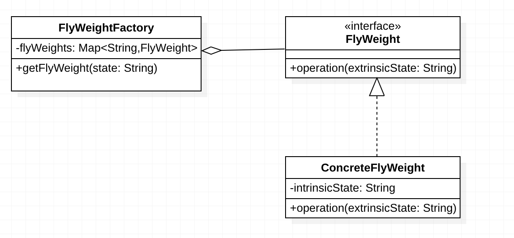
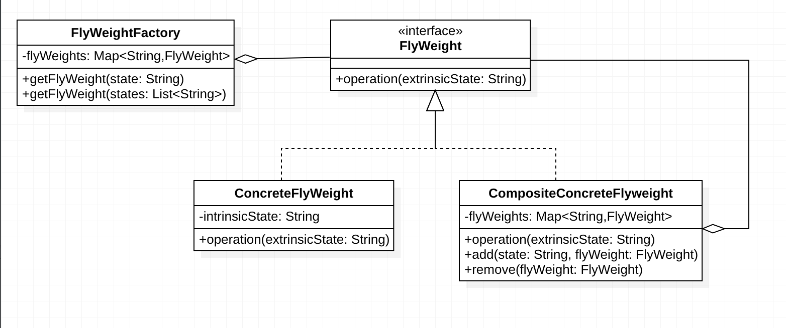

## 什么是享元模式
享元模式（Flyweight Pattern） ,运用**共享技术**有效的支持大量的细粒度对象。换句话说，使用享元模式对相同或者类似的**对象进行复用**，以此来减少少相同或者类似的对象的创建数量，从而减少内存占用，提高性能。

在学习享元模式之前需要先了解一下 细粒度 和享元对象中的 内部状态、外部状态 这三个概念：

* 内部状态：不随环境改变而改变的状态，内部状态可以共享，例如人的性别，不管任何环境下都不会改变
* 外部状态：随着环境改变而改变的状态，不可以共享的状态，享元对象的外部状态通常由客户端保存，并在享元对象创建后，需要的时候传入享元对象内部，不同的外部状态是相互独立的。例如衣服和鞋子，人在不同的环境下会穿不同的衣服和鞋子，但是衣服和鞋子又是相互独立不受彼此影响的
* 细粒度：较小的对象，所包含的内部状态较小

## 单纯享元模式
单纯享元模式，也就是说所有的具体享元类都是可以被共享的，不存在不可以共享的具体享元类。
### 类图

* FlyWeight:享元类的接口，接口中operation方法中的extrinsicState为外部状态。
* ConcreteFlyWeight:具体的享元类，实现接口FlyWeight,存储内部状态intrinsicState。
* FlyWeightFactory:享元工厂，用来创建和管理享元对象，其主要思想就是用一个Map来保存已经创建的对象实例。它主要是用来确保合理的共享FlyWeight对象，当用户请求一个FlyWeight对象时（getFlyWeight()方法），工厂提供一个已经存在的FlyWeight实例，如果不存在则创建一个返回。

### 代码实现
享元类接口——FlyWeight
```java
/**
 * FlyWeight class
 * 定义享元类接口
 */
public interface FlyWeight {
    /**
     * 操作方法.
     * @param extrinsicState 外部状态
     */
    public void operation(String extrinsicState);
}
```
具体享元实现——ConcreteFlyWeight
```java
/**
 * ConcreteFlyWeight class
 */
public class ConcreteFlyWeight implements FlyWeight {

    /**内部状态*/
    private String intrinsicState;

    /**
     * 构造方法，并设置内部状态.
     * @param intrinsicState
     */
    public  ConcreteFlyWeight(String intrinsicState) {
        this.intrinsicState = intrinsicState;
    }

    @Override
    public void operation(String extrinsicState) {
        System.out.println("内部状态：" + intrinsicState);
        System.out.println("外部状态：" + extrinsicState);
    }
}
```
享元工厂——FlyWeightFactory
```java
/**
 * FlyWeightFactory class
 * 用于创建和管理享元对象，本身是单例的。
 */
public class FlyWeightFactory {

    /**唯一的factory实例*/
    private static FlyWeightFactory factory = new FlyWeightFactory();

    /**用于保存享元对象的map*/
    private Map<String, FlyWeight> flyWeights = new HashMap<>();

    /**
     * 私有的构造函数
     */
    private FlyWeightFactory() {}

    /**
     * 返回FlyWeightFactory唯一实例.
     * @return
     */
    public static FlyWeightFactory getInstance() {
        return factory;
    }

    /**
     * 单纯享元模式工厂方法.
     * @param state key
     * @return
     */
    public FlyWeight getFlyWeight(String state) {
        FlyWeight flyWeight = flyWeights.get(state);
        if (flyWeight == null) {
            flyWeight = new ConcreteFlyWeight(state);
            flyWeights.put(state, flyWeight);
        }
        return flyWeight;
    }
}
```
客户端调用和输出
```java
public class Client {
    public static void main(String[] args) {
        FlyWeightFactory factory = FlyWeightFactory.getInstance();
        FlyWeight flyWeight1 = factory.getFlyWeight("a");
        FlyWeight flyWeight2 = factory.getFlyWeight("b");
        FlyWeight flyWeight3 = factory.getFlyWeight("a");
        FlyWeight flyWeight4 = factory.getFlyWeight("c");

        //flyWeight1和flyWeight3具有相同的内部状态a,使用同一个实例，下面结果输出true
        System.out.println(flyWeight1 == flyWeight3);

        //不同的外部状态从方法传入
        flyWeight2.operation("hello");
        flyWeight2.operation("hi");
    }
}
```
```bash
true
内部状态：b
外部状态：hello
内部状态：b
外部状态：hi
```

## 复合享元模式
复合享元模式，将一些单纯享元使用组合模式加以组合，可以形成复合享元对象，这样的复合享元对象本身不能共享，但是它们可以分解成单纯享元对象，而后者则可以共享。

复合享元模式中，组成复合享元对象的每个单纯享元对象拥有自己的内部状态，而每个单纯享元对象的外部状态都和复合享元对象的外部状态相同。**所以复合享元模式可以对多个单纯享元对象设置相同的外部状态**， 这也是复合享元模式的应用场景。
### 类图

FlyWeight:享元类的接口，接口中operation方法中的extrinsicState为外部状态,是单纯享元类和复合享元类的共同接口。
ConcreteFlyWeight:具体的享元类，实现接口FlyWeight,存储内部状态intrinsicState。
CompositeConcreteFlyweight：复合享元类，实现FlyWeight接口，同时使用Map来保存单纯享元对象，并提供add()和remove()方法来增加或者删除单纯享元对象。
FlyWeightFactory:享元工厂，用来创建和管理享元对象，其主要思想就是用一个Map来保存已经创建的对象实例。它主要是用来确保合理的共享FlyWeight对象。
    * getFlyWeight(state:String):单纯享元工厂方法，当用户请求一个FlyWeight对象时，工厂提供一个已经存在的FlyWeight实例，如果不存在则创建一个返回(直接返回单纯享元对象)。
    * getFlyWeight(states:List):复合享元工厂方法，根据提供的states:List，使用add()方法，将每个state对应的单纯享元对象添加到复合享元对象（CompositeConcreteFlyweight）的flyWeights中，并且这些单纯享元对象是从FlyWeightFactory的flyWeights中获取的（如果不存在则添加并返回），因此这些单纯享元对象是可以共享的。

### 代码实现

复合享元类——CompositeConcreteFlyweight
```java
/**
 * CompositeConcreteFlyweight class
 *
 */
public class CompositeConcreteFlyweight implements FlyWeight {
    Map<String, FlyWeight> flyWeights = new HashMap<>();

    /**
     * flyWeights是单纯享元对象的集合，它们具有相同的外部状态extrinsicState，
     * 调用的时候使用循环调用单纯享元对象的operation方法
     * @param extrinsicState 外部状态
     */
    @Override
    public void operation(String extrinsicState) {
        for (Map.Entry<String, FlyWeight> entry : flyWeights.entrySet()) {
            entry.getValue().operation(extrinsicState);
        }
    }

    /**
     * 添加单纯享元对象.
     * @param state
     * @param flyWeight
     */
    public void add(String state, FlyWeight flyWeight) {
        flyWeights.put(state, flyWeight);
    }

    /**
     * 移除单纯享元对象.
     * @param state
     */
    private void remove(String state) {
        flyWeights.remove(state);
    }
}
```
修改后的享元工厂——FlyWeightFactory
```java
/**
 * FlyWeightFactory class
 * 用于创建和管理享元对象，本身是单例的。
 */
public class FlyWeightFactory {

    /**唯一的factory实例*/
    private static FlyWeightFactory factory = new FlyWeightFactory();

    /**用于保存享元对象的map*/
    private Map<String, FlyWeight> flyWeights = new HashMap<>();

    /**
     * 私有的构造函数
     */
    private FlyWeightFactory() {}

    /**
     * 返回FlyWeightFactory唯一实例.
     * @return
     */
    public static FlyWeightFactory getInstance() {
        return factory;
    }

    /**
     * 单纯享元模式工厂方法.
     * @param state key
     * @return
     */
    public FlyWeight getFlyWeight(String state) {
        FlyWeight flyWeight = flyWeights.get(state);
        if (flyWeight == null) {
            flyWeight = new ConcreteFlyWeight(state);
            flyWeights.put(state, flyWeight);
        }
        return flyWeight;
    }

    /**
     * 复合享元模式工厂方法.
     * @param states
     * @return
     */
    public FlyWeight getFlyWeight(List<String> states) {
        CompositeConcreteFlyweight flyWeight = new CompositeConcreteFlyweight();
        for (String state : states) {
            //调用了单纯享元模式工厂方法,所以使用flyWeight.add加入的单纯享元对象是可以共享的
            flyWeight.add(state, this.getFlyWeight(state));
        }

        return flyWeight;
    }
}
```
客户端调用和输出
```java
public class Client2 {
    public static void main(String[] args) {
        FlyWeightFactory factory = FlyWeightFactory.getInstance();
        List<String> states = new ArrayList<>();
        states.add("a");
        states.add("b");
        states.add("c");
        FlyWeight flyWeight = factory.getFlyWeight(states);
        FlyWeight flyWeight2 = factory.getFlyWeight(states);

        //并不相等，输出false，复合享元对象不可共享
        System.out.println(flyWeight == flyWeight2);
        //多个单纯享元对象具有相同的外部状态hello
        flyWeight.operation("hello");
    }
}
```
```bash
false
内部状态：a
外部状态：hello
内部状态：b
外部状态：hello
内部状态：c
外部状态：hello
```

四. 总结
使用场景
    * 系统中有大量相同或者相似的对象，因此而造成了系统存储开销。
    * 对象的大多数状态是外部状态，如果删除对象的外部状态，那么可以用相对较少的共享对象取代很多组对象，此时可以考虑使用享元模式。也就是说可以将外部状态使用传入对象的方式来处理。
    
优点
    * 实现了对象的共享
    * 使用享元模式减少对象的创建，减少了对内存的使用。
    
缺点
    * 使用享元模式，需要分离出内部状态和外部状态，使得系统更加复杂。
    
应用：
Java中不可变类String，Integer等。