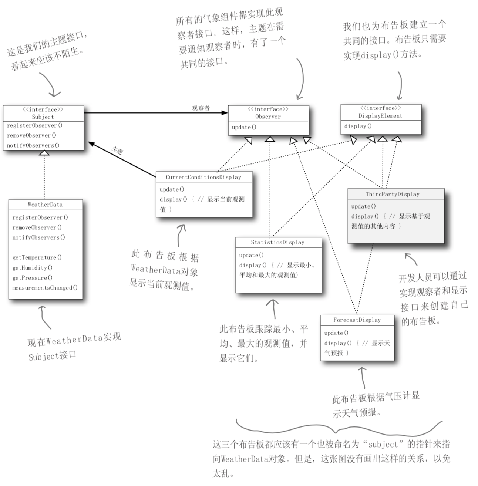
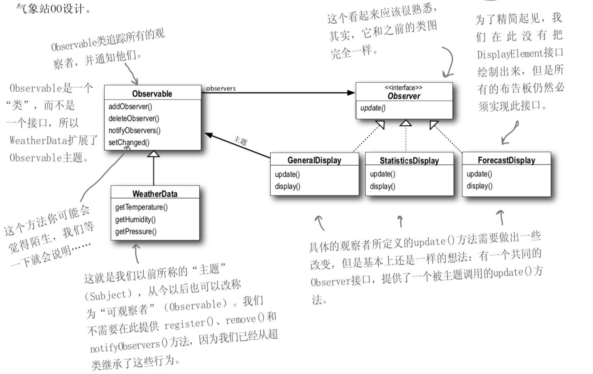

## 认识观察者模式
我们看看报纸和杂志的订阅是怎么回事:
1. 报社的业务就是出版报纸。
2. 向某家报社订阅报纸，只要他们有新报纸出版，就会给你送来。只要你是他们的订户，你就会一直收到新报纸。
<!-- more -->
3. 当你不想再看报纸的时候，取消订阅，他们就不会再送新报纸来。
4. 只要报社还在运营，就会一直有人(或单位)向他们订阅报 纸或取消订阅报纸。

## 观察者模式
出版者+订阅者=观察者模式
出版者改称为“主题”(Subject)，订阅者改称为“观察者”(Observer)。
观察者模式：定义了对象之间的一对多依赖，当一个对象改变状态时，它的所有依赖者都会收到通知并自动更新。

## 示例

建立气象站：
该气象站必须建立在WeatherData对象上，由WeatherData对象负责追踪目前的天气状况(温度、
湿度、气压)。希望能建立一个应用，有三种布告板，分别显示目前的状况、气象统计及简单的预报。 
当WeatherObject对象获得最新的测量数据时，三种布告板 必须实时更新。
而且，这是一个可以扩展的气象站，Weather-O-Rama气象 站希望公布一组API，好让其他开发人员可以写出自己的气象布告板，并插入此应用中。


```java
public interface Subject {
    // 注册
    public void registerObserver(Observer o);
    // 移除
    public void removeObserver(Observer o);
    // 通知
    public void notifyObservers();
}
```

```java
public interface Observer {
    public void update(float temp, float humidity, float pressure);
}
```

```java
public interface DisplayElement {
    // 显示布告板
    public void display();
}
```

```java
import java.util.ArrayList;


public class WeatherData implements Subject{
    private ArrayList observers;
    // 温度
    private float temperature;
    // 湿度
    private float humidity;
    // 气压
    private float pressure;

    public WeatherData() {
        observers = new ArrayList();
    }

    @Override
    public void registerObserver(Observer o) {
        observers.add(o);
    }

    @Override
    public void removeObserver(Observer o) {
        int i = observers.indexOf(o);
        if (i >= 0) {
            observers.remove(i);
        }
    }

    @Override
    public void notifyObservers() {
        for (int i = 0; i < observers.size(); i++) {
            Observer observer = (Observer)observers.get(i);
            observer.update(temperature, humidity, pressure);
        }

    }
    // 当从气象站得到更新观测值时，我们通知观察者。
    public void measurementsChanged() {
        notifyObservers();
    }

    public void setMeasurements(float temperature, float humidity, float pressure) {
        this.temperature = temperature;
        this.humidity = humidity;
        this.pressure = pressure;
        measurementsChanged();
    }

    //其他方法省略
}
```
布告板

```java

public class CurrentConditionsDisplay implements Observer, DisplayElement{
    private float temperature;

    private float humidity;

    private Subject weatherData;

    public CurrentConditionsDisplay(Subject weatherData) {
        this.weatherData = weatherData;
        weatherData.registerObserver(this);
    }

    @Override
    public void display() {
        System.out.println("Current conditions: " + temperature + "F degrees and " + humidity + "% humidity");
    }

    @Override
    public void update(float temp, float humidity, float pressure) {
        this.temperature = temp;
        this.humidity = humidity;
        display();
    }
}
```
气象站测试类

```java
public class WeatherStation {
    public static void main(String[] args) {
        WeatherData weatherData = new WeatherData();
        CurrentConditionsDisplay currentDisplay = new CurrentConditionsDisplay(weatherData);
//        StatisticsDisplay statisticsDisplay = new StatisticsDisplay(weatherData);
//        ForecastDisplay forecastDisplay = new ForecastDisplay(weatherData);
        weatherData.setMeasurements(80, 65, 30.4f);
        weatherData.setMeasurements(82, 70, 29.2f);
        weatherData.setMeasurements(78, 90, 29.2f);
    }
}
```

运行结果

```bash
Current conditions: 80.0F degrees and 65.0% humidity
Current conditions: 82.0F degrees and 70.0% humidity
Current conditions: 78.0F degrees and 90.0% humidity
```

## JAVA内置的观察者模式
Java API有内置的观察者模式。java.util包(package)内包含最基本的Observer接口与Observable类。


Observer接口
```java
package java.util;

public interface Observer {

    void update(Observable o, Object arg);
}

```

Observable类
```java

package java.util;

public class Observable {
    private boolean changed = false;// 数据更新标记
    private Vector<Observer> obs; // 观察者列表

    //构造函数
    public Observable() {
        obs = new Vector<>();
    }
    
    //添加观察者
    public synchronized void addObserver(Observer o) {
        if (o == null)
            throw new NullPointerException();
        if (!obs.contains(o)) {
            obs.addElement(o);
        }
    }

    // 删除某一个观察者
    public synchronized void deleteObserver(Observer o) {
        obs.removeElement(o);
    }

    // 通知观察者
    public void notifyObservers() {
        notifyObservers(null);
    }

    // 如果changed = true 意味着数据被修改，通知每个观察者。
    public void notifyObservers(Object arg) {
        Object[] arrLocal;

        synchronized (this) {
            if (!changed)
                return;
            arrLocal = obs.toArray();
            clearChanged();
        }

        for (int i = arrLocal.length-1; i>=0; i--)
            ((Observer)arrLocal[i]).update(this, arg);
    }

    // 删除所有观察者
    public synchronized void deleteObservers() {
        obs.removeAllElements();
    }

    // 设置changed值
    protected synchronized void setChanged() {
        changed = true;
    }

    // 清除changed值
    protected synchronized void clearChanged() {
        changed = false;
    }

    // 获取changed值
    public synchronized boolean hasChanged() {
        return changed;
    }

    // 返回观察者个数
    public synchronized int countObservers() {
        return obs.size();
    }
}

```

```java
import java.util.Observable;

public class WeatherData extends Observable {
    // 温度
    private float temperature;
    // 湿度
    private float humidity;
    // 气压
    private float pressure;

    public WeatherData() {
    }

    // 当从气象站得到更新观测值时，我们通知观察者。
    public void measurementsChanged() {
        setChanged();
        notifyObservers();
    }

    public void setMeasurements(float temperature, float humidity, float pressure) {
        this.temperature = temperature;
        this.humidity = humidity;
        this.pressure = pressure;
        measurementsChanged();
    }

    //使用“拉”的做法
    public float getTemperature() {
        return temperature;
    }

    public float getHumidity() {
        return humidity;
    }

    public float getPressure() {
        return pressure;
    }

    //其他方法省略
}
```

```java
import java.util.Observable;
import java.util.Observer;

public class CurrentConditionsDisplay implements Observer, DisplayElement{
    private float temperature;

    private float humidity;

    Observable observable;

    public CurrentConditionsDisplay(Observable observable) {
        this.observable = observable;
        observable.addObserver(this);
    }

    @Override
    public void display() {
        System.out.println("Current conditions: " + temperature + "F degrees and " + humidity + "% humidity");
    }


    @Override
    public void update(Observable o, Object arg) {
        if (o instanceof WeatherData) {
            WeatherData weatherData = (WeatherData)o;
            this.temperature = weatherData.getTemperature();
            this.humidity = weatherData.getHumidity();
            display();
        }
    }
}
```

测试代码和测试结果同上

### java.util.Observable的缺点
java.util.Observable的实现 有许多问题，限制了它的使用和复用。
* 观察者是一个“类”而不是一个“接 口”
    * 你必须设计一个类继承它。如果某类想同时 具有Observable类和另一个超类的行为，就会陷入两难，毕竟Java不支持多重继承。
* Observable将关键的方法保护起来
    * setChanged()方法被保护起来了(被定义成 protected)。这意味着:除非你继承自Observable，否则你无法创建Observable实例并组合到你自己的对象中来。这个设计违反了第二个设计原 则:“多用组合，少用继承”。

## 要点
* 观察者模式定义了对象之间一对多的关系。
* 主题(也就是可观察者)用一个共同的接口来更新观察者。
* 观察者和可观察者之间用松耦合方式结合(loosecoupl- ing)，可观察者不知道观察者的细节，只知道观察者实现了观察者接口。
* 使用此模式时，你可从被观察者处推(push)或拉(pull)数据(然而，推的方式被认为更“正确”)。
* 有多个观察者时，不可以依赖特定的通知次序。
* Java有多种观察者模式的实现，包括了通用的java.util.Observable。
* 要注意java.util.Observable实现上所带来的一些问题。
* 如果有必要的话，可以实现自己的Observable。
* Swing大量使用观察者模式，许多GUI框架也是如此。
* 此模式也被应用在许多地方，例如:JavaBeans、RMI。


