本博客利用Hexo + Next + GitHubPages 搭建博客。

## 准备工作

### 安装node.js

``` bash
$ brew install node
```

### 安装 git

``` bash
$ brew install git
```

### 安装yarn

``` bash
$ npm install yarn
```

如果安装失败用

``` bash
$ brew install yarn
```

### 安装hexo

进入你的项目目录，举个例子我的目录是blog

``` bash
$ cd blog
```

然后用 yarn 安装 hexo

``` bash
$ yarn add hexo -S
```

如果安装失败用

``` bash
$ npm install hexo-cli -g
$ npm install hexo-server --save
```
详细可见[官方文档](https://hexo.io/zh-cn/docs/)

## 搭建本地博客

### 项目初始化

进入你的项目目录,初始化hexo

``` bash
$ cd blog
$ hexo init
```
### 安装依赖

``` bash
$ yarn install
```
### 启动本地服务

``` bash
$ hexo server
```
在浏览器输入 `localhost:4000` 即可

## 关联 GitHub
### 创建项目

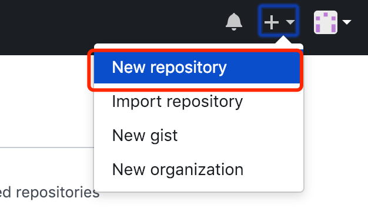

项目名称一定一定是 `[用户名].github.io`
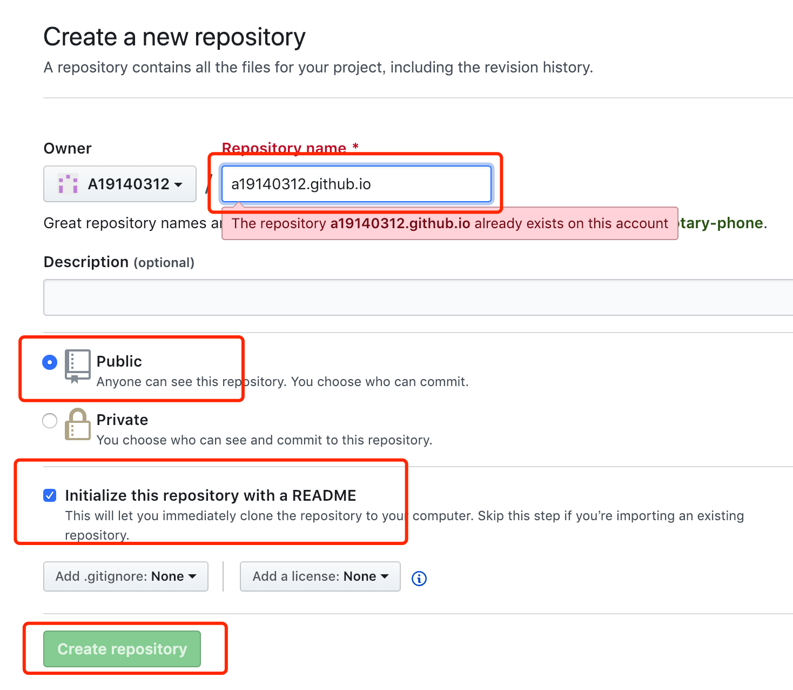

### 设置

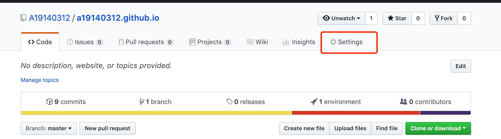

在设置中找到GitHub Pages ，分支选择master，点击choose a theme

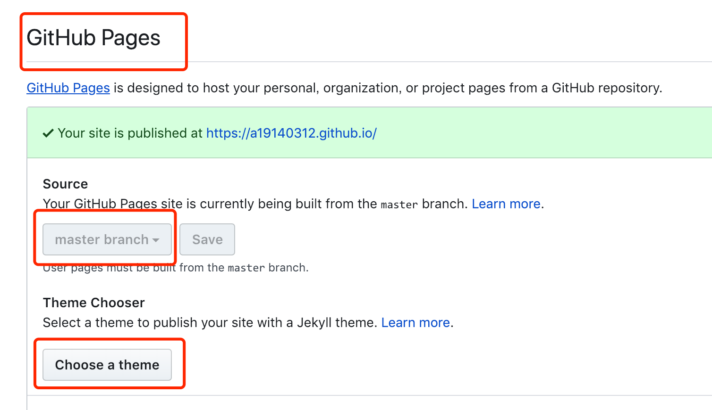

选择喜欢的主题，点击select theme即可
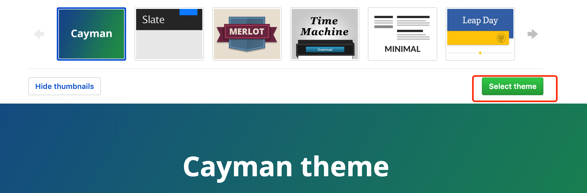

到这里就可以访问你的主页啦  `https://[用户名].github.io/`,接下来复制你的项目链接

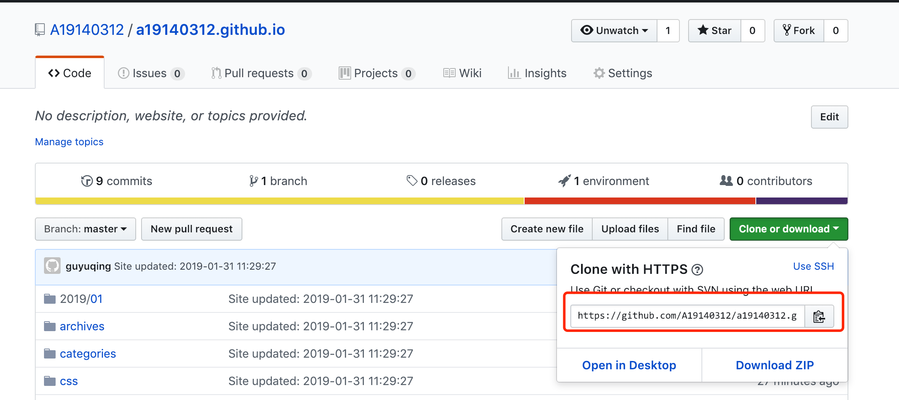

到你的本地项目根目录找到 `_config.yml` 文件，粘贴到以下位置

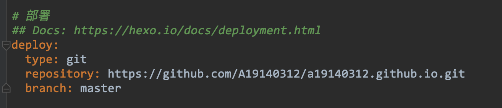

### 站点配置
站点配置包括修改博客名称，描述，作者等等，建议直接查看[官方教程](https://hexo.io/zh-cn/docs/configuration)

### 关联

安装 hexo-deployer-git 插件
``` bash
$ yarn add hexo-deployer-git -S
```
如果失败的话尝试下面的方法
``` bash
$ npm install --save hexo-deployer-git
```
在你的项目文件夹下运行 hexo d -g （生成本地文件并将本地文件推送到 GitHub ，和 git push 功能相同）,如果失败的话前面加sudo
``` bash
$  hexo d -g
```
这时访问你的github主页`https://[用户名].github.io/`就可以啦

## NexT主题配置
NexT 是一个高质量并且优雅的Hexo 主题。
详细可见[官方文档](https://github.com/iissnan/hexo-theme-next/blob/master/README.cn.md)

### 安装NexT主题
在你的项目文件夹下，执行以下命令，安装NexT主题
``` bash
$ git clone https://github.com/iissnan/hexo-theme-next.git themes/next
```
更改项目根目录下`_config.yml` 文件，如下
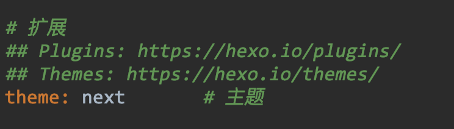

重新生成本地文件并推送到github
``` bash
$  hexo d -g
```
访问你的github主页`https://[用户名].github.io/`就可以看到啦

### 主题配置

`themes/next`文件夹下的`_config.yml`是主题的配置文件
next内置了4种主题方案，选择你喜欢的方案解开注释即可
```yaml
# ---------------------------------------------------------------
# Scheme Settings
# ---------------------------------------------------------------

# Schemes
#scheme: Muse
scheme: Mist
#scheme: Pisces
#scheme: Gemini
```
Menu Settings是控制图中菜单的位置，根据需要解开注释即可
```yaml
# ---------------------------------------------------------------
# Menu Settings
# ---------------------------------------------------------------
menu:
  home: / || home
#  about: /about/ || user
  tags: /tags/ || tags
  categories: /categories/ || th
#  archives: /archives/ || archive
#  schedule: /schedule/ || calendar
#  sitemap: /sitemap.xml || sitemap
#  commonweal: /404.html || heartbeat
```
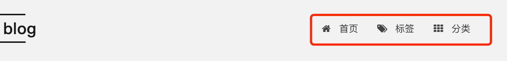
还有很多很多的配置请参考[官方教程](http://theme-next.iissnan.com/getting-started.html#install-next-theme),[主题个性配置教程](http://shenzekun.cn/hexo%E7%9A%84next%E4%B8%BB%E9%A2%98%E4%B8%AA%E6%80%A7%E5%8C%96%E9%85%8D%E7%BD%AE%E6%95%99%E7%A8%8B.html),[主题美化](http://yearito.cn/posts/hexo-theme-beautify.html)

修改之后，运行以下命令就可以再你的主页看到啦
``` bash
$  hexo clean
$  hexo d -g
```
也可以在本地启动服务器，在浏览器输入 `localhost:4000` 观看效果
``` bash
$ hexo server
```
## 创建文章

### 添加【标签】页面

新建标签页面
``` bash
$ hexo new page tags
```
修改项目根目录下 source/tags 的 index.md 文件如下：
``` markdown
title: tags
type: "tags"
comments: false
---
```
修改`themes/next`文件夹下的`_config.yml`主题配置文件，取消  `tags: /tags/ || tags` 这行注释
新建测试文章
``` bash
$ hexo new 'test'
```
在测试文章的头部添加tags信息，如下：
``` markdown
title: 测试文章
tags:
  - Testing
  - Another Tag
---
```
启动本地服务，就可以看到标签菜单，点击可进入标签页，看到 如图所示 证明标签页面添加成功。
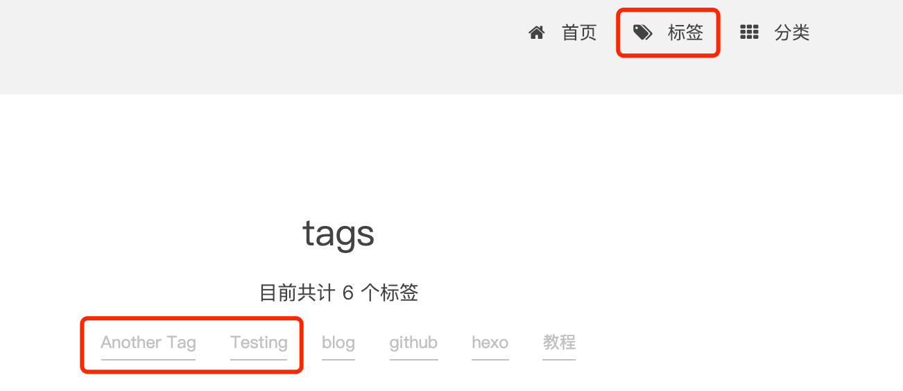

### 添加【分类】页面
新建标签页面
``` bash
$ hexo new page categories
```
修改项目根目录下 source/tags 的 index.md 文件如下：
``` markdown
title: categories
type: "categories"
comments: false
---
```
修改`themes/next`文件夹下的`_config.yml`主题配置文件，取消  `categories: /categories/ || th` 这行注释
在测试文章的头部添加categories信息，如下：
``` markdown
title: 测试文章
tags:
  - Testing
  - Another Tag
---
categories: Testing
```
启动本地服务，就可以看到标签菜单，点击可进入标签页，看到 如图所示 证明分类页面添加成功。
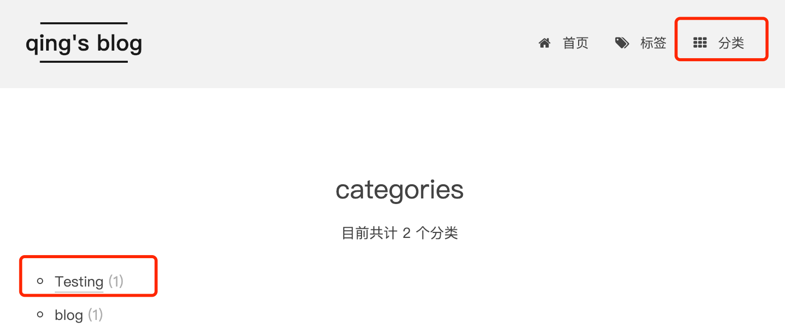

### 给博客添加图片
在项目目录下执行

``` bash
$ npm install hexo-asset-image --save
```

在用下面命令生成md文章时，会在_post目录下看到一个与文章同名的文件夹
``` bash
$ hexo new '文章名'
```
将想要上传的图片先放到文件夹下，然后在博客中使用markdown的格式引入图片：
``` markdown
 
```
文章名和文件夹名字相同，所以不需要绝对路径，只要xxxx是文件夹的名字就可以了。

### 添加Valine评论系统

首先需要去注册一个[Leancloud](https://leancloud.cn/)账号,验证邮箱
然后随便创建一个应用，按如图所示找到`appid`，`appkey`
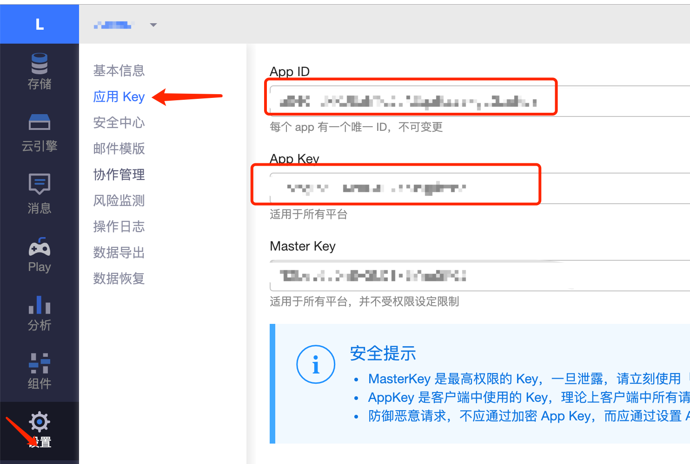

按下图修改`themes/next`文件夹下的`_config.yml`主题配置文件，重新启动服务器就可以啦
``` yaml
 # Valine.
 # You can get your appid and appkey from https://leancloud.cn
 # more info please open https://valine.js.org
 valine:
   enable: true
   appid: your appid  # your leancloud application appid
   appkey: your appkey # your leancloud application appkey
   notify: false # mail notifier , https://github.com/xCss/Valine/wiki
   verify: false # Verification code
   placeholder: 描述  # comment box placeholder
   avatar: monsterid # gravatar style
   guest_info: nick,mail # custom comment header
   pageSize: 10 # pagination size
```
如果要删除评论请到[Leancloud](https://leancloud.cn/)里删除哦
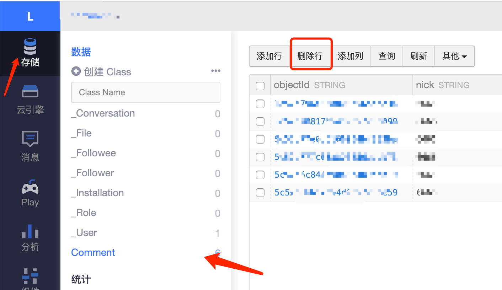