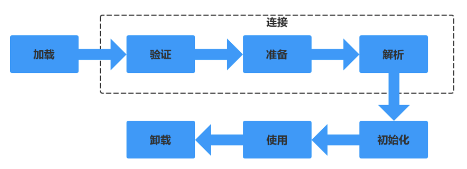

# Java基础

    ------------------------ 基础 ------------------------

## 基础
### JDK 和 JRE 有什么区别？
* JDK：Java 开发工具包，提供了 Java 的开发环境和运行环境（包括JRE）。
* JRE：Java 运行环境

### == 和 equals 的区别是什么？
* **==：** 基本类型：比较的是值是否相同；引用类型：比较的是引用的地址是否相同；
* **equals**：equals 本质上就是 ==，只不过 String 和 Integer 等重写了 equals 方法，把它变成了值比较

总结 ：== 对于基本类型来说是值比较，对于引用类型来说是比较的是引用；而 equals 默认情况下是引用比较，只是很多类重新了 equals 方法，比如 String、Integer 等把它变成了值比较，所以一般情况下 equals 比较的是值是否相等。

### 为什么重写了equals方法，就要重写hashCode方法？
不是必须，只是建议。虽然可以不重写hashCode，但是会对集合造成影响。
比如hashMap，如果equals判断相同的key，但是hashCode不同，也就是内存中的地址不同，那么进行如下操作，就不会被覆盖，而是被put两次
hashMap.put("k","v1")，hashMap.put("k":"v2")

###  final 在 Java 中有什么作用？
* final 修饰的类叫最终类，该类不能被继承。
* final 修饰的方法不能被重写。
* final 修饰的变量叫常量，常量必须初始化，初始化之后值就不能被修改。

### Java基础的数据类型有哪些？
基础类型有 8 种：byte、boolean、char、short、int、float、long、double

### Java 中操作字符串都有哪些类？它们之间有什么区别？
操作字符串的类有：String、StringBuffer、StringBuilder。
String：
    * 声明的是不可变的对象，它的底层是一个用final修饰的字符数组，每次操作都会生成新的 String 对象，然后将指针指向新的 String 对象
    * String 对象赋值之后就会在字符串常量池中缓存，如果下次创建会判定常量池是否已经有缓存对象，如果有的话直接返回该引用给创建者。
StringBuffer： 可以在原有对象的基础上进行操作，线程安全的，性能高于StringBuilder
StringBuilder： 可以在原有对象的基础上进行操作，非线程安全的

### String和StringBuilder 的区别？
jdk1.5：string 对象时恒定不变的,stringBuider对象表示的字符串是可变的。所以在字符串频繁修改的情况下stringBuider效率
jdk1.8: 编译器利用String的可变配套类(StringBuilder)帮我们做了优化，编译器自动调用StringBuilder.apend()方法添加。因此在拼接字符串小于500左右时，两个对象效率相同。

### JDK 动态代理为什么只能基于接口？
java的代理对象自动继承了Proxy，又因为JAVA是单继承的，所以目标对象只能实现接口不能继承。

### ArrayList 和 Vector 的区别？
**相同**：
    * 都实现了 List 接口(List 接口继承了 Collection 接口)
    * 都是有序集合，即存储在这两个集合中的元素的位置都是有顺序的，相当于一种动态的数组
    * 允许重复

**区别**：
    * Vector 是线程安全的，ArrayList 是线程序不安全的。
**数据增长**:
    * 相同：ArrayList 与 Vector 都可以设置初始的空间大小
    * 不同：Vector 还可以设置增长的空间大小，而 ArrayList 没有提供设置增长空间的方法。
           Vector 默认增加原来的 1 倍，ArrayList 增加原来的 0.5 倍。
           
### 快速失败 (fail-fast) 和安全失败 (fail-safe) 的区别是什么?
Iterator 的安全失败是基于对底层集合做拷贝，因此，它不受源集合上修改的影响。

java.util 包下面的所有的集合类都是快速失败的，迭代器会抛出 ConcurrentModificationException 异常
java.util.concurrent 包下面的所有的类都是安全失败的。安全失败的迭代器永远不会抛出这样的异常。

###  HashMap 的工作原理是什么?
HashMap 是 **数组 + 链表 + 红黑树** 实现的。
* 负载因子（loadFactor）：0.75f
* 容量（capacity）：16
* 扩容阈值（threshold）：loadFactor * capacity
* 转化成树的链表阈值（TREEIFY_THRESHOLD）：8
* 转化成树的最小容量（MIN_TREEIFY_CAPACITY）：64
Java 中的 HashMap 是以键值对 (key-value) 的形式存储元素的，我们把一对(key-value)称为Node。
HashMap 需要 一个 hash 函数，当调用 put() 方法的时候，HashMap 会计算 key 的 hash 值，然后把键值对存储在集合中合适的索引上。 
如果索引上已经存在了Node，发生哈希冲突。
    * 如果索引上的结构是**链表**，则在链表中遍历，如果有相同的key，value 会被更新成新值，否则遍历到链表尾部，插入新的(key-value) ，size+1
        * 如果链表的长度大于**转化成树的链表阈值（TREEIFY_THRESHOLD）** 并且，hashMap的容量大于**转化成树的最小容量（MIN_TREEIFY_CAPACITY）** 则转换成`红黑树`。
    * 如果索引上的结构是**红黑树**，则在红黑树中遍历，如果有相同的key，value 会被更新成新值，否则插入红黑树，size+1。
    
如果 size > threshold 则进行扩容。
    * 当原来的容量已经达到最大容量的时候，将阈值设置为Integer.MAX_VALUE，这样就不会再发生重构的情况
    * 将新的阈值设置为旧的阈值的两倍, 新的容量设置为旧容量的2倍。
    * 根据新容量新建一个Node数组，将旧数组中的元素全部取出，重新映射到新数组中
    
### List、Map、Set 三个接口，存取元素时，各有什么特点?
这样的题属于随意发挥题:这样的题比较考水平，两个方面的水平:一是要真正明白 这些内容，二是要有较强的总结和表述能力。如果你明白，但表述不清楚，在别人那 里则等同于不明白。

首先List与Set
相同：
    * 都是单列元素的集合，有一个相同的父类 Collection
不同：
    * List 元素可以重复，Set不可以
    * List 可以按index取元素，Set只能逐一遍历
    * List 是有序集合。

Map 是双列集合，要存储一对 key/value，不能存储重复的 key。

###  HashSet 的底层实现是什么?
HashSet 的实现是依赖于 HashMap 的，HashSet 的值都是存储 在 HashMap 中的。在 HashSet 的构造法中会初始化一个 HashMap 对象
HashSet 不允许值重复，因此，HashSet 的值是作为 HashMap 的 key 存储在 HashMap 中的，当存储的值已经存在时返回 false。

###  Iterator 和 ListIterator 的区别是什么?
* Iterator 可用来遍历 Set 和 List 集合，但是 ListIterator 只能用来遍历 List。
* Iterator 对集合只能是前向遍历，ListIterator 既可以前向也可以后向。
ListIterator 实现了 Iterator 接口，并包含其他的功能，比如:增加元素，替换元 素，获取前一个和后一个元素的索引，等等。

### 数组 (Array) 和列表 (ArrayList) 有什么区别?
* Array 可以包含基本类型和对象类型，ArrayList 只能包含对象类型。
* Array 大小是固定的，ArrayList 的大小是动态变化的。
* ArrayList 处理固定大小的基本数据类型的时候，这种方式相对比较慢。

###  Comparable 和 Comparator 接口是干什么的?
**Comparable**：只包含一个 compareTo() 方法，这个方法可以个 给两个对象排序。具体来说，它返回负数，0，正数来表明输入对象小于，等于，大于 已经存在的对象。
**Comparator**：包含 compare() 和 equals() 两个方法。
    * compare() 方法用来给两个输入参数排序，返回负数，0，正数表明第一个参数是小 于，等于，大于第二个参数。
    * equals() 方法需要一个对象作为参数，它用来决定输入 参数是否和 comparator 相等。
    
### Collection 和 Collections 的区别？
**Collection**：是集合类的上级接口, 继承与它的接口主要是 set 和 list。
**Collections**： 类是针对集合类的一个帮助类. 它提供一系列的静态方法对各种集合的搜 索, 排序, 线程安全化等操作。

    
    

    ------------------------ JVM ------------------------

## JVM
### 说一下 JVM 的主要组成部分？及其作用？

* 类加载器（ClassLoader）
* 运行时数据区（Runtime Data Area）
* 执行引擎（Execution Engine）
* 本地库接口（Native Interface）

组件的作用： 首先通过类加载器（ClassLoader）会把 Java 代码转换成字节码，
           运行时数据区（Runtime Data Area）再把字节码加载到内存中，而字节码文件只是 JVM 的一套指令集规范，并不能直接交给底层操作系统去执行，
           因此需要特定的命令解析器执行引擎（Execution Engine），将字节码翻译成底层系统指令，再交由 CPU 去执行，
           而这个过程中需要调用其他语言的本地库接口（Native Interface）来实现整个程序的功能。

### 说一下类装载的执行过程？

类装载分为以下 5 个步骤：
* 加载：根据查找路径找到相应的 class 文件然后导入；
* 检查：检查加载的 class 文件的正确性；
* 准备：给类中的静态变量分配内存空间；
    * public static int value = 123; //此时在准备阶段过后的初始值为0而不是123，在初始化过程才会被赋值为123
    * public static final int value = 123;//value的值在准备阶段过后就是123。
* 解析：虚拟机将常量池中的符号引用替换成直接引用的过程。符号引用就理解为一个标示，而在直接引用直接指向内存中的地址；
* 初始化：对静态变量和静态代码块执行初始化工作。

### 类加载器的种类？

* 启动类加载器(Bootstrap ClassLoader)：负责加载JRE的核心类库，如JRE目标下的rt.jar，charsets.jar等
* 扩展类加载器(Extension ClassLoader)：负责加载JRE扩展目录ext中jar类包
* 系统类加载器(Application ClassLoader)：负责加载ClassPath路径下的类包
* 用户自定义加载器(User ClassLoader)：负责加载用户自定义路径下的类包

### 什么是双亲委派模型？

如果一个类加载器收到了类加载的请求，它首先不会自己去加载这个类，而是把这个请求委派给父类加载器去完成，每一层的类加载器都是如此，这样所有的加载请求都会被传送到顶层的启动类加载器中，只有当父加载无法完成加载请求（它的搜索范围中没找到所需的类）时，子加载器才会尝试去加载类。
           
###  JVM 运行时数据区？

* 程序计数器（Program Counter Register）: 前线程所执行的字节码的行号指示器，字节码解析器的工作是通过改变这个计数器的值，来选取下一条需要执行的字节码指令，分支、循环、跳转、异常处理、线程恢复等基础功能，都需要依赖这个计数器来完成；
* Java 虚拟机栈（Java Virtual Machine Stacks）: 用于存储局部变量表、操作数栈、动态链接、方法出口等信息；
* 本地方法栈（Native Method Stack）: 与虚拟机栈的作用是一样的，只不过虚拟机栈是服务 Java 方法的，而本地方法栈是为虚拟机调用 Native 方法服务的；
* Java 堆（Java Heap）: Java 虚拟机中内存最大的一块，是被所有线程共享的，几乎所有的对象实例都在这里分配内存；
* 方法区（Methed Area）: 用于存储已被虚拟机加载的类信息、常量、静态变量、即时编译后的代码等数据。

    ------------------------ 多线程 ------------------------

## 多线程

### 什么是线程安全？
如果你的代码所在的进程中有多个线程在同时运行，而这些线程可能会同时运行这段代码。如果每次运行结果和单线程运行的结果是一样的，而且其他的变量的值也和预期的是一样的，就是线程安全的。 

### 如何保证线程安全？
* synchronized关键字 
* 用Lock锁
* volatile+CAS【单纯的volatile是轻量级的同步机制**保证可见性但是不具备原子性**所以要配合CAS来实现线程安全】
* atomic原子类

###  哪些集合类是线程安全的？
Vector、Hashtable、Stack 都是线程安全的，而像 HashMap 则是非线程安全的，不过在 JDK 1.5 之后随着 Java. util. concurrent 并发包的出现，它们也有了自己对应的线程安全类，比如 HashMap 对应的线程安全类就是 ConcurrentHashMap。

### 并行和并发有什么区别?
* 并行：多个处理器或多核处理器同时处理多个任务。( 两个队列和一台咖啡机 )
* 并发：多个任务在同一个 CPU 核上，按细分的时间片轮流(交替)执行，从逻辑上来看那些任务是同时执行。( 两个队列和两台咖啡机 )

### 线程和进程的区别?
一个程序下至少有一个进程，一个进程下至少有一个线程，一个进程下也可以有多个线程来增加程序的执行速度。

### 守护线程是什么?
守护线程是运行在后台的一种特殊进程。它独立于控制终端并且周期性地执行某种任务或等待处理某些发生的事件。在 Java 中垃圾回收线程就是特殊的守护线程。

### 创建线程有哪几种方式?
* 继承 Thread 重写 run 方法；
* 实现 Runnable 接口；
* 实现 Callable 接口。(可以获取线程执行之后的返回值)
* 线程池

### Runnable和Callable的区别?
* Callable规定（重写）的方法是call()，Runnable规定（重写）的方法是run()。
* Callable的任务执行后可返回值，而Runnable的任务是不能返回值的。
* call方法可以抛出异常，run方法不可以。
* 运行Callable任务可以拿到一个Future对象，表示异步计算的结果。它提供了检查计算是否完成的方法，以等待计算的完成，并检索计算的结果。通过Future对象可以了解任务执行情况，可取消任务的执行，还可获取执行结果。

### 线程有哪些状态?
* NEW 尚未启动
* RUNNABLE 正在执行中
* BLOCKED 阻塞的（被同步锁或者IO锁阻塞）
* WAITING 永久等待状态
* TIMED_WAITING 等待指定的时间重新被唤醒的状态
* TERMINATED 执行完成

### sleep() 和 wait() 有什么区别?
* 类的不同：sleep() 来自 Thread，wait() 来自 Object。
* 释放锁：sleep() 不释放锁；wait() 释放锁。
* 用法不同：sleep() 时间到会自动恢复；wait() 可以使用 notify()/notifyAll()直接唤醒。

### notify()和 notifyAll()有什么区别？
* notifyAll: 会唤醒所有的线程,会将全部线程由等待池移到锁池,然后参与锁的竞争，竞争成功则继续执行，如果不成功则留在锁池等待锁被释放后再次参与竞争
* notify: 唤醒一个线程,具体唤醒哪一个线程由虚拟机控制。

### 线程的 run() 和 start() 有什么区别？
start() 方法用于启动线程，run() 方法用于执行线程的运行时代码。run() 可以重复调用，而 start() 只能调用一次。

### `创建线程池有哪几种方式？`
1. public static ExecutorService newCachedThreadPool() 创建一个可缓存线程池，如果线程池长度超过处理需要，可灵活回收空闲线程，若无可回收，则新建线程，但是在之前构造的线程可用时将重用它们。
2. public static ExecutorService newFixedThreadPool(int nThreads)  创建一个定长线程池，可控制线程最大并发数，以共享的无界队列方式来运行线程，超出的线程会在队列中等待。
3. public static ExecutorService newSingleThreadExecutor() 创建一个单线程化的线程池，它只会用唯一的工作线程来执行任务，以无界队列方式来运行线程，保证所有任务按照指定顺序(FIFO, LIFO, 优先级)执行。
4. public static ScheduledExecutorService newScheduledThreadPool(int corePoolSize) 创建一个周期线程池，支持定时及周期性任务执行。
5. public static ExecutorService newWorkStealingPool() 创建持有足够线程的线程池来支持给定的并行级别，并通过使用多个队列，减少竞争，它需要穿一个并行级别的参数，如果不传，则被设定为默认的CPU数量，这个线程池实际上是ForkJoinPool的扩展，适合使用在很耗时的任务中，能够合理的使用CPU进行并行操作。

### 线程池中 submit() 和 execute() 方法有什么区别？
* execute()：只能执行 Runnable 类型的任务。
* submit()：可以执行 Runnable 和 Callable 类型的任务。

### 什么是CAS？
全称Compare and swap，比较并交换。
CAS机制当中使用了3个基本操作数：内存地址V，旧的预期值A，要修改的新值B。只有当变量的预期值A和内存地址V当中的实际值相同时，才会将内存值修改为 B 
java 的 CAS 利用的的是 unsafe（该类都是基于JVM对操作系统进行的操作，因此是unsafe）这个类提供的 CAS 操作
unsafe 的CAS 依赖了的 JVM 针对不同的操作系统实现的 Atomic::cmpxchg
Atomic::cmpxchg 的实现使用了汇编的 cas 操作，并使用 cpu 硬件提供的 lock信号保证其原子性

### CAS有什么问题？
ABA问题。
举个例子：
假设有一个遵循CAS原理的提款机，小灰有100元存款，要用这个提款机来提款50元。
由于提款机硬件出了点小问题，小灰的提款操作被同时提交两次，开启了两个线程，两个线程都是获取当前值100元，要更新成50元。
理想情况下，应该一个线程更新成功，另一个线程更新失败，小灰的存款只被扣一次。
线程1首先执行成功，把余额从100改成50。线程2因为某种原因阻塞了。这时候，小灰的妈妈刚好给小灰汇款50元。
线程2仍然是阻塞状态，线程3执行成功，把余额从50改成100。
线程2恢复运行，由于阻塞之前已经获得了“当前值”100，并且经过compare检测，此时存款实际值也是100，所以成功把变量值100更新成了50。
小灰凭空少了50元钱。

解决方案：
使用携带版本的号的AtomicStampedReference

### 什么是锁？
锁(lock)或互斥(mutex)是一种同步机制，用于在有许多执行线程的环境中强制对资源的访问限制。锁旨在强制实施互斥排他、并发控制策略。

### 什么是死锁？
线程A持有独占锁资源a，并尝试去获取独占锁资源b
同时，线程B持有独占锁资源b，并尝试去获取独占锁资源a
这样线程A和线程B相互持有对方需要的锁，从而发生阻塞，最终变为死锁。

### 死锁发生的必要条件？
* 互斥条件：一个资源每次只能被一个进程使用。
* 请求与保持条件：一个进程因请求资源而阻塞时，对已获得的资源保持不放。
* 不剥夺条件:进程已获得的资源，在末使用完之前，不能强行剥夺。
* 循环等待条件:若干进程之间形成一种头尾相接的循环等待资源关系。

### 怎么防止死锁？
* 尽量使用 tryLock(long timeout, TimeUnit unit)的方法(ReentrantLock、ReentrantReadWriteLock)，设置超时时间，超时可以退出防止死锁。
* 尽量使用 Java. util. concurrent 并发类代替自己手写锁。
* 尽量降低锁的使用粒度，尽量不要几个功能用同一把锁。
* 尽量减少同步的代码块。

### 当一个线程进入一个对象的一个 synchronized 方法后，其它线程是否可进入此对象的其它方法?
* 其他方法前是否加了 synchronized 关键字，如果没加，则能。
* 如果这个方法内部调用了 wait，则可以进入其他 synchronized 方法。

### 简述 synchronized 和 java.util.concurrent.locks.Lock 的异同?
相同点:Lock 能完成 synchronized 所实现的所有功能。
不同点:Lock 有比 synchronized 更精确的线程语义和更好的性能。
synchronized 会自动释放锁，而 Lock 一定要求程序员手工释放，并且必须在 finally从句中释放。
Lock 还有更强大的功能，例如，它的 tryLock 方法可以非阻塞方式去拿锁。

### 线程调度(优先级)
与线程休眠类似，线程的优先级仍然无法保障线程的执行次序。只不过，优先级高的线 程获取 CPU 资源的概率较大，优先级低的并非没机会执行。
线程的优先级用 1-10 之 间的整数表示，数值越大优先级越高，默认的优先级为 5。 在一个线程中开启另外一个新线程，则新开线程称为该线程的子线程，子线程初始优先级与父线程相同。

### 什么是线程饥饿？
线程饥饿是另一种活跃性问题，也可以使程序无法执行下去。
如果一个线程因为处理器时间全部被其他线程抢走而得不到处理器运行时间，这种状态被称之为`饥饿`
一般是由高优先级线程吞噬所有的低优先级线程的处理器时间引起的。

### 什么是活锁？
这两个线程虽然都没有停止运行，但是却无法向下执行，这种情况就是所谓的活锁。
举个例子，两个人在走廊上碰见，大家都互相很有礼貌，互相礼让，A从左到右，B也从从左转向右，发现又挡住了地方，继续转换方向，但又碰到了，反反复复，一直没有机会运行下去。
* 当所有线程在序中执行 Object.wait(0)，参数为 0 的 wait 方法。程序将发生 活锁直到在相应的对象上有线程调用 Object.notify() 或者 Object.notifyAll()。

### Volatile关键字的作用？
让其他线程能够马上感知到某一线程多某个变量的修改
* 保证可见性:对共享变量的修改，其他的线程马上能感知到
* 保证有序性:禁止重排序（编译阶段、指令优化阶段）volatile之前的代码不能调整到他的后面，volatile之后的代码不能调整到他的前面

### volatile 能使得一个非原子操作变成原子操作吗?
在 Java 中除了 long 和 double 之外的所有基本类型的读和赋值，都是原子性操作。
而 64 位的 long 和 double 变量由于会被 JVM 当作两个分离的 32 位来进行操 作，所以不具有原子性，会产生字撕裂问题。但是当你定义 long 或 double 变量时， 如果使用 volatile 关键字，就会获到**(只有简单的赋值与返回操作的)**原子性。
不能保证其他情况的原子性。

    ------------------------ Spring ------------------------

# Spring

## 基础
### 为什么要使用 spring？
* spring 提供 ioc 技术，容器会帮你管理依赖的对象，从而不需要自己创建和管理依赖对象了，更轻松的实现了程序的解耦。
* spring 提供了事务支持，使得事务操作变的更加方便。
* spring 提供了面向切片编程，这样可以更方便的处理某一类的问题。
* 更方便的框架集成，spring 可以很方便的集成其他框架，比如 MyBatis 等。

## AOP
### 什么是 aop？
aop 是面向切面编程，可以通过预编译方式和运行期动态代理实现在不修改源代码的情况下给程序动态统一添加功能的一种技术。
aop的应用场景：日志记录、权限验证、效率检查、事务管理、exception

## IOC
### 什么是 ioc？
控制反转，将你设计好的对象交给容器控制，可以用来减低计算机代码之间的耦合度。

###  spring 常用的注入方式有哪些？
* setter 属性注入
* 构造方法注入
* 注解方式注入

###  spring 中的 bean 是线程安全的吗？
spring 中的 bean 默认是单例模式，spring 框架并没有对单例 bean 进行多线程的封装处理。
实际上大部分时候 spring bean 无状态的（比如 dao 类），所有某种程度上来说 bean 也是安全的，但如果 bean 有状态的话（比如 view model 对象），那就要开发者自己去保证线程安全了，最简单的就是改变 bean 的作用域，把“singleton”变更为“prototype”，这样请求 bean 相当于 new Bean()了，所以就可以保证线程安全了。
* 有状态就是有数据存储功能。
* 无状态就是不会保存数据。

###  spring 自动装配 bean 有哪些方式？
* no：默认值，表示没有自动装配，应使用显式 bean 引用进行装配。
* byName：它根据 bean 的名称注入对象依赖项。
* byType：它根据类型注入对象依赖项。
* constructor：通过构造函数来注入依赖项，需要设置大量的参数。

### Spring beanFactory 和 factoryBean 的区别？
**beanFactory** 是Spring容器的顶层接口，用于管理Bean的一个工厂。 在Spring中，所有的Bean都是由BeanFactory(也就是IOC容器)来进行管理的。
**FactoryBean** 这个Bean不是简单的Bean，而是一个能生产或者修饰对象生成的工厂Bean，它能在需要的时候生产一个对象，且不仅仅限于它自身，它能返回任何Bean的实例。

通常情况下，bean 无须自己实现工厂模式，Spring 容器担任了工厂的 角色；但少数情况下，容器中的 bean 本身就是工厂，作用是产生其他 bean 实例。由工厂 bean 产生的其他 bean 实例，不再由 Spring 容器产生，因此与普通 bean 的配置不同，不再需要提供 class 元素。

    ---------------- 计算机网络 ----------------

# 计算机网络

## 基础

###  OSI 的七层模型都有哪些？

* 物理层：利用传输介质为数据链路层提供物理连接，实现比特流的透明传输。
* 数据链路层：负责建立和管理节点间的链路。
* 网络层：通过路由选择算法，为报文或分组通过通信子网选择最适当的路径。
* 传输层：向用户提供可靠的端到端的差错和流量控制，保证报文的正确传输。
* 会话层：向两个实体的表示层提供建立和使用连接的方法。
* 表示层：处理用户信息的表示问题，如编码、数据格式转换和加密解密等。
* 应用层：直接向用户提供服务，完成用户希望在网络上完成的各种工作。

## http协议
Hyper Text Transfer Protocol（超文本传输协议）的缩写,是用于从万维网（WWW:World Wide Web ）服务器传输超文本到本地浏览器的传送协

### HTTP的特性
* HTTP构建于TCP/IP协议之上，默认端口号是80
* HTTP是无连接无状态的
    + 无连接：无连接的含义是限制每次连接只处理一个请求。服务器处理完客户的请求，并收到客户的应答后，即断开连接。采用这种方式可以节省传输时间。
    + 无状态：HTTP协议是无状态协议。无状态是指协议对于事务处理没有记忆能力。缺少状态意味着如果后续处理需要前面的信息，则它必须重传，这样可能导致每次连接传送的数据量增大。另一方面，在服务器不需要先前信息时它的应答就较快。

### HTTP状态码

    1xx：指示信息--表示请求已接收，继续处理
    2xx：成功--表示请求已被成功接收、理解、接受
    3xx：重定向--要完成请求必须进行更进一步的操作
    4xx：客户端错误--请求有语法错误或请求无法实现
    5xx：服务器端错误--服务器未能实现合法的请求


200 OK //客户端请求成功
301 Moved Permanently //永久重定向。
302 Found //暂时重定向。
400 Bad Request //客户端请求有语法错误，不能被服务器所理解
401 Unauthorized //请求未经授权，这个状态代码必须和WWW-Authenticate报头域一起使用 
403 Forbidden //服务器收到请求，但是拒绝提供服务
404 Not Found //请求资源不存在，eg：输入了错误的URL
500 Internal Server Error //服务器发生不可预期的错误
503 Server Unavailable //服务器当前不能处理客户端的请求，一段时间后可能恢复正常

### HTTP 请求/响应的步骤？
* **1、客户端连接到Web服务器**
    一个HTTP客户端，通常是浏览器，与Web服务器的HTTP端口（默认为80）建立一个TCP套接字连接。例如，http://www.oakcms.cn。
* **2、发送HTTP请求**
    通过TCP套接字，客户端向Web服务器发送一个文本的请求报文，一个请求报文由请求行、请求头部、空行和请求数据4部分组成。
* **3、服务器接受请求并返回HTTP响应**
    Web服务器解析请求，定位请求资源。服务器将资源复本写到TCP套接字，由客户端读取。一个响应由状态行、响应头部、空行和响应数据4部分组成。
* **4、释放连接TCP连接**
    若connection 模式为close，则服务器主动关闭TCP连接，客户端被动关闭连接，释放TCP连接;若connection 模式为keepalive，则该连接会保持一段时间，在该时间内可以继续接收请求;
* **5、客户端浏览器解析HTML内容**
    客户端浏览器首先解析状态行，查看表明请求是否成功的状态代码。然后解析每一个响应头，响应头告知以下为若干字节的HTML文档和文档的字符集。客户端浏览器读取响应数据HTML，根据HTML的语法对其进行格式化，并在浏览器窗口中显示。

### 浏览器请求过程？
* 1、浏览器向 DNS 服务器请求解析该 URL 中的域名所对应的 IP 地址;
* 2、解析出 IP 地址后，根据该 IP 地址和默认端口 80，和服务器建立TCP连接;
* 3、浏览器发出读取文件(URL 中域名后面部分对应的文件)的HTTP 请求，该请求报文作为 TCP三次握手的第三个报文的数据发送给服务器;
* 4、服务器对浏览器请求作出响应，并把对应的 html 文本发送给浏览器;
* 5、释放 TCP连接;
* 6、浏览器将该 html 文本并显示内容;

###  get 和 post 请求有哪些区别？
从原理性看：
* 根据HTTP规范，GET用于信息获取，而且应该是安全和幂等的
* 根据HTTP规范，POST请求表示可能修改服务器上资源的请求

从表面上看：
* GET请求的数据会附在URL后面，POST的数据放在HTTP包体，POST安全性比GET安全性高
* GET请求会被浏览器主动缓存，并且传递参数有大小限制，POST没有。

## TCP／UDP协议

###  tcp 和 udp的区别？
tcp 和 udp 是 OSI 模型中的运输层中的协议。tcp 提供可靠的通信传输，而 udp 则常被用于让广播和细节控制交给应用的通信传输。
区别如下：
* tcp 面向连接，udp 面向非连接即发送数据前不需要建立链接；
* tcp 提供可靠的服务（数据传输），udp 无法保证；
* tcp 面向字节流，udp 面向报文；
* tcp 数据传输慢，udp 数据传输快；

### tcp协议是100%可靠的么？
TCP 并不能保证数据一定会被对方接收到，因为这是不可能的。TCP 能够做到的是，如果有可能，就把数据递送到接收方，否则就（通过放弃重传并且中断连接这一手段）通知用户。因此准确说 TCP 也不是 100% 可靠的协议，它所能提供的是数据的可靠递送或故障的可靠通知。

### 三次握手
三次握手的目的是连接服务器指定端口，建立 TCP 连接，并同步连接双方的序列号和确认号，交换 TCP 窗口大小信息。在 socket 编程中，客户端执行 connect() 时。将触发三次握手。

* 第一次握手(SYN=1, seq=x):
  客户端发送一个 TCP 的 SYN 标志位置1的包，指明客户端打算连接的服务器的端口，以及初始序号 X,保存在包头的序列号(Sequence Number)字段里。
  发送完毕后，客户端进入 `SYN_SEND` 状态。
* 第二次握手(SYN=1, ACK=1, seq=y, ACKnum=x+1):
  服务器发回确认包(`ACK`)应答。即 SYN 标志位和 ACK 标志位均为1。服务器端选择自己 ISN 序列号，放到 Seq 域里，同时将确认序号(Acknowledgement Number)设置为客户的 ISN 加1，即X+1。 
  发送完毕后，服务器端进入 `SYN_RCVD` 状态。
* 第三次握手(ACK=1，seq=x+1,ACKnum=y+1)
  客户端再次发送确认包(ACK)，SYN 标志位为0，ACK 标志位为1，并且把服务器发来 ACK 的序号字段+1，放在确定字段中发送给对方，并且在数据段放写ISN的+1
  发送完毕后，客户端进入 `ESTABLISHED` 状态，当服务器端接收到这个包时，也进入 `ESTABLISHED` 状态，TCP 握手结束。

#### 为什么需要三次握手，两次不行吗？
如果是用两次握手，则会出现下面这种情况：
如客户端发出连接请求，但因连接请求报文丢失而未收到确认，于是客户端再重传一次连接请求。后来收到了确认，建立了连接。数据传输完毕后，就释放了连接。
客户端共发出了两个连接请求报文段，其中第一个丢失，第二个到达了服务端，但是第一个丢失的报文段只是在某些网络结点长时间滞留了，延误到连接释放以后的某个时间才到达服务端
此时服务端误认为客户端又发出一次新的连接请求，于是就向客户端发出确认报文段，同意建立连接。
**因此**：不采用三次握手，只要服务端发出确认，就建立新的连接了，此时客户端忽略服务端发来的确认，也不发送数据，则服务端一致等待客户端发送数据，`浪费资源`。

#### 什么是半连接队列？
服务器第一次收到客户端的 SYN 之后，就会处于 `SYN_RCVD` 状态，此时双方还没有完全建立其连接，服务器会把此种状态下请求连接放在一个队列里，我们把这种队列称之为`半连接队列`。

当然还有一个`全连接队列`，就是已经完成三次握手，建立起连接的就会放在全连接队列中。如果队列满了就有可能会出现丢包现象。

#### ISN(Initial Sequence Number)是固定的吗？
当一端为建立连接而发送它的SYN时，它为连接选择一个初始序号。ISN随时间而变化，因此每个连接都将具有不同的ISN。ISN可以看作是一个32比特的计数器，`每4ms加1` 。这样选择序号的目的在于防止在网络中被延迟的分组在以后又被传送，而导致某个连接的一方对它做错误的解释。

三次握手的其中一个重要功能是客户端和服务端交换 ISN(Initial Sequence Number)，以便让对方知道接下来接收数据的时候如何按序列号组装数据。如果 ISN 是固定的，攻击者很容易猜出后续的确认号，因此 ISN 是动态生成的。

#### 三次握手过程中可以携带数据吗？
其实第三次握手的时候，是可以携带数据的。但是，**第一次、第二次握手不可以携带数据**

第一次握手不可以放数据，其中一个简单的原因就是会让服务器更加容易受到攻击了。而对于第三次的话，此时客户端已经处于 ESTABLISHED 状态。对于客户端来说，他已经建立起连接了，并且也已经知道服务器的接收、发送能力是正常的了，所以能携带数据也没啥毛病。

#### SYN攻击是什么？
在三次握手过程中，服务器发送 SYN-ACK 之后，收到客户端的 ACK 之前的 TCP 连接称为半连接(half-open connect)。此时服务器处于 SYN_RCVD 状态。当收到 ACK 后，服务器才能转入 ESTABLISHED 状态.

SYN 攻击指的是，攻击客户端在短时间内伪造大量不存在的IP地址，向服务器不断地发送SYN包，服务器回复确认包，并等待客户的确认。由于源地址是不存在的，服务器需要不断的重发直至超时，这些伪造的SYN包将长时间占用未连接队列，正常的SYN请求被丢弃，导致目标系统运行缓慢，严重者会引起网络堵塞甚至系统瘫痪。

### 四次挥手
TCP 的连接的拆除需要发送四个包，因此称为四次挥手(Four-way handshake)，也叫做改进的三次握手。客户端或服务器均可主动发起挥手动作，在 socket 编程中，任何一方执行 close() 操作即可产生挥手操作。

* 第一次挥手(FIN=1，seq=x)
  假设客户端想要关闭连接，客户端发送一个 FIN 标志位置为1的包，表示自己已经没有数据可以发送了，但是仍然可以接受数据。
  发送完毕后，客户端进入 `FIN_WAIT_1` 状态。
* 第二次挥手(ACK=1，ACKnum=x+1)
  服务器端确认客户端的 FIN 包，发送一个确认包，表明自己接受到了客户端关闭连接的请求，但还没有准备好关闭连接。
  发送完毕后，服务器端进入 `CLOSE_WAIT` 状态，客户端接收到这个确认包之后，进入 `FIN_WAIT_2` 状态，等待服务器端关闭连接。
* 第三次挥手(FIN=1，seq=y)
  服务器端准备好关闭连接时，向客户端发送结束连接请求，FIN 置为1。
  发送完毕后，服务器端进入 `LAST_ACK` 状态，等待来自客户端的最后一个ACK
* 第四次挥手(ACK=1，ACKnum=y+1)
  客户端接收到来自服务器端的关闭请求，发送一个确认包，并进入 `TIME_WAIT` 状态，等待可能出现的要求重传的 ACK 包。
  服务器端接收到这个确认包之后，关闭连接，进入 `CLOSED` 状态。
  客户端等待了某个固定时间（`两个最大段生命周期`，2MSL，2 Maximum Segment Lifetime）之后，没有收到服务器端的 ACK ，认为服务器端已经正常关闭连接，于是自己也关闭连接，进入 `CLOSED` 状态。

#### 挥手为什么需要四次？
因为当服务端收到客户端的SYN连接请求报文后，可以直接发送SYN+ACK报文。其中ACK报文是用来应答的，SYN报文是用来同步的。
但是关闭连接时，当服务端收到FIN报文时，很可能并不会立即关闭SOCKET，所以只能先回复一个ACK报文，告诉客户端，"你发的FIN报文我收到了"。
只有等到我服务端所有的报文都发送完了，我才能发送FIN报文，因此不能一起发送。故需要四次挥手。

#### 2MSL等待状态
TIME_WAIT状态也成为2MSL等待状态。它是任何报文段被丢弃前在网络内的最长时间。
* 保证客户端发送的最后一个ACK报文段能够到达服务端。 
  这个ACK报文段有可能丢失，使得处于LAST-ACK状态的B收不到对已发送的FIN+ACK报文段的确认，服务端超时重传FIN+ACK报文段，而客户端能在2MSL时间内收到这个重传的FIN+ACK报文段，接着客户端重传一次确认，重新启动2MSL计时器，最后客户端和服务端都进入到CLOSED状态。
* 防止“已失效的连接请求报文段”出现在本连接中。
   客户端在发送完最后一个ACK报文段后，再经过2MSL，就可以使本连接持续的时间内所产生的所有报文段都从网络中消失，使下一个新的连接中不会出现这种旧的连接请求报文段。

### 滑动窗口
TCP协议里窗口机制有2种：一种是固定的窗口大小；一种是滑动的窗口。
这个窗口大小就是我们一次传输几个数据。 
对所有数据帧按顺序赋予编号，发送方在发送过程中始终保持着一个发送窗口，只有落在发送窗口内的帧才允许被发送； 
同时接收方也维持着一个接收窗口，只有落在接收窗口内的帧才允许接收。
这样通过调整发送方窗口和接收方窗口的大小可以实现`流量控制`。
**每个TCP/IP主机支持全双工数据传输，因此TCP有两个滑动窗口：一个用于接收数据，另一个用于发送数据。**

* 首先是**第一次发送数据这个时候的窗口大小是根据链路带宽的大小来决定的**。我们假设这个时候窗口的大小是3。
* 这个时候接受方收到数据以后会对数据进行确认告诉发送方我下次希望手到的是数据是多少。这里我们看到接收方发送的ACK=3(这是发送方发送序列2的回答确认，下一次接收方期望接收到的是3序列信号)。
* 这个时候发送方收到这个数据以后就知道我第一次发送的3个数据对方只收到了2个。就知道第3个数据对方没有收到。下次在发送的时候就从第3个数据开始发。这个时候窗口大小就变成了2 。 
* 看到接收方发送的ACK是5就表示他下一次希望收到的数据是5，发送方就知道我刚才发送的2个数据对方收了这个时候开始发送第5个数据。

只有在接收窗口向前滑动时（与此同时也发送了确认），发送窗口才有可能向前滑动。 当发送窗口和接收窗口的大小都等于1时，就是停止等待协议。

    ---------------- 设计模式 ----------------

# 设计模式

    ---------------- MyBatis ----------------

# MyBatis

    ---------------- Kafka ----------------

# Kafka

## kafka 可以脱离 zookeeper 单独使用吗？为什么？
kafka 不能脱离 zookeeper 单独使用，因为 kafka 使用 zookeeper 管理和协调 kafka 的节点服务器。

##  kafka 有几种数据保留的策略？
kafka 有两种数据保存策略：按照过期时间保留和按照存储的消息大小保留。

##  kafka 同时设置了 7 天和 10G 清除数据，到第五天的时候消息达到了 10G，这个时候 kafka 将如何处理？
这个时候 kafka 会执行数据清除工作，时间和大小不论那个满足条件，都会清空数据。

## 什么情况会导致 kafka 运行变慢？
* cpu 性能瓶颈
* 磁盘读写瓶颈
* 网络瓶颈

    ---------------- MySQL ----------------

# MySQL

## 数据库的三范式是什么？
* 第一范式：强调的是列的原子性，即数据库表的每一列都是不可分割的原子数据项。
* 第二范式：要求实体的属性完全依赖于主关键字。所谓完全依赖是指不能存在仅依赖主关键字一部分的属性。
* 第三范式：任何非主属性不依赖于其它非主属性。
https://zhuanlan.zhihu.com/p/92991575

## ACID 是什么？
* Atomicity（原子性）：一个事务（transaction）中的所有操作，或者全部完成，或者全部不完成，不会结束在中间某个环节。事务在执行过程中发生错误，会被恢复（Rollback）到事务开始前的状态，就像这个事务从来没有执行过一样。即，事务不可分割、不可约简。
* Consistency（一致性）：在事务开始之前和事务结束以后，数据库的完整性没有被破坏。这表示写入的资料必须完全符合所有的预设约束、触发器、级联回滚等。
* Isolation（隔离性）：数据库允许多个并发事务同时对其数据进行读写和修改的能力，隔离性可以防止多个事务并发执行时由于交叉执行而导致数据的不一致。事务隔离分为不同级别，包括读未提交（Read uncommitted）、读提交（read committed）、可重复读（repeatable read）和串行化（Serializable）。
* Durability（持久性）：事务处理结束后，对数据的修改就是永久的，即便系统故障也不会丢失。

## 数据库的事务隔离级别？
* READ-UNCOMMITTED：未提交读，最低隔离级别、事务未提交前，就可被其他事务读取（会出现幻读、脏读、不可重复读）。
* READ-COMMITTED：提交读，一个事务提交后才能被其他事务读取到（会造成幻读、不可重复读）。
* REPEATABLE-READ：可重复读，默认级别，保证多次读取同一个数据时，其值都和事务开始时候的内容是一致，禁止读取到别的事务未提交的数据（会造成幻读）。
* SERIALIZABLE：序列化，代价最高最可靠的隔离级别，该隔离级别能防止脏读、不可重复读、幻读。

> **脏读** ：表示一个事务能够读取另一个事务中还未提交的数据。比如，某个事务尝试插入记录 A，此时该事务还未提交，然后另一个事务尝试读取到了记录 A。
> **不可重复读** ：是指在一个事务内，多次读同一数据。
> **幻读**：指同一个事务内多次查询返回的结果集不一样。比如同一个事务 A 第一次查询时候有 n 条记录，但是第二次同等条件下查询却有 n+1 条记录，这就好像产生了幻觉。发生幻读的原因也是另外一个事务新增或者删除或者修改了第一个事务结果集里面的数据，同一个记录的数据内容被修改了，所有数据行的记录就变多或者变少了。

## char 和 varchar 的区别是什么？
* char(n) ：**固定长度类型**，比如订阅 char(10)，当你输入"abc"三个字符的时候，它们占的空间还是 10 个字节，其他 7 个是空字节。
* varchar(n) ：**可变长度**，存储的值是每个值占用的字节再加上一个用来记录其长度的字节的长度。
chat 优点：效率高；缺点：占用空间；适用场景：存储密码的 md5 值，固定长度的，使用 char 非常合适。
所以，从空间上考虑 varcahr 比较合适；从效率上考虑 char 比较合适，二者使用需要权衡。

## float 和 double 的区别是什么？
* float 最多可以存储 8 位的十进制数，并在内存中占 4 字节。
* double 最可可以存储 16 位的十进制数，并在内存中占 8 字节。

##  MySQL 常用的引擎？
* InnoDB 引擎：mysql 5.1 后默认的数据库引擎，提供了对数据库 acid 事务的支持，并且还提供了行级锁和外键的约束，它的设计的目标就是处理大数据容量的数据库系统。
              MySQL 运行的时候，InnoDB 会在内存中建立缓冲池，用于缓冲数据和索引。
              但是该引擎是不支持全文搜索，同时启动也比较的慢，它是不会保存表的行数的，所以当进行 select count(*) from table 指令的时候，需要进行扫描全表。
              由于锁的粒度小，写操作是不会锁定全表的,所以在并发度较高的场景下使用会提升效率的。
* MyIASM 引擎：不提供事务的支持，也不支持行级锁和外键。。因此当执行插入和更新语句时，即执行写操作的时候需要锁定这个表，所以会导致效率会降低。
              MyIASM 引擎是保存了表的行数，于是当进行 select count(*) from table 语句时，可以直接的读取已经保存的值而不需要进行扫描全表。
              所以，如果表的读操作远远多于写操作时，并且不需要事务的支持的，可以将 MyIASM 作为数据库引擎的首选。

## MySQL 的行锁和表锁？
MyISAM 只支持表锁，InnoDB 支持表锁和行锁，默认为行锁。
* 表级锁：开销小，加锁快，不会出现死锁。锁定粒度大，发生锁冲突的概率最高，并发量最低。
* 行级锁：开销大，加锁慢，会出现死锁。锁力度小，发生锁冲突的概率小，并发度最高。

## 说一下乐观锁和悲观锁？
* 乐观锁：每次去拿数据的时候都认为别人不会修改，所以不会上锁，但是在提交更新的时候会判断一下在此期间别人有没有去更新这个数据。
* 悲观锁：每次去拿数据的时候都认为别人会修改，所以每次在拿数据的时候都会上锁，这样别人想拿这个数据就会阻止，直到这个锁被释放。

数据库的乐观锁需要自己实现，在表里面添加一个 version 字段，每次修改成功值加 1，这样每次修改的时候先对比一下，自己拥有的 version 和数据库现在的 version 是否一致，如果不一致就不修改，这样就实现了乐观锁。

## 如何做 MySQL 的性能优化？
* 为搜索字段创建索引。
* 避免使用 select *，列出需要查询的字段。
* 垂直分割分表。
* 选择正确的存储引擎。

    ------------------------ Redis ------------------------

# Redis
## Redis 是什么？都有哪些使用场景？
Redis 是一个使用 C 语言开发的高速缓存数据库。
Redis 使用场景：
* 记录帖子点赞数、点击数、评论数；
* 缓存近期热帖；
* 缓存文章详情信息；
* 记录用户会话信息。

## Redis 有哪些功能？
* 数据缓存功能
* 分布式锁的功能
* 支持数据持久化
* 支持事务
* 支持消息队列

## Redis 支持的数据类型有哪些？
Redis 支持的数据类型：string（字符串）、list（列表）、hash（字典）、set（集合）、zset（有序集合）。

## Redis 为什么是单线程的？
因为 cpu 不是 Redis 的瓶颈，Redis 的瓶颈最有可能是机器内存或者网络带宽。既然单线程容易实现，而且 cpu 又不会成为瓶颈，那就顺理成章地采用单线程的方案了。
关于 Redis 的性能，官方网站也有，普通笔记本轻松处理每秒几十万的请求。

## Redis 单机数据库的好处？
* 纯内存
* 单线程，避免频繁上下文切换
* 采用`非阻塞IO多路复用？`

## Redis 持久化有几种方式？
* RDB（Redis Database）：默认持久化方式，按一定的时间周期把内存的数据以快照的形式保存到硬盘的二进制文件
    * 优点：
        * 只有一个dump.rdb 方便持久化
        * 容灾性好，一个文件可以保存到安全的磁盘
        * 性能最大化，fork子进程来完成写操作，让主进程继续处理命令，IO最大化
        * 数据集大时，比AOF的效率高
    * 缺点：
        * 数据安全性低，RDB隔一段时间就会进行持久化，如果持久化之间发生故障，会发生数据丢失
* AOF（Append Only File）：每一个收到的写命令都通过write函数追加到文件中，当redis重启会重新执行文件保存的写命令来重建数据库
    * 优点：
        * 数据安全，aof可以配置为每进行一次命令就记录到AOF文件中
        * 通过append模式写文件，即使中途服务器宕机，可以通过redis-check-aof工具进行恢复
        * rewrite模式：fork一个子进程进行AOF重写
    * 缺点：AOF文件比RDB文件大，且恢复速度慢，数据集大时比RDB效率低。
    
两种模式同时开启，数据恢复优先选择AOF。

## 怎么保证缓存和数据库数据的一致性？
* 合理设置缓存的过期时间。
* 新增、更改、删除数据库操作时同步更新 Redis，可以使用事物机制来保证数据的一致性。
              

## Redis 淘汰策略有哪些？
* volatile-lru：从已设置过期时间的数据集（server. db[i]. expires）中挑选最近最少使用的数据淘汰。
* volatile-ttl：从已设置过期时间的数据集（server. db[i]. expires）中挑选将要过期的数据淘汰。
* volatile-random：从已设置过期时间的数据集（server. db[i]. expires）中任意选择数据淘汰。
* allkeys-lru：从数据集（server. db[i]. dict）中挑选最近最少使用的数据淘汰。
* allkeys-random：从数据集（server. db[i]. dict）中任意选择数据淘汰。
* no-enviction（驱逐）：禁止驱逐数据。

## Redis 常见的性能问题有哪些？该如何解决？
* 主服务器写内存快照，会阻塞主线程的工作，当快照比较大时对性能影响是非常大的，会间断性暂停服务，所以主服务器最好不要写内存快照。
* Redis 主从复制的性能问题，为了主从复制的速度和连接的稳定性，主从库最好在同一个局域网内。

# 参考
https://www.cnblogs.com/bailing80/p/11443409.html