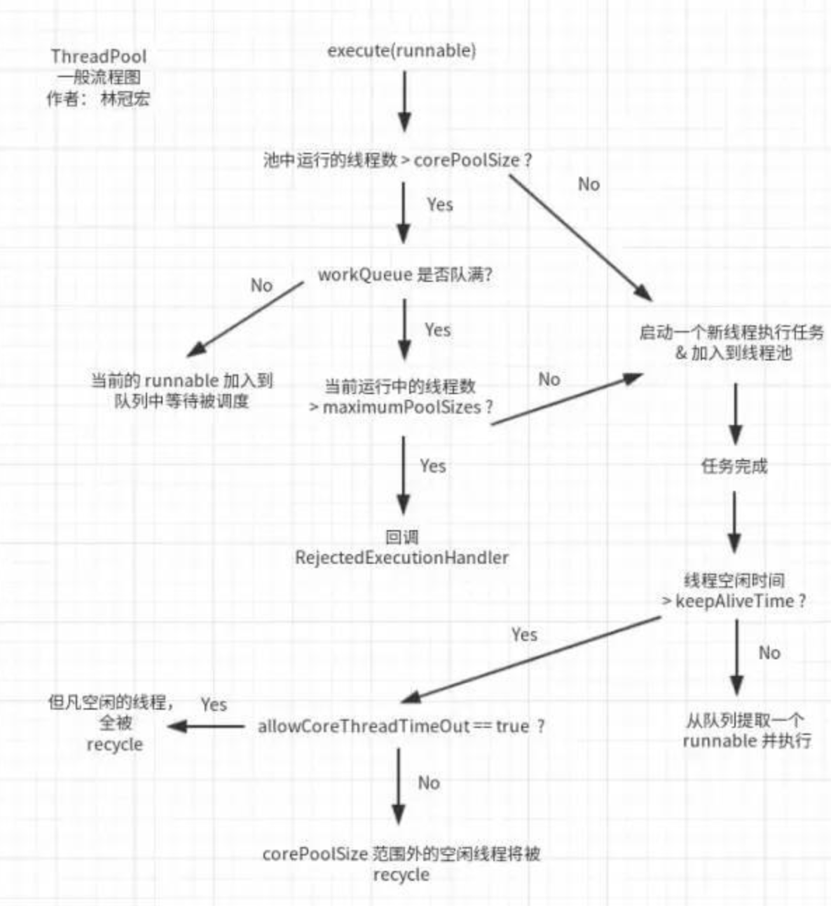
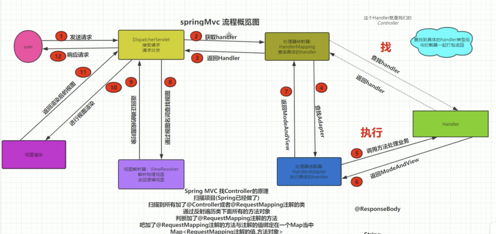
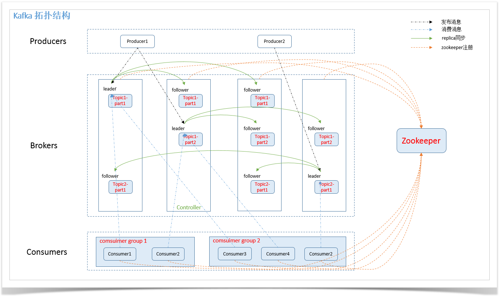
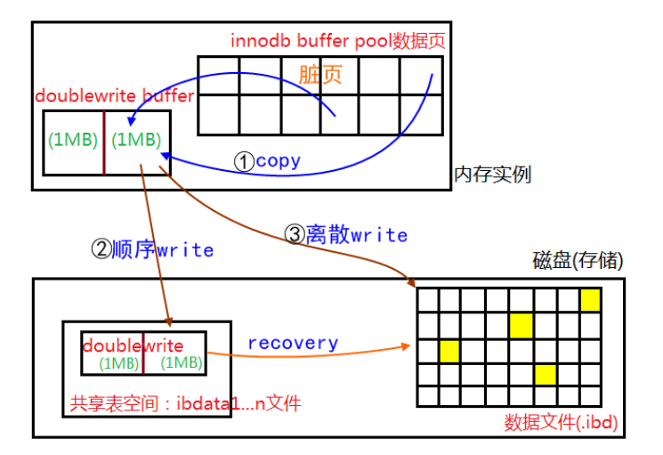
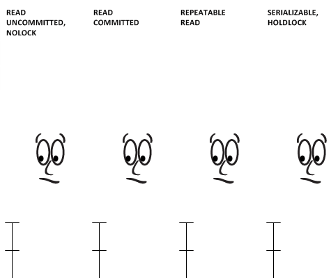
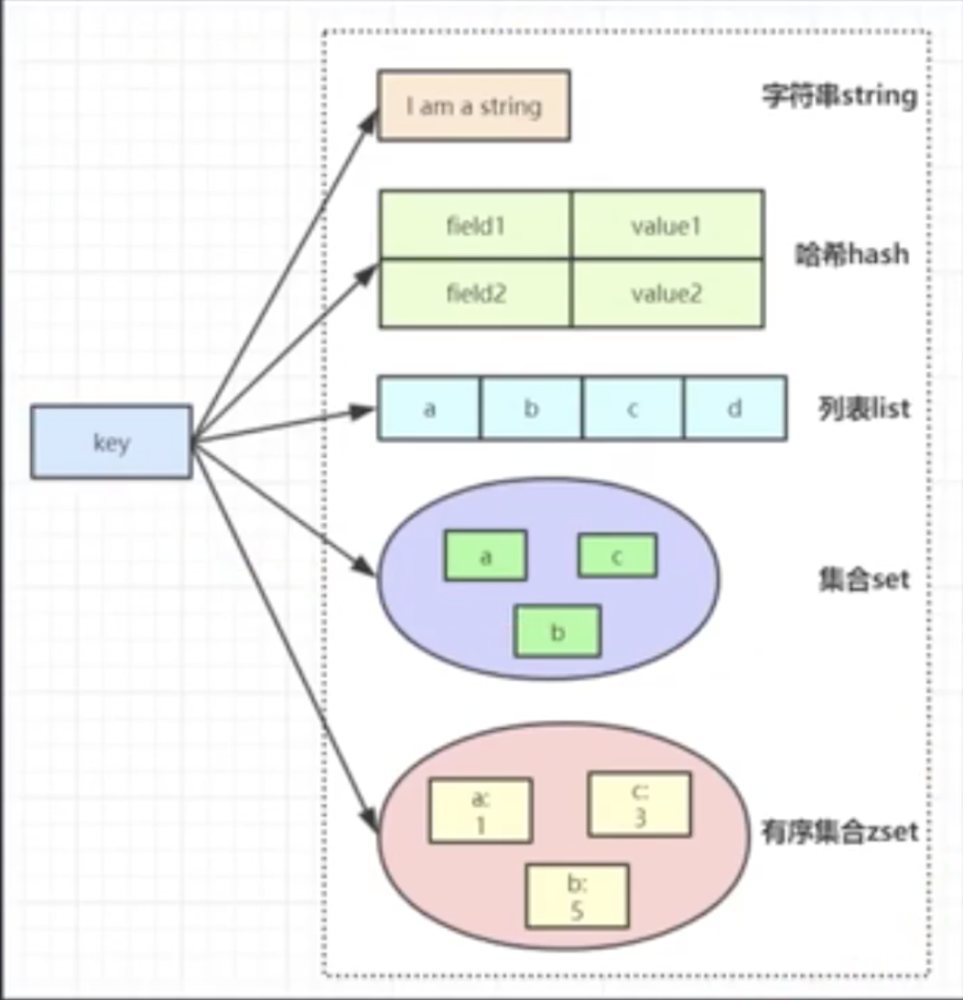

# Java基础

<div style="text-align:center;color:#bfbfbf;font-size:16px;">
    <span>------------------------ 基础 ------------------------</span>
</div>

## 基础
### JDK 和 JRE 有什么区别？
* JDK：Java 开发工具包，提供了 Java 的开发环境和运行环境（包括JRE）。
* JRE：Java 运行环境

### == 和 equals 的区别是什么？
* **==：** 基本类型：比较的是值是否相同；引用类型：比较的是引用的地址是否相同；
* **equals**：equals 本质上就是 ==，只不过 String 和 Integer 等重写了 equals 方法，把它变成了值比较

总结 ：== 对于基本类型来说是值比较，对于引用类型来说是比较的是引用；而 equals 默认情况下是引用比较，只是很多类重新了 equals 方法，比如 String、Integer 等把它变成了值比较，所以一般情况下 equals 比较的是值是否相等。

### 为什么重写了equals方法，就要重写hashCode方法？
不是必须，只是建议。虽然可以不重写hashCode，但是会对集合造成影响。
比如hashMap，如果equals判断相同的key，但是hashCode不同，也就是内存中的地址不同，那么进行如下操作，就不会被覆盖，而是被put两次
hashMap.put("k","v1")，hashMap.put("k":"v2")

###  final 在 Java 中有什么作用？
* final 修饰的类叫最终类，该类不能被继承。
* final 修饰的方法不能被重写。
* final 修饰的变量叫常量，常量必须初始化，初始化之后值就不能被修改。

### Java基础的数据类型有哪些？
基础类型有 8 种：byte、boolean、char、short、int、float、long、double

### Java 中操作字符串都有哪些类？它们之间有什么区别？
操作字符串的类有：String、StringBuffer、StringBuilder。
String：
    * 声明的是不可变的对象，它的底层是一个用final修饰的字符数组，每次操作都会生成新的 String 对象，然后将指针指向新的 String 对象
    * String 对象赋值之后就会在字符串常量池中缓存，如果下次创建会判定常量池是否已经有缓存对象，如果有的话直接返回该引用给创建者。
StringBuffer： 可以在原有对象的基础上进行操作，线程安全的，性能高于StringBuilder
StringBuilder： 可以在原有对象的基础上进行操作，非线程安全的

### String和StringBuilder 的区别？
jdk1.5：string 对象时恒定不变的,stringBuider对象表示的字符串是可变的。所以在字符串频繁修改的情况下stringBuider效率
jdk1.8: 编译器利用String的可变配套类(StringBuilder)帮我们做了优化，编译器自动调用StringBuilder.apend()方法添加。因此在拼接字符串小于500左右时，两个对象效率相同。


### 接口和抽象类有什么区别？
设计目的：
    * 接口的设计目的，是对类的行为进行约束，也就是提供一种机制，可以强制要求不同的类具有相同的行为。
    * 抽象类的设计目的，是代码复用。
相同：
    * 都不能被实例化
    * 都能包含抽象的方法
不同：
    * 在抽象类中可以写非抽象的方法，从而避免在子类中重复书写他们，这样可以提高代码的复用性，这是抽象类的优势；接口中只能有抽象的方法。
    * 抽象类中的成员变量可以是各种类型的；而接口中的成员变量只能是public static final类型的；
    * 抽象类可以有静态代码块和静态方法；接口中不能含有静态代码块以及静态方法
    * 一个类只能继承一个抽象类，而一个类却可以实现多个接口。　　

### 请列举你所知道的Object类的方法并简要说明。
* getClass():用于返回当前运行时对象的Class对象
* equals():用于比较两个对象的地址是否相同，即两个引用是否指向同一个对象；
* clone():用于创建并返回当前对象的一份拷贝
* toString():返回类的名字@实例的哈希码的16进制字符串；
* notify():唤醒等待队列中的其中一个线程
* notifyAll():唤醒线程等待队列中的所有线程；
* wait(long timeout):让一个线程等待一段时间。
* finalize()：用于释放资源，可以覆盖此方法实现资源清理工作。GC在回收对象之前调用该方法，但是无法确定该方法具体什么时候被调用

### 类的加载顺序
* 父类静态代码块(包括静态初始化块，静态属性，但不包括静态方法)
* 子类静态代码块(包括静态初始化块，静态属性，但不包括静态方法 )
* 父类非静态代码块( 包括非静态初始化块，非静态属性 )
* 父类构造函数
* 子类非静态代码块 ( 包括非静态初始化块，非静态属性 )
* 子类构造函数

### 对象在堆上要分配多大内存？
1. java对象的属性---不固定
2. 对象头---固定12 byte
3. 数据对齐（64位虚拟机要求对象大小是8的整数倍，不够就补齐）

64位jvm中，一个仅包含一个boolean属性的对象，大小是16 byte，12byte对象头，1byte数据，3byte填充数据

### 对象有几种状态？
1. 无状态 刚new出来的时候  biased_lock:0 | lock: 10
2. 偏向锁 biased_lock:1 | lock: 10
3. 轻量级锁
4. 重量级锁
5. 无引用，被gc标记

### 什么是对象头？
所有对象通用的一部分结构。
由两部分组成：
1. mark word 
    * 32 bits jvm 占 32 bits
        * hashcode：25｜ age：4｜ biased_lock(偏向锁)：1 | lock(同步状态) : 2 
    * 64 bits jvm 占 64 bits
        * 
        * 无状态下，在未调用过hashcode函数时，对象头hashcode位置都为0，调用过hashcode函数计算之后才会保存。
2. klass pointer 指向类.class的指针
    * 64 bits jvm 开启指针压缩占 32 bits 不开启占 64 bits
    
### 解释一下对象创建过程？
假设有一个对象T,有一个属性m=8，那么在new 这个对象时先在堆中申请空间，
然后属性半初始化也就是m=0，然后再调用构造方法将m修改为8，然后将引用变量t指向堆中的地址。

### DCL与volatile的问题？
volatile 的作用是线程的可见性和禁止了指令重排序。
在单例模式中，未了保证多线程的安全性，采用了DCL（Double-Check-Locking）方式，
那么在线程1创建对象X的时候，对象先半初始化，再调用构造方法，线程2再去判断X对象等不等于空，
如果此时发生指令重排序，对象先半初始化，线程2再去判断X对象等不等于空，再调用构造方法，会导致线程2拿到了半初始化的对象。
所以需要volatile来禁止指令重排。

### 对象在内存中的存储布局？
对象头、实例数据和对齐填充

### 对象怎么定位？
引用->堆内存的对象->方法区常量。

### 对象怎么分配？
开始new一个对象
    *尝试在栈上分配？
        * 可以在栈上分配，在pop时结束生命周期
        * 若一个对象的引用逃出了方法或者线程，在方法调用过程中传递对象的引用到另一个方法，或栈空间不够大。则不能在栈上分配。
            * 对象是否够大？
                * 足够大，老年代分配，full gc时结束生命周期
                * 不够大，尝试 tlab 分配？
                    * tlab空间是否足够？
                        * 足够，tlab（线程本地空间）分配到eden，
                        * 不足，共享空间分配到eden
                    * young gc-> 幸存者区-> 老年代-> full gc 结束生命周期
                    
一般的对象分配内存，都是在新生代进行空间申请的。在多个线程都在申请空间时，每次对象分配都必须进行同步。竞争激烈的场合分配的效率又会进一步下降。TLAB是一个存在于eden区的线程独享内存区域，主要用于降低在新生代分配对象时的内存竞争，提升对象分配的效率。
      

### Object o = new Object() 在内存中占多少字节？
对象的引用o 4 byte
Object 的 mark word 占 8 byte
klass pointer 若开启指针压缩占 4 byte，不开启压缩占 8 byte
对象的属性大小不确定。


<div style="text-align:center;color:#bfbfbf;font-size:16px;">
    <span>------------------------ 集合 ------------------------</span>
</div>

## 集合

###  HashSet 的底层实现是什么?
HashSet 的实现是依赖于 HashMap 的，HashSet 的值都是存储 在 HashMap 中的。在 HashSet 的构造法中会初始化一个 HashMap 对象
HashSet 不允许值重复，因此，HashSet 的值是作为 HashMap 的 key 存储在 HashMap 中的，当存储的值已经存在时返回 false。

###  Iterator 和 ListIterator 的区别是什么?
* Iterator 可用来遍历 Set 和 List 集合，但是 ListIterator 只能用来遍历 List。
* Iterator 对集合只能是前向遍历，ListIterator 既可以前向也可以后向。
ListIterator 实现了 Iterator 接口，并包含其他的功能，比如:增加元素，替换元 素，获取前一个和后一个元素的索引，等等。

### 数组 (Array) 和列表 (ArrayList) 有什么区别?
* Array 可以包含基本类型和对象类型，ArrayList 只能包含对象类型。
* Array 大小是固定的，ArrayList 的大小是动态变化的。
* ArrayList 处理固定大小的基本数据类型的时候，这种方式相对比较慢。

###  Comparable 和 Comparator 接口是干什么的?
**Comparable**：只包含一个 compareTo() 方法，这个方法可以个 给两个对象排序。具体来说，它返回负数，0，正数来表明输入对象小于，等于，大于 已经存在的对象。
**Comparator**：包含 compare() 和 equals() 两个方法。
    * compare() 方法用来给两个输入参数排序，返回负数，0，正数表明第一个参数是小 于，等于，大于第二个参数。
    * equals() 方法需要一个对象作为参数，它用来决定输入 参数是否和 comparator 相等。
    
### Collection 和 Collections 的区别？
**Collection**：是集合类的上级接口, 继承与它的接口主要是 set 和 list。
**Collections**： 类是针对集合类的一个帮助类. 它提供一系列的静态方法对各种集合的搜 索, 排序, 线程安全化等操作。

### ArrayList 和 Vector 的区别？
**相同**：
    * 都实现了 List 接口(List 接口继承了 Collection 接口)
    * 都是有序集合，即存储在这两个集合中的元素的位置都是有顺序的，相当于一种动态的数组
    * 允许重复

**区别**：
    * Vector 是线程安全的，ArrayList 是线程序不安全的。
**数据增长**:
    * 相同：ArrayList 与 Vector 都可以设置初始的空间大小
    * 不同：Vector 还可以设置增长的空间大小，而 ArrayList 没有提供设置增长空间的方法。
           Vector 默认增加原来的 1 倍，ArrayList 增加原来的 0.5 倍。
           
### 快速失败 (fail-fast) 和安全失败 (fail-safe) 的区别是什么?
Iterator 的安全失败是基于对底层集合做拷贝，因此，它不受源集合上修改的影响。

java.util 包下面的所有的集合类都是快速失败的，迭代器会抛出 ConcurrentModificationException 异常
java.util.concurrent 包下面的所有的类都是安全失败的。安全失败的迭代器永远不会抛出这样的异常。


    
### List、Map、Set 三个接口，存取元素时，各有什么特点?
这样的题属于随意发挥题:这样的题比较考水平，两个方面的水平:一是要真正明白 这些内容，二是要有较强的总结和表述能力。如果你明白，但表述不清楚，在别人那 里则等同于不明白。

首先List与Set
相同：
    * 都是单列元素的集合，有一个相同的父类 Collection
不同：
    * List 元素可以重复，Set不可以
    * List 可以按index取元素，Set只能逐一遍历
    * List 是有序集合。

Map 是双列集合，要存储一对 key/value，不能存储重复的 key。

###  HashMap 的工作原理是什么?
HashMap 1.8是 **数组 + 链表 + 红黑树** 实现的。
* 负载因子（loadFactor）：0.75f
* 容量（capacity）：16
* 扩容阈值（threshold）：loadFactor * capacity
* 转化成树的链表阈值（TREEIFY_THRESHOLD）：8
* 转化成树的最小容量（MIN_TREEIFY_CAPACITY）：64
Java 中的 HashMap 是以键值对 (key-value) 的形式存储元素的，我们把一对(key-value)称为Node。
HashMap 需要 一个 hash 函数，当调用 put() 方法的时候，HashMap 会计算 key 的 hash 值，然后把键值对存储在集合中合适的索引上。 
如果索引上已经存在了Node，发生哈希冲突。
    * 如果索引上的结构是**链表**，则在链表中遍历，如果有相同的key，value 会被更新成新值，否则遍历到链表尾部，插入新的(key-value) ，size+1
        * 如果链表的长度大于**转化成树的链表阈值（TREEIFY_THRESHOLD）** 并且，hashMap的容量大于**转化成树的最小容量（MIN_TREEIFY_CAPACITY）** 则转换成`红黑树`。
    * 如果索引上的结构是**红黑树**，则在红黑树中遍历，如果有相同的key，value 会被更新成新值，否则插入红黑树，size+1。
    
如果 size > threshold 则进行扩容。
    * 当原来的容量已经达到最大容量的时候，将阈值设置为Integer.MAX_VALUE，这样就不会再发生重构的情况
    * 将新的阈值设置为旧的阈值的两倍, 新的容量设置为旧容量的2倍。
    * 根据新容量新建一个Node数组，将旧数组中的元素全部取出，重新映射到新数组中
    
### hashMap 容量为什么是 2 的幂次？
为了**加快哈希计算**以及**减少哈希冲突**。
为什么可以加快计算？
我们都知道为了找到 KEY 的位置在哈希表的哪个槽里面，需要计算 **hash(KEY) % 数组长度**
但是 % 计算比 & 慢很多，所以用 & 代替 %，为了保证 & 的计算结果等于 % 的结果需要把 length 减 1，也就是 **hash(KEY) & (length - 1)**
证明：当length 为2的幂次时，m % length = m & (length-1)
     m 可以分成两部分 x（length的正数倍） 和 y（剩余部分） 因此 y的范围为 0 <= y <length
     m % length = (x + y)% length = x % length + y % length = 0 + y % length = y
     假设y 是 5 二进制 0101，length 为 8 二进制 1000 ，length -1 二进制 0111
     0101&0111 = 0101 刚好将 5取出，因此成立

为什么可以减少冲突？
假设现在数组的长度 length 可能是偶数也可能是奇数。
length 为偶数时，length-1 为奇数，奇数的二进制最后一位是 1，这样便保证了 hash &(length-1) 的最后一位可能为 0，也可能为 1（这取决于 h 的值），即 & 运算后的结果可能为偶数，也可能为奇数，**这样便可以保证散列的均匀性。**
length 为奇数的话，很明显 length-1 为偶数，它的最后一位是 0，这样 hash & (length-1) 的最后一位肯定为 0，即只能为偶数，这样任何 hash 值都只会被散列到数组的偶数下标位置上，这便**浪费了近一半的空间**

    
### ConcurrentHashMap 的工作原理是什么什么？
* JDK1.7:
    ConcurrentHashMap采用了**数组+Segment+分段锁**的方式实现。
    Segment：类似于HashMap的结构，即内部拥有一个Entry数组，数组中的每个元素又是一个链表,同时又是一个ReentrantLock（Segment继承了ReentrantLock）。
    
    从上面的结构我们可以了解到，ConcurrentHashMap定位一个元素的过程需要进行两次Hash操作。
    第一次Hash定位到Segment，第二次Hash定位到元素所在的链表的头部。
* JDK1.8:
    采用了数组+链表+红黑树实现.**彻底放弃了Segment转而采用的是Node，其设计思想也不再是JDK1.7中的分段锁思想。**
    Java8 ConcurrentHashMap结构基本上和Java8的HashMap一样，原来是对需要进行数据操作的Segment加锁，现调整为对每个数组元素加锁（Node）。

### HashTable 、ConcurrentHashMap 和 hashMap 的区别？
hashTable 默认初始容量是11，hashMap 和 ConcurrentHashMap 默认初始容量是16，
HashTable 在put和get方法上用了 synchronized 。ConcurrentHashMap 对每个node节点使用 synchronized

### LinkedHashMap 工作原理？
LinkedHashMap基于hashMap的基础上，对每个键值对(Node节点)多维护了一个before和after指针，每次插入时维护双向链表。
LinkedHashMap有序，可分为插入顺序和访问顺序两种。
如果是访问顺序，那put和get操作已存在的Entry时，都会把Entry移动到双向链表的表尾(其实是先删除再插入)。

### TreeMap 工作原理？
底层红黑树实现。
TreeMap有序是通过Comparator来进行比较的，如果comparator为null，那么就使用自然顺序

### Stack 的工作原理？
继承vector，添加操作是添加到vector的尾部，pop操作是移除vector末尾元素。


<div style="text-align:center;color:#bfbfbf;font-size:16px;">
    <span>------------------------ 异常 ------------------------</span>
</div>

## 异常
### Java中的异常有哪几类？
异常类有分为编译时异常和运行时异常
常见的编译时异常：
    * IOException
    * SQLException
    * parseException
    
常见的运行时异常（RuntimeException）：
    * NullPointerException: 空指针异常,一般出现于数组,空对象的变量和方法
    * ArrayIndexOutOfBoundsException: 数组越界异常
    * NoClassDefFoundException: java运行时系统找不到所引用的类
    * NumberFormatException: 数据格式异常
    * OutOfMemoryException: 内存溢出异常
    * ArithmeticException: 算数异常,一般在被除数是0中
    * IllegalArgumentException: 非法参数异常
    

### Error 和 Exception 区别是什么？
Error 类型的错误通常为虚拟机相关错误，如系统崩溃，内存不足，堆栈溢出等，编译器不会对这类错误进行检测，JAVA 应用程序也不应对这类错误进行捕获，一旦这类错误发生，通常应用程序会被终止，仅靠应用程序本身无法恢复；
Exception 类的错误是可以在应用程序中进行捕获并处理的，通常遇到这种错误，应对其进行处理，使应用程序可以继续正常运行。

### 运行时异常和编译时异常区别是什么？
运行时异常：编译器不会对运行时异常进行检测，没有 try-catch，方法签名中也没有 throws 关键字声明，编译依然可以通过。如果出现了 RuntimeException, 那一定是程序员的错误
编译时异常：如果没有 try-catch，且方法签名中也没有用 throws 关键字声明可能抛出的异常，则编译无法通过。这类异常通常为应用环境中的错误，即外部错误，非应用程序本身错误，如文件找不到等。

### throw 和 throws 的区别是什么？
**throw** 关键字用来抛出方法或代码块中的异常，受查异常和非受查异常都可以被抛出。
**throws** 关键字用在方法签名处，用来标识该方法可能抛出的异常列表。一个方法用 throws 标识了可能抛出的异常列表，调用该方法的方法中必须包含可处理异常的代码，否则也要在方法签名中用 throws 关键字声明相应的异常。


### Java内存溢出是什么？
内存溢出分三种情况。
* OutOfMemoryError： PermGen space 元空间
    这个区域主要用来保存加来的Class的一些信息，在程序运行期间属于永久占用的，Java的GC不会对他进行释放，所以如果启动的程序加载的信息比较大，超出了这个空间的大小，就会发生溢出错误；
    解决的办法无非就是增加空间分配了——增加java虚拟机中的XX:PermSize和XX:MaxPermSize参数的大小，其中XX:PermSize是初始永久保存区域大小，XX:MaxPermSize是最大永久保存区域大小。
* OutOfMemoryError：Java heap space 
    heap 是Java内存中的堆区，主要用来存放对象，当对象太多超出了空间大小，GC又来不及释放的时候，就会发生溢出错误。
    一般来说，当已存在对象没有引用(即不可达)的时候，GC就会定时的来回收对象，释放空间。但是因为程序的设计问题，导致对象可达但是又没有用(即前文提到的内存泄露)，当这种情况越来越多的时候，问题就来了。
    针对这个问题，我们需要做一下两点： 1、检查程序，减少大量重复创建对象的死循环，减少内存泄露。 2、增加Java虚拟机中Xms（初始堆大小）和Xmx（最大堆大小）参数的大小。
* StackOverFlowError
    stack是Java内存中的栈空间，主要用来存放方法中的变量，参数等临时性的数据的，发生溢出一般是因为分配空间太小，或是执行的方法递归层数太多创建了占用了太多栈帧导致溢出。
    针对这个问题，除了修改配置参数-Xss参数增加线程栈大小之外，优化程序是尤其重要。


<div style="text-align:center;color:#bfbfbf;font-size:16px;">
    <span>------------------------ 反射 ------------------------</span>
</div>

## 反射
### 什么是反射？
反射是在运行状态中，对于任意一个类，都能够知道这个类的所有属性和方法；对于任意一个对象，都能够调用它的任意一个方法和属性；
这种动态获取的信息以及动态调用对象的方法的功能称为 Java 语言的反射机制。


### 什么是 Java 序列化？什么情况下需要序列化？
Java 序列化是为了保存各种对象在内存中的状态，并且可以把保存的对象状态再读出来。
以下情况需要使用 Java 序列化：
* 想把的内存中的对象状态保存到一个文件中或者数据库中时候；
* 想用套接字在网络上传送对象的时候；
* 想通过RMI（远程方法调用）传输对象的时候。


### 动态代理是什么？有哪些应用？
动态代理是运行时动态生成代理类。

动态代理的应用有 spring aop、hibernate 数据查询、测试框架的后端 mock、rpc，Java注解对象获取等。

### 怎么实现动态代理？
JDK 原生动态代理和 cglib 动态代理。JDK 原生动态代理是基于接口实现的，而 cglib 是基于继承当前类的子类实现的。

### JDK 动态代理为什么只能基于接口？
java的代理对象自动继承了Proxy，又因为JAVA是单继承的，所以目标对象只能实现接口不能继承。
    
    


<div style="text-align:center;color:#bfbfbf;font-size:16px;">
    <span>------------------------ JVM ------------------------</span>
</div>

## JVM
### 什么是JVM？什么是hotspot？
JVM ------- 规范/标准
hotspot --- 产品/实现

### 说一下 JVM 的主要组成部分？及其作用？

* 类加载器（ClassLoader）
* 运行时数据区（Runtime Data Area）
* 执行引擎（Execution Engine）
* 本地库接口（Native Interface）

组件的作用： 首先通过类加载器（ClassLoader）会把 Java 代码转换成字节码，
           运行时数据区（Runtime Data Area）再把字节码加载到内存中，而字节码文件只是 JVM 的一套指令集规范，并不能直接交给底层操作系统去执行，
           因此需要特定的命令解析器执行引擎（Execution Engine），将字节码翻译成底层系统指令，再交由 CPU 去执行，
           而这个过程中需要调用其他语言的本地库接口（Native Interface）来实现整个程序的功能。

### 说一下类装载的执行过程？

类装载分为以下 5 个步骤：
1. **加载**：将.class文件从磁盘读到内存
    * 通过类的全限定名(com.xxx.xxx)+类加载器确定唯一的类，来获取定义此类的二进制字节流
    * 将这个类字节流代表的静态存储结构转为方法区的运行时数据结构
    * 在堆中生成一个代表此类的java.lang.Class对象，作为访问方法区这些数据结构的入口。
2. **检查**：检查加载的 class 文件的正确性；
    * 文件格式验证:验证字节流是否符合 Class 文件的规范，如 主次版本号是否在当前虚拟机范围内，常量池中的常量是否有不被支持的类型.
    * 元数据验证:对字节码描述的信息进行语义分析，如这个类是否有父类，是否集成了不被继承的类等。
    * 字节码验证:是整个验证过程中最复杂的一个阶段，通过验证数据流和控制流的分析，确定程序语义是否正确，主要针对方法体的验证。如:方法中的类型转换是否正确，跳转指令是否正确等。
    * 符号引用验证:基于方法区的存储结构验证，发生在解析中，是否可以将符号引用成功解析为直接引用。
3. **准备**：给类中的静态变量分配内存空间；
    * public static int value = 123; //此时在准备阶段过后的初始值为0而不是123，在初始化过程才会被赋值为123
    * public static final int value = 123;//value的值在准备阶段过后就是123。
4. **解析**：虚拟机将常量池中的符号引用替换成直接引用的过程。**符号引用就理解为一个标示，而在直接引用直接指向内存中的地址**；
5. **初始化**：对静态变量和静态代码块执行初始化工作。


### 类加载器的种类？

* 启动类加载器(Bootstrap ClassLoader)：负责加载JRE的核心类库，如JRE目标下的rt.jar，charsets.jar等
* 扩展类加载器(Extension ClassLoader)：负责加载JRE扩展目录ext中jar类包
* 系统类加载器(Application ClassLoader)：负责加载ClassPath路径下的类包
* 用户自定义加载器(User ClassLoader)：负责加载用户自定义路径下的类包

### 什么是双亲委派模型？

如果一个类加载器收到了类加载的请求，它首先不会自己去加载这个类，而是把这个请求委派给父类加载器去完成，每一层的类加载器都是如此，这样所有的加载请求都会被传送到顶层的启动类加载器中，只有当父加载无法完成加载请求（它的搜索范围中没找到所需的类）时，子加载器才会尝试去加载类。
           
### 双亲委派模式的优势?
* 沙箱安全机制:比如自己写的String.class类不会被加载，这样可以防止核心库被随意篡改
* 避免类的重复加载:当父ClassLoader已经加载了该类的时候，就不需要子ClassLoader再加载一次   

### 为什么要打破双亲委派模式?
例如：tomcat 
Tomcat是个web容器,可能需要部署两个应用程序，不同的应用程序可能会依赖同一个第三方类库的不同版本，不能要求同一个类库在同一个服务器只有一份，因此要保证每个应用程序的类库都是独立的，保证相互隔离。 
如果使用默认的类加载器机制，那么是无法加载两个相同类库的不同版本的，默认的类加载器是不管你是什么版本的，只在乎你的全限定类名，并且只有一份。
           
###  JVM 运行时数据区？

* 程序计数器（Program Counter Register）: 前线程所执行的字节码的行号指示器，字节码解析器的工作是通过改变这个计数器的值，来选取下一条需要执行的字节码指令，分支、循环、跳转、异常处理、线程恢复等基础功能，都需要依赖这个计数器来完成；
* Java 虚拟机栈（Java Virtual Machine Stacks）: 用于存储局部变量表、操作数栈、动态链接、方法出口等信息；
* 本地方法栈（Native Method Stack）: 与虚拟机栈的作用是一样的，只不过虚拟机栈是服务 Java 方法的，而本地方法栈是为虚拟机调用 Native 方法服务的；
* Java 堆（Java Heap）: Java 虚拟机中内存最大的一块，是被所有线程共享的，几乎所有的对象实例都在这里分配内存；
* 方法区（Methed Area）: 用于存储已被虚拟机加载的类信息、常量、静态变量、即时编译后的代码等数据。


### Java 中都有哪些引用类型？
* 强引用：通常我们使用new操作符创建一个对象时所返回的引用即为强引用
* 软引用：有用但不是必须的对象，在发生内存溢出之前会被回收。内存不够的时候垃圾回收器会回收。softReference适用于做缓存。
* 弱引用：有用但不是必须的对象，在下一次GC时会被回收。垃圾回收器遇到就会回收。WeekReference能解决某些地方的内存泄露问题。
* 虚引用（幽灵引用/幻影引用）：无法通过虚引用获得对象。垃圾回收器遇到就会回收，PhantomReference<Object,queue> 实现虚引用，虚引用的用途是在 gc 时返回一个通知放到queue中。
                         java在申请一块堆外内存之后，会在堆内存分配一个对象保存这个堆外内存的引用，这个对象被垃圾收集器管理，一旦这个对象被回收，相应的用户线程会收到通知并对直接内存进行清理工作。
                         
                         
### Java 堆的结构是什么样子的?

堆空间一般分为新生代、老年代。

### 什么是新生代？
新生代分为两部分:`伊甸区`(Eden space)和`幸存者区`(Survivor space)，所有的类都是在伊甸区被new出来的。
幸存区(Survivor space):分为From和To区,TO区永远保持空。
当Eden区的空间用完是，程序又需要创建对象，JVM的垃圾回收器将Eden区进行垃圾回收(`Minor GC`)，将Eden区中的不再被其它对象应用的对象进行销毁。
然后将Eden区中剩余的对象移到From Survivor区。若From Survivor区也满了，再对该区进行垃圾回收，然后移动到To Survivor区，From区为空后，将To和From区转换，保证To区为空，并且对象年龄加一。
当对象年龄默认加到15（因为**对象头只有4个bits**是存对象年龄，最大为15）时将剩下的对象移到老年代。

### 什么是老年代？
新生代经过多次GC仍然存货的对象移动到老年区。
若老年代也满了，这时候将发生Major GC(也可以叫`Full GC`)， 进行老年区的内存清理。
若老年区执行了Full GC之后发现依然无法进行对象的保存，就会抛出 OOM(OutOfMemoryError)异常.

### Survivor区 到 老年代有什么条件？
对象年龄到15，才会移动到老年代。因为**对象头只有4个bits**是存对象年龄，最大为15

### JVM 有哪些垃圾回收算法？
* **标记-清除算法**：标记无用对象，然后进行清除回收。缺点：效率不高，无法清除垃圾碎片。
* **标记-整理算法**：标记无用对象，让所有存活的对象都向一端移动，然后直接清除掉端边界以外的内存。
* **复制算法**：按照容量划分二个大小相等的内存区域，当一块用完的时候将活着的对象复制到另一块上，然后再把已使用的内存空间一次清理掉。缺点：内存使用率不高，只有原来的一半。
* **分代算法**：根据对象存活周期的不同将内存划分为几块，一般是新生代和老年代，新生代基本采用复制算法，老年代采用标记整理算法。

### JVM 有哪些垃圾回收器？
* Serial：最早的单线程串行垃圾回收器。**新生代采用复制算法，老年代采用标记-整理算法。**
* Serial Old：Serial 垃圾回收器的老年代版本，同样也是单线程的，可以作为 CMS 垃圾回收器的备选预案。采用**标记-整理**算法。
* ParNew：是 Serial 的多线程版本。**新生代采用复制算法，老年代采用标记-整理算法。**
* Parallel： 是 ParNew 收集器类似是多线程的，但 Parallel 是吞吐量优先的收集器，可以牺牲等待时间换取系统的吞吐量。**新生代采用复制算法，老年代采用标记-整理算法。**
* Parallel Old： 是 Parallel 老年代版本，，Parallel Old 使用的是**标记-整理**的内存回收算法。
* CMS：一种以获得最短停顿时间为目标的收集器，第一款真正意义上的并发收集器，它第一次实现了让垃圾收集线程与用户线程(基本上)同时工作。是一种**标记-清除**算法实现
    * 初始标记(CMS initial mark): 暂停所有的其他线程，并记录下直接与root相连的对象，速度很快 
    * 并发标记(CMS concurrent mark): **同时开启GC和用户线程**，用一个闭包结构去记录可达对象。但在这个阶段结束，这个闭包结构并不能保证包含当前所有的可达对象。因为用户线程可能会不断的更新引用域，所以GC 线程无法保证可达性分析的实时性。所以这个算法里会跟踪记录这些发生引用更新的地方。
    * 重新标记(CMS remark): 重新标记阶段就是为了修正并发标记期间因为用户程序继续运行而导致标记产生变动的那一部分对象的标记记录，这个阶段的停顿时间一般会比初始标记阶段的时间稍长，远远比并发标记阶 段时间短
    * 并发清除(CMS concurrent sweep): 开启用户线程，同时GC线程开始对为标记的区域做清扫。
* G1：一种兼顾吞吐量和停顿时间的 GC 实现，是 JDK 9 以后的默认 GC 选项。G1从整体来看是基于**标记整理**算法实现的收集器;从局部上来看是基于**标记复制**算法实现的

### 堆栈的区别？
* 功能方面：堆是用来存放对象的，栈是用来执行程序的。
* 共享性：堆是线程共享的，栈是线程私有的。
* 空间大小：堆大小远远大于栈。

### 怎么判断对象是否可以被回收？
**引用计数器**：为每个对象创建一个引用计数，有对象引用时计数器 +1，引用被释放时计数 -1，当计数器为 0 时就可以被回收。它有一个缺点不能解决循环引用的问题；
**可达性分析**：这个算法的基本思想就是通过一系列的称为"GC Roots"的对象作为起点，从这些节点开始向下搜索，节点所走过的路径称为引用链，当一个对象到GC Roots没有任何引用链相连的话，则证明此对象时不可用的。
    * `GC Roots根节点`:类加载器、Thread、虚拟机栈的局部变量表、static成员、常量引用、本地方法栈的变量等等.


### JVM 调优的工具？
JDK 自带了很多监控工具，都位于 JDK 的 bin 目录下，其中最常用的是 jconsole 和 jvisualvm 这两款视图监控工具。
* jconsole：用于对 JVM 中的内存、线程和类等进行监控；
* jvisualvm：JDK 自带的全能分析工具，可以分析：内存快照、线程快照、程序死锁、监控内存的变化、gc 变化等。

### JVM 调优的参数都有哪些？
-Xms2g：初始化推大小为 2g；
-Xmx2g：堆最大内存为 2g；
-XX:NewRatio=4：设置年轻的和老年代的内存比例为 1:4；
-XX:SurvivorRatio=8：设置新生代 Eden 和 Survivor 比例为 8:2；
–XX:+UseParNewGC：指定使用 ParNew + Serial Old 垃圾回收器组合；
-XX:+UseParallelOldGC：指定使用 ParNew + ParNew Old 垃圾回收器组合；
-XX:+UseConcMarkSweepGC：指定使用 CMS + Serial Old 垃圾回收器组合；
-XX:+PrintGC：开启打印 gc 信息；
-XX:+PrintGCDetails：打印 gc 详细信息。

### Java 中会存在内存泄漏吗？
所谓内存泄露就是指一个不再被程序使用的对象或变量一直被占据在内存中。
长生命周期的对象持有短生命周期对 象的引用就很可能发生内存泄露，尽管短生命周期对象已经不再需 要，但是因为长生命周期对象持有它的引用而导致不能被回收。

### finalize() 方法什么时候被调用?
垃圾回收器(garbage colector)决定回收某对象时，就会运行该 对象的 finalize() 方法 但是在 Java 中很不幸，如果内存总是充 足的，那么垃圾回收可能永远不会进行，也就是说 filalize() 可能 永远不被执行，显然指望它做收尾工作是靠不住的。 那么 finalize() 究竟是做什么的呢? 它最主要的用途是回收特殊渠道申请的内存。Java 程序有垃圾回收器，所以一般情况下内存问题 不用程序员操心。但有一种 JNI(Java Native Interface)调用 non-Java 程序(C 或 C++)， finalize() 的工作就是回收这部分的内存。

### 深拷贝和浅拷贝区别是什么？
* 浅克隆：当对象被复制时只复制它本身和其中包含的值类型的成员变量，而引用类型的成员对象并没有复制，指向同一个地址。
* 深克隆：除了对象本身被复制外，对象所包含的所有成员变量也将复制。

###  如何实现对象克隆？
* 实现 Cloneable 接口并重写 Object 类中的 clone() 方法。
* 实现 Serializable 接口，通过对象的序列化和反序列化实现克隆，可以实现真正的深度克隆。

<div style="text-align:center;color:#bfbfbf;font-size:16px;">
    <span>------------------------ 多线程 ------------------------</span>
</div>

## 多线程

### 什么是线程安全？
如果你的代码所在的进程中有多个线程在同时运行，而这些线程可能会同时运行这段代码。如果每次运行结果和单线程运行的结果是一样的，而且其他的变量的值也和预期的是一样的，就是线程安全的。 

### 如何保证线程安全？
* synchronized关键字 
* 用Lock锁
* volatile+CAS【单纯的volatile是轻量级的同步机制**保证可见性但是不具备原子性**所以要配合CAS来实现线程安全】
* atomic原子类

###  哪些集合类是线程安全的？
Vector、Hashtable、Stack 都是线程安全的，而像 HashMap 则是非线程安全的，不过在 JDK 1.5 之后随着 Java. util. concurrent 并发包的出现，它们也有了自己对应的线程安全类，比如 HashMap 对应的线程安全类就是 ConcurrentHashMap。

### 并行和并发有什么区别?
* 并行：多个处理器或多核处理器同时处理多个任务。( 两个队列和一台咖啡机 )
* 并发：多个任务在同一个 CPU 核上，按细分的时间片轮流(交替)执行，从逻辑上来看那些任务是同时执行。( 两个队列和两台咖啡机 )

### 线程和进程的区别?
一个程序下至少有一个进程，一个进程下至少有一个线程，一个进程下也可以有多个线程来增加程序的执行速度。

### 守护线程是什么?
守护线程是运行在后台的一种特殊进程。它独立于控制终端并且周期性地执行某种任务或等待处理某些发生的事件。在 Java 中垃圾回收线程就是特殊的守护线程。

### 创建线程有哪几种方式?
* 继承 Thread 重写 run 方法；
* 实现 Runnable 接口；
* 实现 Callable 接口。(可以获取线程执行之后的返回值)
* 线程池

### Runnable和Callable的区别?
* Callable规定（重写）的方法是call()，Runnable规定（重写）的方法是run()。
* Callable的任务执行后可返回值，而Runnable的任务是不能返回值的。
* call方法可以抛出异常，run方法不可以。
* 运行Callable任务可以拿到一个Future对象，表示异步计算的结果。它提供了检查计算是否完成的方法，以等待计算的完成，并检索计算的结果。通过Future对象可以了解任务执行情况，可取消任务的执行，还可获取执行结果。

### FutureTask 和 Future 的区别？
FutureTask实现了RunnableFuture接口，而RunnableFuture继承了Runnable接口和Future接口。
所以FutureTask既可以作为Runnable被线程执行，又可以作为Future得到Callable的返回值。

### 线程有哪些状态?
* NEW 尚未启动
* RUNNABLE 就绪状态
* RUNNING 执行状态
* BLOCKED 阻塞的（被同步锁或者IO锁阻塞）
* WAITING 等待状态
* TIMED_WAITING 超时等待状态
* TERMINATED 执行完成


### sleep() 和 wait() 有什么区别?
* 类的不同：sleep() 来自 Thread，wait() 来自 Object。
* 释放锁：sleep() 不释放锁；wait() 释放锁。
* 用法不同：sleep() 时间到会自动恢复；wait() 可以使用 notify()/notifyAll()直接唤醒。

### sleep() 和 yield() 区别？
* sleep() 方法给其他线程运行机会时不考虑线程的优先级，因此会给低优先级的线程以运行的机会；yield() 方法**只会给相同优先级或更高优先级的线程以运行的机会；** 
* 线程执行 sleep() 方法后转入阻塞（blocked）状态，而执行 yield() 方法后转入就绪（Runnable）状态； 
* sleep() 方法声明抛出InterruptedException，而 yield() 方法没有声明任何异常； 
* sleep() 方法比 yield() 方法（跟操作系统相关）具有更好的可移植性。

### notify()和 notifyAll()有什么区别？
* notifyAll: 会唤醒所有的线程,会将全部线程由等待池移到锁池,然后参与锁的竞争，竞争成功则继续执行，如果不成功则留在锁池等待锁被释放后再次参与竞争
* notify: 唤醒一个线程,具体唤醒哪一个线程由虚拟机控制。

### 线程的 run() 和 start() 有什么区别？
start() 方法用于启动线程，run() 方法用于执行线程的运行时代码。run() 可以重复调用，而 start() 只能调用一次。

### park() 的作用
LockSupport类中的 park(Object blocker) 表示**阻塞指定线程**，参数blocker当前线程对象，使线程进入等待状态，释放cpu,并不会抛出中断异常
unpark(Thread thread) 唤醒指定线程，参数thread指定线程对象 


### `创建线程池有哪几种方式？`
1. public static ExecutorService newCachedThreadPool() 
    * 默认corePoolSize = 0，maximumPoolSize= 2147483647。
    * 创建一个可缓存线程池，如果线程池长度超过处理需要，可灵活回收空闲线程，若无可回收，则新建线程，但是在之前构造的线程可用时将重用它们。
2. public static ExecutorService newFixedThreadPool(int nThreads) 
    * 默认corePoolSize = nThreads，maximumPoolSize= nThreads。 
    * 创建一个定长线程池，可控制线程最大并发数，以共享的无界队列方式来运行线程，超出的线程会在队列中等待。
3. public static ExecutorService newSingleThreadExecutor() 
    * 默认corePoolSize = 1，maximumPoolSize= 1。  
    * 创建一个单线程化的线程池，它只会用唯一的工作线程来执行任务，以无界队列方式来运行线程，保证所有任务按照指定顺序(FIFO, LIFO, 优先级)执行。
4. public static ScheduledExecutorService newScheduledThreadPool(int corePoolSize) 
    * 默认corePoolSize = corePoolSize，maximumPoolSize= 2147483647。  
    * 创建一个周期线程池，支持定时及周期性任务执行。
5. public static ExecutorService newWorkStealingPool() 
    * 创建持有足够线程的线程池来支持给定的并行级别，并通过使用多个队列，减少竞争，它需要穿一个并行级别的参数，如果不传，则被设定为默认的CPU数量，这个线程池实际上是ForkJoinPool的扩展，适合使用在很耗时的任务中，能够合理的使用CPU进行并行操作。

### 线程池流程？


### 线程池中 submit() 和 execute() 方法有什么区别？
* execute()：只能执行 Runnable 类型的任务。
* submit()：可以执行 Runnable 和 Callable 类型的任务。

### 什么是CAS？
全称Compare and swap，比较并交换。
CAS机制当中使用了3个基本操作数：内存地址V，旧的预期值A，要修改的新值B。只有当变量的预期值A和内存地址V当中的实际值相同时，才会将内存值修改为 B 
java 的 CAS 利用的的是 unsafe（该类都是基于JVM对操作系统进行的操作，因此是unsafe）这个类提供的 CAS 操作
unsafe 的CAS 依赖了的 JVM 针对不同的操作系统实现的 Atomic::cmpxchg
Atomic::cmpxchg 的实现使用了汇编的 cas 操作，并使用 cpu 硬件提供的 lock信号保证其原子性

### CAS有什么问题？
ABA问题。
举个例子：
假设有一个遵循CAS原理的提款机，小灰有100元存款，要用这个提款机来提款50元。
由于提款机硬件出了点小问题，小灰的提款操作被同时提交两次，开启了两个线程，两个线程都是获取当前值100元，要更新成50元。
理想情况下，应该一个线程更新成功，另一个线程更新失败，小灰的存款只被扣一次。
线程1首先执行成功，把余额从100改成50。线程2因为某种原因阻塞了。这时候，小灰的妈妈刚好给小灰汇款50元。
线程2仍然是阻塞状态，线程3执行成功，把余额从50改成100。
线程2恢复运行，由于阻塞之前已经获得了“当前值”100，并且经过compare检测，此时存款实际值也是100，所以成功把变量值100更新成了50。
小灰凭空少了50元钱。

解决方案：
使用携带版本的号的AtomicStampedReference

### 什么是AQS？
AbstractQueuedSynchronizer，抽象队列同步器
AQS就是一个并发包的基础组件，是一个抽象类，用来实现各种锁，各种同步组件的。
它包含了state变量、加锁线程、等待队列等并发中的核心组件。常见的实现类有:ReentrantLock等。

### AQS原理？
* AQS对象内部有一个核心的变量叫做**state**，是int类型的，代表了加锁的状态，初始状态下，这个state的值是0。
* AQS内部还有一个关键变量，用来记录**当前加锁的是哪个线程**，初始化状态下，这个变量是null。
* AQS内部还有一个**等待队列**，专门放那些加锁失败的线程

当 线程1 尝试进行加锁，用CAS操作将state值从0变为1。如果CAS操作成功，将当前加锁线程设置成自己。
线程1 **可重入加锁时，每次判断当前加锁线程是否是自己，是的话state+1**
当 线程2 尝试获取锁，用CAS操作将state值从0变为1，失败！！！然后检查当前加锁线程是否是自己，那当然不是。
线程2 会将自己放入AQS中的一个等待队列，等待 线程1 释放锁之后，自己就可以重新尝试加锁了。
线程1 释放锁就是将state变量的值递减1，将当前加锁线程设置成null。
接下来，会从**等待队列的队头唤醒** 线程2 重新尝试加锁。
重复上述过程。

### ReentrantLock 原理？
ReentrantLock 可是分为公平锁和非公平锁，默认的构造函数是非公平锁
公平锁：当判断到锁状态字段state == 0 时，不会立马将当前线程设置为该锁的占用线程，而是去判断是在此线程之前是否有其他线程在等待这个锁，然后再CAS操作获取锁
非公平锁：没有判断是否有在此之前的排队线程，而是直接CAS操作进行获锁，此多个线程之间同时争用一把锁的时候，谁先获取到就变得随机了
加锁过程：
线程A，首先获取state的值判断是否为0，若state == 0。
    * 判断是自己是否需要排队
        * 若需要排队，也就是 队列的 head != tail 也就是队列已初始化了 并且 （head.next !=null 或 head.next.thread != 当前线程）
            * 将head.next 指向A，A.pre 指向head。
            * 判断A是否是排队的第一个线程
        * 若不需要排队，尝试进行加锁，用CAS操作将state值从0变为1。
            * 如果CAS操作成功，将当前加锁线程设置成自己。
            * 如果CAS操作失败，会检查当前加锁线程是否是自己。
                * 若是当前线程，就是重入锁，将state++。
                * 若不是当前线程，将线程放入等待队列。
                    * 如果队列为空，初始化一个thread=null的node作为队列的头head，将head.next 指向A，A.pre 指向head。
                * 判断A是否是排队的第一个线程
                    * 如果A.pre == head ,表示A是排队的第一个线程，自旋两次尝试加锁，将A.pre 的ws值改为-1，若还失败则使用park()进行线程阻塞。
                    * 如果不是，则直接使用park()进行线程阻塞。

释放锁：
将state变量的值递减1，如果state == 0，将当前加锁线程设置成null。
如果队列不为空，将队列的head节点的ws值改为0，然后用unpark()唤醒 head.next也就是A线程，
然后将队列的head设置为A，A节点的thread设置为null。


### 什么是锁？
锁(lock)或互斥(mutex)是一种同步机制，用于在有许多执行线程的环境中强制对资源的访问限制。锁旨在强制实施互斥排他、并发控制策略。
锁的作用就是保证多线程同步执行。


### Java中有哪些锁？
公平锁、非公平锁、读写锁、共享锁、互斥锁、自旋锁、偏向锁、轻量级锁、重量级锁等等。

### 什么是死锁？
线程A持有独占锁资源a，并尝试去获取独占锁资源b
同时，线程B持有独占锁资源b，并尝试去获取独占锁资源a
这样线程A和线程B相互持有对方需要的锁，从而发生阻塞，最终变为死锁。

### 死锁发生的必要条件？
* 互斥条件：一个资源每次只能被一个进程使用。
* 请求与保持条件：一个进程因请求资源而阻塞时，对已获得的资源保持不放。
* 不剥夺条件:进程已获得的资源，在末使用完之前，不能强行剥夺。
* 循环等待条件:若干进程之间形成一种头尾相接的循环等待资源关系。

### 怎么防止死锁？
* 尽量使用 tryLock(long timeout, TimeUnit unit)的方法(ReentrantLock、ReentrantReadWriteLock)，设置超时时间，超时可以退出防止死锁。
* 尽量使用 Java. util. concurrent 并发类代替自己手写锁。
* 尽量降低锁的使用粒度，尽量不要几个功能用同一把锁。
* 尽量减少同步的代码块。

### 当一个线程进入一个对象的一个 synchronized 方法后，其它线程是否可进入此对象的其它方法?
* 其他方法前是否加了 synchronized 关键字，如果没加，则能。
* 如果这个方法内部调用了 wait，则可以进入其他 synchronized 方法。

### synchronized(l){XX}是锁了代码块还是对象？怎么实现？
锁了对象l，那么是对l做了什么来表示l被锁了呢？上锁就是改变了对象头的锁标记。

### 线程调度(优先级)
与线程休眠类似，线程的优先级仍然无法保障线程的执行次序。只不过，优先级高的线 程获取 CPU 资源的概率较大，优先级低的并非没机会执行。
线程的优先级用 1-10 之 间的整数表示，数值越大优先级越高，默认的优先级为 5。 在一个线程中开启另外一个新线程，则新开线程称为该线程的子线程，子线程初始优先级与父线程相同。

### 什么是线程饥饿？
线程饥饿是另一种活跃性问题，也可以使程序无法执行下去。
如果一个线程因为处理器时间全部被其他线程抢走而得不到处理器运行时间，这种状态被称之为`饥饿`
一般是由高优先级线程吞噬所有的低优先级线程的处理器时间引起的。

### 什么是活锁？
这两个线程虽然都没有停止运行，但是却无法向下执行，这种情况就是所谓的活锁。
举个例子，两个人在走廊上碰见，大家都互相很有礼貌，互相礼让，A从左到右，B也从从左转向右，发现又挡住了地方，继续转换方向，但又碰到了，反反复复，一直没有机会运行下去。
* 当所有线程在序中执行 Object.wait(0)，参数为 0 的 wait 方法。程序将发生 活锁直到在相应的对象上有线程调用 Object.notify() 或者 Object.notifyAll()。

### Volatile关键字的作用？
让其他线程能够马上感知到某一线程多某个变量的修改
* 保证可见性:对共享变量的修改，其他的线程马上能感知到
* 保证有序性:禁止重排序（编译阶段、指令优化阶段）volatile之前的代码不能调整到他的后面，volatile之后的代码不能调整到他的前面

### volatile 能使得一个非原子操作变成原子操作吗?
在 Java 中除了 long 和 double 之外的所有基本类型的读和赋值，都是原子性操作。
而 64 位的 long 和 double 变量由于会被 JVM 当作两个分离的 32 位来进行操 作，所以不具有原子性，会产生字撕裂问题。但是当你定义 long 或 double 变量时， 如果使用 volatile 关键字，就会获到**(只有简单的赋值与返回操作的)**原子性。
不能保证其他情况的原子性。

###  synchronized 和 volatile 的区别是什么？
* volatile 是变量修饰符；synchronized 是修饰类、方法、代码段。
* volatile 仅能实现变量的修改可见性，不能保证原子性；而 synchronized 则可以保证变量的修改可见性和原子性。
* volatile 不会造成线程的阻塞；synchronized 可能会造成线程的阻塞。

### synchronized 和 Lock 有什么区别？
* synchronized 可以给类、方法、代码块加锁；而 lock 只能给代码块加锁。
* synchronized 不需要手动获取锁和释放锁，使用简单，发生异常会自动释放锁，不会造成死锁；而 lock 需要自己加锁和释放锁，如果使用不当没有 unLock()去释放锁就会造成死锁。
* 通过 Lock 可以知道有没有成功获取锁，而 synchronized 却无法办到。

### synchronized 和 ReentrantLock 区别是什么？
* ReentrantLock 使用起来比较灵活，但是必须有释放锁的配合动作；
* ReentrantLock 必须手动获取与释放锁，而 synchronized 不需要手动释放和开启锁；
* ReentrantLock 只适用于代码块锁，而 synchronized 可用于修饰方法、代码块等。

性能区别：由于线程执行是交替执行。
jdk1.6 synchronized 是重量级锁，要频繁调用操作系统函数，交替执行，从用户态转到内核态效率低。
jdk1.8 synchronized 增加了偏向锁和轻量级锁，也是在jdk层面解决，所以和 ReentrantLock 性能差不多。
ReentrantLock 将线程交替执行放到jdk层面解决，所以比1.6的synchronized效率高
如果线程是单线程或者线程是交替执行，那么ReentrantLock队列不会进行初始化，不会发送阻塞，都在jdk层面运行。而1.6 synchronized需要调用os操作更改锁对象状态，然后进入同步块。

###  synchronized 底层实现原理？
synchronized 是由一对 monitorenter/monitorexit 指令实现的，monitor 对象是同步的基本实现单元。在 Java 6 之前，monitor 的实现完全是依靠操作系统内部的互斥锁，因为需要进行用户态到内核态的切换，所以同步操作是一个无差别的重量级操作，性能也很低。但在 Java 6 的时候，Java 虚拟机 对此进行了大刀阔斧地改进，提供了三种不同的 monitor 实现，也就是常说的三种不同的锁：偏向锁（Biased Locking）、轻量级锁和重量级锁，大大改进了其性能。

### 什么是Monitor？
Monitor其实是一种同步工具，也可以说是一种同步机制，它通常被描述为一个对象,也常被翻译为“监视器\管程”,每个对象都会有一个 monitor
* 某一线程占有一个对象的时候，先看该对象的 monitor 的计数器是不是0，如果是0表示这个对象还没有线程占有，这个时候线程占有这个对象，并且对这个对象的monitor+1；如果不为0，表示这个对象已经被其他线程占有，这个线程等待。当线程释放占有权的时候，monitor-1；
* 同一线程可以对同一对象进行多次加锁，+1，+1，体现了重入性

### 多线程中 synchronized 锁升级的原理是什么？
在锁对象的对象头里面有一个 threadid 字段，在第一次访问的时候 threadid 为空，jvm 让其持有偏向锁，并将 threadid 设置为其线程 id，再次进入的时候会先判断 threadid 是否与其线程 id 一致，如果一致则可以直接使用此对象，如果不一致，则升级偏向锁为轻量级锁，通过自旋循环一定次数来获取锁，执行一定次数之后，如果还没有正常获取到要使用的对象，此时就会把锁从轻量级升级为重量级锁，此过程就构成了 synchronized 锁的升级。

### 什么是偏向锁？
当线程请求到锁对象后，将锁对象的状态标志位改为01，即偏向模式。然后使用CAS操作将线程的threadid记录在锁对象的Mark Word中。以后该线程可以直接进入同步块，连CAS操作都不需要。但是，一旦有第二条线程需要竞争锁，那么偏向模式立即结束，进入轻量级锁的状态。

### 什么是轻量级锁？
从偏向锁的状态发生竞争后，会锁膨胀变成轻量级锁。
轻量级锁是在内存有一个锁记录，当某个线程获取到锁后，会将锁记录保存到线程内存中，同时将原本的锁记录指向它的线程内存中的备份锁记录位置。其他线程判断锁记录已经指向了其他线程，因此会进入自旋状态。达到一定的次数或时间后，会膨胀变成重量级锁。

### 悲观锁和乐观锁的概念？
* 乐观锁：乐观地认为所有的并发操作都是线程安全的，不需要加锁来处理。但为了保证数据没有被修改，会通过CAS操作来进行判定和替换。
* 悲观锁：悲观地认为所有的并发操作都是线程不安全的，都需要加锁来保证线程安全

###  ThreadLocal 是什么？有哪些使用场景？
ThreadLocal 为每个使用该变量的线程提供独立的变量副本，所以每一个线程都可以独立地改变自己的副本，而不会影响其它线程所对应的副本。

ThreadLocal 的经典使用场景是数据库连接和 session 管理等。

### ThreadLocal原理？
* 每个Thread维护着一个ThreadLocalMap的引用
* ThreadLocalMap是ThreadLocal的内部类，用Entry来进行存储
* 调用ThreadLocal的set()方法时，实际上就是往ThreadLocalMap设置值，key是ThreadLocal对象，值是传递进来的对象
* 调用ThreadLocal的get()方法时，实际上就是往ThreadLocalMap获取值，key是ThreadLocal对象
* ThreadLocal本身并不存储值，它只是作为一个key来让线程从ThreadLocalMap获取value。

### ThreadLocal缺点？
ThreadLocal<M> t1 = new ThreadLocal<>();
ThreadLocal 中 ThreadLocalMap 中的key和value是保存在Entry中，但是Entry实现了WeekReference，因此key是一个虚引用指向ThreadLocal对象。
假设entry是个强引用，那么t1 = null时，ThreadLocal对象还被key强引用，导致无法回收。生命周期跟Thread一样长，只能等待线程结束。
Entry是个弱引用，那么在t1 = null时，ThreadLocal对象 会在内存不够的时候被回收。
但是还有一个问题，当ThreadLocal被回收时，key=null，那么value再也无法被访问到，还是存在内存溢出的问题。所以当ThreadLocal使用完成之后要调用remove方法。

ThreadLocal由于真正存储数据的ThreadLocalMap只单纯地采取了数组的形式来存储数据，因此出现hash冲突时会为hash值就增加一个固定的大小0x61c88647进行线性寻找位置，会导致大量的hash冲突，造成很高的资源消耗。

### 什么是CyclicBarrier？
栅栏(Barrier)类似于闭锁，他能阻塞一组线程直到某个事件发生后再全部同时执行。CyclicBarrier 字面意思是回环栅栏，回环的意思是它能够被重复利用，当然前提是在所有线程释放了以后。

### 什么是CountDownLatch？
CountDownLatch也叫闭锁,使得一(多)个主线程必须等待其他线程完成操作后再执行.
CountDownLatch内部维护一个计数器(父类的int state),主线程先执行await方法，如果此时计数器大于0，则阻塞等待。当一个线程完成任务后，计数器值减1。直到计数器为0时，表示所有的线程已经完成任务，等待的主线程被唤醒继续执行。

### CyclicBarrier 和 CountDownLatch 的区别？
* CyclicBarrier 是所有线程必须同时到达栅栏位置，才能继续执行。它用于等待其他线程，并且能够重置使用。
* CountDownLatch 用于等待事件，是一次性对象，一旦进入终止状态，就不能被重置。
* CountDownLatch 通常阻塞的是主线程，开锁以后主线程才继续执行。
* CyclicBarrier 阻塞的是子线程，到达栅栏位置后，每个线程还可以继续做自己后续的事情。

## IO

### 字节流和字符流？

字节流：以字节（8bit）为单位，能处理所有类型的数据
字符流：以字符为单位，根据码表映射字符，一次可能读多个字节，只能处理字符类型的数据。
InputStreamReader:字节到字符的桥梁
OutputStreamWriter:字符到字节的桥梁


### NIO是什么？
NIO（Non-blocking I/O，在Java领域，也称为New I/O），是一种同步非阻塞的I/O模型。
说到NIO就得先从传统BIO（Blocking I/O）说起。
BIO：传统的网络通讯模型，就是BIO，同步阻塞IO
它其实就是服务端创建一个ServerSocket， 然后就是客户端用一个Socket去连接服务端的那个ServerSocket， ServerSocket接收到了一个的连接请求就创建一个Socket和一个线程去跟那个Socket进行通讯。
服务端会在等待连接、等待读取或者等待写入时发生阻塞。
这种方式的缺点：每次一个客户端接入，都需要在服务端创建一个线程来服务这个客户端。
这样大量客户端来的时候，就会造成服务端的线程数量可能达到了几千甚至几万，这样就可能会造成服务端过载过高，最后崩溃死掉。
因此我们要在BIO的基础上进行改进。

假设一个单线程的Socket服务，那么它会在accept()也就是等待客户端连接时阻塞，当有客户端A连接时，服务端会等待read()服务端发来的的数据。
首先，如果可以让read（）不阻塞，那么在客户端A连接之后，如果读到数据，就进行逻辑操作，如果没读到数据，我们就继续等待下一个客户端连接
那么此时有客户端B连接，这时A发送数据，就接受不到数据了，所以我们再增加一个list保存socket连接，
也就是在A连接之后，我们就用list保存这个socket连接，然后轮询这个list，看看有没有客户端发送数据，有就处理，然后继续等待下一个客户端连接。
此时 accept（）操作还是阻塞的，在没有客户端连接时，还是接收不到数据。
如果可以让accept（）不阻塞，在没有客户端连接的时候，也进行轮询这个list，看看有没有客户端发送数据。
这样就实现了一个简单的nio。
java的nio就是将上述操作中的轮询操作交给操作系统来进行了。


<div style="text-align:center;color:#bfbfbf;font-size:16px;">
    <span>------------------------ Spring ------------------------</span>
</div>

# Spring

## 基础
### 为什么要使用 spring？
* spring 提供 ioc 技术，容器会帮你管理依赖的对象，从而不需要自己创建和管理依赖对象了，更轻松的实现了程序的解耦。
* spring 提供了事务支持，使得事务操作变的更加方便。
* spring 提供了面向切片编程，这样可以更方便的处理某一类的问题。
* 更方便的框架集成，spring 可以很方便的集成其他框架，比如 MyBatis 等。

### spring 有哪些主要模块？
* spring core：框架的最基础部分，提供 ioc 和依赖注入特性。
* spring context：构建于 core 封装包基础上的 context 封装包，提供了一种框架式的对象访问方法。
* spring dao：Data Access Object 提供了JDBC的抽象层。
* spring aop：提供了面向切面的编程实现，让你可以自定义拦截器、切点等。
* spring Web：提供了针对 Web 开发的集成特性，例如文件上传，利用 servlet listeners 进行 ioc 容器初始化和针对 Web 的 ApplicationContext。
* spring Web mvc：spring 中的 mvc 封装包提供了 Web 应用的 Model-View-Controller（MVC）的实现。

### spring mvc流程


## AOP
### 什么是 aop？
aop 是面向切面编程，可以通过预编译方式和运行期动态代理实现在不修改源代码的情况下给程序动态统一添加功能的一种技术。
aop的应用场景：日志记录、权限验证、效率检查、事务管理、exception

### AOP术语？
* 切面(Aspect)：切面是通知和切点的结合，通知和切点共同定义了切面的全部内容
* 连接点(Join point)：目标对象中的方法。
* 通知(Advice)：定义了切面是做什么以及何时使用。
* 切点(Pointcut)：表示连接点的集合。（PointCut是JoinPoint的谓语，这是一个动作，主要是告诉通知连接点在哪里，切点表达式决定 JoinPoint 的数量）
* 目标对象(Target object)：目标对象 原始对象
* aop代理(AOP proxy)：代理对象  包含了原始对象的代码和增加后的代码的那个对象
* 织入(Weaving)：把代理逻辑加入到目标对象上的过程

### AOP实现原理？
通过动态代理实现。动态代理又分为jdk动态代理和cglib动态代理。
* jdk动态代理：主要通过Proxy.newProxyInstance()和InvocationHandler这两个类和方法实现
    * 实现过程
        * 实现InvocationHandler接口，重写invoke()方法
        * 调用Proxy.newProxyInsatnce(classloader,interfaces,handler)方法生成代理类
            * 生成的代理类为$Proxy0 extends Proxy implements Person
            * 因为已经继承了Proxy,所以java动态代理只能对接口进行代理
    * 总结： 代理类调用自己方法时，通过自身持有的中介类对象来调用中介类对象的invoke方法，从而达到代理执行被代理对象的方法。


## IOC
### 什么是 ioc？
控制反转，将你设计好的对象交给容器控制，可以用来减低计算机代码之间的耦合度。

### 什么是DI？
DI是依赖注入，是实现IOC的一种方式。

###  spring 常用的注入方式有哪些？
* setter 属性注入
* 构造方法注入
* 注解方式注入

###  spring 中的 bean 是线程安全的吗？
spring 中的 bean 默认是单例模式，spring 框架并没有对单例 bean 进行多线程的封装处理。
实际上大部分时候 spring bean 无状态的（比如 dao 类），所有某种程度上来说 bean 也是安全的，但如果 bean 有状态的话（比如 view model 对象），那就要开发者自己去保证线程安全了，最简单的就是改变 bean 的作用域，把“singleton”变更为“prototype”，这样请求 bean 相当于 new Bean()了，所以就可以保证线程安全了。
* 有状态就是有数据存储功能。
* 无状态就是不会保存数据。

###  spring 自动装配 bean 有哪些方式？
* no：默认值，表示没有自动装配，应使用显式 bean 引用进行装配。
* byName：它根据 bean 的名称注入对象依赖项。
* byType：它根据类型注入对象依赖项。
* constructor：通过构造函数来注入依赖项，需要设置大量的参数。


### Spring beanFactory 和 factoryBean 的区别？
**beanFactory** 是Spring容器的顶层接口，用于管理Bean的一个工厂。 在Spring中，所有的Bean都是由BeanFactory(也就是IOC容器)来进行管理的。
**FactoryBean** 这个Bean不是简单的Bean，而是一个能生产或者修饰对象生成的工厂Bean，它能在需要的时候生产一个对象，且不仅仅限于它自身，它能返回任何Bean的实例。

通常情况下，bean 无须自己实现工厂模式，Spring 容器担任了工厂的 角色；但少数情况下，容器中的 bean 本身就是工厂，作用是产生其他 bean 实例。由工厂 bean 产生的其他 bean 实例，不再由 Spring 容器产生，因此与普通 bean 的配置不同，不再需要提供 class 元素。


### BeanFactory和ApplicationContext是什么关系？

最主要的区别是BeanFactory是延迟加载，ApplicationContext是即时加载。

### spring 支持几种 bean 的作用域？
* singleton：spring ioc 容器中只存在一个 bean 实例，bean 以单例模式存在，是系统默认值；
* prototype：每次从容器调用 bean 时都会创建一个新的示例，既每次 getBean()相当于执行 new Bean()操作；
* Web 环境下的作用域：
* request：每次 http 请求都会创建一个 bean；
* session：同一个 http session 共享一个 bean 实例；
* global-session：用于 portlet 容器，因为每个 portlet 有单独的 session，globalsession 提供一个全局性的 http session。


### spring bean 容器的生命周期是什么样的？
1. Spring 容器根据配置中的 bean 定义，通过构造方法反射来实例化 bean。
2. Spring 使用依赖注入填充所有属性，如 bean 中所定义的配置。
3. 如果 bean 实现 BeanNameAware 接口，则工厂通过传递 bean 的 ID 来调用 setBeanName()。
4. 如果 bean 实现 BeanFactoryAware 接口，工厂通过传递自身的实例来调用 setBeanFactory()。
5. 如果存在与 bean 关联的任何 BeanPostProcessors，则调用 preProcessBeforeInitialization() 方法。
6. 如果为 bean 指定了 init 方法（ <bean> 的 init-method 属性），那么将调用它。
7. 最后，如果存在与 bean 关联的任何 BeanPostProcessors，则将调用 postProcessAfterInitialization() 方法。
8. 如果 bean 实现 DisposableBean 接口，当 spring 容器关闭时，会调用 destory()。
9. 如果为 bean 指定了 destroy 方法（ <bean> 的 destroy-method 属性），那么将调用它。


1：实例化一个ApplicationContext的对象；
2：调用bean工厂后置处理器完成扫描；
3：循环解析扫描出来的类信息；
4：实例化一个BeanDefinition对象来存储解析出来的信息；
5：把实例化好的beanDefinition对象put到beanDefinitionMap当中缓存起来，以便后面实例化bean；
6：再次调用bean工厂后置处理器；
7：当然spring还会干很多事情，比如国际化，比如注册BeanPostProcessor等等，如果我们只关心如何实例化一个bean的话那么这一步就是spring调用finishBeanFactoryInitialization方法来实例化单例的bean，实例化之前spring要做验证，需要遍历所有扫描出来的类，依次判断这个bean是否Lazy，是否prototype，是否abstract等等；
8：如果验证完成spring在实例化一个bean之前需要推断构造方法，因为spring实例化对象是通过构造方法反射，故而需要知道用哪个构造方法；
9：推断完构造方法之后spring调用构造方法反射实例化一个对象；注意我这里说的是对象、对象、对象；这个时候对象已经实例化出来了，但是并不是一个完整的bean，最简单的体现是这个时候实例化出来的对象属性是没有注入，所以不是一个完整的bean；
10：spring处理合并后的beanDefinition(合并？是spring当中非常重要的一块内容)；
11：判断是否支持循环依赖，如果支持则提前把一个工厂存入singletonFactories——map；
12：判断是否需要完成属性注入
13：如果需要完成属性注入，则开始注入属性
14：判断bean的类型回调Aware接口
15：调用生命周期回调方法
16：如果需要代理则完成代理
17：put到单例池——bean完成——存在spring容器当中

### Spring中的aware接口什么作用？
BeanNameAware接口是为了让自身Bean能够感知到，获取到自身在Spring容器中的id属性，也就是beanName；
其他的Aware接口也是为了能够感知到自身的一些属性。
比如实现了ApplicationContextAware接口的类，能够获取到ApplicationContext。
实现了BeanFactoryAware接口的类，能够获取到BeanFactory对象。


### Spring 在什么时候完成的依赖注入？
在初始化的时候。也就是在new AnnotationConfigApplicationContext的时候

### Spring中的循环依赖是怎么解决的？
spring 单例情况下是支持循环依赖的。
假设A对象和B对象循环依赖，那么在初始化时会经历如下步骤：
创建A -> 实例化A -> 填充A的属性 -> getBean(B) -> 创建B -> 实例化B -> 填充B的属性-> getBean(A)
-> 若二级缓存中存在，将从二级缓存工厂中生产出的A放入三级缓存->从三级缓存中获取A->。。。

### @Resource 和 @Autowired 的区别？
* 默认装配类型不一样：
    * @Autowired默认按type装配：默认情况下它要求依赖对象必须存在，如果允许null值，可以设置它required属性为false。
    * @Resource 默认按照名称进行装配：当找不到与名称匹配的bean才会按照类型装配
* bean 在初始化时 调用的后置处理器不一样，
    * @Autowired 调用的是 AutowiredAnnotationBeanPostProcessor()
    * @Resource 调用的是 CommonAnnotationBeanPostProcessor()

### Spring 三级缓存？
每一级缓存都是一个map。
一级：singletonObjects 单例池，主要存放单例 bean
二级：singletonFactories 主要存放ObjectFactory类型工厂对象
三级：earlySingletonObjects 从工厂中获取的spring 对象，也就是半成品bean
三级缓存存在的意义是防止工厂重复执行对对象的操作，提高性能。
 
### @Qualifier 注解有什么用？
当您创建多个相同类型的 bean 并希望仅使用属性装配其中一个 bean 时，您可以使用@Qualifier 注解和 @Autowired 通过指定应该装配哪个确切的 bean 来消除歧义。


### 什么是事务传播行为？
事务传播行为（propagation behavior）指的就是当一个事务方法被另一个事务方法调用时，这个事务方法应该如何运行。
例如：methodA方法调用methodB方法时，methodB是继续在调用者methodA的事务中运行呢，还是为自己开启一个新事务运行，这就是由methodB的事务传播行为决定的。

* PROPAGATION_REQUIRED：如果当前没有事务，就创建一个新事务，如果当前存在事务，就加入该事务，这是最常见的选择，也是**Spring默认的事务传播行为。**
    * methodA 调用 methodB时，设置B为当前传播行为，A未开启事物，B在自己的事物中运行，A开启事物，则B加入A的事物，若A发生异常，则B会进行回滚操作。
* PROPAGATION_REQUIRES_NEW：创建新事务，无论当前存不存在事务，都创建新事务。
    * A开启事物，B也创建自己的事物，若A发生异常，B不影响。
* PROPAGATION_SUPPORTS：支持当前事务，如果当前存在事务，就加入该事务，如果当前不存在事务，就以非事务执行。
    * A未开启事物，则B以非事物方式执行，若A发生异常，B不影响；若A开启事物，则B加入A的事物，若A发生异常，则B会进行回滚操作。
* PROPAGATION_MANDATORY：支持当前事务，如果当前存在事务，就加入该事务，如果当前不存在事务，就抛出异常。
    * A未开启事物，则直接抛出异常；若A开启事物，则B加入A的事物，若A发生异常，则B会进行回滚操作。
* PROPAGATION_NOT_SUPPORTED：以非事务方式执行操作，如果当前存在事务，就把当前事务挂起。
    * 无论A开不开启事物，B都以非事物方式执行   
* PROPAGATION_NEVER：以非事务方式执行，如果当前存在事务，则抛出异常。
    * A未开启事物，则B以非事物方式执行；A开启事物，则抛出异常；
* PROPAGATION_NESTED：如果当前存在事务，则在嵌套事务内执行。如果当前没有事务，则按REQUIRED属性执行。
    * A未开启事物，B在自己的事物中运行；若A开启事物，则在嵌套事物中执行，若A抛出异常，则B会回滚。


<div style="text-align:center;color:#bfbfbf;font-size:16px;">
    <span>---------------- 计算机网络 ----------------</span>
</div>

# 计算机网络

## 基础

###  OSI 的七层模型都有哪些？

* 物理层：利用传输介质为数据链路层提供物理连接，实现比特流的透明传输。
* 数据链路层：负责建立和管理节点间的链路。
* 网络层：通过路由选择算法，为报文或分组通过通信子网选择最适当的路径。
* 传输层：向用户提供可靠的端到端的差错和流量控制，保证报文的正确传输。
* 会话层：向两个实体的表示层提供建立和使用连接的方法。
* 表示层：处理用户信息的表示问题，如编码、数据格式转换和加密解密等。
* 应用层：直接向用户提供服务，完成用户希望在网络上完成的各种工作。

## http协议
Hyper Text Transfer Protocol（超文本传输协议）的缩写,是用于从万维网（WWW:World Wide Web ）服务器传输超文本到本地浏览器的传送协

### HTTP的特性
* HTTP构建于TCP/IP协议之上，默认端口号是80
* HTTP是无连接无状态的
    + 无连接：无连接的含义是限制每次连接只处理一个请求。服务器处理完客户的请求，并收到客户的应答后，即断开连接。采用这种方式可以节省传输时间。
    + 无状态：HTTP协议是无状态协议。无状态是指协议对于事务处理没有记忆能力。缺少状态意味着如果后续处理需要前面的信息，则它必须重传，这样可能导致每次连接传送的数据量增大。另一方面，在服务器不需要先前信息时它的应答就较快。

### HTTP状态码

    1xx：指示信息--表示请求已接收，继续处理
    2xx：成功--表示请求已被成功接收、理解、接受
    3xx：重定向--要完成请求必须进行更进一步的操作
    4xx：客户端错误--请求有语法错误或请求无法实现
    5xx：服务器端错误--服务器未能实现合法的请求


200 OK //客户端请求成功
301 Moved Permanently //永久重定向。
302 Found //暂时重定向。
400 Bad Request //客户端请求有语法错误，不能被服务器所理解
401 Unauthorized //请求未经授权，这个状态代码必须和WWW-Authenticate报头域一起使用 
403 Forbidden //服务器收到请求，但是拒绝提供服务
404 Not Found //请求资源不存在，eg：输入了错误的URL
500 Internal Server Error //服务器发生不可预期的错误
503 Server Unavailable //服务器当前不能处理客户端的请求，一段时间后可能恢复正常

### HTTP 请求/响应的步骤？
* **1、客户端连接到Web服务器**
    一个HTTP客户端，通常是浏览器，与Web服务器的HTTP端口（默认为80）建立一个TCP套接字连接。例如，http://www.oakcms.cn。
* **2、发送HTTP请求**
    通过TCP套接字，客户端向Web服务器发送一个文本的请求报文，一个请求报文由请求行、请求头部、空行和请求数据4部分组成。
* **3、服务器接受请求并返回HTTP响应**
    Web服务器解析请求，定位请求资源。服务器将资源复本写到TCP套接字，由客户端读取。一个响应由状态行、响应头部、空行和响应数据4部分组成。
* **4、释放连接TCP连接**
    若connection 模式为close，则服务器主动关闭TCP连接，客户端被动关闭连接，释放TCP连接;若connection 模式为keepalive，则该连接会保持一段时间，在该时间内可以继续接收请求;
* **5、客户端浏览器解析HTML内容**
    客户端浏览器首先解析状态行，查看表明请求是否成功的状态代码。然后解析每一个响应头，响应头告知以下为若干字节的HTML文档和文档的字符集。客户端浏览器读取响应数据HTML，根据HTML的语法对其进行格式化，并在浏览器窗口中显示。

### 浏览器请求过程？
* 1、浏览器向 DNS 服务器请求解析该 URL 中的域名所对应的 IP 地址;
* 2、解析出 IP 地址后，根据该 IP 地址和默认端口 80，和服务器建立TCP连接;
* 3、浏览器发出读取文件(URL 中域名后面部分对应的文件)的HTTP 请求，该请求报文作为 TCP三次握手的第三个报文的数据发送给服务器;
* 4、服务器对浏览器请求作出响应，并把对应的 html 文本发送给浏览器;
* 5、释放 TCP连接;
* 6、浏览器将该 html 文本并显示内容;

###  get 和 post 请求有哪些区别？
从原理性看：
* 根据HTTP规范，GET用于信息获取，而且应该是安全和幂等的
* 根据HTTP规范，POST请求表示可能修改服务器上资源的请求

从表面上看：
* GET请求的数据会附在URL后面，POST的数据放在HTTP包体，POST安全性比GET安全性高
* GET请求会被浏览器主动缓存，并且传递参数有大小限制，POST没有。

## TCP／UDP协议

###  tcp 和 udp的区别？
tcp 和 udp 是 OSI 模型中的运输层中的协议。tcp 提供可靠的通信传输，而 udp 则常被用于让广播和细节控制交给应用的通信传输。
区别如下：
* tcp 面向连接，udp 面向非连接即发送数据前不需要建立链接；
* tcp 提供可靠的服务（数据传输），udp 无法保证；
* tcp 面向字节流，udp 面向报文；
* tcp 数据传输慢，udp 数据传输快；

### tcp协议是100%可靠的么？
TCP 并不能保证数据一定会被对方接收到，因为这是不可能的。TCP 能够做到的是，如果有可能，就把数据递送到接收方，否则就（通过放弃重传并且中断连接这一手段）通知用户。因此准确说 TCP 也不是 100% 可靠的协议，它所能提供的是数据的可靠递送或故障的可靠通知。

### 三次握手
三次握手的目的是连接服务器指定端口，建立 TCP 连接，并同步连接双方的序列号和确认号，交换 TCP 窗口大小信息。在 socket 编程中，客户端执行 connect() 时。将触发三次握手。

* 第一次握手(SYN=1, seq=x):
  客户端发送一个 TCP 的 SYN 标志位置1的包，指明客户端打算连接的服务器的端口，以及初始序号 X,保存在包头的序列号(Sequence Number)字段里。
  发送完毕后，客户端进入 `SYN_SEND` 状态。
* 第二次握手(SYN=1, ACK=1, seq=y, ACKnum=x+1):
  服务器发回确认包(`ACK`)应答。即 SYN 标志位和 ACK 标志位均为1。服务器端选择自己 ISN 序列号，放到 Seq 域里，同时将确认序号(Acknowledgement Number)设置为客户的 ISN 加1，即X+1。 
  发送完毕后，服务器端进入 `SYN_RCVD` 状态。
* 第三次握手(ACK=1，seq=x+1,ACKnum=y+1)
  客户端再次发送确认包(ACK)，SYN 标志位为0，ACK 标志位为1，并且把服务器发来 ACK 的序号字段+1，放在确定字段中发送给对方，并且在数据段放写ISN的+1
  发送完毕后，客户端进入 `ESTABLISHED` 状态，当服务器端接收到这个包时，也进入 `ESTABLISHED` 状态，TCP 握手结束。

#### 为什么需要三次握手，两次不行吗？
如果是用两次握手，则会出现下面这种情况：
如客户端发出连接请求，但因连接请求报文丢失而未收到确认，于是客户端再重传一次连接请求。后来收到了确认，建立了连接。数据传输完毕后，就释放了连接。
客户端共发出了两个连接请求报文段，其中第一个丢失，第二个到达了服务端，但是第一个丢失的报文段只是在某些网络结点长时间滞留了，延误到连接释放以后的某个时间才到达服务端
此时服务端误认为客户端又发出一次新的连接请求，于是就向客户端发出确认报文段，同意建立连接。
**因此**：不采用三次握手，只要服务端发出确认，就建立新的连接了，此时客户端忽略服务端发来的确认，也不发送数据，则服务端一致等待客户端发送数据，`浪费资源`。

#### 什么是半连接队列？
服务器第一次收到客户端的 SYN 之后，就会处于 `SYN_RCVD` 状态，此时双方还没有完全建立其连接，服务器会把此种状态下请求连接放在一个队列里，我们把这种队列称之为`半连接队列`。

当然还有一个`全连接队列`，就是已经完成三次握手，建立起连接的就会放在全连接队列中。如果队列满了就有可能会出现丢包现象。

#### ISN(Initial Sequence Number)是固定的吗？
当一端为建立连接而发送它的SYN时，它为连接选择一个初始序号。ISN随时间而变化，因此每个连接都将具有不同的ISN。ISN可以看作是一个32比特的计数器，`每4ms加1` 。这样选择序号的目的在于防止在网络中被延迟的分组在以后又被传送，而导致某个连接的一方对它做错误的解释。

三次握手的其中一个重要功能是客户端和服务端交换 ISN(Initial Sequence Number)，以便让对方知道接下来接收数据的时候如何按序列号组装数据。如果 ISN 是固定的，攻击者很容易猜出后续的确认号，因此 ISN 是动态生成的。

#### 三次握手过程中可以携带数据吗？
其实第三次握手的时候，是可以携带数据的。但是，**第一次、第二次握手不可以携带数据**

第一次握手不可以放数据，其中一个简单的原因就是会让服务器更加容易受到攻击了。而对于第三次的话，此时客户端已经处于 ESTABLISHED 状态。对于客户端来说，他已经建立起连接了，并且也已经知道服务器的接收、发送能力是正常的了，所以能携带数据也没啥毛病。

#### SYN攻击是什么？
在三次握手过程中，服务器发送 SYN-ACK 之后，收到客户端的 ACK 之前的 TCP 连接称为半连接(half-open connect)。此时服务器处于 SYN_RCVD 状态。当收到 ACK 后，服务器才能转入 ESTABLISHED 状态.

SYN 攻击指的是，攻击客户端在短时间内伪造大量不存在的IP地址，向服务器不断地发送SYN包，服务器回复确认包，并等待客户的确认。由于源地址是不存在的，服务器需要不断的重发直至超时，这些伪造的SYN包将长时间占用未连接队列，正常的SYN请求被丢弃，导致目标系统运行缓慢，严重者会引起网络堵塞甚至系统瘫痪。


### 四次挥手
TCP 的连接的拆除需要发送四个包，因此称为四次挥手(Four-way handshake)，也叫做改进的三次握手。客户端或服务器均可主动发起挥手动作，在 socket 编程中，任何一方执行 close() 操作即可产生挥手操作。

* 第一次挥手(FIN=1，seq=x)
  假设客户端想要关闭连接，客户端发送一个 FIN 标志位置为1的包，表示自己已经没有数据可以发送了，但是仍然可以接受数据。
  发送完毕后，客户端进入 `FIN_WAIT_1` 状态。
* 第二次挥手(ACK=1，ACKnum=x+1)
  服务器端确认客户端的 FIN 包，发送一个确认包，表明自己接受到了客户端关闭连接的请求，但还没有准备好关闭连接。
  发送完毕后，服务器端进入 `CLOSE_WAIT` 状态，客户端接收到这个确认包之后，进入 `FIN_WAIT_2` 状态，等待服务器端关闭连接。
* 第三次挥手(FIN=1，seq=y)
  服务器端准备好关闭连接时，向客户端发送结束连接请求，FIN 置为1。
  发送完毕后，服务器端进入 `LAST_ACK` 状态，等待来自客户端的最后一个ACK
* 第四次挥手(ACK=1，ACKnum=y+1)
  客户端接收到来自服务器端的关闭请求，发送一个确认包，并进入 `TIME_WAIT` 状态，等待可能出现的要求重传的 ACK 包。
  服务器端接收到这个确认包之后，关闭连接，进入 `CLOSED` 状态。
  客户端等待了某个固定时间（`两个最大段生命周期`，2MSL，2 Maximum Segment Lifetime）之后，没有收到服务器端的 ACK ，认为服务器端已经正常关闭连接，于是自己也关闭连接，进入 `CLOSED` 状态。

#### 挥手为什么需要四次？
因为当服务端收到客户端的SYN连接请求报文后，可以直接发送SYN+ACK报文。其中ACK报文是用来应答的，SYN报文是用来同步的。
但是关闭连接时，当服务端收到FIN报文时，很可能并不会立即关闭SOCKET，所以只能先回复一个ACK报文，告诉客户端，"你发的FIN报文我收到了"。
只有等到我服务端所有的报文都发送完了，我才能发送FIN报文，因此不能一起发送。故需要四次挥手。

#### 2MSL等待状态
TIME_WAIT状态也成为2MSL等待状态。它是任何报文段被丢弃前在网络内的最长时间。
* 保证客户端发送的最后一个ACK报文段能够到达服务端。 
  这个ACK报文段有可能丢失，使得处于LAST-ACK状态的B收不到对已发送的FIN+ACK报文段的确认，服务端超时重传FIN+ACK报文段，而客户端能在2MSL时间内收到这个重传的FIN+ACK报文段，接着客户端重传一次确认，重新启动2MSL计时器，最后客户端和服务端都进入到CLOSED状态。
* 防止“已失效的连接请求报文段”出现在本连接中。
   客户端在发送完最后一个ACK报文段后，再经过2MSL，就可以使本连接持续的时间内所产生的所有报文段都从网络中消失，使下一个新的连接中不会出现这种旧的连接请求报文段。


### 滑动窗口
TCP协议里窗口机制有2种：一种是固定的窗口大小；一种是滑动的窗口。
这个窗口大小就是我们一次传输几个数据。 
对所有数据帧按顺序赋予编号，发送方在发送过程中始终保持着一个发送窗口，只有落在发送窗口内的帧才允许被发送； 
同时接收方也维持着一个接收窗口，只有落在接收窗口内的帧才允许接收。
这样通过调整发送方窗口和接收方窗口的大小可以实现`流量控制`。
**每个TCP/IP主机支持全双工数据传输，因此TCP有两个滑动窗口：一个用于接收数据，另一个用于发送数据。**

* 首先是**第一次发送数据这个时候的窗口大小是根据链路带宽的大小来决定的**。我们假设这个时候窗口的大小是3。
* 这个时候接受方收到数据以后会对数据进行确认告诉发送方我下次希望手到的是数据是多少。这里我们看到接收方发送的ACK=3(这是发送方发送序列2的回答确认，下一次接收方期望接收到的是3序列信号)。
* 这个时候发送方收到这个数据以后就知道我第一次发送的3个数据对方只收到了2个。就知道第3个数据对方没有收到。下次在发送的时候就从第3个数据开始发。这个时候窗口大小就变成了2 。 
* 看到接收方发送的ACK是5就表示他下一次希望收到的数据是5，发送方就知道我刚才发送的2个数据对方收了这个时候开始发送第5个数据。

只有在接收窗口向前滑动时（与此同时也发送了确认），发送窗口才有可能向前滑动。 当发送窗口和接收窗口的大小都等于1时，就是停止等待协议。

### 如果已经建立了连接，但是客户端突然出现故障了怎么办？
TCP还设有一个保活计时器，显然，客户端如果出现故障，服务器不能一直等下去，白白浪费资源。服务器每收到一次客户端的请求后都会重新复位这个计时器，时间通常是设置为2小时，若两小时还没有收到客户端的任何数据，服务器就会发送一个探测报文段，以后每隔75秒钟发送一次。若一连发送10个探测报文仍然没反应，服务器就认为客户端出了故障，接着就关闭连接。

### 拥塞控制和流量控制的区别？
* 拥塞控制：拥塞控制是作用于网络的，它是防止过多的数据注入到网络中，避免出现网络负载过大的情况；常用的方法就是：（ 1 ）慢开始、拥塞避免（ 2 ）快重传、快恢复。
* 流量控制：流量控制是作用于接收者的，它是控制发送者的发送速度从而使接收者来得及接收，防止分组丢失的。

### TCP确认延迟机制？
接收方在收到数据后，并不会立即回复ACK,而是延迟一定时间。一般ACK延迟发送的时间为200ms，但这个200ms并非收到数据后需要延迟的时间。系统有一个固定的定时器每隔200ms会来检查是否需要发送ACK包。
1. ACK是可以合并的，也就是指如果连续收到两个TCP包，并不一定需要ACK两次，只要回复最终的ACK就可以了，可以降低网络流量。
2. 如果接收方有数据要发送，那么就会在发送数据的TCP数据包里，带上ACK信息。这样做，可以避免大量的ACK以一个单独的TCP包发送，减少了网络流量。


### TCP拥塞控制机制？
* 慢启动：
    TCP在连接过程的三次握手完成后，开始传数据，并不是一开始向网络通道中发送大量的数据包，这样很容易导致网络中路由器缓存空间耗尽，从而发生拥塞
    而是根据初始的cwnd大小逐步增加发送的数据量，cwnd初始化为1个最大报文段(MSS)大小（这个值可配置不一定是1个MSS）；每当有一个报文段被确认，cwnd大小指数增长。 
    开始 —> cwnd = 1 
    1个RTT(往返延迟)后 —> cwnd = 2*1 = 2 
    2个RTT后 —> cwnd = 2*2= 4 
    3个RTT后 —> cwnd = 4*2 = 8
    
* 拥塞避免
    cwnd不能一直这样无限增长下去，一定需要某个限制。TCP使用了一个叫慢启动门限(ssthresh)的变量，一旦cwnd>=ssthresh（大多数TCP的实现，通常大小都是65536），慢启动过程结束，拥塞避免阶段开始；
    此时窗口大小不再呈指数上升，而是以加法增加，避免增长过快导致网络拥塞。
    拥塞发生：当发生丢包进行数据包重传时，表示网络已经拥塞。分两种情况进行处理：
        * 等到RTO（重传超时时间）超时，重传数据包
        * sshthresh = cwnd /2，cwnd 重置为 1
* 快重传
    对于接收方来说，如果接收方收到一个失序的报文段，就立即回送一个 ACK 给发送方
    当发送方收到了3个重复的ACK时，则发送方快速重传丢失的包（所谓失序的报文是指，用户没有按照顺序收到TCP报文段，比如接收方收到了报文 M1, M2, M4，那么M4就称为失序报文，也就是M3被丢失），而不必等待M3的重传计时器到期
* 快恢复
    一旦出现超时重传，或者收到第三个重复的 ack 时（快重传），TCP 会把慢启动门限 ssthresh 的值设置为 cwnd 值的一半，同时 cwnd = ssthresh


<div style="text-align:center;color:#bfbfbf;font-size:16px;">
    <span>---------------- 设计模式 ----------------</span>
</div>

# 设计模式


<div style="text-align:center;color:#bfbfbf;font-size:16px;">
    <span>---------------- MyBatis ----------------</span>
</div>

# MyBatis
## 什么是 MyBatis?
MyBatis 是一个可以自定义 SQL、存储过程和高级映射的持久层框架。

##  MyBatis 中 #{}和 ${}的区别是什么？
\#{}是预编译处理，${}是字符替换。 

在使用 #{}时，MyBatis 会将 SQL 中的 #{}替换成“?”，配合 PreparedStatement 的 set 方法赋值，这样可以有效的防止 SQL 注入，保证程序的运行安全。
Mybatis 在处理${}时，就是把${}替换成变量的值。

## MyBatis 有几种分页方式？
**逻辑分页**： 使用 MyBatis 自带的 RowBounds 进行分页，它是一次性查询很多数据，然后在数据中再进行检索。

**物理分页**： 自己手写 SQL 分页或使用分页插件 PageHelper，去数据库查询指定条数的分页数据的形式。

## MyBatis 逻辑分页和物理分页的区别是什么？
* 逻辑分页是一次性查询很多数据，然后再在结果中检索分页的数据。这样做弊端是需要消耗大量的内存、有内存溢出的风险、对数据库压力较大。
* 物理分页是从数据库查询指定条数的数据，弥补了一次性全部查出的所有数据的种种缺点，比如需要大量的内存，对数据库查询压力较大等问题。

## RowBounds 是一次性查询全部结果吗？为什么？
RowBounds 表面是在“所有”数据中检索数据，其实**并非是一次性查询**出所有数据，因为 MyBatis 是对 jdbc 的封装，在 jdbc 驱动中有一个 Fetch Size 的配置，它规定了每次最多从数据库查询多少条数据，假如你要查询更多数据，它会在你执行 next()的时候，去查询更多的数据。就好比你去自动取款机取 10000 元，但取款机每次最多能取 2500 元，所以你要取 4 次才能把钱取完。只是对于 jdbc 来说，当你调用 next()的时候会自动帮你完成查询工作。这样做的好处可以有效的防止内存溢出。

##  MyBatis 是否支持延迟加载？延迟加载的原理是什么？
MyBatis 支持延迟加载，设置 lazyLoadingEnabled=true 即可。
延迟加载的原理的是调用的时候触发加载，而不是在初始化的时候就加载信息。
比如调用 a. getB(). getName()，这个时候发现 a. getB() 的值为 null，此时会单独触发事先保存好的关联 B 对象的 SQL，先查询出来 B，然后再调用 a. setB(b)，而这时候再调用 a. getB(). getName() 就有值了，这就是延迟加载的基本原理。

## `说一下 MyBatis 的一级缓存和二级缓存？`

* 一级缓存：是SqlSession级别的缓存。在操作数据库时需要构造sqlSession对象，在对象中有一个数据结构（HashMap）用于存储缓存数据。不同的sqlSession之间的缓存数据区域（HashMap）是互相不影响的。
* 二级缓存：是mapper级别的缓存，多个SqlSession去操作同一个Mapper的sql语句，多个SqlSession可以共用二级缓存，二级缓存是跨SqlSession的，使用二级缓存属性类需要实现 Serializable 序列化接口(可用来保存对象的状态)。。
开启二级缓存数据查询流程：二级缓存 -> 一级缓存 -> 数据库。
缓存更新机制：当某一个作用域(一级缓存 Session/二级缓存 Mapper)进行了C/U/D 操作后，默认该作用域下所有 select 中的缓存将被 clear。


<div style="text-align:center;color:#bfbfbf;font-size:16px;">
    <span>---------------- Kafka ----------------</span>
</div>

# Kafka

## kafka 流程？

* 生产者：可以声明主题Topic、分区Partition、键 Key以及值 Value，主题和值是必须要声明的，分区和键可以不用指定。拥有相同key的消息将会被写到同一分区，若没有指定key则由分区器分配。
* topic：Topic中数据是顺序不可变序列，采用log追加方式写入，Topic的数据可存储在多个partition中。
* partition：每个 Partition 中的消息都是有序的，生产的消息被不断追加到 Partition log 上，其中的每一个消息都被赋予了一个唯一的 offset 值。 因此数据不会因消费而丢失，所以只要consumer指定offset，一个消息可被不同的consumer多次消费。kafka中只能保证partition中记录是有序的，而不保证topic中不同partition的顺序。
* Replication：同一个 partition 可能会有多个 replication，需要在这些 replication 之间选出一个 leader，producer 和 consumer 只与这个 leader 交互，其它 replication 作为 follower 从 leader 中复制数据。
* 消费者：订阅topic是以一个消费组来订阅的，一个消费组里面可以有多个消费者。**一个partition，只能被消费组里的一个消费者消费**，但是可以同时被多个消费组消费。

## kafka 可以脱离 zookeeper 单独使用吗？为什么？
kafka 不能脱离 zookeeper 单独使用，因为 kafka 使用 zookeeper 管理和协调 kafka 的节点服务器。

##  kafka 有几种数据保留的策略？
kafka 有两种数据保存策略：按照过期时间保留和按照存储的消息大小保留。

##  kafka 同时设置了 7 天和 10G 清除数据，到第五天的时候消息达到了 10G，这个时候 kafka 将如何处理？
这个时候 kafka 会执行数据清除工作，时间和大小不论那个满足条件，都会清空数据。

## 什么情况会导致 kafka 运行变慢？
* cpu 性能瓶颈
* 磁盘读写瓶颈
* 网络瓶颈


<div style="text-align:center;color:#bfbfbf;font-size:16px;">
    <span>---------------- MySQL ----------------</span>
</div>

# MySQL

## 基础
### 数据库的三范式是什么？
* 第一范式：强调的是列的原子性，即数据库表的每一列都是不可分割的原子数据项。
* 第二范式：要求实体的属性完全依赖于主关键字。所谓完全依赖是指不能存在仅依赖主关键字一部分的属性。
* 第三范式：任何非主属性不依赖于其它非主属性。
https://zhuanlan.zhihu.com/p/92991575

### char 和 varchar 的区别是什么？
* char(n) ：**固定长度类型**，比如订阅 char(10)，当你输入"abc"三个字符的时候，它们占的空间还是 10 个字节，其他 7 个是空字节。
* varchar(n) ：**可变长度**，存储的值是每个值占用的字节再加上一个用来记录其长度的字节的长度。
chat 优点：效率高；缺点：占用空间；适用场景：存储密码的 md5 值，固定长度的，使用 char 非常合适。
所以，从空间上考虑 varcahr 比较合适；从效率上考虑 char 比较合适，二者使用需要权衡。

### float 和 double 的区别是什么？
* float 最多可以存储 8 位的十进制数，并在内存中占 4 字节。
* double 最可可以存储 16 位的十进制数，并在内存中占 8 字节。

###  MySQL 常用的引擎？
* InnoDB 引擎：mysql 5.1 后默认的数据库引擎，提供了对数据库 acid 事务的支持，并且还提供了行级锁和外键的约束，它的设计的目标就是处理大数据容量的数据库系统。
              MySQL 运行的时候，InnoDB 会在内存中建立缓冲池，用于缓冲数据和索引。
              但是该引擎是不支持全文搜索，同时启动也比较的慢，它是不会保存表的行数的，所以当进行 select count(*) from table 指令的时候，需要进行扫描全表。
              由于锁的粒度小，写操作是不会锁定全表的,所以在并发度较高的场景下使用会提升效率的。
* MyIASM 引擎：不提供事务的支持，也不支持行级锁和外键。。因此当执行插入和更新语句时，即执行写操作的时候需要锁定这个表，所以会导致效率会降低。
              MyIASM 引擎是保存了表的行数，于是当进行 select count(*) from table 语句时，可以直接的读取已经保存的值而不需要进行扫描全表。
              所以，如果表的读操作远远多于写操作时，并且不需要事务的支持的，可以将 MyIASM 作为数据库引擎的首选。

### 如何做 MySQL 的性能优化？
* 为搜索字段创建索引。
* 避免使用 select *，列出需要查询的字段。
* 垂直分割分表。
* 选择正确的存储引擎。

### left join、right join、inner join的区别
* left join(左联接) 返回包括左表中的所有记录和右表中联结字段相等的记录 
* right join(右联接) 返回包括右表中的所有记录和左表中联结字段相等的记录
* inner join(等值连接) 只返回两个表中联结字段相等的行

## innodb

### innodb 体系结构？


### 什么是redo log？
当数据库对数据做修改的时候，需要把数据页从磁盘读到buffer pool中，然后在buffer pool中进行修改，那么这个时候buffer pool中的数据页就与磁盘上的数据页内容不一致，称buffer pool的数据页为dirty page 脏数据。
如果发生非正常的DB服务重启，那么这些数据并没有同步到磁盘文件中（注意，同步到磁盘文件是个随机IO），会发生数据丢失。
如果这个时候，能够有一个文件，当缓冲池中的data page变更结束后，把相应修改记录记录到这个文件（注意，记录日志是顺序IO），那么当DB服务发生crash的情况，恢复DB的时候，也可以根据这个文件的记录内容，重新应用到磁盘文件，数据保持一致。
这个文件就是redo log ，用于记录 数据修改后的记录，顺序记录。

重做日志支持以下三种情况触发刷新：
    * Master Thread每一秒将重做日志缓冲刷新到重做日志文件
    * 每次事务提交时将重做日志缓冲刷新到重做日志文件
    * 当重做日志缓冲池剩余空间小于1/2时，重做日志缓冲刷新到重做日志文件


### 什么是undo log？
undo日志用于存放数据修改被修改前的值。
假设修改表中 id=1 的行数据，把Name=’B’ 修改为Name = ‘B2’ ，那么undo日志就会用来存放Name=’B’的记录，如果这个修改出现异常，可以使用undo日志来实现回滚操作，保证事务的一致性。

### undo 和 redo 事物实现过程？
事务B要将字段A的值由原来的1修改为3，要将B的值由原来的2修改为4，redo日志记录的是：
```text
假设有A、B两个数据，值分别为1,2.
1. 事务B开始
2. 记录A=1到undo log
3. 修改A=3
4. 记录A=3到 redo log
5. 记录B=2到 undo log
6. 修改B=4
7. 记录B=4到redo log
8. 将redo log写入磁盘
9. 事务提交，将数据写入磁盘
10.事物B结束
```
如果上面事务B回滚（当做新的事务C），则redo记录的是：
```text
1. 事务C开始
2. 记录A=1到undo log
3. 修改A=3
4. 记录A=3到 redo log
5. 记录B=2到 undo log
6. 修改B=4
7. 记录B=4到redo log
   <!--回滚-->
8. 修改B=2
9. 记录B=2到redo log
10.修改A=1
11.记录A=1到redo log
12.将redo log写入磁盘
13.事务提交，将数据写入磁盘
14.事物C结束
```

### Double write解决了什么问题?
* 数据库IO的最小单位是16K（MySQL默认，oracle是8K）
* 文件系统IO的最小单位是4K（也有1K的）
* 磁盘IO的最小单位是512字节

一个数据页的大小是16K，假设在把内存中的脏页写到数据库的时候，写了8K突然宕机了，也就是说前8K数据是新的，后8K是旧的，那么磁盘数据库这个数据页就是不完整的，是一个坏掉的数据页，这种情况被称为部分写失效

### 为什么 redo log 不需要 doublewrite 的支持？
因为 redo log 写入的单位就是 512 字节，也就是磁盘 IO 的最小单位，所以无所谓数据损坏。

### 页断裂可不可以通过 redo log 来进行恢复呢？
redo记录的是对页的修改，只能恢复校验完整（还没写）的页，不能修复坏掉的数据页，所以这个数据就丢失了，可能会造成数据不一致，所以需要double write。

### 两次写工作流程？

doublewrite由两部分组成，一部分为内存中的doublewrite buffer，其大小为2MB，另一部分是磁盘上共享表空间(ibdata x)中连续的128个页，即2个区(extent)，大小也是2M。
1. 当一系列机制触发数据缓冲池中的脏页刷新时，并不直接写入磁盘数据文件中，而是先拷贝至内存中的doublewrite buffer中；
2. 接着从两次写缓冲区分两次写入磁盘共享表空间中(连续存储，顺序写，性能很高)，每次写1MB；
3. 待第二步完成后，再将doublewrite buffer中的脏页数据写入实际的各个表空间文件(离散写)；(脏页数据固化后，即进行标记对应doublewrite数据可覆盖) 

### 为什么 double write 可以解决页断裂？
1. 磁盘还未写，此时可以通过 redo log 恢复；
2. 磁盘正在进行从内存到共享表空间的写，此时数据文件中的页还没开始被写入，因此也同样可以通过 redo log 恢复；
3. 磁盘正在写数据文件，此时共享表空间已经写完，可以从共享表空间拷贝页的副本到数据文件实现恢复。


## 事物
### 什么是事务？
一个事务是可以被看作一个单元的一系列SQL语句的集合。它是一个操作序列，这些操作要么都执行，要么都不执行，它是一个不可分割的工作单位。

### 事务的特性（ACID） 是什么？
* Atomicity（原子性）：一个事务（transaction）中的所有操作，或者全部完成，或者全部不完成，不会结束在中间某个环节。事务在执行过程中发生错误，会被恢复（Rollback）到事务开始前的状态，就像这个事务从来没有执行过一样。即，事务不可分割、不可约简。
* Consistency（一致性）：在事务开始之前和事务结束以后，数据库的完整性没有被破坏。这表示写入的资料必须完全符合所有的预设约束、触发器、级联回滚等。
* Isolation（隔离性）：数据库允许多个并发事务同时对其数据进行读写和修改的能力，隔离性可以防止多个事务并发执行时由于交叉执行而导致数据的不一致。事务隔离分为不同级别，包括读未提交（Read uncommitted）、读提交（read committed）、可重复读（repeatable read）和串行化（Serializable）。
* Durability（持久性）：事务处理结束后，对数据的修改就是永久的，即便系统故障也不会丢失。

### 数据库的事务隔离级别？
* READ-UNCOMMITTED：未提交读，最低隔离级别、事务未提交前，就可被其他事务读取（会出现幻读、脏读、不可重复读）。
* READ-COMMITTED：提交读，读取数据的事务允许其他事务继续访问该行数据，但是未提交的写事务将会禁止其他事务访问该行。（会造成幻读、不可重复读）。
* REPEATABLE-READ：可重复读，默认级别。读取数据的事务将会禁止写事务（但允许读事务），写事务则禁止任何其他事务。（会造成幻读）。
* SERIALIZABLE：序列化，代价最高最可靠的隔离级别，这个事务执行的时候不允许别的事务并发执行。事务只能一个接着一个地执行。该隔离级别能防止脏读、不可重复读、幻读。

> **脏读** ：表示一个事务能够读取另一个事务中还未提交的数据。比如，某个事务尝试插入记录 A，此时该事务还未提交，然后另一个事务尝试读取到了记录 A。
> **不可重复读** ：事务A读取数据后，事务B执行更新操作，使A无法再次读取结果。
> **幻读**：指同一个事务内多次查询返回的结果集不一样。比如同一个事务 A 第一次查询时候有 n 条记录，但是第二次同等条件下查询却有 n+1 条记录，这就好像产生了幻觉。发生幻读的原因也是另外一个事务新增或者删除或者修改了第一个事务结果集里面的数据，同一个记录的数据内容被修改了，所有数据行的记录就变多或者变少了。
> **丢失修改**：两个事务A，B读入同一数据并修改，B提交的结果被A破坏了，导致B的修改丢失。

## 锁
### 从数据库系统的角度来看分为几种？
1. 共享锁（S）
    共享锁又称读锁，是读取操作创建的锁。其他用户可以并发读取数据，但任何事务都不能对数据进行修改（获取数据上的排他锁），直到已释放所有共享锁。
2. 更新锁（U）
    更新锁可以防止通常形式的死锁。一般更新模式由一个事务组成，此事务读取记录，获取资源（页或行）的共享锁，然后修改行，此操作要求锁转换为排它锁。
3. 排他锁（X）
    排它锁可以防止并发事务对资源进行访问。其它事务不能读取或修改排它锁锁定的数据。
4. 意向锁
    意向锁就是说在屋（比如代表一个表）门口设置一个标识，说明屋子里有人（比如代表某些记录）被锁住了。另一个人想知道屋子里是否有人被锁，不用进屋子里一个一个的去查，直接看门口标识就行了。
     * 意向共享锁（IS）：表示事务准备给数据行加入共享锁，也就是说一个数据行加共享锁前必须先取得**该表的IS锁**
     * 意向排他锁（IX）：类似上面，表示事务准备给数据行加入排他锁，说明事务在一个数据行加排他锁前必须先取得**该表的IX锁。**
     * 意向共享排他锁（SIX）：对一个数据对象加 SIX锁，表示对它加 S锁，再加IX锁，即 SIX=S+IX。例如对某个表加 SIX锁，则表示该事务要读整个表（所以要对该表加 S锁），同时会更新个别元组（所以要对该表加 IX锁）。
     
    当一个表中的某一行被加上排他锁后，该表就不能再被加表锁。数据库程序如何知道该表不能被加表锁？一种方式是逐条的判断该表的每一条记录是否已经有排他锁，另一种方式是直接在表这一层级检查表本身是否有意向锁，不需要逐条判断。显然后者效率高。

### 什么是悲观锁？
悲观锁，正如其名，它指的是对数据被外界（包括本系统当前的其他事务，以及来自外部系统的事务处理）修改持保守态度(悲观)，因此，在整个数据处理过程中，将数据处于锁定状态。
* 悲观锁的流程
    * 在对任意记录进行修改前，先尝试为该记录加上排他锁（exclusive locking）。 
    * 如果加锁失败，说明该记录正在被修改，那么当前查询可能要等待或者抛出异常。具体响应方式由开发者根据实际需要决定。
    * 如果成功加锁，那么就可以对记录做修改，事务完成后就会解锁了。
    * 其间如果有其他对该记录做修改或加排他锁的操作，都会等待我们解锁或直接抛出异常。
* 优点与不足
    悲观并发控制实际上是“先取锁再访问”的保守策略，为数据处理的安全提供了保证。
    但是在效率方面，处理加锁的机制会让数据库产生额外的开销，还有增加产生死锁的机会；
    另外，在只读型事务处理中由于不会产生冲突，也没必要使用锁，这样做只能增加系统负载,还有会降低了并行性.
    一个事务如果锁定了某行数据，其他事务就必须等待该事务处理完才可以处理那行数
    
### 什么是乐观锁？
乐观锁 相对悲观锁而言，乐观锁假设认为数据一般情况下不会造成冲突，所以在数据进行提交更新的时候，才会正式对数据的冲突与否进行检测，如果发现冲突了，则让返回用户错误的信息，让用户决定如何去做。
相对于悲观锁，在对数据库进行处理的时候，乐观锁并不会使用数据库提供的锁机制。一般的实现乐观锁的方式就是记录数据版本。
* 实现方式
    * 对记录加版本号：在数据初始化时指定一个版本号，每次对数据的更新操作都对版本号执行+1操作。并判断当前版本号是不是该数据的最新的版本号。
    * 对记录加时间戳：在数据初始化时使用时间戳（timestamp），在更新提交的时候检查当前数据库中数据的时间戳和自己更新前取到的时间戳进行对比，如果一致则OK。
    * 对将要更新的数据进行提前读取、事后对比。

### 什么是锁的粒度？
锁的粒度就是指锁的生效范围，就是说是行锁，还是页锁，还是整表锁. 锁的粒度同样既可以由数据库自动管理，也可以通过手工指定hint来管理。

### 封锁协议？

* 一级封锁协议：对应READ-UNCOMMITTED 隔离级别，本质是在事务A中修改完数据M后，立刻对这个数据M加上共享锁(S锁)（当事务A继续修改数据M的时候，先释放掉S锁，再修改数据，再加上S锁），根据S锁的特性，事务B可以读到事务A修改后的数据(无论事务A是否提交，因为是共享锁，随时随地都能查到数据A修改后的结果)，事务B不能去修改数据M，直到事务A提交，释放掉S锁。
    * 缺点：丢失更新。脏读。不可重复读。幻读。
* 二级封锁协议：对应READ-COMMITTED隔离级别，本质是事务A在修改数据M后立刻加X锁，事务B不能修改数据M，同时不能查询到最新的数据M(避免脏读)，查询到的数据M是上一个版本(Innodb MVCC快照)的。
    * 缺点：丢失更新。不可重复读。幻读。
* 三级封锁协议：对应REPEATABLE-READ隔离级别,本质是二级封锁协议基础上，对读到的数据M瞬间加上共享锁M，直到事务结束才释放（保证了其他事务没办法修改该数据），这个级别是MySql 5.5 默认的隔离级别。
    * 缺点：丢失更新。幻读。
* 最强封锁协议：对应Serialization隔离级别，本质是从MVCC并发控制退化到基于锁的并发控制，对事务中所有读取操作加S锁，写操作加X锁，这样可以避免脏读，不可重复读，幻读，更新丢失，开销也最大，会造成读写冲突，并发程度也最低。

## MySQL 的行锁和表锁？
MyISAM 只支持表锁，InnoDB 支持表锁和行锁，默认为行锁。
* 表级锁：开销小，加锁快，不会出现死锁。锁定粒度大，发生锁冲突的概率最高，并发量最低。
* 行级锁：开销大，加锁慢，会出现死锁。锁力度小，发生锁冲突的概率小，并发度最高。

## 说一下乐观锁和悲观锁？
* 乐观锁：每次去拿数据的时候都认为别人不会修改，所以不会上锁，但是在提交更新的时候会判断一下在此期间别人有没有去更新这个数据。
* 悲观锁：每次去拿数据的时候都认为别人会修改，所以每次在拿数据的时候都会上锁，这样别人想拿这个数据就会阻止，直到这个锁被释放。

数据库的乐观锁需要自己实现，在表里面添加一个 version 字段，每次修改成功值加 1，这样每次修改的时候先对比一下，自己拥有的 version 和数据库现在的 version 是否一致，如果不一致就不修改，这样就实现了乐观锁。


## 索引
### B+tree和Btree的区别？
btree是每个节点都保存数据，而b+tree只有叶子节点保存数据，并且每个叶子节点都有指向前后叶子节点的指针。

### InnoDB索引原理？
数据库中的B+树索引可以分为**聚集索引和辅助索引**。
聚集索引(主键索引)：按照每张表的主键构造一颗B+树，同时叶子结点存放的即为整张表的行纪录数据也称为数据页。
辅助索引(非聚集索引)：按照每张表的索引构造一颗B+树，叶子节点存放该行数据的主键。

当通过索引数据来查找数据的时候，存储引擎会遍历辅助索引并且通过叶级别的指针获取到指向主键索引的的主键，然后再通过主键索引来找到一个完整的记录；

<div style="text-align:center;color:#bfbfbf;font-size:16px;">
    <span>------------------------ Redis ------------------------</span>
</div>

# Redis
## Redis 是什么？都有哪些使用场景？
Redis 是一个使用 C 语言开发的高速缓存数据库。
Redis 使用场景：
* 记录帖子点赞数、点击数、评论数；
* 缓存近期热帖；
* 缓存文章详情信息；
* 记录用户会话信息。

## Redis 有哪些功能？
* 数据缓存功能
* 分布式锁的功能
* 支持数据持久化
* 支持事务
* 支持消息队列

## Redis 支持的数据类型有哪些？

Redis 支持的数据类型：string（字符串）、list（列表）、hash（字典）、set（集合）、zset（有序集合）。


## Redis 为什么是单线程的？
因为 cpu 不是 Redis 的瓶颈，Redis 的瓶颈最有可能是机器内存或者网络带宽。既然单线程容易实现，而且 cpu 又不会成为瓶颈，那就顺理成章地采用单线程的方案了。
关于 Redis 的性能，官方网站也有，普通笔记本轻松处理每秒几十万的请求。

## Redis 单机数据库的好处？
* 纯内存
* 单线程，避免频繁上下文切换
* 采用`非阻塞IO多路复用？`

## Redis 持久化有几种方式？
* RDB（Redis Database）：默认持久化方式，按一定的时间周期把内存的数据以快照的形式保存到硬盘的二进制文件
    * 优点：
        * 只有一个dump.rdb 方便持久化
        * 容灾性好，一个文件可以保存到安全的磁盘
        * 性能最大化，fork子进程来完成写操作，让主进程继续处理命令，IO最大化
        * 数据集大时，比AOF的效率高
    * 缺点：
        * 数据安全性低，RDB隔一段时间就会进行持久化，如果持久化之间发生故障，会发生数据丢失
* AOF（Append Only File）：每一个收到的写命令都通过write函数追加到文件中，当redis重启会重新执行文件保存的写命令来重建数据库
    * 优点：
        * 数据安全，aof可以配置为每进行一次命令就记录到AOF文件中
        * 通过append模式写文件，即使中途服务器宕机，可以通过redis-check-aof工具进行恢复
        * rewrite模式：fork一个子进程进行AOF重写
    * 缺点：AOF文件比RDB文件大，且恢复速度慢，数据集大时比RDB效率低。
    
两种模式同时开启，数据恢复优先选择AOF。


## 怎么保证缓存和数据库数据的一致性？
* 合理设置缓存的过期时间。
* 新增、更改、删除数据库操作时同步更新 Redis，可以使用事物机制来保证数据的一致性。
              

## Redis 淘汰策略有哪些？
* volatile-lru：从已设置过期时间的数据集（server. db[i]. expires）中挑选最近最少使用的数据淘汰。
* volatile-ttl：从已设置过期时间的数据集（server. db[i]. expires）中挑选将要过期的数据淘汰。
* volatile-random：从已设置过期时间的数据集（server. db[i]. expires）中任意选择数据淘汰。
* allkeys-lru：从数据集（server. db[i]. dict）中挑选最近最少使用的数据淘汰。
* allkeys-random：从数据集（server. db[i]. dict）中任意选择数据淘汰。
* no-enviction（驱逐）：禁止驱逐数据。

## Redis 过期策略？
* redis默认每100ms随机抽取进行检查是否有过期的key
* 在获取某个key时会检查，这个key如果设置了过期时间那么是否过期了，如果过期则删除

## 什么是缓存雪崩？
由于原有缓存失效，新缓存未到期间，原本应该访问缓存的请求都去查询数据库了，而对数据库CPU和内存造成压力，严重会导致数据库宕机，整个系统崩溃
**解决方法**：考虑用加锁或队列的方式来保证不会有大量线程对数据库一次性进行读写。或将缓存失效时间分散开

## 什么是缓存穿透？
数据在数据库中没有，自然在缓存中也不会有，这就导致用户查询时缓存中找不到，都要去数据库再查一遍
解决方法：
    1. 布隆过滤器，将所有可能存在的数据哈希到足够大的bitmap中，一个一定不存在的数据会被bitmap拦截
    2. 如果查询数据为空（不管数据不存在还是系统故障）仍把这个空结果进行缓存

## 什么是缓存预热？
系统上线后将相关的缓存数据直接加载到缓存系统
解决方法：
    * 数据量不大，项目启动时自动进行加载
    * 定时刷新缓存

## Redis 常见的性能问题有哪些？该如何解决？
* 主服务器写内存快照，会阻塞主线程的工作，当快照比较大时对性能影响是非常大的，会间断性暂停服务，所以主服务器最好不要写内存快照。
* Redis 主从复制的性能问题，为了主从复制的速度和连接的稳定性，主从库最好在同一个局域网内。

## Redis 主从复制？
用户可执行slaveof命令或设置slaveof选项让一个服务器去复制另一个服务器
* 旧版复制
    * 同步sync：用于将从服务器的数据库状态更新至主服务器当前所处的数据库状态
        * 从服务器向主服务器发送sync命令
        * 收到sync命令的主服务器执行**bgsave**在后台生成RDB文件，并用一个缓冲区记录从现在开始执行的所有写命令
        * 当主服务器bgsave执行完毕时，主服务器会将RDB文件发送给从服务器，从服务器接收并载入rdb，将自己的数据库状态更新至主服务器执行bgsave时的数据状态
        * 主服务器将缓冲区中写命令发送给从服务器，从服务器执行写命令，更新状态
    * 命令传播：由于主服务器的数据库状态被修改，导致主从状态不一致时让主从服务器的数据库重新回到一致
        * 主服务器会将自己执行的写命令发送给从服务器执行，从而使主从状态一致
    * 缺陷：在断线后重复制的效率非常低，需要执行sync命令全量生成并加载rdb文件
* 新版复制：使用psync代替sync，可以**部分同步**和**全部同步**
    * 全部同步：sync 
    * 部分同步：psync
        * 主服务器的复制偏移量和从服务器的复制偏移量
            * 主服务器每次向从服务器传播N个字节的数据时，就将自己的复制偏移量的值加上N
            * 从服务器收到N子节数据时就将自己的复制偏移量的值加N
        * 主服务器的复制积压缓冲区
            * 主服务器维护的一个固定长度先进先出队列，大小1M
            * 当主服务器命令传播时，还会将写命令入队到复制缓冲里，并且复制缓冲会为队列中每字节记录复制偏移量
            * 当从服务器重新连上主服务器，从会通过psync将自己的offset发给主服务器
                * 如果offset之后的数据仍在复制积压缓冲里，执行部分重同步
                * 否则执行完整重同步
        * 服务器的运行ID
            * 当从服务器对主服务器进行初次复制时，主会将自己的运行ID传给从服务器，从服务器保存起来
            * 当从服务器断线重连，从服务器向当前连接的主发送之前保存的运行ID
                * 如果和当前主服务器的ID相同，则可以尝试执行部分重同步
                * 否则执行完整重同步
## 哨兵模式sentinel？
sentinel是高可用的解决方案，由一个或多个sentinel实例组成的sentinel系统，可以监视任意多个主从服务器，并在被监视的主服务器进入下线时，将从升为主服务器
* 启动哨兵
    * 初始化服务器：sentinel并不使用数据库，初始化不会加载RDB或AOF
    * 使用sentinel专用代码、初始化sentinel状态、初始化sentinel状态的masters属性
    * 创建连向主服务器的异步网络连接
        * 命令连接，向主服务器发送命令并接收命令回复
        * 订阅连接，专门用于订阅主服务器的__sentinel__:hello 频道
* 获取主服务器信息：默认每十秒一次，通过命令连接向被监视的主服务器发送INFO命令，并通过分析回复来获取状态，可以获取到主服务器信息，以及主服务器下所有从服务器信息
* 获取从服务器信息：根据INFO命令回复
* 向主从服务器发送信息：每两秒一次向服务器__sentinel__:hello频道发送一条信息
* 接收主从服务器的频道信息
* 更新sentinels字典
* 创建连向其他sentinel的命令连接
* 检测主观下线：每秒向所有与它创建了命令连接的实例发送PING，并通过返回的PING命令回复判断是否在线
* 检测客观下线：
    * 当一个主服务器主观下线后，为了确保主服务器真下线了，会向同样监视这服务器的其他sentinel进行询问
    * 当认为主服务器进入下线状态的sentinel数量超过配置中设置的quorum参数值，就进入客观下线状态
* 选举领头sentinel：当一个服务器客观下线时，监视该服务器的sentinel会选举出一个领头sentinel，并由领头进行故障转移
    * 选举方式：
        * 监视同一主服务器的在线sentinel都有资格
        * 每次选举无论成功与否，配置纪元的值都会自增一次
        * 在一个配置纪元里，所有sentinel都有一次将某个sentinel设置为局部头的机会，并且一旦设置不可更改
        * 每个发现主服务器进入客观下线的sentinel都会要求其他sentinel将自己设为局部头
        * 设置局部头的规则是先到先得，之后接收到的所有设置要求都会被拒绝
        * 如果有某个sentinel被半数以上设置成了局部头，那么就成为领头
        * 在给定时限内，没有一个被选举为领头，那么将在一段时间后再次选举
* 故障转移：
    * 选出新的主服务器：从已下线主服务器的所有从服务器列表中筛选
        * 删除列表中所有处于下线或者断线状态的从服务器
        * 删除列表中5s内没有回复过领头sentinel的info命令的从服务器
        * 删除所有与已下线服务器连接断开超过down-after-milliseconds*10毫秒的从服务器
        * 根据从服务器优先级排序，相同优先级按照从服务器复制偏移量排序，相同偏移量按运行ID最小排序
        * 向选出的从服务器发送SLAVEOF no one命令升级为主服务器 
    * 修改从服务器的赋值目标
        * 向其他从服务器发送slaveof命令，让他们复制新主服务器
    * 将旧的主服务器变成从服务器
        * 当旧的主服务器重新上线时，会向他发出slaveof命令，让他变成从服务器
          
## redis集群？
Redis集群是Redis提供的分布式数据库方案，集群通过分片（sharding）来进行数据共享，并提供复制和故障转移功能。
* 节点：一个redis集训由多个节点构成
    * 启动节点：redis 启动时会根据cluster-enabled配置是否为yes决定是否开启集训模式
    * 集群数据结构：
        * clusterNode：保存了节点的创建时间、名称、配置纪元、ip、端口号等
        * clusterLink：保存了连接**节点**所需的套接字描述符、输入缓冲区、输出缓冲区
        * redisClient：保存了连接**客户端**所需的套接字描述符、输入缓冲区、输出缓冲区
    * 节点之间建立连接：通过cluster meet节点之间握手
        * 节点A会为节点B创建一个clusterNode结构，并将该结构添加到自己的clusterState.nodes字典里面。
        * 节点A将根据CLUSTER MEET命令给定的IP地址和端口号，向节点B发送一条MEET消息（message）
        * 节点B将接收到节点A发送的MEET消息，节点B会为节点A创建一个clusterNode结构，并将该结构添加到自己的clusterState.nodes字典里面。
        * 节点B将向节点A返回一条PONG消息。
        * 节点A将接收到节点B返回的PONG消息，通过这条PONG消息节点A可以知道节点B已经成功地接收到了自己发送的MEET消息。
        * 节点A将向节点B返回一条PING消息。
        * 节点B将接收到节点A返回的PING消息，通过这条PING消息节点B可以知道节点A已经成功地接收到了自己返回的PONG消息，握手完成。
        
* 槽指派：集群的整个数据库被分为16384个槽（slot），数据库中的每个键都属于这16384个槽的其中一个，集群中的每个节点可以处理0个或最多16384个槽。
    * 记录节点的槽指派信息：clusterNode结构的slots属性和numslot属性记录了节点负责处理哪些槽
        * slots属性是包含16384位的二进制数组，对应索引i上的值为1那么表示节点负责处理槽i。
    * 传播节点的槽指派信息：将自己的slots数组通过消息发送给集群中的其他节点，以此来告知其他节点自己目前负责处理哪些槽。
    * 记录集群中所有的槽指派信息：clusterState结构中的slots数组记录了集群中所有16384个槽的指派信息，slots数组包含16384个项，每个数组项都是一个指向clusterNode结构的指针
* 在集训中执行命令：客户端向节点发送与数据库键有关的命令时，接收命令的节点会计算出命令要处理的数据库键属于哪个槽，并检查这个槽是否指派给了自己
    * 如果键所在的槽正好就指派给了当前节点，那么节点直接执行这个命令。
    * 如果键所在的槽并没有指派给当前节点，那么节点会向客户端返回一个MOVED错误，指引客户端转向（redirect）至正确的节点，并再次发送之前想要执行的命令
* 重新分片：Redis集群的重新分片操作可以将任意数量已经指派给某个节点（源节点）的槽改为指派给另一个节点（目标节点），并且相关槽所属的键值对也会从源节点被移动到目标节点
* ASK错误：在进行重新分片期间：属于被迁移槽的一部分键值对保存在源节点里面，而另一部分键值对则保存在目标节点里面，当客户端向源节点发送一个与数据库键有关的命令，若此时数据不在原节点上，返回ASK并指引客户端转向目标节点。
* 复制与故障转移：
    * 设置从节点：向一个节点发送命令CLUSTER REPLICATE <node_id>，让接收命令的节点称为node_id的从节点
    * 故障检测：
        * 集群中的每个节点都会定期地向集群中的其他节点发送PING消息，如果没有在规定时间返回PONG消息，那么该节点会被疑似下线。
        * 集群中的各个节点会通过互相发送消息的方式来交换集群中各个节点的状态信息，来确认某个节点是疑似下线还是已下线。
        * 当一个主节点A通过消息得知主节点B认为主节点C进入了疑似下线状态时，会记录主节点C的状态。
        * 当集群中半数以上的主节点都将某节点疑似下线，那么这个主节点被标记为已下线。
        * 将主节点x标记为已下线的节点会向集群广播一条关于主节点x的FAIL消息，所有收到这条FAIL消息的节点都会立即将主节点x标记为已下线。
    * 故障转移：当一个从节点发现自己正在复制的主节点进入了已下线状态时，从节点将开始对下线主节点进行故障转移
        * 选举新的主节点
            * 集群的配置纪元是一个自增计数器，它的初始值为0。
            * 当集群里的某个节点开始一次故障转移操作时，集群配置纪元的值会被增一
            * 对于每个配置纪元，集群里每个负责处理槽的主节点都有一次投票的机会，而第一个向主节点要求投票的从节点将获得主节点的投票。
            * 当从节点发现自己正在复制的主节点进入已下线状态时，从节点会向集群广播一条CLUSTERMSG_TYPE_FAILOVER_AUTH_REQUEST消息，要求所有收到这条消息、并且具有投票权的主节点向这个从节点投票
            * 如果一个主节点具有投票权（它正在负责处理槽），并且这个主节点尚未投票给其他从节点，那么主节点将向要求投票的从节点返回一条CLUSTERMSG_TYPE_FAILOVER_AUTH_ACK消息，表示这个主节点支持从节点成为新的主节点。
            * 如果集群里有N个具有投票权的主节点，那么当一个从节点收集到大于等于N/2+1张支持票时，这个从节点就会当选为新的主节点。
            * 如果在一个配置纪元里面没有从节点能收集到足够多的支持票，那么集群进入一个新的配置纪元，并再次进行选举，直到选出新的主节点为止。
        * 被选中的从节点会执行SLAVEOF no one命令，成为新的主节点
        * 新的主节点会撤销所有对已下线主节点的槽指派，并将这些槽全部指派给自己。
        * 新的主节点向集群广播一条PONG消息，这条PONG消息可以让集群中的其他节点立即知道这个节点已经由从节点变成了主节点，并且这个主节点已经接管了原本由已下线节点负责处理的槽。
        * 新的主节点开始接收和自己负责处理的槽有关的命令请求，故障转移完成

    
# 算法

## 排序

### 各种排序算法的时间复杂度以及稳定性？


### 冒泡排序
* 算法原理：相邻的数据进行两两比较，小(大)数放在前面，大(小)数放在后面，这样一趟下来，最小(大)的数就被排在了第一位，第二趟也是如此，如此类推，直到所有的数据排序完成。
* 时间复杂度：最坏：O(n2) 最好: O(n) 平均: O(n2) 空间复杂度：O(1) 稳定性： 稳定

### 选择排序
* 算法原理：先在未排序序列中找到最小（大）元素，存放到排序序列的起始位置，然后，再从剩余未排序元素中继续寻找最小（大）元素，然后放到已排序序列的末尾。以此类推，直到所有元素均排序完毕。
* 时间复杂度：最坏：O(n2) 最好: O(n) 平均: O(n2) 空间复杂度：O(1) 稳定性： 稳定

### 直接插入排序
* 算法原理：每次将一个待排序的数据按照其关键字的大小插入到前面已经排序好的数据中的适当位置，直到全部数据排序完成。
* 时间复杂度：最坏：O(n2) 最好: O(n) 平均: O(n2) 空间复杂度：O(1) 稳定性： 稳定

### 快速排序
* 算法原理：
  * 从数列中挑出一个元素作为基准数。
  * 分区过程，将比基准数大的放到右边，小于或等于它的数都放到左边。
  * 再对左右区间递归执行第二步，直至各区间只有一个数。
* 时间复杂度：最坏：O(n2) 最好: O(nlogn) 平均: O(nlogn) 空间复杂度：O(logn) 稳定性： 不稳定 

### 归并排序
* 算法原理：将两个（或两个以上）有序表合并成一个新的有序表，即把待排序序列分为若干个子序列，每个子序列是有序的。然后再把有序子序列合并为整体有序序列。
* 时间复杂度：最坏：O(nlogn) 最好: O(n) 平均: O(nlogn) 空间复杂度：O(1) 稳定性： 稳定 

### 堆排序
* 算法原理：堆排序就是把最大堆堆顶的最大数取出，将剩余的堆继续调整为最大堆，再次将堆顶的最大数取出，这个过程持续到剩余数只有一个时结束。
* 时间复杂度：最坏：O(nlogn) 最好: O(nlogn) 平均: O(nlogn) 空间复杂度：O(1) 稳定性： 不稳定 

```java
	/*
	 *
	 * 堆排序（升序排列）-建立最大堆
	 * @param array
	 */

	public static void heapSortAsc(int[] a) {
		int len = a.length;
		for (int i = len / 2 - 1; i >= 0; i--) {
			maxHeapDown(a, i, len - 1);
		}
		for (int i = len - 1; i > 0; i--) {//堆顶和末尾交换
			swap(a, i, 0);
			maxHeapDown(a, 0, i - 1);
		}
	}

	public static void maxHeapDown(int[] a, int start, int end) {//自顶向下调整成为最大堆
		int son = start * 2 + 1;//左儿子
		int root = a[start];

		for (; son <= end; start = son, son = 2 * son + 1) {
			if (son < end && a[son] < a[son + 1]) {
				son++;//右儿子
			}
			if (root >= a[son]) break;
			else {
				swap(a, start, son);
			}
		}
	}
```

## 智商题


# 参考
https://www.cnblogs.com/bailing80/p/11443409.html