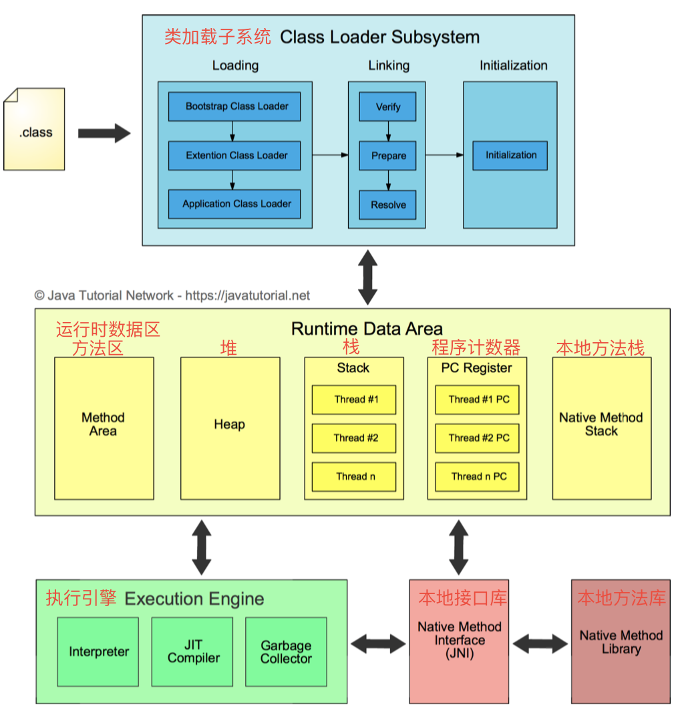
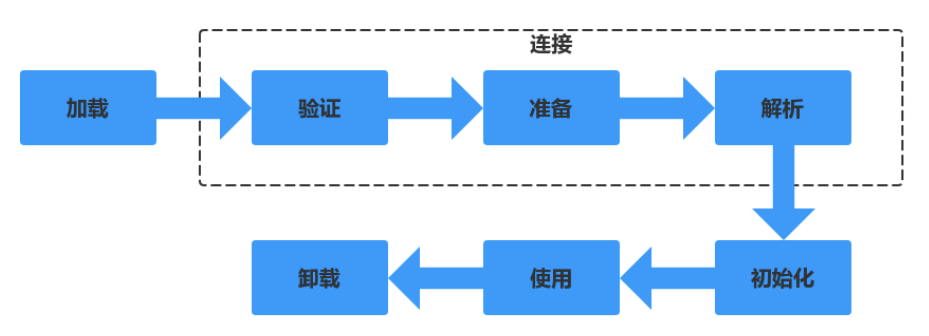
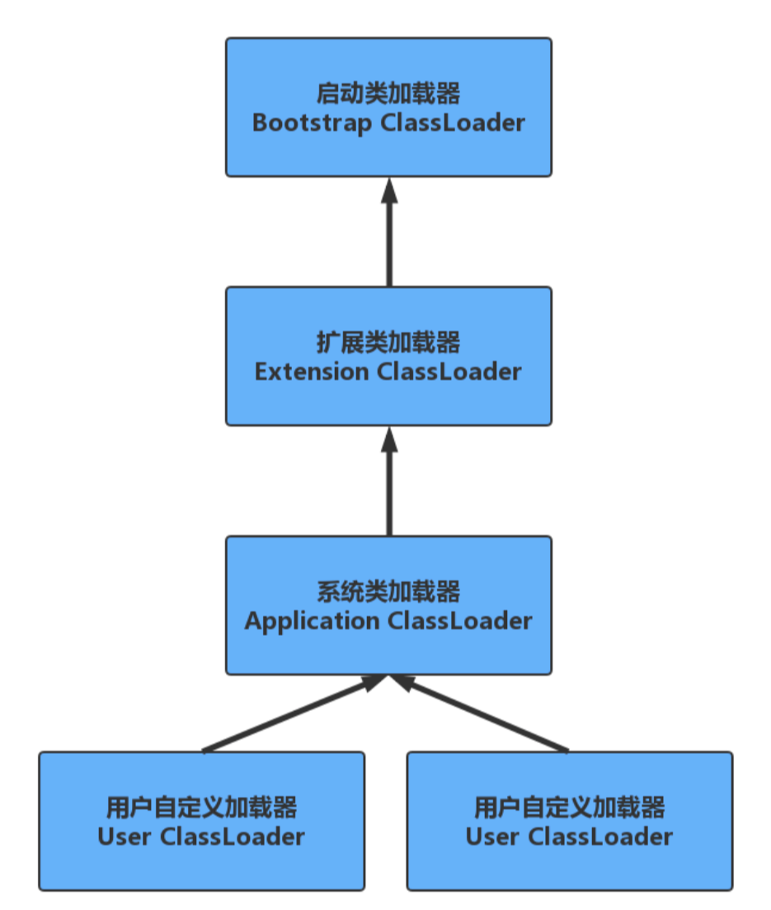

Java虚拟机(java virtual machine，JVM)，一种能够运行java字节码的虚拟机。作为一种编程语言的虚拟机，实际上不只是专用于Java语言，只要生成的编译文件匹配JVM对加载编译文件格式要求，任何语言都可以由JVM编译运行。 比如kotlin、scala等。
<!-- more -->
# JVM基本结构
JVM由三个主要的子系统构成
* 类加载子系统
* 运行时数据区(内存结构)
* 执行引擎

## 类加载机制
### 类的生命周期

1. 加载：将.class文件从磁盘读到内存
    * 通过类的全限定名来获取定义此类的二进制字节流
    * 将这个类字节流代表的静态存储结构转为方法区的运行时数据结构
    * 在堆中生成一个代表此类的java.lang.Class对象，作为访问方法区这些数据结构的入口。
2. 连接
    1. 验证：验证字节码文件的正确性
        * 文件格式验证：基于字节流验证。
        * 元数据验证：基于方法区的存储结构验证。
        * 字节码验证：基于方法区的存储结构验证。
        * 符号引用验证：基于方法区的存储结构验证。
    2. 准备：给类的静态变量分配内存，并赋予`默认值`
        * public static int value = 123; //此时在准备阶段过后的初始值为0而不是123，在初始化过程才会被赋值为123
        * public static final int value = 123;//value的值在准备阶段过后就是123。
    3. 解析：类装载器装入类所引用的其它所有类
3. 初始化：为类的静态变量赋予正确的初始值，上述的准备阶段为静态变量赋予的是虚拟机默认的初始值，此处赋予的才是程序编写者为变量分配的真正的初始值，执行静态代码块
4. 使用
5. 卸载

### 类加载器的种类
#### 启动类加载器(Bootstrap ClassLoader)
负责加载JRE的核心类库，如JRE目标下的rt.jar，charsets.jar等
#### 扩展类加载器(Extension ClassLoader)
负责加载JRE扩展目录ext中jar类包
#### 系统类加载器(Application ClassLoader)
负责加载ClassPath路径下的类包
#### 用户自定义加载器(User ClassLoader)
负责加载用户自定义路径下的类包

    