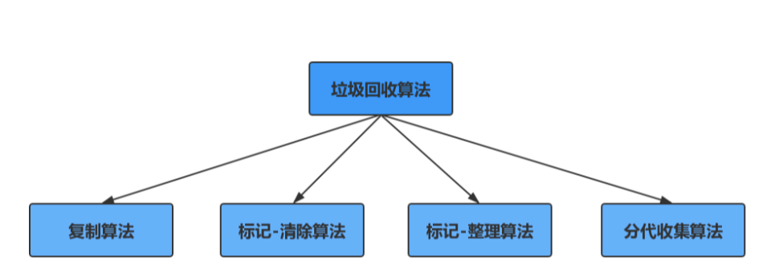
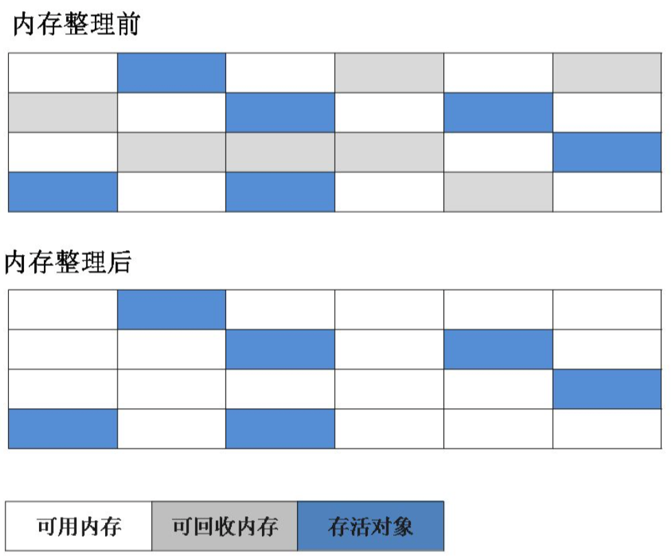
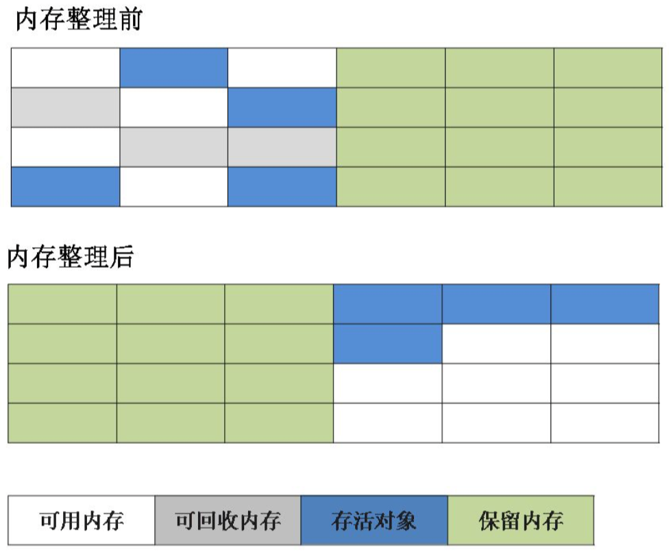
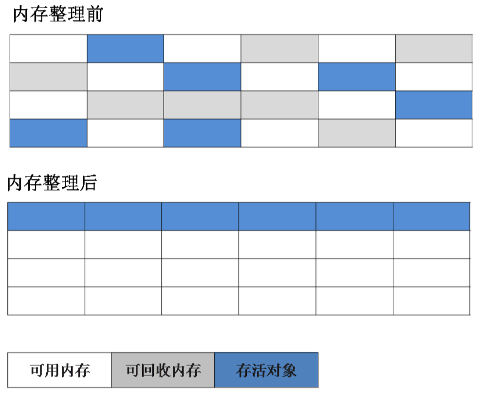
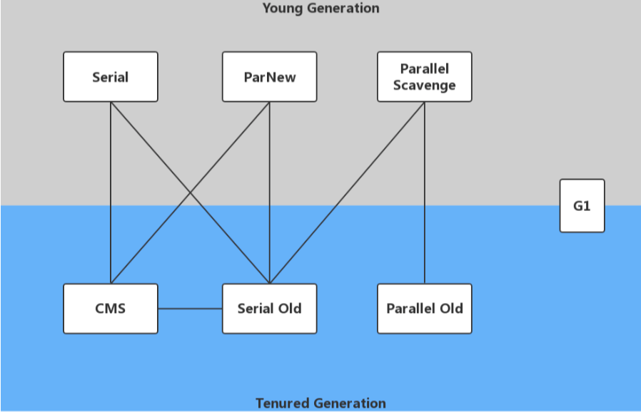
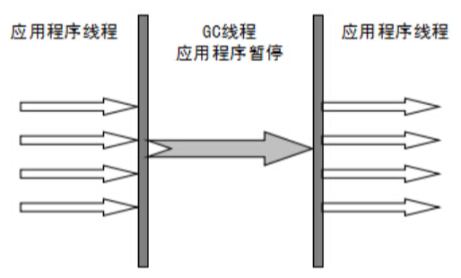
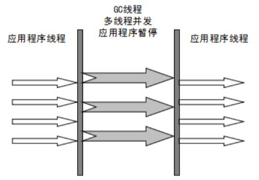
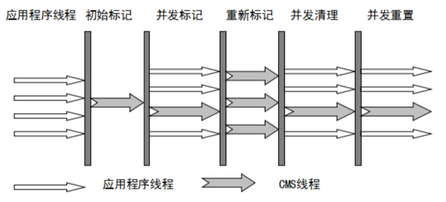

Java虚拟机(java virtual machine，JVM)，一种能够运行java字节码的虚拟机。作为一种编程语言的虚拟机，实际上不只是专用于Java语言，只要生成的编译文件匹配JVM对加载编译文件格式要求，任何语言都可以由JVM编译运行。 比如kotlin、scala等。
<!-- more -->
# JVM基本结构
JVM由三个主要的子系统构成
* 类加载子系统
* 运行时数据区(内存结构)
* 执行引擎


## 类加载机制
### 类的生命周期

1. 加载：将.class文件从磁盘读到内存
    * 通过类的全限定名(com.xxx.xxx)+类加载器确定唯一的类，来获取定义此类的二进制字节流
    * 将这个类字节流代表的静态存储结构转为方法区的运行时数据结构
    * 在堆中生成一个代表此类的java.lang.Class对象，作为访问方法区这些数据结构的入口。
2. 连接
    1. 验证：验证字节码文件的正确性
        * 文件格式验证：基于字节流验证。
        * 元数据验证：基于方法区的存储结构验证。
        * 字节码验证：基于方法区的存储结构验证。
        * 符号引用验证：基于方法区的存储结构验证。
    2. 准备：给类的静态变量分配内存，并赋予`默认值`（不包括实例变量）
        * public static int value = 123; //此时在准备阶段过后的初始值为0而不是123，在初始化过程才会被赋值为123
        * public static final int value = 123;//value的值在准备阶段过后就是123。
    3. 解析：类装载器装入类所引用的其它所有类
3. 初始化：为类的静态变量赋予正确的初始值，上述的准备阶段为静态变量赋予的是虚拟机默认的初始值，此处赋予的才是程序编写者为变量分配的真正的初始值，执行静态代码块
4. 使用
5. 卸载

### 类加载器的种类
总体上分为两种：启动类加载器（C++实现） 和 其他类加载器（JAVA实现）
#### 启动类加载器(Bootstrap ClassLoader)
负责加载JRE的核心类库，如JRE目标下的rt.jar，charsets.jar等
#### 扩展类加载器(Extension ClassLoader)
负责加载JRE扩展目录ext中jar类包
#### 系统类加载器(Application ClassLoader)
负责加载ClassPath路径下的类包
#### 用户自定义加载器(User ClassLoader)
负责加载用户自定义路径下的类包


### 类加载机制
#### 全盘负责委托机制
当一个ClassLoader加载一个类的时候，除非显示的使用另一个ClassLoader，该类所依赖和引用的类也由这个 ClassLoader载入

#### 双亲委派机制
指先委托父类加载器寻找目标类，在找不到的情况下，在自己的路径中查找并载入目标类

1. 当有类需要加载，系统类加载器先判断有没有父类，有交给扩展类加载器加载
2. 扩展类加载器判断有没有父类，有交给启动类加载器
3. 启动类加载器没有父类，去实际加载该类，该类不是JRE包下的类，交给子类扩展类加载器去加载
4. 扩展类加载器去加载该类，发现该类不是ext中的包，交给系统类加载器加载
5. 系统类加载器加载，发现是classPath路径下的包，进行加载。

##### 双亲委派模式的优势
* 沙箱安全机制:比如自己写的String.class类不会被加载，这样可以防止核心库被随意篡改
* 避免类的重复加载:当父ClassLoader已经加载了该类的时候，就不需要子ClassLoader再加载一次

##### 为什么要打破双亲委派模式
例如：tomcat 
Tomcat是个web容器,可能需要部署两个应用程序，不同的应用程序可能会依赖同一个第三方类库的不同版本，不能要求同一个类库在同一个服务器只有一份，因此要保证每个应用程序的类库都是独立的，保证相互隔离。 
如果使用默认的类加载器机制，那么是无法加载两个相同类库的不同版本的，默认的类加载器是不管你是什么版本的，只在乎你的全限定类名，并且只有一份。

##### 如何打破双亲委派模式
1. 继承ClassLoader
2. 重写findClass()方法
3. 重写loadClass()方法

## 运行时数据区(内存结构)


### 虚拟机栈
java虚拟机栈是线程私有的，每个方法执行都会创建一个栈帧，栈帧包含局部变量表、操作数栈、动态连接、方法出口等。

#### 栈与栈帧
每一个方法的执行到执行完成，对应着一个栈帧在虚拟机中从入栈到出栈的过程。java虚拟机栈栈顶的栈帧就是当前执行方法的栈帧。PC寄存器会指向该地址。当这个方法调用其他方法的时候久会创建一个新的栈帧，这个新的栈帧会被方法Java虚拟机栈的栈顶，变为当前的活动栈，在当前只有当前活动栈的本地变量才能被使用，当这个栈帧所有指令都完成的时候，这个栈帧被移除，之前的栈帧变为活动栈，前面移除栈帧的返回值变为这个栈帧的一个操作数。

#### 栈帧
栈帧包含局部变量表、操作数栈、动态连接、方法返回地址

##### 局部变量表
* 局部变量表是变量值的存储空间，用于存放方法参数和方法内部定义的局部变量。在java编译成class文件的时候，就在方法的Code属性的max_locals数据项中确定该方法需要分配的最大局部变量表的容量。
* 局部变量表的容量以变量槽（Slot）为最小单位，32位虚拟机中一个Slot可以存放32位（4 字节）以内的数据类型（ boolean、byte、char、short、int、float、reference和returnAddress八种）
* 对于64位长度的数据类型（long，double），虚拟机会以高位对齐方式为其分配`两个连续的Slot`空间，也就是相当于把一次long和double数据类型读写分割成为两次32位读写。
* reference类型虚拟机规范没有明确说明它的长度，但一般来说，虚拟机实现至少都应当能从此引用中直接或者间接地查找到对象在Java堆中的起始地址索引和方法区中的对象类型数据。
* Slot是可以重用的，当Slot中的变量超出了作用域，那么下一次分配Slot的时候，将会覆盖原来的数据。Slot对对象的引用会影响GC（要是被引用，将不会被回收）。  
* 系统不会为局部变量赋予初始值（实例变量和类变量都会被赋予初始值）。也就是说不存在类变量那样的准备阶段。

##### 操作数栈
* 操作数栈和局部变量表一样，在编译时期就已经确定了该方法所需要分配的局部变量表的最大容量。
* 操作数栈的每一个元素可用是任意的Java数据类型，包括long和double。32位数据类型所占的栈容量为1，64位数据类型占用的栈容量为2。
* 当一个方法刚刚开始执行的时候，这个方法的操作数栈是空的，在方法执行的过程中，会有各种字节码指令往操作数栈中写入和提取内容，也就是出栈 / 入栈操作（例如：在做算术运算的时候是通过操作数栈来进行的，又或者在调用其它方法的时候是通过操作数栈来进行参数传递的）。

##### 动态连接
直接引用：有具体引用地址的指针，被引用的类、方法或者变量已经被加载到内存中
符号引用：即用用字符串符号的形式来表示引用，其实被引用的类、方法或者变量还没有被加载到内存中。
举个例子：
```java
/**
* 符号引用
*/
String str = "abc";
System.out.println("str=" + str);
/**
* 直接引用
*/
System.out.println("str=" + "abc");
```

动态链接：在程序运行过程中，由符号引用转化为直接引用。
静态链接：在类加载过程中，由符号引用转化为直接引用。

##### 方法返回地址
当一个方法开始执行时，可能有两种方式退出该方法：
* 正常完成出口
    * 正常完成出口是指方法正常完成并退出，没有抛出任何异常(包括Java虚拟机异常以及执行时通过throw语句显示抛出的异常)。如果当前方法正常完成，则根据当前方法返回的字节码指令，这时有可能会有返回值传递给方法调用者(调用它的方法)，或者无返回值。具体是否有返回值以及返回值的数据类型将根据该方法返回的字节码指令确定。
* 异常完成出口
    * 异常完成出口是指方法执行过程中遇到异常，并且这个异常在方法体内部没有得到处理，导致方法退出。
    
无论方法采用何种方式退出，在方法退出后都需要返回到方法被调用的位置，程序才能继续执行，方法返回时可能需要在当前栈帧中保存一些信息，用来帮他恢复它的上层方法执行状态。
方法退出过程实际上就等同于把当前栈帧出栈，因此退出可以执行的操作有：恢复上层方法的局部变量表和操作数栈，把返回值(如果有的话)压如调用者的操作数栈中，调整PC计数器的值以指向方法调用指令后的下一条指令。
一般来说，方法正常退出时，调用者的PC计数值可以作为返回地址，栈帧中可能保存此计数值。而方法异常退出时，返回地址是通过异常处理器表确定的，栈帧中一般不会保存此部分信息。

```java
public class Demo {
    public int math(){
        int a = 1;
        int b = 2;
        int c = (a + b)*10;
        return c;
    }
    public static void main(String[] args) {
        Demo demo = new Demo();
        demo.math();
    }
}
```
当执行👆Demo的math方法时，主线程内存会如何操作

第一步，现将1放入`操作数栈`

第二步，将1放入`局部变量表`中第一个槽里

第三步，第四步同上，最终将2放入`局部变量表`中第二个槽里

第五步，将1复制一份放入`操作数栈`的栈顶
第六步，将2复制一份放入`操作数栈`的栈顶

第七步，将2，1弹出操作数栈交给cpu去运算得到3，放到`操作数栈`的栈顶

第八步，从常量池（-128～127）里拿到10，放入`操作数栈`顶

第九步，弹出10，3交给cpu去运算得到30，放到`操作数栈`的栈顶（jvm1.6开始进行了指令优化，第8、9步合并成了一步操作）

第十步，将30放到`局部变量表`中第3个槽里。

第十一步，将30复制一份放入`操作数栈`第栈顶。
第十二步，将30弹出操作数栈，通过`返回地址`返回。

### 程序计数器
就是一个指针，指向方法区中的方法字节码(用来存储**指向下一跳指令的地址**，也就是当前线程将要执行的指令代码)，
由执行引擎读取下一条指令，是一个非常小的内存空间，几乎可以忽略不计，用来保证线程间切换后正确执行。

### 本地方法栈
和栈作用很相似，区别不过是Java栈为JVM执行Java方法服务，而本地方法栈为JVM执行native方法服务。
登记native方法，在Execution Engine执行时加载本地方法库。

### 方法区（永久代/持久代，元空间）
类的所有字段和方法字节码，以及一些特殊方法如构造函数，接口代码也在这里定义。
简单来说，所有定义的方法的信息都保存在该区域，静态变量+常量+类信息(构造方法/接口定义)+运行时常量池都存在方法区中，
虽然Java虚拟机规范把方法区描述为堆的一个逻辑部分，但是它却有一个别名叫做Non-Heap(非堆)，目的应该是为了和Java的堆区分开(jdk1.8以前hotspot虚拟机叫永久代、持久代，jdk1.8时叫元空间)

永久代和元空间区别在于元数据区不在虚拟机当中，而是用的`本地内存`，永久代在虚拟机当中，永久代逻辑结构上也属于堆，但是物理上不属于。

#### 为什么移除了永久代?
参考官方解释http://openjdk.java.net/jeps/122
大概意思是移除永久代是为融合HotSpot与 JRockit而做出的努力，因为JRockit没有永久代，不需要配置永久代。


### 堆
虚拟机启动时自动分配创建，用于存放`对象`的实例，几乎所有对象都在堆上分配内存，当对象无法在该空间申请到内
存是将抛出OutOfMemoryError异常。同时也是垃圾收集器管理的主要区域。


#### 新生代(Young Generation)
类出生、成长、消亡的区域，一个类在这里产生，应用，最后被垃圾回收器收集，结束生命。
新生代分为两部分:`伊甸区`(Eden space)和`幸存者区`(Survivor space)，所有的类都是在伊甸区被new出来的。
幸存区(Survivor space):分为From和To区,TO区永远保持空。
当Eden区的空间用完是，程序又需要创建对象，JVM的垃圾回收器将Eden区进行垃圾回收(`Minor GC`)，将Eden区中的不再被其它对象应用的对象进行销毁。
然后将Eden区中剩余的对象移到From Survivor区。若From Survivor区也满了，再对该区进行垃圾回收，然后移动到To Survivor区，From区为空后，将To和From区转换，保证To区为空，并且对象年龄加一。
当对象年龄默认加到15（因为**对象头只有4个bits**是存对象年龄，最大为15）时将剩下的对象移到老年代。

### 老年代(Old Generation)
新生代经过多次GC仍然存货的对象移动到老年区。
若老年代也满了，这时候将发生Major GC(也可以叫`Full GC`)， 进行老年区的内存清理。
若老年区执行了Full GC之后发现依然无法进行对象的保存，就会抛出 OOM(OutOfMemoryError)异常.


## GC算法和收集器
几种常见GC：
MinorGC/YoungGC 新生代
OldGC CMS特有
FullGC/MajorGC 回收所有
MixedGC（FullGC+YoungGC）  G1特有

### 如何判断对象可以被回收
堆中几乎放着所有的对象实例，对堆垃圾回收前的第一步就是要判断哪些对象已经死亡(即不能再被任何途径使用的对象)

#### 引用计数法
给对象添加一个引用计数器，每当有一个地方引用，计数器就加1。当引用失效，计数器就减1。任何时候计数器为0 的对象就是不可能再被使用的。

这个方法实现简单，效率高，但是目前主流的虚拟机中没有选择这个算法来管理内存，最主要的原因是它很难解决**对象之前相互循环引用**的问题。所谓对象之间的相互引用问题，通过下面代码所示:除了对象a和b相互引用着对方之外，这两个对象之间再无任何引用。但是它们因为互相引用对方，导致它们的引用计数器都不为0，于是引用计数器法无法通知GC回收器回收它们。

```java
public class CounterGC{
    Object instance = null;
    public static void main(String[] args){
      CounterGC a = new CounterGC();
      CounterGC b = new CounterGC();
      a.instance = b;
      b.instance = a;
      a = null;
      b = null;
    }
}
```

#### 可达性分析算法
这个算法的基本思想就是通过一系列的称为"GC Roots"的对象作为起点，从这些节点开始向下搜索，节点所走过的路
径称为引用链，当一个对象到GC Roots没有任何引用链相连的话，则证明此对象时不可用的。

`GC Roots根节点`:类加载器、Thread、虚拟机栈的局部变量表、static成员、常量引用、本地方法栈的变量等等.


### 如何判断一个常量是废弃常量
运行时常量池主要回收的是废弃的常量。那么，我们怎么判断一个常量时废弃常量呢?
假如在常量池中存在字符串"abc"，如果当前没有任何String对象引用该字符串常量的话，就说明常量"abc"就是废弃常量，如果这时发生内存回收的话而且有必要的话（内存不够用时才会发生回收），"abc"会被系统清理出常量池。

### 如何判断一个类是无用的类
需要满足以下三个条件:
* 该类所有的实例都已经被回收，也就是 Java 堆中不存在该类的任何实例。
* 加载该类的 ClassLoader 已经被回收。
* 该类对应的 java.lang.Class 对象没有在任何地方被引用，无法在任何地方通过反射访问该类的方法。
虚拟机可以对满足上述3个条件的无用类进行回收，这里仅仅是"**可以**"，而并不是和对象一样不适用了就必然会被回收。


### 垃圾回收算法


#### 标记-清除算法
它是最基础的收集算法，这个算法分为两个阶段，`标记`和`清除`。首先标记出所有需要回收的对象，在标记完成后
统一回收所有被标记的对象。它有两个不足的地方:
1. 效率问题，标记和清除两个过程的效率都不高;
2. 空间问题，标记清除后会产生大量不连续的碎片;


#### 复制算法
为了解决效率问题，复制算法出现了。它可以把内存分为大小相同的两块，每次只使用其中的一块。
当这一块的内存使用完后，就将还存活的对象复制到另一块区，然后再把使用的空间一次清理掉。
这样就使每次的内存回收都是对内存区间的一半进行回收


#### 标记-整理算法
根据老年代的特点提出的一种标记算法，标记过程和“标记-清除”算法一样，但是后续步骤不是直接对可回收对象进行回收，而是让所有存活的对象向一段移动，然后直接清理掉边界以外的内存


#### 分代收集算法
现在的商用虚拟机的垃圾收集器基本都采用"分代收集"算法，这种算法就是根据对象存活周期的不同将内存分为几块。
一般将java堆分为新生代和老年代，这样我们就可以根据各个年代的特点选择合适的垃圾收集算法。
在新生代中，每次收集都有大量对象死去，所以可以选择复制算法，只要付出少量对象的复制成本就可以完成每次垃圾收集。
而老年代的对象存活几率时比较高的，而且没有额外的空间对它进行分配担保，就必须选择“标记-清除”或 者“标记-整理”算法进行垃圾收集。

### 垃圾收集器

#### Serial收集器
Serial(串行)收集器收集器是最基本、历史最悠久的垃圾收集器了。
大家看名字就知道这个收集器是一个单线程收集器了。
它的`单线程`的意义不仅仅意味着它只会使用一条垃圾收集线程去完成垃圾收集工作，更重要的是它在进行垃圾收集工作的时候必须暂停其他所有的工作线程( “Stop The World” )，直到它收集结束。
**新生代采用复制算法，老年代采用标记-整理算法。**

虚拟机的设计者们当然知道Stop The World带来的不良用户体验，所以在后续的垃圾收集器设计中停顿时间在不断缩短(仍然还有停顿，寻找最优秀的垃圾收集器的过程仍然在继续)。
但是Serial收集器有没有优于其他垃圾收集器的地方呢?
当然有，它简单而高效(与其他收集器的单线程相比)。 Serial收集器由于没有线程交互的开销，自然可以获得很高的单线程收集效率。Serial收集器对于运行在Client模式下的虚拟机来说是个不错的选择。

#### ParNew收集器
ParNew收集器其实就是Serial收集器的`多线程`版本，除了使用多线程进行垃圾收集外，其余行为(控制参数、收集算法、回收策略等等)和Serial收集器完全一样。
**新生代采用复制算法，老年代采用标记-整理算法。**

它是许多运行在Server模式下的虚拟机的首要选择，除了Serial收集器外，只有它能与CMS收集器(真正意义上的并发收集器，后面会介绍到)配合工作。

#### Parallel Scavenge收集器(JDK1.8)
Parallel Scavenge 收集器类似于ParNew收集器。
Parallel Scavenge收集器关注点是`吞吐量`(高效率的利用CPU)。所谓吞吐量就是CPU中用于运行用户代码的时间与CPU总消耗时间的比值。
CMS等垃圾收集器的关注点更多的是用户线程的`停顿时间`(提高用户体验)。 Parallel Scavenge收集器提供了很多参数供用户找到最合适的停顿时间或最大吞吐量，如果对于收集器运作不太了解的话，手工优化存在的话可以选择把内存管理优化交给虚拟机去完成也是一个不错的选择。
**新生代采用复制算法，老年代采用标记-整理算法。**


#### Serial Old收集器
Serial收集器的老年代版本，它同样是一个`单线程`收集器，采用**标记-整理**算法。
它主要有两大用途:一种用途是在JDK1.5以及以前的版本 中与Parallel Scavenge收集器搭配使用，另一种用途是作为CMS收集器的后备方案。

#### Parallel Old收集器
Parallel Scavenge收集器的老年代版本。使用`多线程`和**标记-整理**算法。
在注重吞吐量以及CPU资源的场合，都可以优先考虑 Parallel Scavenge收集器和Parallel Old收集器。

#### **CMS收集器**
并行和并发概念补充:
* 并行(Parallel) :指多条垃圾收集线程并行工作，但此时用户线程仍然处于等待状态。 
* 并发(Concurrent):指用户线程与垃圾收集线程同时执行(但不一定是并行，可能会交替执行)，用户程序 在继续运行，而垃圾收集器运行在另一个CPU上。

CMS(Concurrent Mark Sweep)收集器是一种以获取最短回收停顿时间为目标的收集器。它而非常符合在注重用户体验的应用上使用。
CMS(Concurrent Mark Sweep)收集器是HotSpot虚拟机第一款真正意义上的并发收集器，它第一次实现了让垃圾收集线程与用户线程(基本上)同时工作。

从名字中的Mark Sweep这两个词可以看出，CMS收集器是一种**标记-清除**算法实现的，它的运作过程相比于前面几种垃圾收集器来说更加复杂一些。
整个过程分为四个步骤:
* 初始标记(CMS initial mark): 暂停所有的其他线程，并记录下直接与root相连的对象，速度很快 
* 并发标记(CMS concurrent mark): **同时开启GC和用户线程**，用一个闭包结构去记录可达对象。但在这个阶段结束，这个闭包结构并不能保证包含当前所有的可达对象。因为用户线程可能会不断的更新引用域，所以GC 线程无法保证可达性分析的实时性。所以这个算法里会跟踪记录这些发生引用更新的地方。
* 重新标记(CMS remark): 重新标记阶段就是为了修正并发标记期间因为用户程序继续运行而导致标记产生变动的那一部分对象的标记记录，这个阶段的停顿时间一般会比初始标记阶段的时间稍长，远远比并发标记阶 段时间短
* 并发清除(CMS concurrent sweep): 开启用户线程，同时GC线程开始对为标记的区域做清扫。

CMS主要优点:并发收集、低停顿。
但是它有下面三个明显的缺点:
* 对CPU资源敏感;
* 无法处理浮动垃圾;
* 它使用的回收算法-**标记-清除**算法会导致收集结束时会有大量空间碎片产生。

#### G1收集器
G1 (Garbage-First)是一款面向服务器的垃圾收集器,主要针对配备多颗处理器及大容量内存的机器. 以极高概率满足 GC停顿时间要求的同时,还具备高吞吐量性能特征.

被视为JDK1.7中HotSpot虚拟机的一个重要进化特征。它具备一下特点:
* 并行与并发:G1能充分利用CPU、多核环境下的硬件优势，使用多个CPU(CPU或者CPU核心)来缩短Stop- The-World停顿时间。部分其他收集器原本需要停顿Java线程执行的GC动作，G1收集器仍然可以通过并发的方式让java程序继续执行 
* 分代收集:虽然G1可以不需要其他收集器配合就能独立管理整个GC堆，但是还是保留了分代的概念。 空间整 合:与CMS的“标记–清理”算法不同，G1从整体来看是基于**标记整理**算法实现的收集器;从局部上来看是基于**标记复制**算法实现的
* **可预测的停顿**:这是G1相对于CMS的另一个大优势，降低停顿时间是G1 和 CMS 共同的关注点，但G1除了追求低停顿外，还能建立可预测的停顿时间模型，能让使用者明确指定在一个长度为M毫秒的时间片段内

G1收集器的运作大致分为以下几个步骤:
* 初始标记
* 并发标记
* 最终标记
* 筛选回收

G1收集器在后台维护了一个优先列表，每次根据允许的收集时间，优先选择回收价值最大的Region(这也就是它的名 字Garbage-First的由来)。这种使用Region划分内存空间以及有优先级的区域回收方式，保证了GF收集器在有限时间内可以尽可能高的收集效率(把内存化整为零)。

#### 怎么选择垃圾收集器?（尽量由JVM自己选择）
1. 优先调整堆的大小让服务器自己来选择
2. 如果内存小于100m，使用串行收集器
3. 如果是单核，并且没有停顿时间的要求，串行或JVM自己选择 
4. 如果允许停顿时间超过1秒，选择并行或者JVM自己选
5. 如果响应时间最重要，并且不能超过1秒，使用并发收集器
官方推荐ZGC(java最新版本垃圾收器器，可预测的停顿最低2ms)，性能高。

## JDK性能调优监控工具
虚拟机参数分析网站：https://www.perfma.com/product/opts
### jps
显示当前系统的java进程情况
```bash
gdeMacBook-Pro:~ g$ jps
94673 AppServiceApplication
54995
55011 RemoteMavenServer36
94696 AppServiceApplication
96956 Jps
```
(空白的54995是idea)
### Jinfo
查看正在运行的Java程序的扩展参数
#### 查看JVM的参数
```bash
gdeMacBook-Pro:~ g$ jinfo -flags 94673
VM Flags:
-XX:-BytecodeVerificationLocal -XX:-BytecodeVerificationRemote -XX:CICompilerCount=4 -XX:ConcGCThreads=3 -XX:G1ConcRefinementThreads=10 -XX:G1HeapRegionSize=1048576 -XX:GCDrainStackTargetSize=64 -XX:InitialHeapSize=268435456 -XX:+ManagementServer -XX:MarkStackSize=4194304 -XX:MaxHeapSize=4294967296 -XX:MaxNewSize=2576351232 -XX:MinHeapDeltaBytes=1048576 -XX:NonNMethodCodeHeapSize=7549744 -XX:NonProfiledCodeHeapSize=244108496 -XX:ProfiledCodeHeapSize=0 -XX:ReservedCodeCacheSize=251658240 -XX:+SegmentedCodeCache -XX:TieredStopAtLevel=1 -XX:+UseCompressedClassPointers -XX:+UseCompressedOops -XX:+UseG1GC
```
#### 查看java系统属性
```bash
jinfo -sysprops 94673
```


### Jstat
jstat命令可以查看堆内存各部分的使用量，以及加载类的数量。命令格式:
jstat [-命令选项] [vmid] [间隔时间/毫秒] [查询次数]
```bash
gdeMacBook-Pro:~ g$ jstat -gc 94673
 S0C    S1C    S0U    S1U      EC       EU        OC         OU       MC     MU    CCSC   CCSU   YGC     YGCT    FGC    FGCT    CGC    CGCT     GCT
 0.0   2048.0  0.0   2048.0 96256.0  68608.0   163840.0   132934.6  131280.0 127368.5 14720.0 13850.3    185    1.219   0      0.000  112     0.661    1.880
```
* S0C：第一个幸存区的大小
* S1C：第二个幸存区的大小
* S0U：第一个幸存区的使用大小
* S1U：第二个幸存区的使用大小
* EC：伊甸园区的大小
* EU：伊甸园区的使用大小
* OC：老年代大小
* OU：老年代使用大小
* MC：方法区大小
* MU：方法区使用大小
* CCSC:压缩类空间大小
* CCSU:压缩类空间使用大小
* YGC：年轻代垃圾回收次数
* YGCT：年轻代垃圾回收消耗时间
* FGC：老年代垃圾回收次数
* FGCT：老年代垃圾回收消耗时间
* GCT：垃圾回收消耗总时间

### Jmap
可以用来查看内存信息
#### 堆的对象统计
```bash
gdeMacBook-Pro:~ g$ jmap -histo 94673 > xxx.txt
```
部分如下
```text
 num     #instances         #bytes  class name (module)
-------------------------------------------------------
   1:        380588       39857240  [B (java.base@11.0.4)
   2:         71568        8387344  [Ljava.lang.Object; (java.base@11.0.4)
   3:        301995        7247880  java.lang.String (java.base@11.0.4)
   4:         25762        5316280  [I (java.base@11.0.4)
   5:         47736        4200768  java.lang.reflect.Method (java.base@11.0.4)
   6:        126275        4040800  java.util.concurrent.ConcurrentHashMap$Node (java.base@11.0.4)
   7:         69142        3871952  java.util.LinkedHashMap (java.base@11.0.4)
   8:          2483        3656120  [C (java.base@11.0.4)
   9:         46566        3352752  io.netty.channel.DefaultChannelHandlerContext
  10:        104582        3346624  java.util.HashMap$Node (java.base@11.0.4)
  11:         20887        2551232  java.lang.Class (java.base@11.0.4)
  12:         32461        2077504  java.util.concurrent.ConcurrentHashMap (java.base@11.0.4)
  13:         48062        1922480  java.util.HashMap$KeyIterator (java.base@11.0.4)
  14:         17400        1720040  [Ljava.util.HashMap$Node; (java.base@11.0.4)
  15:          2184        1432704  io.netty.util.internal.shaded.org.jctools.queues.MpscArrayQueue
  16:         35693        1427720  java.util.LinkedHashMap$Entry (java.base@11.0.4)
  17:         88742        1419872  java.lang.Object (java.base@11.0.4)
  18:          1671        1195280  [Ljava.util.concurrent.ConcurrentHashMap$Node; (java.base@11.0.4)
  19:         10270        1150240  sun.nio.ch.SocketChannelImpl (java.base@11.0.4)
  20:         10237        1064648  io.netty.channel.socket.nio.NioSocketChannel
  21:         42359        1016616  java.util.ArrayList (java.base@11.0.4)
  22:         60868         973888  java.lang.Integer (java.base@11.0.4)
  23:         20436         817440  io.netty.util.DefaultAttributeMap$DefaultAttribute
  24:         10533         758376  org.springframework.core.type.classreading.AnnotationMetadataReadingVisitor
  25:         18570         742800  com.meituan.service.mobile.mtthrift.mtrace.MtraceServerTBinaryProtocol$Factory
  26:         10239         737208  io.netty.channel.DefaultChannelPipeline$HeadContext
  27:         10239         737208  io.netty.channel.DefaultChannelPipeline$TailContext
  28:         30914         729768  [Ljava.lang.Class; (java.base@11.0.4)
  29:         21894         700608  java.util.concurrent.locks.ReentrantLock$NonfairSync (java.base@11.0.4)
------省略----
```
* Num:序号
* Instances:实例数量
* Bytes:占用空间大小
* Class Name:类名

#### 堆信息
```bash
gdeMacBook-Pro:~ g$ jmap -heap 94673
Error: -heap option used
Cannot connect to core dump or remote debug server. Use jhsdb jmap instead
```
jdk9及以上版本使用jmap -heap pid命令查看当前heap使用情况时，发现报错，提示需要使用jhsdb jmap来替代
```bash
gdeMacBook-Pro:~ g$ jhsdb jmap --heap --pid 94673
```


