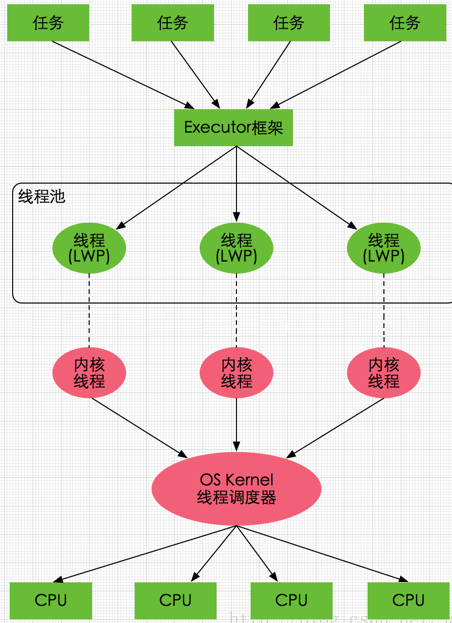
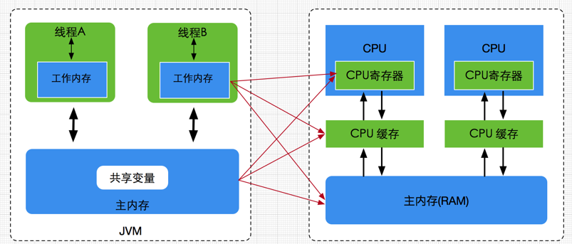
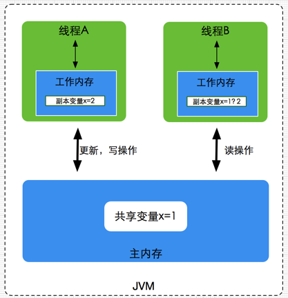

# JVM内存模型


# Java内存模型
Java内存模型(Java Memory Model，简称JMM)，本身是种`抽象的概念`，并不是像硬件架构一样真实存在的；它描述的是一组规则或规范，通过这组规范定义了程序中各个变量(包括实例字段、静态字段和构成数组对象的元素)的访问方式。

<!-- more -->
* 主内存：共享的信息
* 工作内存：私有信息，基本数据类型，直接分配到工作内存，引用的地址存放在工作内存，引用的对象存放在堆中
* 工作方式：
    * 线程修改私有数据，直接在工作空间修改
    * 线程修改共享数据，把数据复制到工作空间中去，在工作空间中修改，修改完成以后，刷新内存中的数据 
    
# 硬件架构

* **多CPU**：一个现代计算机通常由两个或者多个CPU。其中一些CPU还有多核。从这一点可以看出，在一个有两个或者多个CPU的现代计算机上同时运行多个线程是可能的。每个CPU在某一时刻运行一个线程是没有问题的。这意味着，如果你的Java程序是多线程的，在你的Java程序中每个CPU上一个线程可能同时（并发）执行。
* **CPU寄存器**：每个CPU都包含一系列的寄存器，它们是CPU内内存的基础。CPU在寄存器上执行操作的速度远大于在主存上执行的速度。这是因为CPU访问寄存器的速度远大于主存。
* **高速缓存cache**：由于计算机的存储设备与处理器的运算速度之间有着几个数量级的差距，所以现代计算机系统都不得不加入一层读写速度尽可能接近处理器运算速度的高速缓存（Cache）来作为内存与处理器之间的缓冲：将运算需要使用到的数据复制到缓存中，让运算能快速进行，当运算结束后再从缓存同步回内存之中，这样处理器就无须等待缓慢的内存读写了。CPU访问缓存层的速度快于访问主存的速度，但通常比访问内部寄存器的速度还要慢一点。每个CPU可能有一个CPU缓存层，一些CPU还有多层缓存。在某一时刻，一个或者多个缓存行（cache lines）可能被读到缓存，一个或者多个缓存行可能再被刷新回主存。
* **内存**：一个计算机还包含一个主存。所有的CPU都可以访问主存。主存通常比CPU中的缓存大得多。

运作原理：通常情况下，当一个CPU需要读取主存时，它会将主存的部分读到CPU缓存中。它甚至可能将缓存中的部分内容读到它的内部寄存器中，然后在寄存器中执行操作。当CPU需要将结果写回到主存中去时，它会将内部寄存器的值刷新到缓存中，然后在某个时间点将值刷新回主存。

* 解决方案：
    * 总线加锁：所谓总线锁就是使用处理器提供的一个LOCK＃信号，当一个处理器在总线上输出此信号时，其他处理器的请求将被**阻塞**住,那么该处理器可以独占使用共享内存。
    * 缓存上的一致性协议(MESI)
  
## 缓存一致性协议(MESI)
多核CPU硬件架构厂商，设计之初就预测到多线程操作数据不一致的问题，因此出现了——缓存一致性协议。

不同的CPU硬件生产厂商，具体的实现不一样。Intel的MESI协议最出名。
MESI协议文档：https://en.wikipedia.org/wiki/MESI_protocol

在MESI协议中，每个Cache line有4个状态，可用2个bit表示，它们分别是：
* M(Modified): 这行数据有效，数据被修改了，和内存中的数据不一致，数据只存在于本Cache中。
* E(Exclusive): 这行数据有效，数据和内存中的数据一致，数据只存在于本Cache中。
* S(Shared): 这行数据有效，数据和内存中的数据一致，数据存在于很多Cache中。
* I(Invalid): 这行数据无效。

E状态示例如下：

只有Core 0访问变量x，它的Cache line状态为E(Exclusive)。

S状态示例如下：

3个Core都访问变量x，它们对应的Cache line为S(Shared)状态。

M状态和I状态示例如下：

Core 0修改了x的值之后，这个Cache line变成了M(Modified)状态，其他Core对应的Cache line变成了I(Invalid)状态

## 有了MESI，为什么还需要JMM？
既然有了MESI协议，是不是就不需要volatile的可见性语义了？
当然不是，还有以下问题：
* 并不是所有的硬件架构都提供了相同的一致性保证，不同的硬件厂商实现不同，JVM需要volatile统一语义。
* 可见性问题不仅仅局限于CPU缓存内，JVM自己维护的内存模型(JMM)中也有可见性问题。使用volatile做标记，可以解决JVM层面的可见性问题。

# Java线程与硬件处理器
Java线程的实现是基于一对一的线程模型，实际上就是通过语言级别层面程序去间接调用系统内核的线程模型，即我们在使用Java线程时，Java虚拟机内部是转而调用当前操作系统的内核线程来完成当前任务。

如图所示，每个线程最终都会映射到CPU中进行处理，如果CPU存在多核，那么一个CPU将可以并行执行多个线程任务。

# Java内存模型与硬件内存架构的关系
多线程的执行最终都会映射到硬件处理器上进行执行，但Java内存模型和硬件内存架构并不完全一致。
对于硬件内存来说只有寄存器、缓存内存、主内存的概念，并没有工作内存(线程私有数据区域)和主内存(堆内存)之分，也就是说Java内存模型对内存的划分对硬件内存并没有任何影响,不管是工作内存的数据还是主内存的数据，对于计算机硬件来说都会存储在计算机主内存中，当然也有可能存储到CPU缓存或者寄存器中，因此总体上来说，Java内存模型和计算机硬件内存架构是一个相互交叉的关系，是一种抽象概念划分与真实物理硬件的交叉。

# Java内存模型的必要性
如下图，主内存中存在一个共享变量x，现在有A和B两线程分别对该变量x=1进行操作,A线程想要修改x的值为2，而B线程却想要读取x的值,那么B线程读取到到是1还是2呢？
答案：都可能，这是不确定的，这也就是所谓的线程安全问题。

为了解决类似上述的问题，JVM定义了一组规则，通过这组规则来决定一个线程对共享变量的写入何时对另一个线程可见。

# JMM对三个特征的保证
## 原子性
操作不可分割
1. X=10 如果是私有数据具有原子性，如果是共享数据没原子性（需要先把10读到共享空间再把10写入x）  
2. Y=x  没有原子性
    1. 把数据X读到工作空间（原子性）
    2. 把X的值写到Y（原子性）
3. I++ 没有原子性
    1. 读i到工作空间
    2. +1
    3. 刷新结果到内存
    
多个原子性的操作合并到一起没有原子性,但是可以通过Synchronized和JUC中Lock的lock来保证原子性。

## 可见性
线程只能操作自己工作空间中的数据，当一个线程修改了某个共享变量的值，其他线程是否能够马上得知这个修改的值。
* Volatile:在JMM模型上实现MESI协议
* Synchronized:加锁
* JUC   Lock的lock

## 有序性
有序性是指对于单线程的执行代码，我们总是认为代码的执行是按顺序依次执行的，对于单线程而言确实如此，但对于多线程环境，则可能出现乱序现象，因为程序编译成机器码指令后可能会出现指令重排现象，重排后的指令与原指令的顺序未必一致。
* Volatile
* Synchronized
* Happens-before原则
    * 程序次序原则，即在一个线程内必须保证语义串行性，也就是说按照代码顺序执行。
    * 锁定原则：后一次加锁必须等前一次解锁
    * Volatile原则：volatile变量的写，先发生于读，这保证了volatile变量的可见性，简单的理解就是，volatile变量在每次被线程访问时，都强迫从主内存中读该变量的值，而当该变量发生变化时，又会强迫将最新的值刷新到主内存，任何时刻，不同的线程总是能够看到该变量的最新值。
    * 传递原则：A先于B ，B先于C 那么A必然先于C
    * 线程启动规则：如果线程A在执行线程B的start方法之前修改了共享变量的值，那么当线程B执行start方法时，线程A对共享变量的修改对线程B可见
    * 线程终止规则：假设在线程B终止之前，修改了共享变量，线程A从线程B的join方法成功返回后，线程B对共享变量的修改将对线程A可见。
    * 线程中断规则：对线程 interrupt()方法的调用先行发生于被中断线程的代码检测到中断事件的发生，可以通过Thread.interrupted()方法检测线程是否中断。
    * 对象终结规则：对象的构造函数执行，结束先于finalize()方法
    

