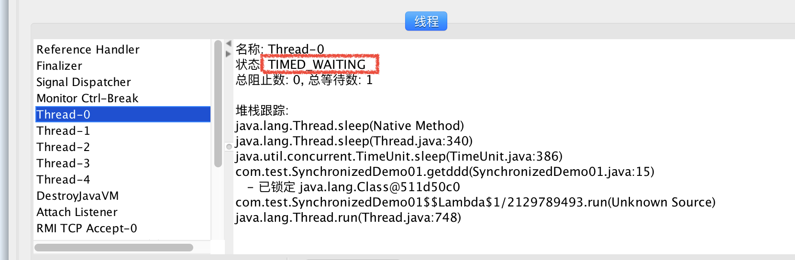
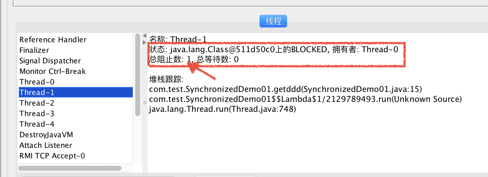
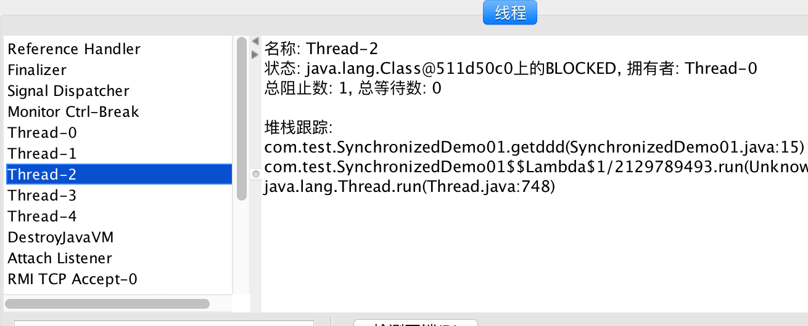
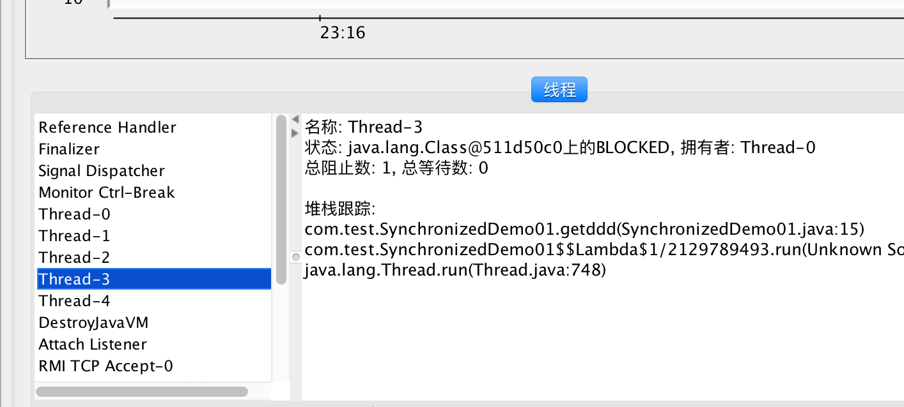
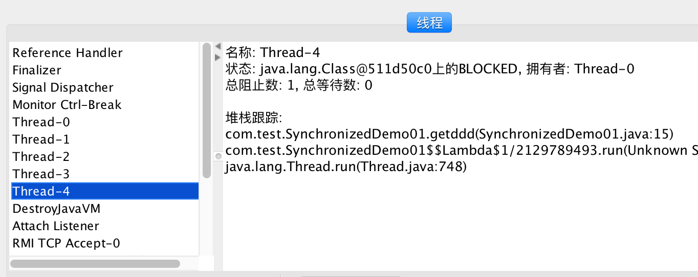
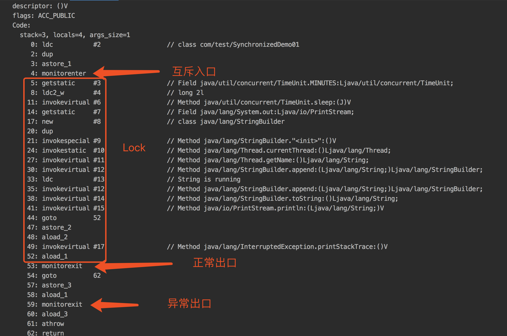
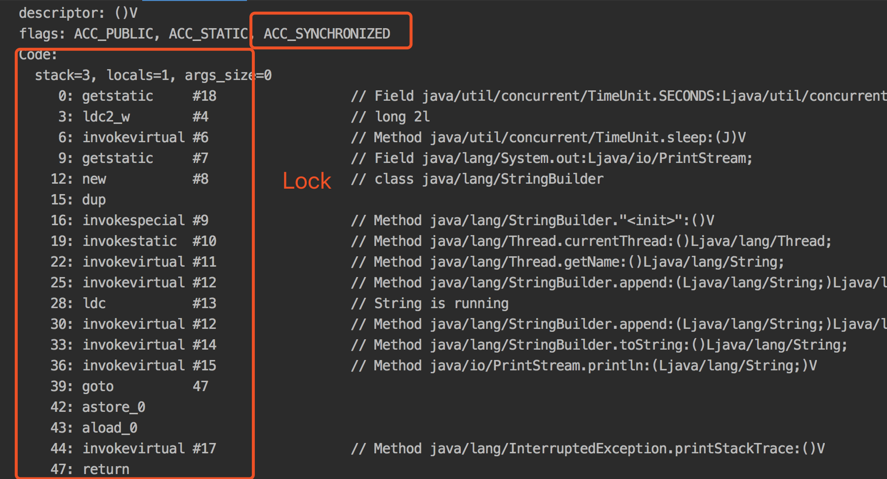
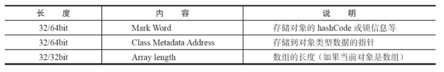
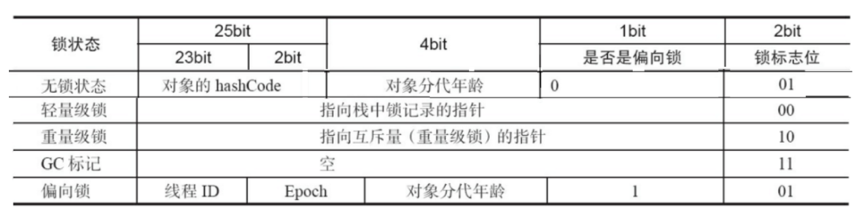

# 概念
利用锁的机制来实现同步的。
锁机制有如下两种特性：
**互斥性**：即在同一时间只允许一个线程持有某个对象锁，通过这种特性来实现多线程中的协调机制，这样在同一时间只有一个线程对需同步的代码块(复合操作)进行访问。互斥性我们也往往称为操作的**原子性**。
**可见性**：必须确保在锁被释放之前，对共享变量所做的修改，对于随后获得该锁的另一个线程是可见的（即在获得锁时应获得最新共享变量的值），否则另一个线程可能是在本地缓存的某个副本上继续操作从而引起不一致。

# 用法
## 同步方法
### 同步非静态方法
```java
Public synchronized void methodName(){

}
```
### 同步静态方法
```java
Public synchronized static void methodName(){

}
```
## 同步代码块
### 获取对象锁
```java
synchronized(this|object) {}
```
用来修饰非静态方法，
在 Java 中，每个对象都会有一个 monitor 对象，这个对象其实就是 Java 对象的锁，通常会被称为“内置锁”或“对象锁”。类的对象可以有多个，所以每个对象有其独立的对象锁，互不干扰
### 获取类锁
```java
synchronized(类.class) {}
```
用来修饰静态方法
在 Java 中，针对每个类也有一个锁，可以称为“类锁”，类锁实际上是通过对象锁实现的，即类的 Class 对象锁。每个类只有一个 Class 对象，所以每个类只有一个类锁。

## monitor 
在 Java 中，每个对象都会有一个 monitor 对象，监视器
* 某一线程占有这个对象的时候，先monitor 的计数器是不是0，如果是0还没有线程占有，这个时候线程占有这个对象，并且对这个对象的monitor+1；如果不为0，表示这个线程已经被其他线程占有，这个线程等待。当线程释放占有权的时候，monitor-1；
* 同一线程可以对同一对象进行多次加锁，+1，+1，体现了重入性

# 原理分析
## 线程堆栈分析(互斥)
### Jconsole
JConsole 是一个内置 Java 性能分析器
Mac下位置：/Library/Java/JavaVirtualMachines/jdk1.8.0_162.jdk/Contents/Home/bin/jconsol

测试代码：
```java
public class SynchronizedDemo01 {
	public void test(){
		synchronized (SynchronizedDemo01.class){
			try {
				TimeUnit.MINUTES.sleep(2);
				System.out.println(Thread.currentThread().getName() + "is running");
			} catch (InterruptedException e) {
				e.printStackTrace();
			}
		}
	}

	public static void main(String[] args) {
		SynchronizedDemo01 demo01 = new SynchronizedDemo01();
		for (int i = 0 ; i < 5 ; i ++){
			new Thread(demo01::test).start();
		}
	}
}
```







## JVM指令分析
### Javap 
Javap -V  反编译
#### 对代码块加锁

以上是代码块的加锁monitorenter和monitorExit配合使用
#### 对方法加锁

通过ACC_SYNCHRONIZED实现

# Java虚拟机对synchronized的优化
## 对象头
一个对象实例包含：对象头、实例变量、填充数据



## 偏向锁
* 作用：偏向锁是为了消除无竞争情况下的同步原语，进一步提升程序性能。
* 与轻量级锁的区别：轻量级锁是在无竞争的情况下使用CAS操作来代替互斥量的使用，从而实现同步；而偏向锁是在无竞争的情况下完全取消同步。
* 与轻量级锁的相同点：它们都是乐观锁，都认为同步期间不会有其他线程竞争锁。
* 原理：当线程请求到锁对象后，将锁对象的状态标志位改为01，即偏向模式。然后使用CAS操作将线程的ID记录在锁对象的Mark Word中。以后该线程可以直接进入同步块，连CAS操作都不需要。但是，一旦有第二条线程需要竞争锁，那么偏向模式立即结束，进入轻量级锁的状态。
* 优点：偏向锁可以提高有同步但没有竞争的程序性能。但是如果锁对象时常被多条线程竞争，那偏向锁就是多余的。
* 偏向锁可以通过虚拟机的参数来控制它是否开启。

## 轻量级锁
* 本质：使用CAS取代互斥同步
* 背景：『轻量级锁』是相对于『重量级锁』而言的，而重量级锁就是传统的锁
* 轻量级锁与重量级锁的比较：
    * 重量级锁是一种悲观锁，它认为总是有多条线程要竞争锁，所以它每次处理共享数据时，不管当前系统中是否真的有线程在竞争锁，它都会使用互斥同步来保证线程的安全；
    * 而轻量级锁是一种乐观锁，它认为锁存在竞争的概率比较小，所以它不使用互斥同步，而是使用CAS操作来获得锁，这样能减少互斥同步所使用的『互斥量』带来的性能开销。
* 前提：轻量级锁比重量级锁性能更高的前提是，在轻量级锁被占用的整个同步周期内，**不存在其他线程的竞争**。若在该过程中一旦有其他线程竞争，那么就会膨胀成重量级锁，从而除了使用互斥量以外，还额外发生了CAS操作，因此更慢！
* 实现原理：
    * Mark Word中有个标志位用来表示当前对象所处的状态。
    * 当线程请求锁时，若该锁对象的Mark Word中标志位为01（未锁定状态），则在该线程的栈帧中创建一块名为『锁记录』的空间，然后将锁对象的Mark Word拷贝至该空间；最后通过CAS操作将锁对象的Mark Word指向该锁记录；
    * 若CAS操作成功，则轻量级锁的上锁过程成功；
    * 若CAS操作失败，再判断当前线程是否已经持有了该轻量级锁；若已经持有，则直接进入同步块；若尚未持有，则表示该锁已经被其他线程占用，此时轻量级锁就要膨胀成重量级锁。

## 重量级锁
* 重量级锁是依赖对象内部的monitor锁来实现的，而monitor又依赖操作系统的MutexLock(互斥锁)来实现，所以重量级锁又称互斥锁，也称为阻塞同步、悲观锁
* 当系统检查到锁是重量级锁之后，会把等待想要获得锁的线程进行阻塞，被阻塞的线程不会消耗cup。但是阻塞或者唤醒一个线程时，都需要操作系统来帮忙，这就需要从**用户态转换到内核态**，线程开销很大。

## 自旋锁
* 背景：互斥同步对性能最大的影响是阻塞，挂起和恢复线程都需要转入内核态中完成；并且通常情况下，共享数据的锁定状态只持续很短的一段时间，为了这很短的一段时间进行上下文切换并不值得。
* 原理：当一条线程需要请求一把已经被占用的锁时，并不会进入阻塞状态，而是继续持有CPU执行权等待一段时间，该过程称为『自旋』。
* 优点：由于自旋等待锁的过程线程并不会引起上下文切换，因此比较高效；
* 缺点：自旋等待过程线程一直占用CPU执行权但不处理任何任务，因此若该过程过长，那就会造成CPU资源的浪费。
* 自适应自旋：自适应自旋可以根据以往自旋等待时间的经验，计算出一个较为合理的本次自旋等待时间。

## 锁消除
编译器会清除一些使用了同步，但同步块中没有涉及共享数据的锁，从而减少多余的同步。
  
## 锁粗化
若有一系列操作，反复地对同一把锁进行上锁和解锁操作，编译器会扩大这部分代码的同步块的边界，从而只使用一次上锁和解锁操作。

