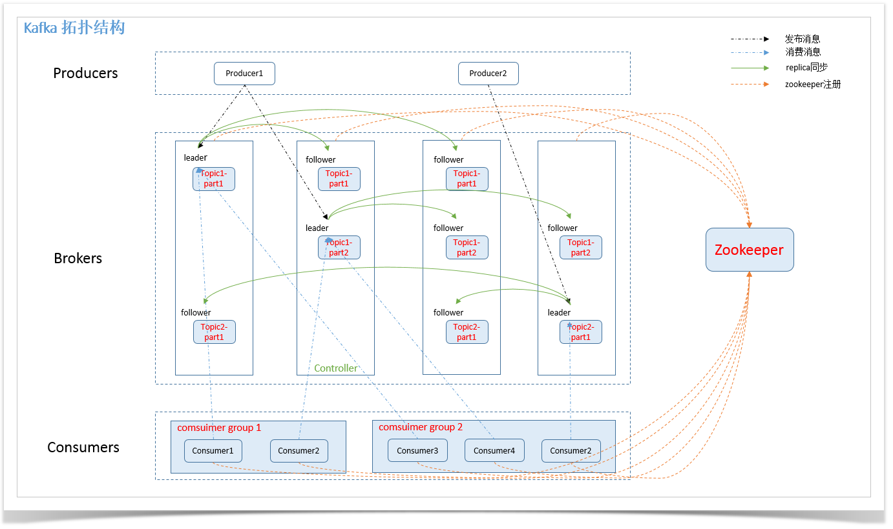
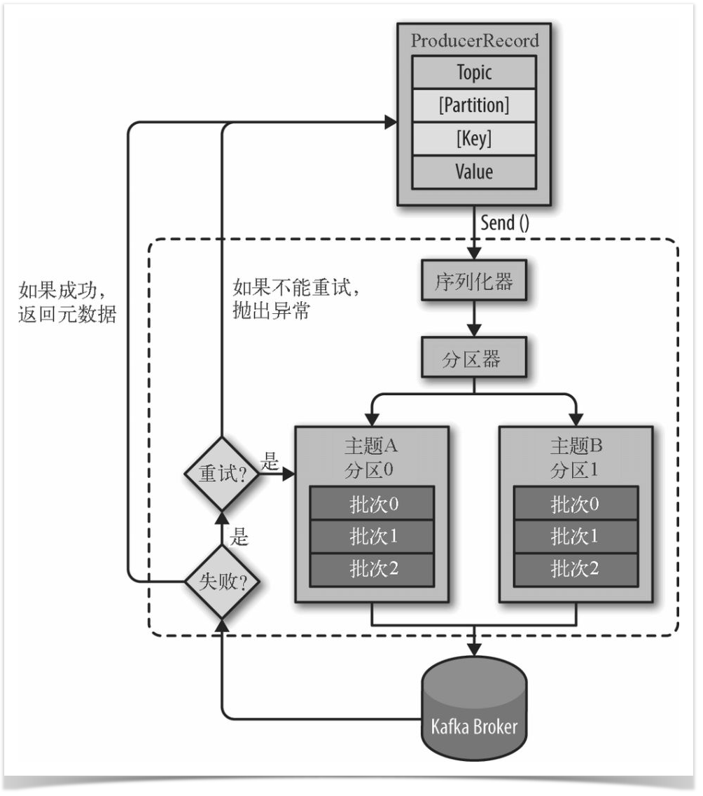
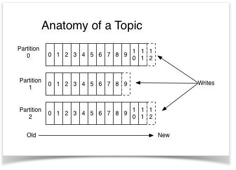
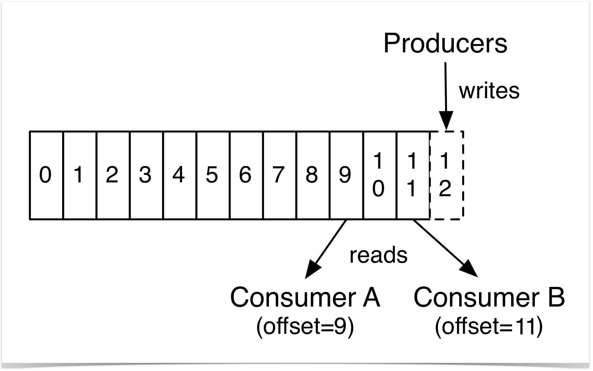
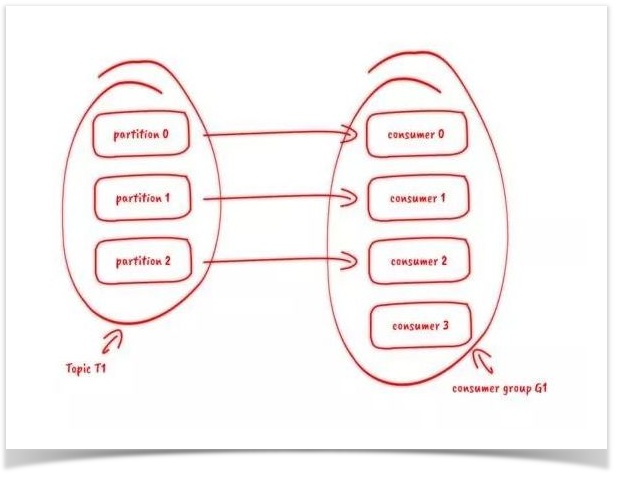
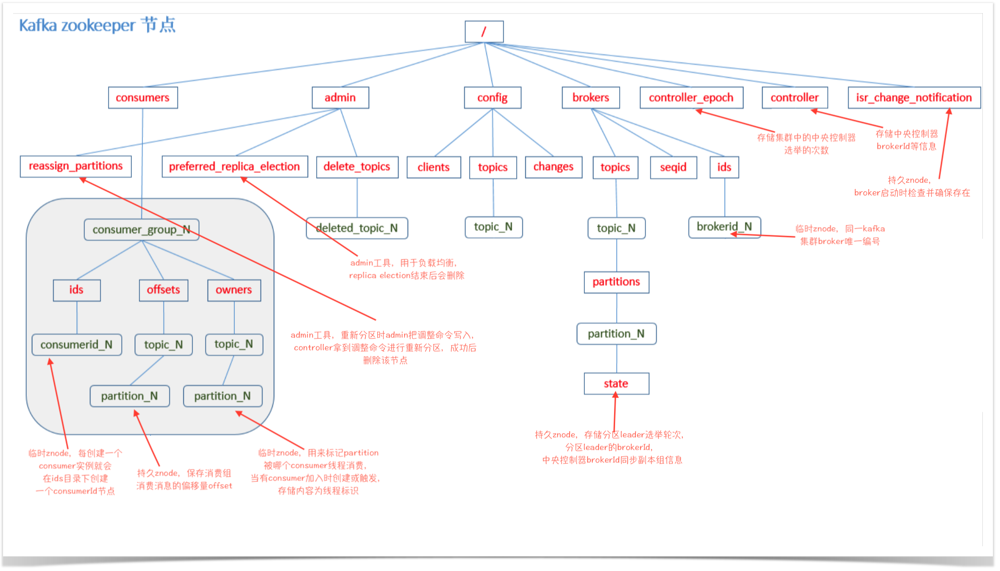

## Kafka创建背景
kafka最初是LinkedIn的一个内部基础设施系统。最初开发的起因是，LinkedIn虽然有了数据库和其他系统可以用来存储数据，但是缺乏一个可以帮助处理持续数据流的组件。它的设计目的是提供一个高性能的消息系统，可以处理多种类型数据，并能够实时提供纯洁且结构化的用户活动数据和系统度量指标。
<!-- more -->
## Kafka简介
Kafka是由LinkedIn开发，使用Scala编写的一个分布式的消息系统，具有高性能、持久化、多副本备份、横向扩展能力。生产者往队列里写消息，消费者从队列里取消息进行业务逻辑。一般在架构设计中起到解耦、削峰、异步处理的作用。

kafka对外使用topic的概念，生产者往topic里写消息，消费者从读消息。为了做到水平扩展，一个topic实际是由多个partition组成的，遇到瓶颈时，可以通过增加partition的数量来进行横向扩容。单个parition内是保证消息有序。

每新写一条消息，kafka就是在对应的文件append写，所以性能非常高。

## Kafka架构

### 一、名词解释
* **Broker**：消息中间件处理节点（服务器），一个节点就是一个broker，一个Kafka集群由一个或多个broker组成
* **Topic**：Kafka对消息进行归类，发送到集群的每一条消息都要指定一个topic
* **Partition**：物理上的概念，每个topic包含一个或多个partition，一个partition对应一个文件夹，这个文件夹下存储partition的数据和索引文件，每个partition内部是有序的
* **Producer**：生产者，负责发布消息到broker
* **Consumer**：消费者，从broker读取消息
* **ConsumerGroup**：每个consumer属于一个特定的consumer group，可为每个consumer指定group name，若不指定，则属于默认的group，一条消息可以发送到不同的consumer group，但一个consumer group中只能有一个consumer能消费这条消息
* **replica**：partition 的副本，保障 partition 的高可用。
* **leader**：replica 中的一个角色， producer 和 consumer 只跟 leader 交互。
* **follower**：replica 中的一个角色，从 leader 中复制数据。
* **controller**：每个集群都有一个broker同时充当了集群控制器角色（自动从集群的活跃成员中选举出来），负责管理工作包括分配分区给broker，监控broker等等
* **zookeeper**：Kafka 通过 zookeeper 来存储集群的 meta 信息。

### 二、架构图
#### 总体数据流

Producers往Brokers里面的指定Topic中写消息，Consumers从Brokers里面拉去指定Topic的消息，然后进行业务处理。

#### 生产者

①首先要构造一个 ProducerRecord 对象，该对象可以声明主题Topic、分区Partition、键 Key以及值 Value，主题和值是必须要声明的，分区和键可以不用指定。

②调用send() 方法进行消息发送。

③因为消息要到网络上进行传输，所以必须进行序列化，序列化器的作用就是把消息的 key 和 value对象序列化成字节数组。

④接下来数据传到分区器，如果之间的 ProducerRecord 对象指定了分区，那么分区器将不再做任何事，直接把指定的分区返回；如果没有，那么分区器会根据 Key 来选择一个分区，选择好分区之后，生产者就知道该往哪个主题和分区发送记录了。

⑤接着这条记录会被添加到一个记录批次里面，这个批次里所有的消息会被发送到相同的主题和分区。会有一个独立的线程来把这些记录批次发送到相应的 Broker 上。

③Broker成功接收到消息，表示发送成功，返回消息的元数据（包括主题和分区信息以及记录在分区里的偏移量）。发送失败，可以选择重试或者直接抛出异常。

key的作用：可以为消息的附加消息，也可以用来决定消息该被写到哪个主题分区，拥有相同key的消息将会被写到同一分区

#### topic

从上图可以看出，Topic中数据是顺序不可变序列，采用log追加方式写入，因而kafka中无因随机写入导致性能低下的问题。

Topic的数据可存储在多个partition中，即可存放在不同的服务器上。这可使Topic大小不限于一台server容量。同时，消息存在多个partition上，可以实现Topic上消息的并发访问。

#### partition

每个 Partition 中的消息都是有序的，生产的消息被不断追加到 Partition log 上，其中的每一个消息都被赋予了一个唯一的 offset 值。 因此数据不会因消费而丢失，所以只要consumer指定offset，一个消息可被不同的consumer多次消费。

kafka中只能保证partition中记录是有序的，而不保证topic中不同partition的顺序。

分区的原因：

* 方便在集群中扩展，每个 Partition 可以通过调整以适应它所在的机器，而一个 topic 又可以有多个 Partition 组成，因此整个集群就可以适应任意大小的数据了;
* 可以提高并发，因为可以以 Partition 为单位读写了。

#### Replication
同一个 partition 可能会有多个 replication(对应 server.properties 配置中的 default.replication.factor=N)。

没有 replication 的情况下，一旦 broker 宕机，其上所有 patition 的数据都不可被消费，同时 producer 也不能再将数据存于其上的 patition。

引入 replication 之 后，同一个 partition 可能会有多个 replication，而这时需要在这些 replication 之间选出一个 leader，producer 和 consumer 只与这个 leader 交互，其它 replication 作为 follower 从 leader 中复制数据。

### 消费者

订阅topic是以一个消费组来订阅的，一个消费组里面可以有多个消费者。

同一个消费组中的两个消费者，不会同时消费一个partition。换句话来说，`就是一个partition，只能被消费组里的一个消费者消费`，但是可以同时被多个消费组消费。

因此，如果消费组内的消费者如果比partition多的话，那么就会有个别消费者一直空闲。

### Kafka Zookeeper 节点

## Kafka常见的应用场景
#### 1.消息队列
比起大多数的消息系统来说，Kafka有更好的吞吐量，内置的分区，冗余及容错性，这让Kafka成为了一个很好的大规模消息处理应用的解决方案。 消息系统一般吞吐量相对较低，但是需要更小的端到端延时，并尝尝依赖于Kafka提供的强大的持久性保障。在这个领域，Kafka足以媲美传统消息系统， 如ActiveMQ或RabbitMQ。

#### 2.行为跟踪
行为跟踪是kafka基于发布订阅模式的扩展应用，当我们跟踪用户浏览页面、搜索及其他行为时，以发布-订阅的模式实时记录到对应的topic里那么这些结果被订阅者拿到后，就可以做进一步的实时处理，或实时监控，或放到hadoop/离线数据仓库里处理。

#### 3.元信息监控
与行为跟踪相似，作为操作记录的监控模块来使用，即汇集记录一些操作信息，可以理解为运维性质的数据监控吧。

#### 4.日志收集
日志收集方面，其实开源产品有很多，包括Scribe、Apache Flume。很多人使用Kafka代替日志聚合（log aggregation）。日志聚合一般来说是从服务器上收集日志文件，然后放到一个集中的位置（文件服务器或分布式文件系统）进行处理。然而Kafka忽略掉文件的细节，将其更清晰地抽象成一个个日志或事件的消息流。这就让Kafka处理过程延迟更低，更容易支持多数据源和分布式数据处理。比其他系统Kafka具有更高的扩展性，高效的性能和因为复制导致的更高的耐用性保证，以及更低的端到端延迟。

#### 5.流处理
保存收集上游的流数据，以提供到下游的Storm或其他流式计算框架进行处理。很多用户会将那些从原始topic来的数据进行阶段性处理，汇总，扩充或者以其他的方式转换到新的topic下再继续后面的处理。例如一个文章推荐的处理流程，可能是先从数据源中抓取文章的内容，然后将其丢入一个叫做“文章”的topic中；后续操作可能是需要对这个内容进行清理，比如回复正常数据或者删除重复数据，最后再将内容匹配的结果返还给用户。这就在一个独立的topic之外，产生了一系列的实时数据处理的流程。Strom和Samza是非常著名的实现这种类型数据转换的框架。

#### 6.持久性日志（commit log）
Kafka可以为一种外部的持久性日志的分布式系统提供服务。这种日志可以在节点之外进行持久性日志的记录，节点间备份数据，并为故障节点数据回复提供一种重新同步的机制。Kafka中提供了日志压缩功能，日志压缩之后整体的日志状态仍然保留，并且通过日志回溯可以实现持久性日志的功能。在这种用法中，Kafka类似于Apache BookKeeper项目。

#### 7.事件源
将状态转移作为按时间顺序排列的记录序列，这种序列可以按时间回溯整个事件的状态变更，kafka本身的持久性，代表着他可以存储大量的日志，并且这些可以根据这些日志进行汇总和回溯等等。

`实际应用中，适用最多最广泛的自然是MQ的功能。`

## Kafka用作MQ时与常用MQ的对比

**RabbitMQ**——Rabbit Message Queue的简写，但不能仅仅理解其为消息队列，消息代理更合适。 RabbitMQ是一个由Erlang 语言开发的AMQP（高级消息队列协议）的开源实现。 RabbitMQ作为一个消息代理，主要和消息打交道，负责接收并转发消息。

**ZeroMQ**——是一个基于消息队列的多线程网络库，其对套接字类型、连接处理、帧、甚至路由的底层细节进行抽象，提供跨越多种传输协议的套接字。是网络通信中新的一层，`介于应用层和传输层之间`（按照TCP/IP划分），其是一个可伸缩层，可并行运行，分散在分布式系统间。

**RocketMQ**——阿里开源的一款高性能、高吞吐量的分布式消息中间件。

**ActiveMQ**——是一种开源的，实现了JMS1.1规范的，面向消息(MOM)的中间件，为应用程序提供高效的、可扩展的、稳定的和安全的企业级消息通信。

特性 | Kafka | RabbitMQ | ZeroMQ | RocketMQ | ActiveMQ
:-: | :-: | :-: | :-: | :-: | :-:
开发语言 | Scala | Erlang | C | Java | Java
支持协议 | 自行设计的基于TCP层的协议 | AMQP | TCP、UDP | 自行设计 | OpenWire、STOMP、REST、MQTT、XMPP、AMQP、WS
消息存储 | 内存、磁盘、数据库。支持大量堆积。 | 内存、磁盘。支持少量堆积。 | 消息发送端的内存或者磁盘中。不支持持久化。 | 磁盘。支持大量堆积。 | 内存、磁盘、数据库。支持少量堆积。
消息事务 | 支持 | 支持 | 不支持 | 支持 | 支持
负载均衡	| 支持 | 支持但支持的不好	 | 去中心化，不支持负载均衡。本身只是一个多线程网络库。 | 支持 | 支持，可以基于zookeeper实现
集群方式 | 天然的‘‘Leader-Slave’无状态集群，每台服务器既是Master也是Slave。 | 支持简单集群，’复制’模式，对高级集群模式支持不好。 | 去中心化，不支持集群。 | ‘Master-Slave’ 模式，开源版本需手动切换Slave变成Master | 支持简单集群模式，比如’主-备’，对高级集群模式支持不好。
可用性 | 非常高（分布式） | 高（主从） | 高 | 非常高（分布式） | 高（主从）
消息重复 | 支持at least once、at most once | 支持at least once、at most once | 只有重传机制，但是没有持久化，消息丢了重传也没有用。既不是at least once、也不是at most once、更不是exactly only once | 支持at least once | 支持at least once
吞吐量TPS | 极大 | 比较大 | 极大 | 大（发送端不是批量发送） | 比较大
时效性 | ms以内 | us级 |   | ms级 | ms级
订阅形式和消息分发 | 基于topic以及按照topic进行正则匹配的发布订阅模式。 | 提供了4种方式：direct, topic ,Headers和fanout。 | 点对点(p2p) | 基于topic/messageTag以及按照消息类型、属性进行正则匹配的发布订阅模式 | 点对点(p2p)、广播（发布-订阅）
顺序消息 | 支持 | 不支持 | 不支持 | 支持 | 不支持
消息确认 | 支持 | 支持 | 支持 | 支持 | 支持
消息回溯	| 支持指定分区offset位置的回溯 | 不支持 | 不支持 | 支持指定时间点的回溯 | 不支持
消费失败重试 | 不支持，但可以通过指定分区offset位置实现。 | 不支持，但是可以利用消息确认机制实现。 | 不支持 | 支持 | 不支持
并发度 | 高 | 极高 | 高 | 高 | 高
资料文档 | 中。有kafka作者自己写的书，网上资料也有一些。 | 多。有一些不错的书，网上资料多。 | 少。没有专门写zeromq的书，网上的资料多是一些代码的实现和简单介绍。 | 少。没有专门写rocketmq的书，网上的资料良莠不齐，官方文档很简洁，但是对技术细节没有过多的描述。 | 多。没有专门写activemq的书，网上资料多。

### 常用MQ的优缺点

#### Kafka
##### 优点
* 性能卓越，单机写入TPS约在百万条/秒，最大的优点，就是吞吐量高。
* 时效性：ms级
* 可用性：非常高，kafka是分布式的，一个数据多个副本，少数机器宕机，不会丢失数据，不会导致不可用
* 消费者采用Pull方式获取消息, 消息有序, 通过控制能够保证所有消息被消费且仅被消费一次;
* 有优秀的第三方Kafka Web管理界面Kafka-Manager；
* 在日志领域比较成熟，被多家公司和多个开源项目使用；
* 功能支持：功能较为简单，主要支持简单的MQ功能，在大数据领域的实时计算以及日志采集被大规模使用

##### 缺点
* Kafka单机超过64个队列/分区，Load会发生明显的飙高现象，队列越多，load越高，发送消息响应时间变长
* 使用短轮询方式，实时性取决于轮询间隔时间；
* 消费失败不支持重试；
* 支持消息顺序，但是一台代理宕机后，就会产生消息乱序；
* 社区更新较慢；

#### RabbitMQ
##### 优点
* 由于erlang语言的特性，mq 性能较好，高并发；
* 吞吐量到万级，MQ功能比较完备 
* 健壮、稳定、易用、跨平台、支持多种语言、文档齐全；
* 开源提供的管理界面非常棒，用起来很好用
* 社区活跃度高；

##### 缺点
* erlang开发，很难去看懂源码，基本职能依赖于开源社区的快速维护和修复bug，不利于做二次开发和维护。
* RabbitMQ确实吞吐量会低一些，这是因为他做的实现机制比较重。
* 需要学习比较复杂的接口和协议，学习和维护成本较高。

#### ZeroMQ
##### 优点
* 吞吐量：百万级
* 扩展性强，其他MQ都已经是成形的产品，已经是一款应用程序了。而ZeroMQ说白了就是一组库函数。

##### 缺点
* 原生不支持持久化，仅支持相当有限的本地缓存，如需要消息持久化需要自己进行扩展。
* 在高并发环境下不会出问题，但是有可能会导致本地的缓存区被塞满而导致消息丢失的情况。

#### RocketMQ
##### 优点
* 单机吞吐量：十万级
* 可用性：非常高，分布式架构
* 消息可靠性：经过参数优化配置，消息可以做到0丢失
* 功能支持：MQ功能较为完善，还是分布式的，扩展性好
* 支持10亿级别的消息堆积，不会因为堆积导致性能下降
* 源码是java，我们可以自己阅读源码，定制自己公司的MQ，可以掌控

##### 缺点
* 支持的客户端语言不多，目前是java及c++，其中c++不成熟；
* 社区活跃度一般
* MQ核心代码未遵循JMS规范，有些系统要迁移需要修改大量代码

#### RocketMQ
##### 优点
* 单机吞吐量：万级
* topic数量都吞吐量的影响：
* 时效性：ms级
* 可用性：高，基于主从架构实现高可用性
* 消息可靠性：有较低的概率丢失数据
* 功能支持：MQ领域的功能极其完备
* 遵循JMS规范安装部署方便

##### 缺点
* 在并发较多时，消费端只能接收一部分，会出现丢失消息情况，需重启消费端才能接收到那部分剩下的消息。
* 官方社区现在对ActiveMQ 5.x维护越来越少，较少在大规模吞吐的场景中使用。

