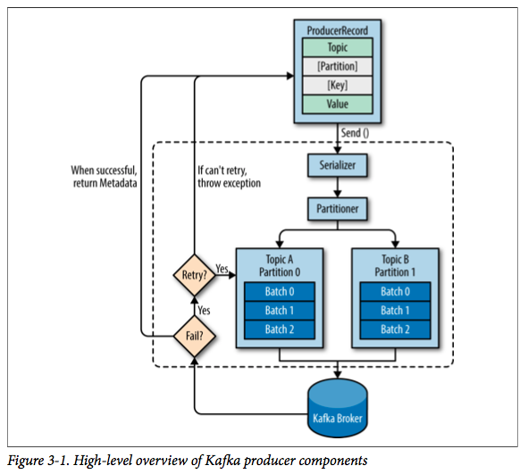

## Kafka生产者
kafka数据生产流程如图：

<!-- more -->
1. 创建一个 ProducerRecord 对象,包括目标主题和要发送的内容
2. 将对象序列化成字节数组
3. 数据被传给分区：
    * 是否指定了partition -> 直接到指定分区
    * 是否指定了key -> 分区器使用该 key 进行 hash 操作，然后对 topic 对应的分区数量进行取模操作并返回一个分区。
    * 没有指定key -> 则通过先产生随机数，之后在该数上自增的方式产生一个数，并转为正数之后进行取余操作。
4. 添加到批次，并发送
5. 服务器收到消息后返回响应
    * 成功 -> 返回 RecordMetaData对象
    * 失败 -> 返回错误信息
