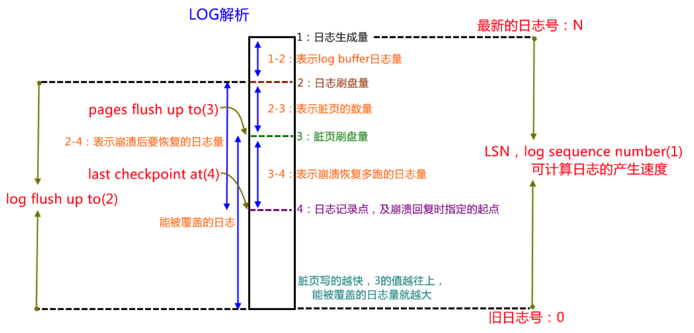

title: 《Mysql技术内幕》学习笔记-LSN
tags:
  - 学习笔记
  - MySql
categories:
  - Mysql
author: Guyuqing
copyright: true
comments: false
date: 2019-08-17 17:42:00
---
LSN(log sequence number)——日志序列号：递增产生，表示事务写入重做日志的字节总量，占用8个字节。
# LSN存在什么地方？有什么含义？

```bash
---
LOG
---
Log sequence number 15151135824   -- redo log buffer 的 lsn，存放在redo log buffer 中称： redo_mem_lsn
Log flushed up to   15151135824   -- redo log file 的 lsn，存放在redo log 中称： redo_log_lsn
Pages flushed up to 15151135824   -- 最后一个刷到磁盘上的页的最新的 lsn  
Last checkpoint at  15151135815   -- 共享表空间上的日志记录点，最后一次检查点，及崩溃恢复时指定的起点 , checkpoint 所在的 lsn, 存放在redo log第一个文件的头部，称： cp_lsn
```


# LSN 有什么用？
主要用于MySQL重启恢复  

# 恢复的算法
假设： redo_log_lsn = 15000 , cp_lsn=10000 , 这时候MySQL crash了，重启后的恢复流程如下：
1. cp_lsn = 10000 之前的redo 日志，不需要恢复： 因为checkpoint之前的日志已经可以确保刷新完毕  
2. 那么 10000 <=  redo_log_LSN <= 15000 的日志需要结合page_lsn判断，哪些需要重做，哪些不需要重做。  
    * redo_log_LSN 日志里面记录的page 操作，如果redo_log_LSN <= page_lsn   , 这些日志不需要重做，因为page已经是最新的  
    * redo_log_LSN 日志里面记录的page 操作, 如果redo_log_LSN >= page_lsn   , 这些日志是需要应用到page 里面去的，这一系列操作我们称为恢复. 
