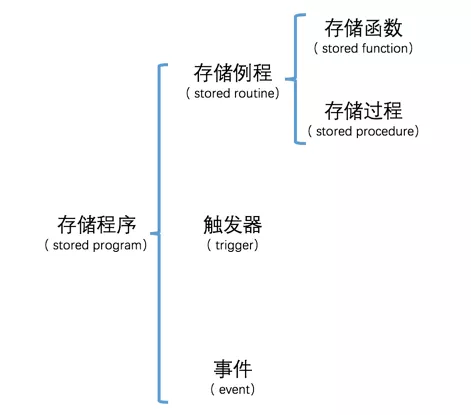

title: Mysql-存储程序
tags:
  - MySql
categories:
  - Mysql
author: Guyuqing
copyright: true
comments: false
date: 2019-08-28 16:32:00
---
MySQL中的存储程序本质上封装了一些可执行的语句，然后给用户提供一种简单的调用方式来执行这些语句，根据调用方式的不同，我们可以把`存储程序`分为`存储例程`、`触发器`和`事件`这几种类型。其中，`存储例程`又可以被细分为`存储函数`和`存储过程`。
<!-- more -->


# 自定义变量

MySQL中对我们自定义的变量的命名有个要求，那就是变量名称前必须加一个`@符号`。我们自定义变量的值的类型可以是任意MySQL支持的类型，例如我们自定义一个变量<font color='red'>a</font>：
```sql
mysql> SET @a = 1;
Query OK, 0 rows affected (0.00 sec)
```

如果我们想查看这个变量的值的话，使用<font color='Orange'>SELECT</font>语句就好了，不过仍然需要在变量名称加一个@符号：
```sql
mysql> SELECT @a;
+------+
| @a   |
+------+
|    1 |
+------+
1 row in set (0.00 sec)
```

同一个变量也可以存储存储不同类型的值，比方说我们再把一个字符串值赋值给变量<font color='red'>a</font>：
```sql
mysql> SET @a = '啦';
Query OK, 0 rows affected (0.00 sec)

mysql> SELECT @a;
+------+
| @a   |
+------+
| 啦   |
+------+
1 row in set (0.00 sec)
```

除了把一个常量赋值给一个变量以外，我们还可以把一个变量赋值给另一个变量：
```sql
mysql> SET @b = @a;
Query OK, 0 rows affected (0.00 sec)

mysql> SELECT @b;
+------+
| @b   |
+------+
| 啦   |
+------+
1 row in set (0.00 sec)
```

我们还可以将某个查询的结果赋值给一个变量，前提是这个<font color='red'>查询的结果只有一个值</font>：
```sql
mysql> SET @a = (SELECT first_column FROM first_table LIMIT 1);
Query OK, 0 rows affected (0.00 sec)

```

还可以用另一种形式的语句来将查询的结果赋值给一个变量：
```sql
mysql> SELECT first_column FROM first_table LIMIT 1 INTO @b;
Query OK, 1 row affected (0.00 sec)

```

我们查看一下这两个变量的值：
```sql
mysql> SELECT @a, @b;
+------+------+
| @a   | @b   |
+------+------+
|    1 |    1 |
+------+------+
1 row in set (0.00 sec)
```
如果我们的查询结果是一条记录，该记录中有多个列的值的话，我们想把这几个值分别赋值到不同的变量中，只能使用`INTO`语句了：
```sql
mysql> SELECT first_column, second_column FROM first_table LIMIT 1 INTO @a, @b;
Query OK, 1 row affected (0.00 sec)

mysql> SELECT @a, @b;                                                           
+------+------+
| @a   | @b   |
+------+------+
|    1 | aaa  |
+------+------+
1 row in set (0.00 sec)
```

# 复合语句

在MySQL客户端的交互界面处，当我们完成键盘输入并按下回车键时，MySQL客户端会检测我们输入的内容中是否包含`;`、`\g`或者`\G`这三个符号之一，如果有的话，会把我们输入的内容发送到服务器。这样一来，如果我们想给服务器发送复合语句（也就是由一条或多条语句组成的语句）的话，就需要把这些语句写到一行中，比如这样：
```sql
mysql> SELECT first_column FROM first_table ;SELECT second_column FROM first_table;
+--------------+
| first_column |
+--------------+
|            1 |
|            2 |
|         NULL |
+--------------+
3 rows in set (0.00 sec)

+---------------+
| second_column |
+---------------+
| aaa           |
| NULL          |
| ccc           |
+---------------+
3 rows in set (0.00 sec)

```

我们也可以用`delimiter`命令来自定义MySQL的检测输入结束的符号，如下：
```sql
mysql> delimiter $
mysql> SELECT first_column FROM first_table ;
    -> SELECT second_column FROM first_table;
    -> $
+--------------+
| first_column |
+--------------+
|            1 |
|            2 |
|         NULL |
+--------------+
3 rows in set (0.00 sec)

+---------------+
| second_column |
+---------------+
| aaa           |
| NULL          |
| ccc           |
+---------------+
3 rows in set (0.00 sec)

```

`delimiter $`命令意味着修改MySQL客户端检测输入结束的符号为`$`,也可以使用任何符号来作为MySQL客户端检测输入结束的符号，也包括多个字符，如下：
```sql
mysql> delimiter 666
mysql> SELECT first_column FROM first_table;
    -> SELECT second_column FROM first_table;
    -> 666
+--------------+
| first_column |
+--------------+
|            1 |
|            2 |
|         NULL |
+--------------+
3 rows in set (0.00 sec)

+---------------+
| second_column |
+---------------+
| aaa           |
| NULL          |
| ccc           |
+---------------+
3 rows in set (0.00 sec)
```

# 存储函数

## 创建存储函数
`存储函数`其实就是一种`函数`，只不过在这个函数里可以执行命令语句而已。
MySQL中定义存储函数的语句如下：
```sql
CREATE FUNCTION 存储函数名称([参数列表])
RETURNS 返回值类型
BEGIN
    函数体内容
END
```

举个🌰：
```sql
mysql> delimiter $
mysql> CREATE FUNCTION second_column(a INT)
    -> RETURNS VARCHAR(100)
    -> BEGIN
    -> RETURN (SELECT second_column FROM first_table WHERE first_column = a);
    -> END $
Query OK, 0 rows affected (0.00 sec)

mysql> delimiter ;
```

## 存储函数的调用
我们自定义的函数和系统内置函数的使用方式是一样的，都是在函数名后加小括号`()`表示函数调用
```sql
mysql> SELECT second_column(1);
+------------------+
| second_column(1) |
+------------------+
| aaa              |
+------------------+
1 row in set (0.00 sec)
```

## 查看存储函数
查看定义了多少个存储函数:
```sql
SHOW FUNCTION STATUS [LIKE 需要匹配的函数名]
```

查看某个函数的具体定义:
```sql
SHOW CREATE FUNCTION 函数名
```

## 删除存储函数
删除某个存储函数
```sql
DROP FUNCTION 函数名
```

## 在函数体中定义变量

在函数体中使用变量前必须先声明这个变量，函数体中的变量名`不允许加@`前缀,声明方式如下：
```sql
DECLARE 变量名 数据类型 [DEFAULT 默认值];   

mysql> delimiter $
mysql> CREATE FUNCTION var_demo(a INT)
    -> RETURNS INT
    -> BEGIN
    -> DECLARE b INT;
    -> SET b = 5;
    -> RETURN b+a;
    -> END $
Query OK, 0 rows affected (0.01 sec)

mysql> delimiter ;
```
我们调用一下这个函数：
```sql
mysql> SELECT var_demo(2);
+-------------+
| var_demo(2) |
+-------------+
|           7 |
+-------------+
1 row in set (0.00 sec)
```
如果不对声明的变量赋值，它的默认值就是NULL，也可以通过`DEFAULT`子句来显式的指定变量的默认值.
```sql
mysql> delimiter $
mysql> CREATE FUNCTION var_default_demo()
-> RETURNS INT
-> BEGIN
->     DECLARE c INT DEFAULT 1;
->     RETURN c;
-> END $
Query OK, 0 rows affected (0.00 sec)

mysql> delimiter ;

mysql> SELECT var_default_demo();
+--------------------+
| var_default_demo() |
+--------------------+
|                  1 |
+--------------------+
1 row in set (0.00 sec)

```

## 参数定义

比如我们上边编写的这个second_column函数：

```sql
mysql> CREATE FUNCTION second_column(a INT)
    -> RETURNS VARCHAR(100)
    -> BEGIN
    -> RETURN (SELECT second_column FROM first_table WHERE first_column = a);
    -> END $
```
需要注意的是，参数名不要和函数体语句中其他的变量名、命令语句的标识符冲突。并且函数参数不可以指定默认值，我们在调用函数的时候，必须显式的指定所有的参数，参数类型也一定要匹配


## 判断语句

语法格式如下：
```sql
IF 布尔表达式 THEN 
    处理语句
[ELSEIF 布尔表达式 THEN
    处理语句]
[ELSE 
    处理语句]    
END IF;
```

举个🌰：
```sql
mysql> delimiter $
mysql> CREATE FUNCTION condition_demo(i INT)
    -> RETURNS VARCHAR(10)
    -> BEGIN
    -> DECLARE result VARCHAR(10);
    -> IF i = 1 THEN
    -> SET result = '结果是1';
    -> ELSEIF i = 2 THEN
    ->  SET result = '结果是2';
    -> ELSEIF i = 3 THEN
    -> SET result = '结果是3';
    -> ELSE
    -> SET result = '非法参数';
    -> END IF;
    -> RETURN result;
    -> END $
Query OK, 0 rows affected (0.01 sec)

mysql> delimiter;


mysql> SELECT condition_demo(2);
+-------------------+
| condition_demo(2) |
+-------------------+
| 结果是2           |
+-------------------+
1 row in set (0.00 sec)

```

## 循环语句
`while`循环语法格式如下：
```sql
WHILE 布尔表达式 DO
    循环语句
END WHILE;
```

举个🌰：
```sql
mysql> delimiter $
mysql> CREATE FUNCTION sum_all(n INT UNSIGNED)
    -> RETURNS INT
    -> BEGIN
    -> DECLARE result INT DEFAULT 0;
    -> DECLARE i INT DEFAULT 1;
    -> WHILE i <= n DO
    -> SET result = result + i;
    -> SET i = i + 1;
    -> END WHILE;
    -> RETURN result;
    -> END $
Query OK, 0 rows affected (0.00 sec)

mysql> delimiter;

mysql> select sum_all(10);
+-------------+
| sum_all(10) |
+-------------+
|          55 |
+-------------+
1 row in set (0.00 sec)
```

`REPEAT`循环语法格式如下：
```sql
REPEAT
    循环语句
UNTIL 布尔表达式 END REPEAT;
```
举个🌰：
```sql
mysql> CREATE FUNCTION sum_repeat(n INT UNSIGNED)
    -> RETURNS INT
    -> BEGIN
    -> DECLARE result INT DEFAULT 0;
    -> DECLARE i INT DEFAULT 1;
    -> REPEAT
    -> -- 循环开始
    -> SET result = result + i;
    -> SET i = i + 1;
    -> UNTIL i > n END REPEAT;
    -> RETURN result;
    -> END $
Query OK, 0 rows affected (0.02 sec)

mysql> select sum_repeat(5);
+---------------+
| sum_repeat(5) |
+---------------+
|            15 |
+---------------+
1 row in set (0.01 sec)
```


`LOOP`循环语法格式如下：
```sql
循环标记:LOOP
    循环语句
    LEAVE 循环标记;
END LOOP 循环标记;
```
举个🌰：
```sql
mysql> CREATE FUNCTION sum_loop(n INT UNSIGNED)
    -> RETURNS INT
    -> BEGIN
    -> DECLARE result INT DEFAULT 0;
    -> DECLARE i INT DEFAULT 1;
    -> LOOP_NAME:LOOP -- 循环开始
    -> IF i > n THEN
    -> LEAVE LOOP_NAME;
    -> END IF;
    -> SET result = result + i;
    -> SET i = i + 1;
    -> END LOOP LOOP_NAME;
    -> RETURN result;
    -> END $
    
mysql> select sum_loop(10);
+--------------+
| sum_loop(10) |
+--------------+
|           55 |
+--------------+
1 row in set (0.00 sec)
```

# 存储过程

存储函数侧重于执行语句并返回一个值，而存储过程更侧重于单纯的去执行语句。
## 创建存储过程
```sql
CREATE PROCEDURE 存储过程名称([参数列表])
BEGIN
    需要执行的语句
END  
```
举个🌰：
```sql
mysql> CREATE PROCEDURE insert_first_table(c1 INT,c2 VARCHAR(100))
    -> BEGIN
    -> SELECT * FROM first_table;
    -> INSERT INTO first_table(first_column,second_column) VALUES(c1,c2);
    -> SELECT * FROM first_table;
    -> END $
Query OK, 0 rows affected (0.02 sec)
```

## 存储过程的调用
存储函数执行语句并返回一个值，所以常用在表达式中。
存储过程偏向于调用那些语句，并不能用在表达式中。
我们需要显式的使用CALL语句来调用一个存储过程：

```sql
CALL 存储过程([参数列表]);
```
举个🌰：
```sql
mysql> CALL insert_first_table(4,'test');
 
+--------------+---------------+
| first_column | second_column |
+--------------+---------------+
|            1 | aaa           |
|            2 | NULL          |
|         NULL | ccc           |
+--------------+---------------+
3 rows in set (0.00 sec)


+--------------+---------------+
| first_column | second_column |
+--------------+---------------+
|            1 | aaa           |
|            2 | NULL          |
|         NULL | ccc           |
|            4 | test          |
+--------------+---------------+
4 rows in set (0.00 sec)
```

## 查看存储过程
```sql
查看当前数据库中创建的存储过程都有哪些的语句：
SHOW PROCEDURE STATUS [LIKE 需要匹配的函数名]

查看某个存储过程定义的语句：
SHOW CREATE PROCEDURE 存储过程名称
```

## 删除存储过程
删除某个存储过程
```sql
DROP PROCEDURE 存储过程名称
```

## 存储过程参数类型
<table>
<tr>
    <th>参数类型</th>
    <th>实际参数是否必须是变量</th>
    <th colspan="3">作用</th>
</tr>
<tr>
    <td style="text-align:center">IN</td>
    <td style="text-align:center">否</td>
    <td colspan="3">用于调用者向过程传递数据，如果该参数在过程中被修改，调用者不可见</td>
</tr>
<tr>
    <td style="text-align:center">OUT</td>
    <td style="text-align:center">是</td>
    <td colspan="3">用于把过程产生的结果放到此参数中，过程结束后调用者可以通过该参数来获取过程执行的结果</td>
</tr>
<tr>
    <td style="text-align:center">INOUT</td>
    <td style="text-align:center">是</td>
    <td colspan="3">综合IN和OUT特点，即可用于调用者向过程传递数据，也可用于存放过程中产生的结果</td>
</tr>
</table>  

### IN
```sql
mysql> CREATE PROCEDURE test_in(IN num INT)
    -> BEGIN
    -> SELECT num;
    -> SET num = 666;
    -> END $
Query OK, 0 rows affected (0.01 sec)

mysql> SET @a = 111;

Query OK, 0 rows affected (0.01 sec)


mysql> CALL test_in(@a);
+------+
| num  |
+------+
|  111 |
+------+
1 row in set (0.00 sec)

Query OK, 0 rows affected (0.00 sec)
```
IN参数类型的变量只能用于读取，对类型的变量赋值是不会被调用者看到的。
如果我们不写明参数类型的话，该参数的类型默认是IN。

### OUT
```sql
mysql> CREATE PROCEDURE test_out(OUT num INT)
    -> BEGIN
    -> SELECT num;
    -> SET num = 666;
    -> END $
Query OK, 0 rows affected (0.01 sec)


mysql> CALL test_out(@a);
+------+
| num  |
+------+
| NULL |
+------+
1 row in set (0.00 sec)

Query OK, 0 rows affected (0.00 sec)

mysql> SELECT @a;
+------+
| @a   |
+------+
|  666 |
+------+
1 row in set (0.00 sec)

```

OUT参数类型的变量只能用于赋值，对类型的变量赋值是会被调用者看到的,因此参数就不允许是常量。

存储过程中向调用者返回多个值，举个例子：
```sql
mysql> CREATE PROCEDURE data_out(OUT a INT,OUT b INT)
    -> BEGIN
    -> SET a = 100;
    -> SET b = 200;
    -> END $
Query OK, 0 rows affected (0.01 sec)

mysql> CALL data_out(@a,@b);
Query OK, 0 rows affected (0.01 sec)

mysql> select @a,@b;
+------+------+
| @a   | @b   |
+------+------+
|  100 |  200 |
+------+------+
1 row in set (0.00 sec)

```

### INOUT

这种类型的参数既可以在存储过程中被读取，也可以被赋值后被调用者看到，因此参数就不允许是常量。

## 存储过程和函数的区别

* 存储函数在定义时需要显式用RETURNS语句标明返回的数据类型，而且在函数体中必须使用RETURN语句来显式指定返回的值，存储过程不需要。

* 存储函数的参数类型只能是IN，而存储过程支持IN、OUT、INOUT三种参数类型。

* 存储函数只能返回一个值，而存储过程可以通过设置多个OUT类型的参数来返回多个结果。

* 存储函数执行过程中产生的结果集并不会被显示到客户端，而存储过程执行过程中产生的结果集会被显示到客户端。

* 存储函数的调用直接使用在表达式中，而存储过程只能通过CALL语句来显式调用。

# 游标
游标（Cursor）是处理数据的一种方法，为了查看或者处理结果集中的数据，游标提供了在结果集中一次一行或者多行前进或向后浏览数据的能力。
初始状态下它标记查询结果集中的第一条记录,根据这个游标取出它对应记录的信息，随后再移动游标，让它指向别的记录。

## 创建游标
```sql
DECLARE 游标名称 CURSOR FOR 查询语句;
```
举个🌰：
```sql
mysql> CREATE PROCEDURE cursor_demo()
    -> BEGIN
    -> DECLARE first_table_cursor CURSOR FOR select * from first_table;
    -> END $
Query OK, 0 rows affected (0.01 sec)
```
## 打开和关闭游标
```sql
OPEN 游标名称;

CLOSE 游标名称;
```
打开游标意味着执行查询语句，让创建好的游标与该查询语句得到的结果集关联起来，关闭游标意味着会释放该游标占用的内存，所以一旦我们使用完了游标，就要把它关闭掉。

## 游标获取记录

```sql
FETCH 游标名 INTO 变量1, 变量2, ... 变量n
```
举个例子：
```sql
mysql> CREATE PROCEDURE cursor_demo()
    -> BEGIN
    -> DECLARE c1 INT;
    -> DECLARE c2 VARCHAR(100);
    -> DECLARE record_count INT;
    -> DECLARE i INT DEFAULT 0;
    ->  -- 声明游标
    -> DECLARE first_table_cursor CURSOR FOR select * from first_table;
    ->
    -> -- 统计表行数
    -> SELECT COUNT(*) FROM first_table INTO record_count;
    ->
    -> -- 使用游标遍历
    -> OPEN first_table_cursor;
    ->
    -> WHILE i < record_count DO
    -> FETCH first_table_cursor INTO c1 , c2;
    -> SELECT c1,c2;
    -> SET i = i + 1;
    -> END WHILE;
    -> CLOSE first_table_cursor;
    -> END $
Query OK, 0 rows affected (0.01 sec)

mysql> CALL cursor_demo();
+------+------+
| c1   | c2   |
+------+------+
|    1 | aaa  |
+------+------+
1 row in set (0.01 sec)

+------+------+
| c1   | c2   |
+------+------+
|    2 | NULL |
+------+------+
1 row in set (0.01 sec)

+------+------+
| c1   | c2   |
+------+------+
| NULL | ccc  |
+------+------+
1 row in set (0.01 sec)

+------+------+
| c1   | c2   |
+------+------+
|    4 | test |
+------+------+
1 row in set (0.01 sec)

Query OK, 0 rows affected (0.01 sec)

```
i表示当前游标对应的记录位置。每调用一次 FETCH 语句，游标就移动到下一条记录的位置。

## 遍历结束的执行策略

其实在FETCH语句获取不到记录的时候会触发一个事件，从而我们可以得知所有的记录都被获取过了，然后我们就可以去主动的停止循环。
MySQL中响应这个事件的语句如下：
```sql
DECLARE CONTINUE HANDLER FOR NOT FOUND 语句;  
```
举个🌰，再来改写一下cursor_demo存储过程：
```sql
mysql> delimiter $
mysql> CREATE PROCEDURE cursor_demo()
    -> BEGIN
    -> -- 声明变量
    -> DECLARE c1 INT;
    -> DECLARE c2 VARCHAR(100);
    -> DECLARE not_done INT DEFAULT 1;
    ->
    -> -- 声明游标
    -> DECLARE first_table_cursor CURSOR FOR select * from first_table;
    ->
    -> -- 在游标遍历完记录的时候将变量 not_done 的值设置为 0，并且继续执行后边的语句
    -> DECLARE CONTINUE HANDLER FOR NOT FOUND SET not_done = 0;
    ->
    -> -- 使用游标遍历
    -> OPEN first_table_cursor;
    ->
    -> WHILE not_done = 1 DO
    ->
    -> FETCH first_table_cursor INTO c1 , c2;
    -> SELECT c1,c2;
    -> END WHILE;
    -> CLOSE first_table_cursor;
    -> END $
Query OK, 0 rows affected (0.00 sec)

mysql>  CALL cursor_demo();
+------+------+
| c1   | c2   |
+------+------+
|    1 | aaa  |
+------+------+
1 row in set (0.01 sec)

+------+------+
| c1   | c2   |
+------+------+
|    2 | NULL |
+------+------+
1 row in set (0.01 sec)

+------+------+
| c1   | c2   |
+------+------+
| NULL | ccc  |
+------+------+
1 row in set (0.01 sec)

+------+------+
| c1   | c2   |
+------+------+
|    4 | test |
+------+------+
1 row in set (0.01 sec)

+------+------+
| c1   | c2   |
+------+------+
|    4 | test |
+------+------+
1 row in set (0.01 sec)

Query OK, 0 rows affected (0.01 sec)

```
我们发现结果集中最后一条记录输出两遍怎么办呢，我们可以使用`EXIT`来替代上边的`CONTINUE`：
`CONTINUE`表示在FETCH语句获取不到记录的时候仍然会执行之后存储过程的语句，也就是会将最后一次关联的记录中的值放入指定的变量
`EXIT`表示在FETCH语句获取不到记录的时候仍然不会执行之后存储过程的语句

# 触发器
存储函数与存储过程都是需要我们`手动`调用的，如果想在执行某条语句之前或者之后自动去调用另外一些语句，就需要用到触发器。

## 创建触发器
触发器的定义：
```sql
CREATE TRIGGER 触发器名
{BEFORE|AFTER}          
{INSERT|DELETE|UPDATE}
ON 表名
FOR EACH ROW 
BEGIN
    触发器内容
END
```
MySQL中目前只支持对INSERT、DELETE、UPDATE这三种类型的语句设置触发器。

因为触发器会对某个语句影响的所有记录依次调用我们自定义的触发器内容，所以我们需要一种访问该记录中的内容的方式，
MySQL提供了NEW和OLD两个单词来分别代表新记录和旧记录，它们在不同操作中的含义不同：
* 对于INSERT语句设置的触发器来说，NEW代表准备插入的记录，不能使用OLD。
* 对于DELETE语句设置的触发器来说，OLD代表删除前的记录，不能使用NEW。
* 对于UPDATE语句设置的触发器来说，NEW代表修改后的记录，OLD代表修改前的记录。

举个🌰：
```sql
mysql> CREATE TRIGGER test_trigger
    -> BEFORE INSERT ON first_table
    -> FOR EACH ROW
    -> BEGIN
    -> IF NEW.first_column < 1 THEN
    ->  SET NEW.first_column = 1;
    -> ELSEIF NEW.first_column > 10 THEN
    ->  SET NEW.first_column = 10;
    -> END IF;
    -> END $
Query OK, 0 rows affected (0.02 sec)

mysql> select * from first_table;
+--------------+---------------+
| first_column | second_column |
+--------------+---------------+
|            1 | aaa           |
|            2 | NULL          |
|         NULL | ccc           |
|            4 | test          |
+--------------+---------------+
4 rows in set (0.00 sec)

mysql> INSERT INTO first_table(first_column,second_column) VALUES(5,'5'),(20,'20');
Query OK, 2 rows affected (0.01 sec)
Records: 2  Duplicates: 0  Warnings: 0


mysql> select * from first_table;
+--------------+---------------+
| first_column | second_column |
+--------------+---------------+
|            1 | aaa           |
|            2 | NULL          |
|         NULL | ccc           |
|            4 | test          |
|            5 | 5             |
|           10 | 20            |
+--------------+---------------+
6 rows in set (0.00 sec)
```
(20,'20')的插入结果变成了(10,'20')说明触发器生效了。

## 查看触发器

```sql
查看当前数据库中的所有触发器的语句：
SHOW TRIGGERS;

查看某个具体的触发器的定义：
SHOW CREATE TRIGGER 触发器名;
```

## 删除触发器：
```sql
DROP TRIGGER 触发器名;
```

## 触发器使用注意事项
1. 触发器内容中不能有输出结果集的语句。
2. 一个表最多只能定义6个触发器分别是：
    * BEFORE INSERT触发器
    * BEFORE DELETE触发器
    * BEFORE UPDATE触发器
    * AFTER INSERT触发器
    * AFTER DELETE触发器
    * AFTER UPDATE触发器
3. NEW中的值可以被更改，OLD中的值无法更改。
4. 如果我们的`BEFORE`触发器内容执行过程中遇到了`ERROR`，那这个触发器对应的具体语句将无法执行；如果具体的操作语句执行过程中遇到了`ERROR`，那与它对应的`AFTER`触发器的内容将无法执行。

# 事件

如果我们想指定某些语句在某个时间点或者每隔一个时间段执行一次的话,就需要创建一个事件。

## 创建事件
```sql
CREATE EVENT 事件名
ON SCHEDULE
{AT 某个确定的时间点 | EVERY 期望的时间间隔 [STARTS datetime][END datetime]}
DO
BEGIN
    具体的语句
END
```

事件支持两种类型的定时执行：
1. 某个确定的时间点执行
    ```sql
    mysql> CREATE EVENT insert_first_table
        -> ON SCHEDULE
        -> AT '2019-09-10 11:30:30'
        -> DO
        -> BEGIN
        -> INSERT INTO first_table(first_column,second_column) VALUES(6,'6');
        -> END $
    ```
    除了直接填某个时间常量，也可以填写一些表达式：
    ```sql
    mysql> CREATE EVENT insert_first_table
        -> ON SCHEDULE
        -> AT DATE_ADD(NOW(), INTERVAL 2 DAY)
        -> DO
        -> BEGIN
        -> INSERT INTO first_table(first_column,second_column) VALUES(6,'6');
        -> END $
    ```
    DATE_ADD(NOW(), INTERVAL 2 DAY)表示该事件将在当前时间的两天后执行。

2. 每隔一段时间执行一次
    ```sql
    mysql> CREATE EVENT insert_first_table
        -> ON SCHEDULE
        -> EVERY 1 HOUR 
        -> DO
        -> BEGIN
        -> INSERT INTO first_table(first_column,second_column) VALUES(6,'6');
        -> END $
    ```
    默认情况下，采用这种每隔一段时间执行一次的方式将从创建事件的事件开始，无限制的执行下去。我们也可以指定该事件开始执行时间和截止时间：
    ```sql
    mysql> CREATE EVENT insert_first_table
        -> ON SCHEDULE
        -> EVERY 1 HOUR STARTS '2019-09-10 11:30:30' ENDS '2019-09-12 11:30:30'
        -> DO
        -> BEGIN
        -> INSERT INTO first_table(first_column,second_column) VALUES(6,'6');
        -> END $
    ```
    在创建好事件之后我们就不用管了，到了指定时间，MySQL服务器会帮我们自动执行的。

## 查看事件
```sql
查看当前数据库中的所有事件的语句：
SHOW EVENTS;

查看某个具体的事件的定义:
SHOW CREATE EVENT 事件名;
```

## 删除事件
```sql
DROP EVENT 事件名;
```

## 事件使用注意事项
默认情况下，MySQL服务器并不会帮助我们执行事件，除非我们在启动服务器的时候就指定了下边这个选项：
```sql
event_scheduler = ON
```
如果在服务器已经启动的情况下，我们可以通过设置`event_scheduler`的系统变量来让MySQL服务器帮助我们执行事件，设置方式如下：
```sql
mysql> SET GLOBAL event_scheduler = ON;
Query OK, 0 rows affected (0.00 sec)
```


# 错误解决
在MySql中创建自定义函数报错信息如下：
```sql
ERROR 1418 (HY000): This function has none of DETERMINISTIC, NO SQL, or READS SQL DATA in its declaration and binary logging is enabled (you *might* want to use the less safe log_bin_trust_function_creators variable)
```
解决方法：
```sql
mysql> set global log_bin_trust_function_creators=1;
```


