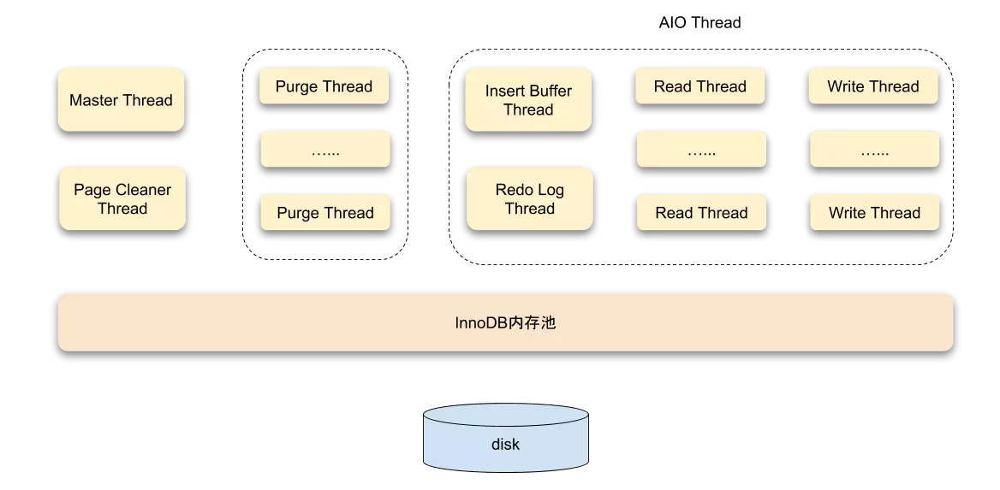
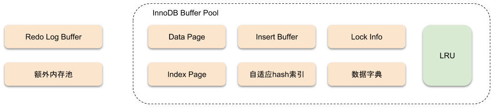
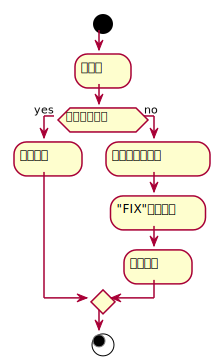
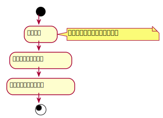
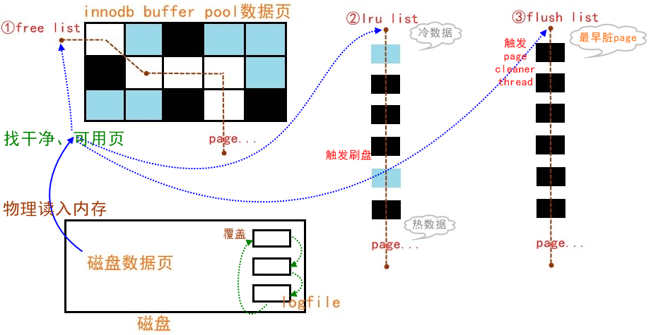
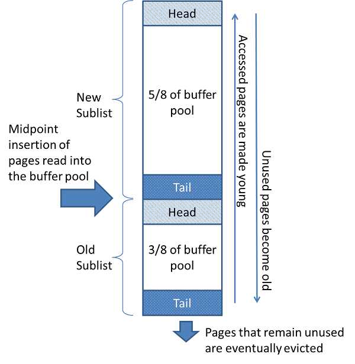
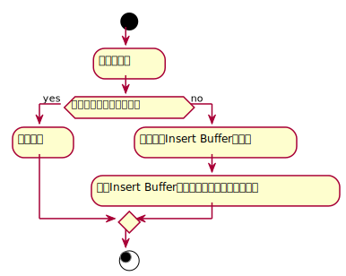
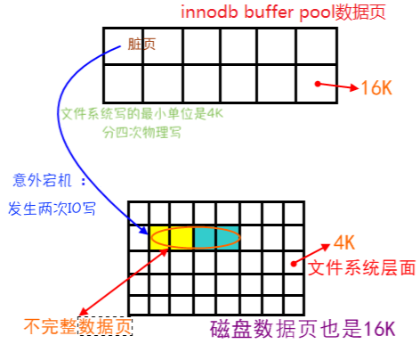
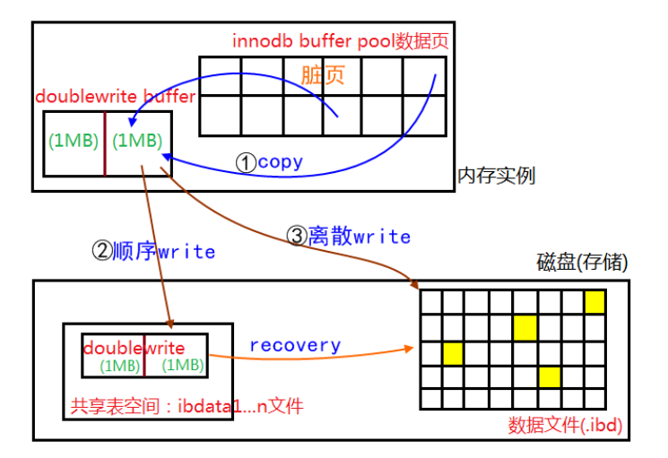

title: InnoDB存储引擎
tags:
  - 学习笔记
  - MySql
categories:
  - Mysql
author: Guyuqing
copyright: true
comments: false
date: 2019-07-31 11:34:00
---
# 概述

* InnoDB存储引擎最早由Innobase Oy公司开发，被包括在MySQL数据库所有的二进制发行版本中，
* 从MySQL 5.5版本开始是默认的表存储引擎<font color=gray>（之前的版本InnoDB存储引擎仅在Windows下为默认的存储引擎）</font>
* 第一个完整支持ACID事务的MySQL存储引擎<font color=gray>（BDB是第一个支持事务的MySQL存储引擎，现在已经停止开发）</font>
* 特点：行锁设计、支持 MVCC、支持外键、提供一致性非锁定读、有效利用内存和 CPU
<!-- more -->

# 体系架构

InnoDB存储引擎是由内存池、后台线程、磁盘存储三大部分组成。

## 线程

InnoDB 使用的是多线程模型, 其后台有多个不同的线程负责处理不同的任务

### Master Thread

Master Thread是最核心的一个后台线程，主要负责将缓冲池中的数据异步刷新到磁盘，保证数据的一致性。包括脏页刷新、合并插入缓冲、UNDO页的回收等。

### IO Thread

在 InnoDB 存储引擎中大量使用了异步IO(Async IO)来处理写IO请求, IO Thread的工作主要是负责这些 IO 请求的回调。

<table>
<tr>
    <th>InnoDB 版本</th>
    <th colspan="4">线程</th>
</tr>
<tr>
    <td style="text-align:center"> 1.0之前 </td>
    <td colspan="4">4 个 io thread：write，read，insert buffer，log IO Thread.
    <ul>
        <li>在Linux下，IO Thread的数量不能进行调整</li>
        <li>在Windows下可以通过参数 innodb_file_io_threads 来增大IO Thread</li>
    </ul>
    </td>
</tr>
<tr>
    <td style="text-align:center"> 1.0之后 </td>
    <td colspan="4">read 和 write IO thread 分别增大到了 4 个<br>
    <ul>
    <li>分别使用 innodb_read_io_threads 和 innodb_write_io_threads 设置线程数</li>
    </ul>
    </td>
</tr>
</table>  

### Purge Thread

事务提交后，其所使用的undo log可能不再需要，因此需要Purge Thread来回收已经分配并使用的UNDO页。

<table>
<tr>
    <th>InnoDB 版本</th>
    <th colspan="4">作用</th>
</tr>
<tr>
    <td style="text-align:center"> 1.1之前 </td>
    <td colspan="4">purge 操作在 master thread 内完成</td>
</tr>
<tr>
    <td style="text-align:center"> 1.1之后 </td>
    <td colspan="4">purge 可以独立到单独的线程,减轻 master thread 工作,提高 cpu 利用率和提高性能<br>
    <ul>
    <li>MySQL数据库的配置文件<code>[mysqld]</code>中添加如下命令来启用独立的Purge Thread：</li>
    <li>innodb_purge_threads=1 </li>
    <li>1.1版本中，即使将 innodb_purge_threads 设为大于1，InnoDB存储引擎启动时也会将其设为1</li>
    </ul>
    </td>
</tr>
<tr>
    <td style="text-align:center"> 1.2之后</td>
    <td colspan="4">支持多个Purge Thread, 这样做可以加快UNDO页的回收，也能更进一步利用磁盘的随机读取性能</td>
</tr>
</table>                                  

### Page Cleaner Thread

Page Cleaner Thread的作用是取代Master Thread中脏页刷新的操作，
减轻原Master Thread的工作及对于用户查询线程的阻塞，进一步提高性能。

## 内存


innoDB内存主要由[缓冲池(innodb buffer pool)](#缓冲池)、[重做日志缓冲(redo log buffer)](#重做日志缓冲)、[额外内存池组成(innodb additional men pool size)](#额外的内存池)组成

### 缓冲池
缓冲池是主存储器中的一个区域，用于在访问时缓存表和索引数据。缓冲池允许直接从内存处理常用数据，从而加快处理速度。
在专用服务器上，通常会将最多80％的物理内存分配给缓冲池。
* **读** 
    * 将从磁盘读到的页存放在缓冲池中 也称将页**fix**在缓冲池中
    * 下一次读相同的页的时候，判断是不是在缓冲池里面 ？直接读该页 ：读磁盘
    * 
* **写**
    * 修改缓冲池中的页
    * 以一定的频率刷新到磁盘
    * 不是每次数据修改都刷新，而是通过[`Checkpoint`](#Checkpoint技术)机制刷新会磁盘
    * 

因此缓冲池的大小影响数据库的整体性能。


由于32位操作系统的限制，在该系统下最多将该值设置为3G。
用户可以打开操作系统的`PAE`选项来获得32位操作系统下最大64GB内存的支持。
为了让数据库使用更多的内存,建议数据库系统都采用 64 位操作系统。



|参数|版本|作用|
|:---:|:---:|:---:|
|innodb_buffer_pool_instances|从InnoDB 1.0.x开始|配置多个缓冲池实例，默认为1|
 
#### 缓冲池中缓存的数据页类型
 
* 索引页(index page)：缓存数据表索引
* 数据页(data page)：缓存数据页，占缓冲池的绝大部分
* undo页(undo Log Page)：undo页是保存事务，为回滚做准备的。
* [插入缓冲](#插入缓冲)（insert buffer）：插入数据时要先插入到缓存池中。
* 自适应哈希索引（adaptive hash index）： 除了B+ Tree索引外，在缓冲池还会维护一个哈希索引，以便在缓冲池中快速找到数据页。
* InnoDB存储的锁信息（lock info）
* 数据字典信息（data dictionary）
    数据字典是对数据库中的数据、库对象、表对象等的元信息的集合。
    在MySQL中，数据字典信息内容就包括表结构、数据库名或表名、字段的数据类型、视图、索引、表字段信息、存储过程、触发器等内容。
    InnoDB有自己的表缓存，可以称为表定义缓存或者数据字典。当InnoDB打开一张表，就增加一个对应的对象到数据字典。

 
#### 缓冲池管理方式

 1. **LRU list** 
     **LRU算法**：最频繁使用页在LRU列表的前端，最少使用的页在尾端。首先释放LRU列表中的尾端的页。缓冲池中页的大小默认为16KB。
     **InnoDB优化的LRU算法(midpoint insertion strategy)**：将新读取到的页不放在首部，而是中间部位 `midpoint` 位置。目标是确保频繁访问"热"页面保留在缓冲池中。
     

     <table>
     <tr>
         <th>参数</th>
         <th colspan="2">作用</th>
     </tr>
     <tr>
         <td style="text-align:center"> innodb_old_blocks_pct </td>
         <td colspan="2">控制LRU列表中 old list 的百分比。<br>
            默认值为 37，对应于原始固定比率3/8。<br>
            值范围是 5（缓冲池中的新页面很快就会老化）到 95。
         </td>
     </tr>
     <tr>
         <td style="text-align:center"> innodb_old_blocks_time </td>
         <td colspan="2">指定第一次访问页面之后的时间窗口（ms）<br>
            在此期间可以访问该页面而不移动到LRU列表的前端<br>
            默认值为 1000 ms
         </td>
     </tr>
     </table> 
     
     默认情况下，算法操作如下：
     * 在默认配置下， `midpoint`位置在LRU list 的5/8处。
     * `midpoint`是new sublist的尾部与old sublist的头部相交的边界。
     * 当 InnoDB 将页面读入缓冲池时，将页插入`midpoint`位置(old sublist的头部)。
     * 访问old sublist中的页 && 该页在old sublist中的停留时间超过innodb_old_blocks_time设置的时间，使其变`young`,将其移动到缓冲池的头部(new sublist的头部)。
     * 当页从LRU列表的old部分加入到new部分时，称此时发生的操作为`page made young`，而因为innodb_old_blocks_time的设置而导致页没有从old部分移动到new部分的操作称为`page not made young`
     * 在数据库操作中，被访问的页将移到new sublist的表头，这样一来，在new sublist中的未被访问的节点将逐渐往表尾移动，当移动过中点，将变为old list的节点。当表满时，old list末尾的页将会被移除。
     
 
 为什么不采用朴素的LRU？
 因为某些SQL操作会访问很多页，甚至全部页，但仅仅在该次查询操作，并不是活跃的热点数据。可能会使缓冲池中的页被刷新出，从而影响缓冲池的效率。
   
 
 2. **Free list**
    当数据库刚启动时，LRU列表是空的，这时页都存放在Free list中。
    当需要从缓冲池中分页时，从Free list中查找是否有可用的空闲页，若有则将该页从Free列表中删除，放入到LRU列表中,维持页数守恒。
 3. **Flush list**               
    在LRU类表的页被修改后，称为脏页（Dirty Page），即缓存和硬盘的页数据不一致。
    数据库会通过`CHECKPOINT`机制将脏页刷新回磁盘，Flush list中的页即为脏页列表。

### 重做日志缓冲
   
    **什么是redo log？**
    当数据库对数据做修改的时候，需要把数据页从磁盘读到buffer pool中，然后在buffer pool中进行修改，那么这个时候buffer pool中的数据页就与磁盘上的数据页内容不一致，称buffer pool的数据页为dirty page 脏数据。
    如果发生非正常的DB服务重启，那么这些数据并没有同步到磁盘文件中（注意，同步到磁盘文件是个随机IO），会发生数据丢失。
    如果这个时候，能够有一个文件，当缓冲池中的data page变更结束后，把相应修改记录记录到这个文件（注意，记录日志是顺序IO），那么当DB服务发生crash的情况，恢复DB的时候，也可以根据这个文件的记录内容，重新应用到磁盘文件，数据保持一致。
    这个文件就是redo log ，用于记录 数据修改后的记录，顺序记录。<br>
    **什么是undo log？**
    undo日志用于存放数据修改被修改前的值。
    假设修改表中 id=1 的行数据，把Name='B' 修改为Name = 'B2' ，那么undo日志就会用来存放Name='B'的记录，如果这个修改出现异常，可以使用undo日志来实现回滚操作，保证事务的一致性。
     


  
  重做日志缓冲不需要设置很大，通常情况下8M能满足大部分的应用场景。重做日志支持以下三种情况触发刷新：
  * Master Thread每一秒将重做日志缓冲刷新到重做日志文件
  * 每次事务提交时将重做日志缓冲刷新到重做日志文件
  * 当重做日志缓冲池剩余空间小于1/2时，重做日志缓冲刷新到重做日志文件
  
### 额外的内存池
   在InnoDB存储引擎中，对内存的管理是通过一种称为内存堆的方式进行的。在对一些数据结构本身的内存进行分配时，需要从额外的内存池中进行申请，当该区域的内存不够时，会从缓冲池中进行申请。

# Checkpoint技术 
        
    
   **什么是Checkpoint？**
   是一个数据库事件(event)，这个事件激活以后会触发数据库写进程(DBWR)将脏数据块写到磁盘中。                           
   
   **为什么需要Checkpoint技术？**
   innoDB在事务提交时，先写重做日志，再修改内存数据这样，就产生了脏页。既然有重做日志保证数据持久性，查询时也可以从缓冲池页中取数据，那为什么还要刷新脏页到磁盘呢？如果重做日志可以无限增大，同时缓冲池足够大，能够缓存所有数据，那么是不需要将缓冲池中的脏页刷新到磁盘。但是，会有以下几个问题：
   1) 服务器内存有限，缓冲池不够用，无法缓存全部数据
   2) 重做日志无限增大成本要求太高
   3) 宕机时如果重做全部日志恢复时间过长            
                                         
   **Checkpoint 解决了什么问题？**
   1) 缩短短数据库的恢复时间
   2) 缓冲池不够时，将脏页刷新到磁盘
   3) 重做日志不可用时，刷新脏页
 

innodb 内部有两种 checkpoint：
1. **sharp checkpoint**：数据库关闭的时候将`所有的脏页`刷回到磁盘，默认方式，参数 innodb_fast_shudown=1
2. **fuzzy checkpoint**：只刷新`部分脏页`
    - master thread checkpoint：master thread 异步的以每秒或者每 10 秒的速度从缓冲池的脏页列表中刷新一定比列的也回磁盘
    - flush_lru_list checkpoint：InnoDB要保证LRU列表中需要有差不多100个空闲页可供使用。如果没有这么多，就会将 lru list 尾部的页移除。如果这些页有脏页，就需要进行 checkpoint。
         - innodb 1.1.x版本之前，检查在用户查询线程中,会阻塞用户查询操作。
         - innodb 1.2.x版本之后，检查放到了单独的 page cleaner 线程中,可通过 **innodb_lru_scan_depth** 控制lru列表中可用页的数量，默认是1024。
    - async/sync flush checkpoint：重做日志文件不可用时，强制将一些页刷新到磁盘。达到重做日志文件的大小阈值。
    - dirty page too much checkpoint：当缓冲池中脏页的数量占据一定百分比时，强制进行Checkpoint，用来保证缓冲池中有足够的页，通过 [innodb_max_dirty_pages_pct](#innodb_max_dirty_pages_pct) 参数控制。
              
<div style="text-align:center;color:#bfbfbf;font-size:16px;">
    <span>-------- 第二部分 --------</span>
</div>
                               
# Master thread 工作方式

## InnoDB 1.0.x 版本之前的 Master thread
Master thread 内部有多个循环 loop 组成：
* 主循环 loop
* 后台循环 backgroup loop
* 刷新循环 flush loop
* 暂停循环 suspend loop

伪代码如下：

```java
void master_thread()
{
	goto loop;
	//主循环
	loop ：
	for(int i = 0; i < 10; ++i){
		thread_sleep(1);
		//1. 日志缓冲刷新到磁盘，即使事务还没有提交
		do log buffer flush to disk;
		//2. 根据前一秒IO操作小于5，合并插入缓冲
		if(last_one_second_ios < 5)
			do merge at most 5 insert buffer;
		//3. 脏页的比例超过了阈值，刷新 100 个脏页到磁盘
		if(buf_get_modified_ratio_pct > innodb_max_dirty_pages_pct)
			do buffer pool flush 100 dirty page;
		//4. 没有用户活动（数据库空闲时）或者数据库关闭（shutdown），切换到 backgroup loop
		if(no user activity)
			goto backgroud loop;
	}
	
	//1. 前10秒IO操作小于200，刷新 100 个脏页到磁盘
	if(last_ten_second_ios < 200)
		do buffer pool flush 100 dirty page;
	//2. 合并至多 5 个插入缓冲
	do merge at most 5 insert buffer;
	//3. 将重做日志刷新到磁盘
	do log buffer flush to disk;
	//4. 删除无用的 undo 页（每次最多尝试回收 20 个 undo 页）
	do full purge;
	//5. 脏页比例超过 70% 刷新100 个脏页到磁盘，否则刷新 10 个脏页
	if ( buf_get_modified_ratio_pct ＞ 70 % )
		do buffer pool flush 100 dirty page
	else
		buffer pool flush 10 dirty page
																
	goto loop
	//后台循环																
	background loop :
	//1. 删除无用的 undo 页
	do full purge
	//2. 合并 20 个插入缓冲
	do merge 20 insert buffer
	//3.如果有任务，跳转到主循环，否则跳转到刷新循环
	if not idle	
		goto loop
	else
		goto flush loop
	
	//刷新循环
	flush loop :
	//不断刷新100个脏页，直到脏页比例没有超过阈值
	do buffer pool flush 100 dirty page
	if ( buf_get_modified_ratio_pct ＞ innodb_max_dirty_pages_pct )
		goto flush loop
	//没有任务，跳转到暂停循环
	goto suspend loop
	
	//暂停循环
	suspend loop :
	//将主线程挂起，等待事件发生
	suspend_thread()
	waiting event
	goto loop;
}

```
## InnoDB 1.2.x 版本之前的 Master thread
1. 提高刷新脏页数量和合并插入数量，改善磁盘 IO 处理能力,刷新数量不再硬编码，而是使用百分比控制。
    * 在合并插入缓冲的时候，合并插入缓冲的数量为 [innodb_io_capacity](#innodb_io_capacity) 的 5%
    * 在从缓冲区刷新脏页的时候，刷新脏页的数量为 [innodb_io_capacity](#innodb_io_capacity)
2. 增加了自适应刷新脏页功能。
    * 1.0.x之前版本：脏页在缓冲池占比小于[innodb_max_dirty_pages_pct](#innodb_max_dirty_pages_pct)，不刷新脏页，大于则刷新100个脏页
    * 1.0.x版本开始：引入[innodb_adaptive_flushing](#innodb_adaptive_flushing)参数，通过函数buf_flush_get_desired_flush_rate判断产生重做日志的速度来决定最适合的刷新脏页数量。
3. full purge回收的Undo页的数量也不再硬编码，使用参数[innodb_purge_batch_size](#innodb_purge_batch_size)控制。

<table>
<tr>
    <th colspan="2">参数</th>
    <th>InnoDB 版本</th>
    <th colspan="3">作用</th>
</tr>
<tr>
    <td colspan="2" style="text-align:center"><span id="innodb_io_capacity">innodb_io_capacity</span></td>
    <td style="text-align:center"> 1.0.x开始 </td>
    <td colspan="3">表示磁盘IO的吞吐量,默认值是200</td>
</tr>
<tr>
    <td colspan="2" rowspan="2" style="text-align:center"><span id="innodb_max_dirty_pages_pct">innodb_max_dirty_pages_pct</span></td>
    <td style="text-align:center"> 1.0.x之前 </td>
    <td colspan="3">脏页在缓冲池中所占比率，默认值是90</td>
</tr>
<tr>
    <td style="text-align:center"> 1.0.x开始</td>
    <td colspan="3">默认值是75<br>加快刷新脏页的频率，保证了磁盘IO的负载。</td>                       
</tr>
<tr>
    <td colspan="2" style="text-align:center"><span id="innodb_adaptive_flushing">innodb_adaptive_flushing</span></td>
    <td style="text-align:center"> 1.0.x开始 </td>
    <td colspan="3">是否自适应刷新脏页，默认为 ON</td>
</tr>
<tr>
    <td colspan="2" style="text-align:center"><span id="innodb_purge_batch_size">innodb_purge_batch_size</span></td>
    <td style="text-align:center"> 1.0.x开始 </td>
    <td colspan="3">清除 undo 页时,表示一次删除多少页,默认是 20</td>
</tr>
</table>   

Master Thread的伪代码变为了下面的形式：

```java
void master_thread()
{
	goto loop;
	//主循环
	loop ：
	for(int i = 0; i < 10; ++i){
		thread_sleep(1);
		//1. 日志缓冲刷新到磁盘，即使事务还没有提交
		do log buffer flush to disk;
		//2. 根据前一秒IO操作小于5%innodb_io_capacity，合并插入缓冲
		if(last_one_second_ios < 5%innodb_io_capacity)
			do merge 5%innodb_io_capacity insert buffer;
		//3. 脏页的比例超过了阈值，刷新 100%innodb_io_capacity 个脏页到磁盘
		if(buf_get_modified_ratio_pct > innodb_max_dirty_pages_pct)
			do buffer pool flush 100%innodb_io_capacity dirty page;
		//4. 没有用户活动（数据库空闲时）或者数据库关闭（shutdown），切换到 backgroup loop
		if(no user activity)
			goto backgroud loop;
	}
	
	//1. 前10秒IO操作小于innodb_io_capacity，刷新 innodb_io_capacity 个脏页到磁盘
	if(last_ten_second_ios < innodb_io_capacity)
		do buffer pool flush 100%innodb_io_capacity dirty page;
	//2. 合并至多 5%innodb_io_capacity 个插入缓冲
	do merge at most 5%innodb_io_capacity insert buffer;
	//3. 将重做日志刷新到磁盘
	do log buffer flush to disk;
	//4. 删除无用的 undo 页（每次最多尝试回收 5%innodb_io_capacity 个 undo 页）
	do full purge;
	//5. 脏页比例超过 70% 刷新 100%innodb_io_capacity 个脏页到磁盘，
	// 否则刷新 10%innodb_io_capacity 个脏页
	if ( buf_get_modified_ratio_pct ＞ 70 % )
		do buffer pool flush 100%innodb_io_capacity dirty page
	else
		buffer pool flush 10%innodb_io_capacity dirty page
																
	goto loop
	//后台循环																
	background loop :
	//1. 删除无用的 undo 页
	do full purge
	//2. 合并 100%innodb_io_capacity 个插入缓冲
	do merge 100%innodb_io_capacity insert buffer
	//3.如果有任务，跳转到主循环，否则跳转到刷新循环
	if not idle	
		goto loop
	else
		goto flush loop
	
	//刷新循环
	flush loop :
	//不断刷新 100%innodb_io_capacity 个脏页，直到脏页比例没有超过阈值
	do buffer pool flush 100%innodb_io_capacity dirty page
	if ( buf_get_modified_ratio_pct ＞ innodb_max_dirty_pages_pct )
		goto flush loop
	//没有任务，跳转到暂停循环
	goto suspend loop
	
	//暂停循环
	suspend loop :
	//将主线程挂起，等待事件发生
	suspend_thread()
	waiting event
	goto loop;
}

```
## InnoDB 1.2.x 版本的 Master thread

InnoDB 1.2.x 版本中再次对 Master Thread 进行了优化，伪代码如下：
```java
if InnoDB is idle
//之前版本中每10秒的操作
srv_master_do_idle_tasks();
else
//之前版本中每秒的操作
srv_master_do_active_tasks();
```
对于刷新脏页的操作，从Master Thread线程分离到一个单独的Page Cleaner Thread，从而减轻了Master Thread的工作，同时进一步提高了系统的并发性。


# InnoDB 关键特性
关键特性包括：
* 插入缓冲 insert buffer
* 两次写 double write
* 自适应哈希索引 adaptive hash index
* 异步 io async io
* 刷新邻接页 flush neighbor page

## 插入缓冲

聚集索引(primary key)一般是顺序的，不需要磁盘的随机读取，插入效率高。
而对于`非聚集索引`来说，叶子节点的插入不再有序，这时就需要离散访问非聚集索引页，插入性能变低。
因此引入插入缓冲机制。

对于`非聚集索引（非唯一）`的插入和更新,不是每一次直接插入索引页。
而是先判断插入的非聚集索引页是否在缓冲池中。
如果在,则直接插入,如果不再,则先放入一个插入缓冲区中。
然后再以一定的频率执行插入缓冲和非聚集索引页子节点的合并操作。

插入缓冲,不是缓冲池中的一个部分,而是**物理页**的一个组成部分。

### 1. insert buffer
Insert Buffer的使用流程：


插入缓冲的启用需要满足一下两个条件：
1）索引是辅助索引（secondary index）
2）索引不适合唯一的

如果辅助索引是唯一的，就不能使用该技术，原因很简单，因为如果这样做，整个索引数据被切分为2部分，无法保证唯一性。

插入缓冲主要带来如下两个坏处：
1）可能导致数据库宕机后实例恢复时间变长。如果应用程序执行大量的插入和更新操作，且涉及非唯一的聚集索引，一旦出现宕机，这时就有大量内存中的插入缓冲区数据没有合并至索引页中，导致实例恢复时间会很长。
2）在写密集的情况下，插入缓冲会占用过多的缓冲池内存，默认情况下最大可以占用1/2，这在实际应用中会带来一定的问题。

### 2. change buffer

InnoDB从1.0.x版本开始引入了Change Buffer，可以将其视为Insert Buffer的升级。
从这个版本开始，InnoDB可以对DML操作——Insert、Delete、Update都进行缓冲，
它们分别是：Insert Buffer, Delete Buffer,Purge Buffer。

对一个记录进行 update 操作有两个过程
* 将记录标记为删除：delete buffer
* 将记录真正删除：pruge buffer


<table>
<tr>
    <th colspan="2">参数</th>
    <th>InnoDB 版本</th>
    <th colspan="3">作用</th>
</tr>
<tr>
    <td colspan="2" style="text-align:center"><span id="innodb_change_buffering">innodb_change_buffering</span></td>
    <td style="text-align:center"> 1.0.x开始 </td>
    <td colspan="3">用来开启各种Buffer选项，默认值是all<br>
        <ul>
        <li>inserts</li>
        <li>deletes</li>
        <li>purges</li>
        <li>changes：开启 inserts 和 deletes</li>
        <li>all：都开启</li>
        <li>none：都不开启</li>
        </ul>
    </td>
</tr>
<tr>
    <td colspan="2" rowspan="2" style="text-align:center"><span id="innodb_change_buffer_max_size">innodb_change_buffer_max_size</span></td>
    <td style="text-align:center"> 1.2.x开始 </td>
    <td colspan="3">用来控制change buffer最大使用内存数量<br>默认值为25,表示最多使用1/4的缓存池空间<br>该参数最大有效值是50</td>
</tr>
</table>  

## 两次写
提高innodb的可靠性，用来解决部分写失败(partial page write页断裂)。

### 脏页刷新到磁盘风险

关于IO的最小单位：

　　1、数据库IO的最小单位是16K（MySQL默认，oracle是8K）

　　2、文件系统IO的最小单位是4K（也有1K的）

　　3、磁盘IO的最小单位是512字节

因此，存在IO写入导致page损坏的风险：



提高innodb的可靠性，用来解决部分写失败(partial page write页断裂)。

### Double write解决了什么问题
一个数据页的大小是16K，假设在把内存中的脏页写到数据库的时候，写了2K突然宕机了，也就是说前2K数据是新的，后14K是旧的，那么磁盘数据库这个数据页就是不完整的，是一个坏掉的数据页，这种情况被称为部分`写失效`

**那么可不可以通过 redo log 来进行恢复呢？**
redo只能恢复校验完整（还没写）的页，不能修复坏掉的数据页，所以这个数据就丢失了，可能会造成数据不一致，所以需要double write。

   
为什么 redo log 不需要 doublewrite 的支持？
因为 redo log 写入的单位就是 512 字节，也就是磁盘 IO 的最小单位，所以无所谓数据损坏。
   

### 两次写工作流程

doublewrite由两部分组成，一部分为内存中的doublewrite buffer，其大小为2MB，另一部分是磁盘上共享表空间(ibdata x)中连续的128个页，即2个区(extent)，大小也是2M。
1. 当一系列机制触发数据缓冲池中的脏页刷新时，并不直接写入磁盘数据文件中，而是先拷贝至内存中的doublewrite buffer中；
2. 接着从两次写缓冲区分两次写入磁盘共享表空间中(连续存储，顺序写，性能很高)，每次写1MB；
3. 待第二步完成后，再将doublewrite buffer中的脏页数据写入实际的各个表空间文件(离散写)；(脏页数据固化后，即进行标记对应doublewrite数据可覆盖)

现在我们来分析一下为什么 double write 可以生效。当宕机发生时，有那么几种情况：
1. 磁盘还未写，此时可以通过 redo log 恢复；
2. 磁盘正在进行从内存到共享表空间的写，此时数据文件中的页还没开始被写入，因此也同样可以通过 redo log 恢复；
3. 磁盘正在写数据文件，此时共享表空间已经写完，可以从共享表空间拷贝页的副本到数据文件实现恢复。

## 自适应哈希索引

哈希：一次就可以定位数据

B+树：取决于树的高度，生产环境一般是 3-4 层，所以需要查询 3-4 次

自适应哈希索引 AHI（adaptive hash index）建立条件：观察到一个访问模式访问频繁，就会建立哈希索引
* 通过该模式访问了 100 次（模式：where x = ?）
* 页通过该模式访问了 N 次，其中 N = 页的记录总数⁄16

InnoDB 存储引擎官方文档显示，启用 AHI 后,读取和写入速度可以提高 2 倍，辅助索引的连接操作性能可以提高 5 倍。

## 异步IO
为了提高磁盘的操作性能，当前的数据库系统都采用异步IO的方式处理磁盘操作。用户可以在发出一个IO请求胡立即再发出另一个IO请求，当全部IO请求发送完毕后，等待所有IO操作完成，这就是AIO。
AIO的另一个优势是可以进行IO Merge操作，也就是将多个IO合并为1个IO, 这样可以提高IOPS(Input/Output Per Second)的性能。

例如：用户访问页的（space, page_no)为(8,6) (8,7) (8,8)，每个页的大小为16KB，同步IO需要3次IO操作。可以优化为从(8,6)开始读取48KB。

## 刷新临接页

当刷新一个脏页时，InnoDB会检查该页所在extent的所有页，如果是脏页，一起刷新。

<table>
    <tr>
        <th colspan="2">参数</th>
        <th>版本</th>
        <th colspan="3">作用</th>
    </tr>
    <tr>
        <th colspan="2" style="text-align:center" >innodb_flush_neighbors</th>
        <td style="text-align:center">1.2.x开始</td>
        <td colspan="3">控制是否启用该特性</td>
    </tr>
</table> 


# 参考：
* http://oohcode.com/2015/10/14/InnoDB-Key-Features/
* https://chyroc.cn/posts/innodb-storage-engine-reading-1/
* https://www.cnblogs.com/zhoujinyi/archive/2013/04/11/2988923.html
* http://huzb.me/2019/01/14/%E6%8F%92%E5%85%A5%E7%BC%93%E5%86%B2%E3%80%81%E4%B8%A4%E6%AC%A1%E5%86%99%E5%92%8C%E8%87%AA%E9%80%82%E5%BA%94%E5%93%88%E5%B8%8C%E7%B4%A2%E5%BC%95/
* https://blog.csdn.net/tanliqing2010/article/details/81509539
* https://www.cnblogs.com/geaozhang/p/7341333.html
* https://draveness.me/mysql-innodb
* https://www.docs4dev.com/docs/zh/mysql/5.7/reference/innodb-architecture.html#innodb%E6%9E%B6%E6%9E%84
