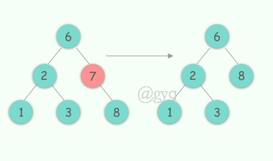
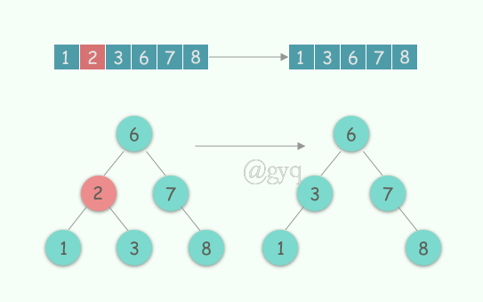
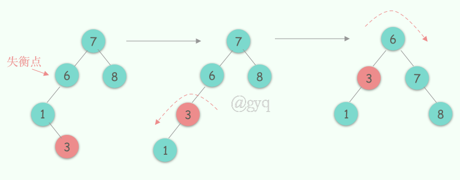

title: 《Mysql技术内幕》学习笔记-索引与算法
tags:
  - 学习笔记
  - MySql
  - InnoDB
categories:
  - Mysql
author: Guyuqing
copyright: true
comments: false
date: 2019-10-17 16:25:00
---
InnoDB存储引擎支持以下几种常见的索引：

B+树索引、全文索引、哈希索引

# 二叉查找树

在介绍B+树前，需要先了解一下二叉查找树。B+树是通过二叉查找树，再由平衡二叉树，B树演化而来。

## 定义

左孩子比父节点小，右孩子比父节点大，中序遍历可以得到键值的排序输出。

## 插入

## 删除
单孩子的情况：如果删除的节点有左孩子那就把左孩子顶上去，如果有右孩子就把右孩子顶上去

左右都有孩子的情况：可以这么想象，如果我们要删除一个数组的元素，那么我们在删除后会将其后面的一个元素顶到被删除的位置。
二叉树操作同样，我们根据`中序遍历`找到要删除结点的后一个结点，然后顶上去，原理跟`数组`一样。

## 查找
查找的平均时间复杂度log(N)，在最坏的情况下会出现`链表`的形式，复杂度退化到O(N)。

# 平衡二叉树

当二叉查找树以`完全二叉树`的形式展现，这样我才能做到查找是严格的O(logN)，

## 定义

首先符合二叉查找树的定义，其次必须满足任何节点的两个子树的高度最大差为1。

## 旋转
节点再怎么失衡都逃不过4种情况

### 左子树的左边节点

### 右子树的右边节点

### 左子树的右边节点

找到`失衡点`，失衡点的左子树进行[右子树的右边节点](#右子树的右边节点)情况旋转，然后进行[左子树的左边节点](#左子树的左边节点)旋转

### 右子树的左边节点

## 插入&删除

步骤同[二叉查找树](#二叉查找树)，只是在插入或删除节点之后多了一步[旋转](#旋转)的过程

