### 准备
#### 开发工具及系统环境
* IDE：IntelliJ IDEA 2019.1
* 系统环境：mac OSX

#### 项目目录结构
* biz层：业务逻辑层
* dao层：数据持久层，使用MB插件生成相关代码及xml
* common层：提供工程层面的基础工具类。
* web层：请求处理层

### 搭建步骤

#### 搭建父工程

1、 IDEA 工具栏选择菜单 File -> New -> Project...

2、选择Spring Initializr，Initializr默认选择Default，点击Next
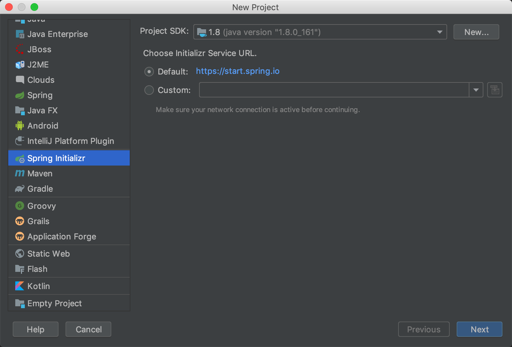
3、填写项目资料,点击Next
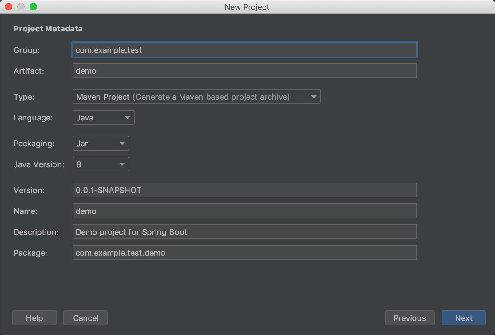
4、直接点击Next
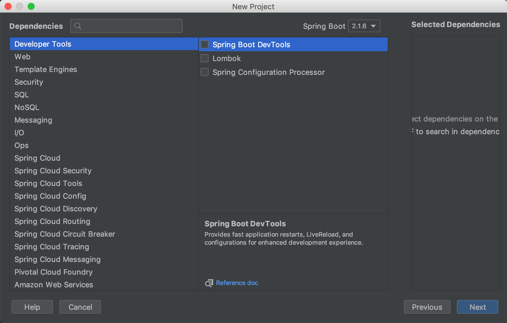
5、填写name，点击Finish
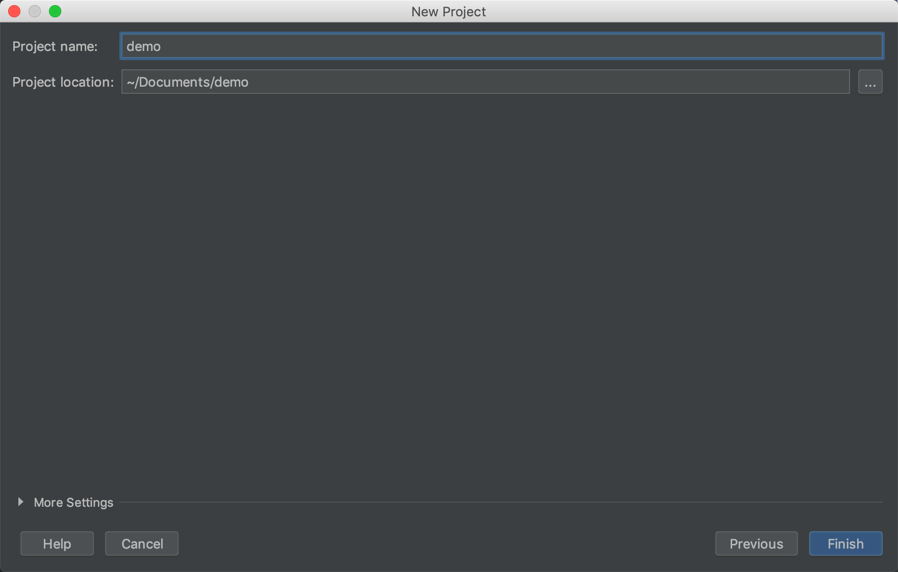
6、项目结构如下
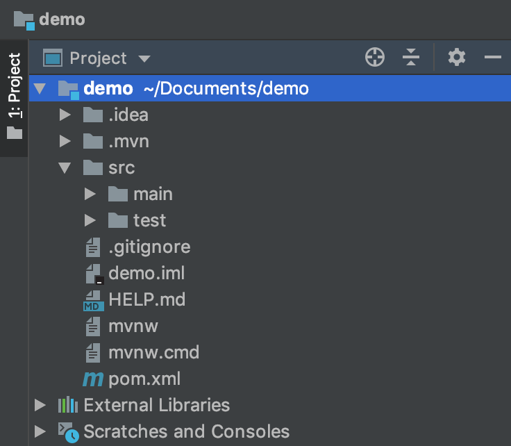
7、删除多余目录，只留如下结构
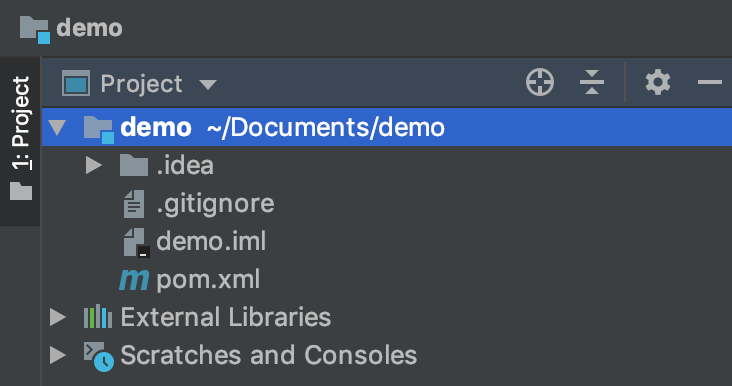

#### 创建子模块
8、选择项目根目录,右键->New -> Module
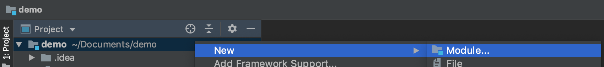
9、选择Maven，点击Next
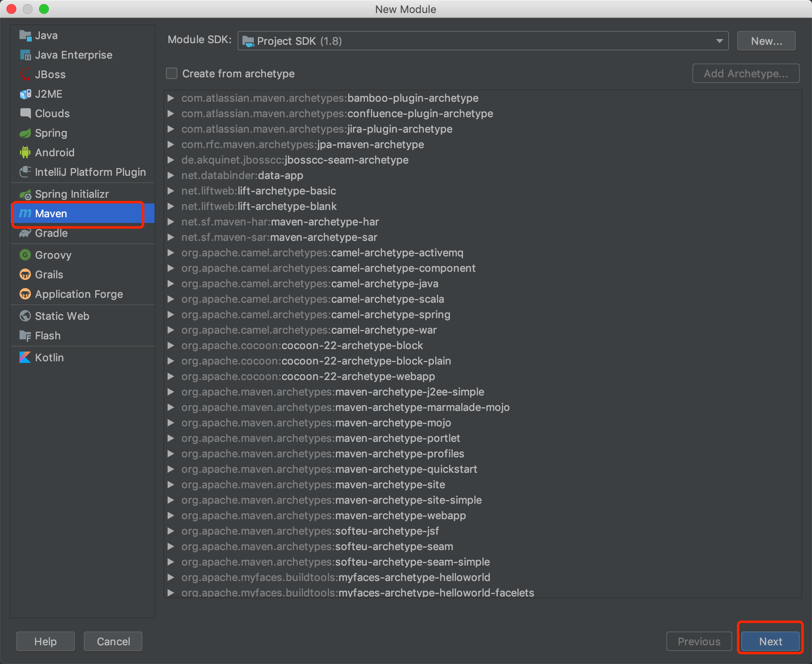
10、填写ArifactId，点击Next
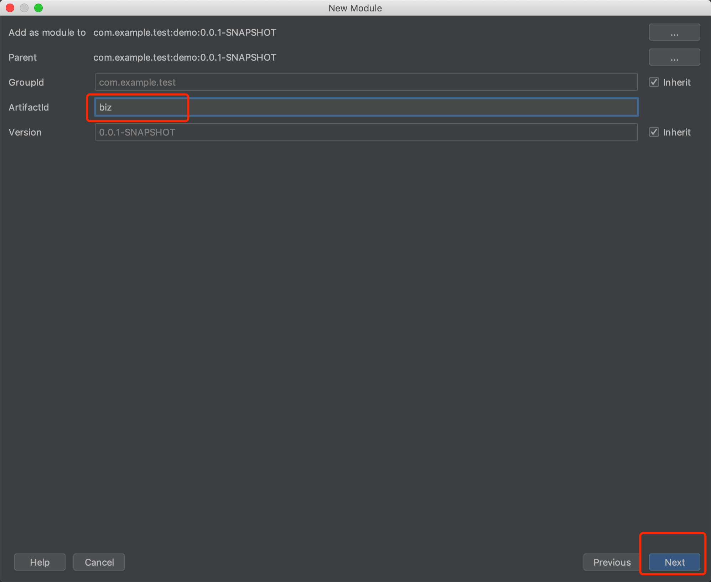
11、点击Finish
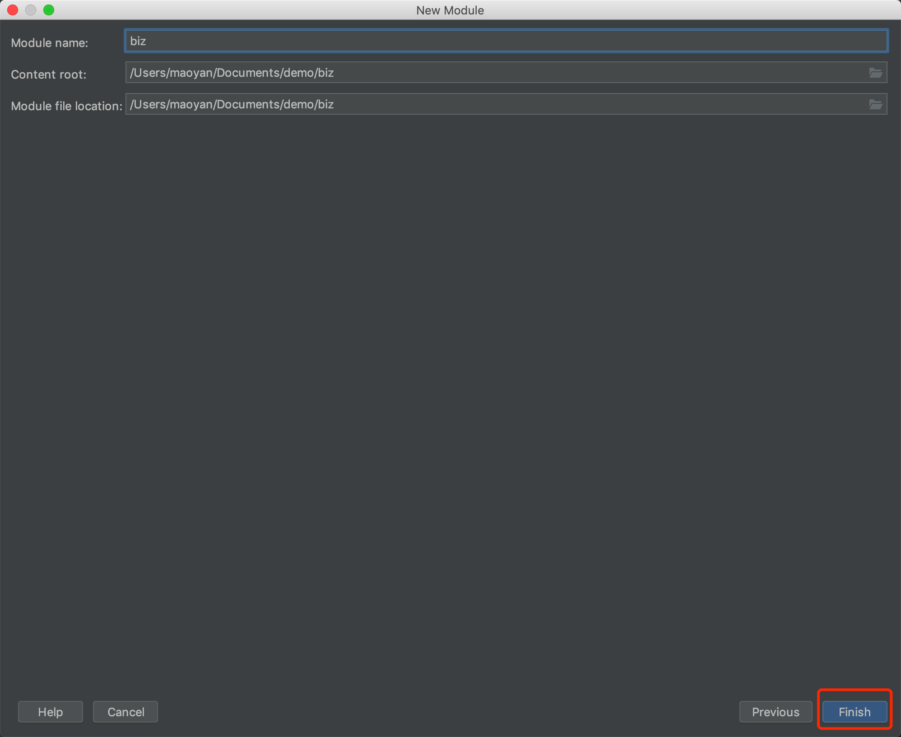
12、同理添加其他子模块，最终项目目录结构如下图
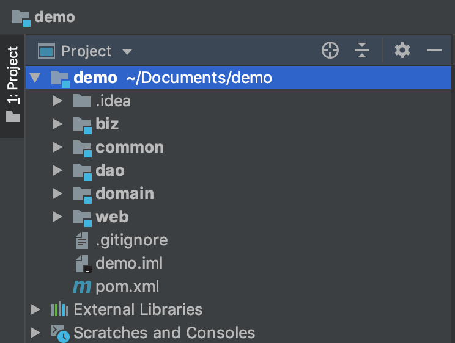

#### 模块间依赖关系

各个子模块的依赖关系：
* biz层：依赖dao层，common层
* dao层：不依赖
* common层：不依赖
* web层：依赖biz层，common层。

13、父pom文件中声明所有子模块依赖
```xml
    <dependencyManagement>
        <dependencies>
            <dependency>
                <groupId>com.example.test</groupId>
                <artifactId>biz</artifactId>
                <version>${project.version}</version>
            </dependency>
            <dependency>
                <groupId>com.example.test</groupId>
                <artifactId>common</artifactId>
                <version>${project.version}</version>
            </dependency>
            <dependency>
                <groupId>com.example.test</groupId>
                <artifactId>dao</artifactId>
                <version>${project.version}</version>
            </dependency>
            <dependency>
                <groupId>com.example.test</groupId>
                <artifactId>web</artifactId>
                <version>${project.version}</version>
            </dependency>
        </dependencies>
    </dependencyManagement>
```
14、biz层pom文件中添加dao层，common层依赖
```xml
    <dependencies>
        <dependency>
            <groupId>com.example.test</groupId>
            <artifactId>dao</artifactId>
        </dependency>
        <dependency>
            <groupId>com.example.test</groupId>
            <artifactId>common</artifactId>
        </dependency>
    </dependencies>
```
15、web层pom文件中添加biz层，common层依赖
```xml
    <dependencies>
        <dependency>
            <groupId>com.example.test</groupId>
            <artifactId>biz</artifactId>
        </dependency>
        <dependency>
            <groupId>com.example.test</groupId>
            <artifactId>common</artifactId>
        </dependency>
    </dependencies>
```

#### 运行项目
16、在web层pom文件中添加spring-boot-starter-web
```xml
        <!-- spring-boot -->
        <dependency>
            <groupId>org.springframework.boot</groupId>
            <artifactId>spring-boot-starter-web</artifactId>
        </dependency>
```

17、在web层创建com.example.test.demo.web包并添加入口类AppServiceApplication.java，目录结构如下
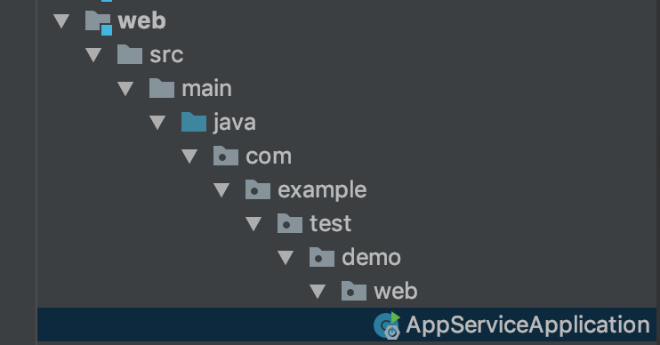
入口类代码如下：
```java

package com.example.test.demo.web;

import org.springframework.boot.SpringApplication;
import org.springframework.boot.autoconfigure.SpringBootApplication;

@SpringBootApplication
public class AppServiceApplication {
    public static void main(String[] args) {
        SpringApplication.run(AppServiceApplication.class, args);
    }
}

```
18、在com.example.test.demo.web包下创建controller目录添加test方法测试接口是否可以正常访问
```java
package com.example.test.demo.web.controller;


import org.springframework.web.bind.annotation.RequestMapping;
import org.springframework.web.bind.annotation.RestController;

@RestController
@RequestMapping("demo")
public class DemoController {

    @RequestMapping("test")
    public String test() {
        return "Hello World!";
    }
}
```

19、运行AppServiceApplication中的main方法启动项目，默认端口为8080，访问http://localhost:8080/demo/test得到如下效果
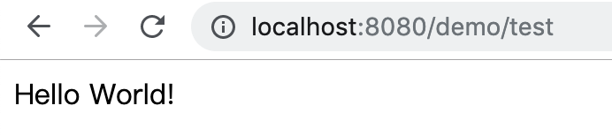

20、在biz层创建com.example.test.demo.biz包并创建DemoService接口类代码如下：
```java
package com.example.test.demo.biz;

public interface DemoService {
    String test();
}

```

21、在com.example.test.demo.biz包下创建impl目录并添加DemoServiceImpl类，代码如下：
```java
package com.example.test.demo.biz.impl;


import com.example.test.demo.biz.DemoService;
import org.springframework.stereotype.Service;


@Service
public class DemoServiceImpl implements DemoService {

    @Override
    public String test() {
        return "biz test";
    }
}
```

22、DemoController类通过@Autowired注解注入DemoService，修改DemoController的test方法，代码如下：
```java
package com.example.test.demo.web.controller;


import com.example.test.demo.biz.DemoService;
import org.springframework.beans.factory.annotation.Autowired;
import org.springframework.web.bind.annotation.RequestMapping;
import org.springframework.web.bind.annotation.RestController;

@RestController
@RequestMapping("demo")
public class DemoController {

    @Autowired
    private DemoService demoService;

    @RequestMapping("test")
    public String test() {
        return demoService.test();
    }
}
```

23、在入口类AppServiceApplication上添加@ComponentScan注解
```java
package com.example.test.demo.web;

import org.springframework.boot.SpringApplication;
import org.springframework.boot.autoconfigure.SpringBootApplication;
import org.springframework.context.annotation.ComponentScan;

@SpringBootApplication
@ComponentScan(basePackages = {
        "com.example.test.demo.*"
})
public class AppServiceApplication {
    public static void main(String[] args) {
        SpringApplication.run(AppServiceApplication.class, args);
    }
}
```

24、更改完之后运行main方法，访问http://localhost:8080/demo/test得到如下效果
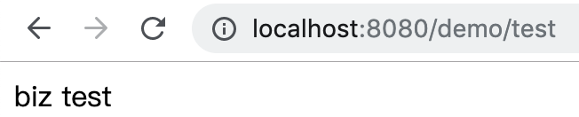

25、其他层同理验证。

#### 集成Mybatis

26、父pom文件中声明mybatis-spring-boot-starter、mysql-connector-java等依赖。
```xml
<?xml version="1.0" encoding="UTF-8"?>
<project xmlns="http://maven.apache.org/POM/4.0.0" xmlns:xsi="http://www.w3.org/2001/XMLSchema-instance"
         xsi:schemaLocation="http://maven.apache.org/POM/4.0.0 http://maven.apache.org/xsd/maven-4.0.0.xsd">
    <modelVersion>4.0.0</modelVersion>
    <packaging>pom</packaging>
    <modules>
        <module>biz</module>
        <module>dao</module>
        <module>common</module>
        <module>web</module>
    </modules>
    <parent>
        <groupId>org.springframework.boot</groupId>
        <artifactId>spring-boot-starter-parent</artifactId>
        <version>2.1.2.RELEASE</version>
        <relativePath/> <!-- lookup parent from repository -->
    </parent>
    <groupId>com.example.test</groupId>
    <artifactId>demo</artifactId>
    <version>0.0.1-SNAPSHOT</version>
    <name>demo</name>
    <description>Demo project for Spring Boot</description>

    <properties>
        <java.version>1.8</java.version>
        <mysql-connector.version>8.0.11</mysql-connector.version>
        <mybatis.version>1.3.2</mybatis.version>
        <mybatis.generator.version>1.3.2</mybatis.generator.version>
    </properties>

    <build>
        <pluginManagement>
            <plugins>
                <plugin>
                    <groupId>org.springframework.boot</groupId>
                    <artifactId>spring-boot-maven-plugin</artifactId>
                </plugin>
                <!--mybatis-->
                <plugin>
                    <groupId>org.mybatis.generator</groupId>
                    <artifactId>mybatis-generator-maven-plugin</artifactId>
                    <version>${mybatis.generator.version}</version>
                    <dependencies>
                        <dependency>
                            <groupId>mysql</groupId>
                            <artifactId>mysql-connector-java</artifactId>
                            <version>${mysql-connector.version}</version>
                        </dependency>
                        <dependency>
                            <groupId>org.mybatis.generator</groupId>
                            <artifactId>mybatis-generator-core</artifactId>
                            <version>${mybatis.generator.version}</version>
                        </dependency>
                    </dependencies>
                </plugin>
            </plugins>
        </pluginManagement>
        <resources>
            <resource>
                <directory>src/main/resources</directory>
                <filtering>true</filtering>
            </resource>
        </resources>
    </build>

    <dependencyManagement>
        <dependencies>
            <dependency>
                <groupId>com.example.test</groupId>
                <artifactId>biz</artifactId>
                <version>${project.version}</version>
            </dependency>
            <dependency>
                <groupId>com.example.test</groupId>
                <artifactId>common</artifactId>
                <version>${project.version}</version>
            </dependency>
            <dependency>
                <groupId>com.example.test</groupId>
                <artifactId>dao</artifactId>
                <version>${project.version}</version>
            </dependency>
            <dependency>
                <groupId>com.example.test</groupId>
                <artifactId>web</artifactId>
                <version>${project.version}</version>
            </dependency>


            <dependency>
                <groupId>org.springframework.boot</groupId>
                <artifactId>spring-boot-starter</artifactId>
            </dependency>

            <dependency>
                <groupId>org.springframework.boot</groupId>
                <artifactId>spring-boot-starter-test</artifactId>
                <scope>test</scope>
            </dependency>

            <!--mybatis-->
            <dependency>
                <groupId>org.mybatis.spring.boot</groupId>
                <artifactId>mybatis-spring-boot-starter</artifactId>
                <version>${mybatis.version}</version>
            </dependency>

            <!-- mysql -->
            <dependency>
                <groupId>mysql</groupId>
                <artifactId>mysql-connector-java</artifactId>
                <version>${mysql-connector.version}</version>
            </dependency>
        </dependencies>
    </dependencyManagement>
</project>

```
27、在dao层中的pom文件中添加以下依赖
```xml
    <build>
        <plugins>
            <plugin>
                <groupId>org.springframework.boot</groupId>
                <artifactId>spring-boot-maven-plugin</artifactId>
            </plugin>
            <plugin>
                <groupId>org.mybatis.generator</groupId>
                <artifactId>mybatis-generator-maven-plugin</artifactId>
                <configuration>
                    <configurationFile>${basedir}/src/main/resources/mybatis-generator.xml</configurationFile>
                    <overwrite>true</overwrite>
                    <verbose>true</verbose>
                </configuration>
            </plugin>
        </plugins>
    </build>
```
28、在web/src/main/resources下添加application.properties

* **com.mysql.jdbc.Driver** 是 mysql-connector-java 5中的
* **com.mysql.cj.jdbc.Driver** 是 mysql-connector-java 6中的

```properties
spring.datasource.driverClassName = com.mysql.cj.jdbc.Driver
spring.datasource.url = jdbc:mysql://localhost:3306/test?useUnicode=true&characterEncoding=UTF8&connectTimeout=1000&socketTimeout=3000
spring.datasource.username = root
spring.datasource.password = qwertyui

mybatis.type-aliases-package = com.example.test.demo.dao.po
mybatis.mapper-locations = classpath:mapper/*.xml
```
29、在web/src/main/resources下添加mybatis-generator.xml配置内容如下
```xml
<?xml version="1.0" encoding="UTF-8"?>
<!DOCTYPE generatorConfiguration
        PUBLIC "-//mybatis.org//DTD MyBatis Generator Configuration 1.0//EN"
        "http://mybatis.org/dtd/mybatis-generator-config_1_0.dtd">
<generatorConfiguration>
    <!-- 引入SpringBoot配置文件 -->
    <properties resource="application.properties"/>

    <context id="Mysql" targetRuntime="MyBatis3" defaultModelType="flat">
        <!-- 生成的pojo，将implements Serializable-->
        <plugin type="org.mybatis.generator.plugins.SerializablePlugin"/>

        <commentGenerator>
            <!--*是否去除自动生成的注释包含时间戳 true：是 ： false:否-->
            <property name="suppressDate" value="true" />
            <!-- 是否去除自动生成的注释 true：是 ： false:否 -->
            <property name="suppressAllComments" value="true" />
        </commentGenerator>

        <jdbcConnection driverClass="${spring.datasource.driverClassName}"
                        connectionURL="${spring.datasource.url}"
                        userId="${spring.datasource.username}"
                        password="${spring.datasource.password}">
        </jdbcConnection>

        <!--
       生成model模型，对应的包路径，以及文件存放路径(targetProject)，targetProject可以指定具体的路径,如./src/main/java，
       也可以使用“MAVEN”来自动生成，这样生成的代码会在target/generatord-source目录下
       -->
        <javaModelGenerator targetPackage="com.example.test.demo.dao.po" targetProject="../dao/src/main/java" >
            <!-- 在targetPackage的基础上，根据数据库的schema再生成一层package，最终生成的类放在这个package下，默认为false -->
            <property name="enableSubPackages" value="true"/>
            <!-- 从数据库返回的值被清理前后的空格 -->
            <property name="trimStrings" value="true"/>
        </javaModelGenerator>

        <!--对应的mapper.xml文件 -->
        <sqlMapGenerator targetPackage="mapper"
                         targetProject="../dao/src/main/resources">
            <property name="enableSubPackages" value="true"/>
        </sqlMapGenerator>

        <!-- 对应的Mapper接口类文件 -->
        <javaClientGenerator type="XMLMAPPER" targetPackage="com.example.test.demo.dao.mapper"
                             targetProject="../dao/src/main/java">
            <property name="enableSubPackages" value="true"/>
        </javaClientGenerator>

        <!-- 表名及对应po类名称-->
        <table tableName="user_info" domainObjectName="UserInfoPO"
               enableCountByExample="true" enableUpdateByExample="true" enableDeleteByExample="true"
               enableSelectByExample="true" selectByExampleQueryId="false">
            <property name="useActualColumnNames" value="false"/>
            <generatedKey column="id" identity="true" sqlStatement="MySql"/>
        </table>
    </context>
</generatorConfiguration>
```
30、根据表自动生成对应的Mapper以及po类,步骤如下。
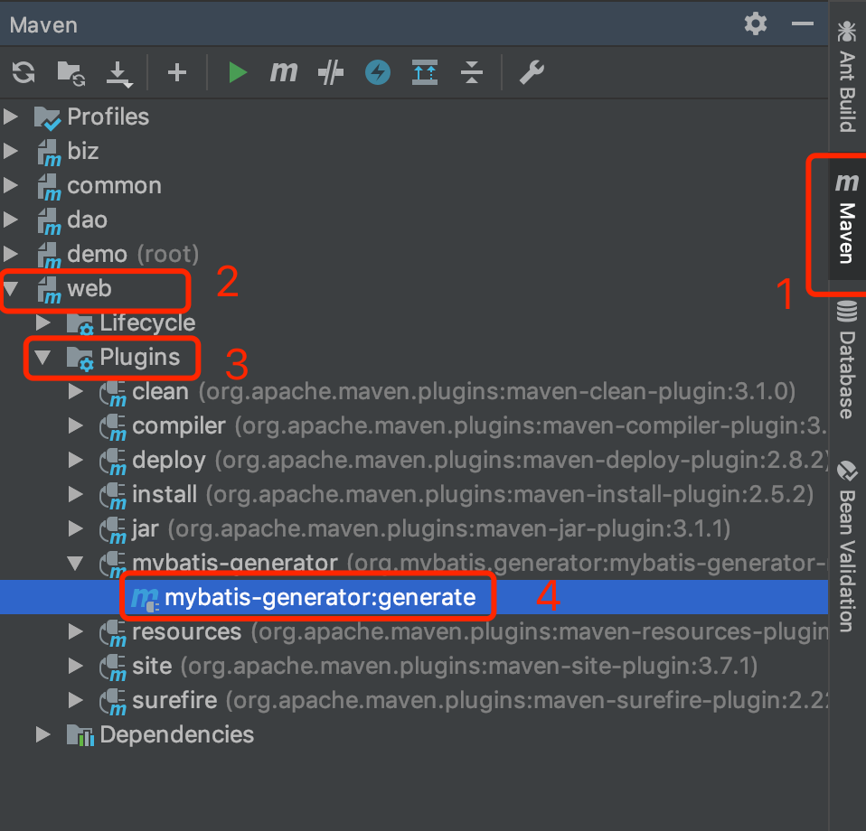
得到目录如下
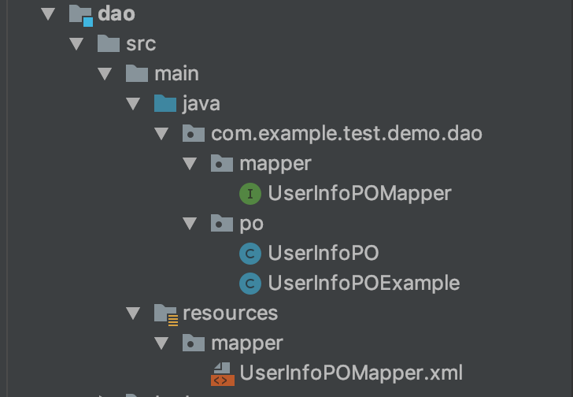

30、biz层下DemoServiceImpl通过@Autowired注解注入UserMapper，修改DemoService的test方法如下：
```java
package com.example.test.demo.biz.impl;


import com.example.test.demo.biz.DemoService;
import com.example.test.demo.dao.mapper.UserInfoPOMapper;
import com.example.test.demo.dao.po.UserInfoPO;
import org.springframework.beans.factory.annotation.Autowired;
import org.springframework.stereotype.Service;


@Service
public class DemoServiceImpl implements DemoService {

    @Autowired
    private UserInfoPOMapper userInfoPOMapper;

    @Override
    public String test() {
        UserInfoPO po = userInfoPOMapper.selectByPrimaryKey(1L);
        return "UserInfo name is:" + po.getName();
    }
}
```
31、在入口类AppServiceApplication上中添加注解
```java
@MapperScan("com.example.test.demo.dao.mapper")
```
32、运行main方法启动项目
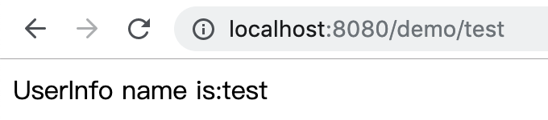

### 遇到的坑
mybatis 自动生成时遇到
> Client does not support authentication protocol requested by server; consider upgrading MySQL client

解决方法登录mysql：
```bash
ALTER USER 'root'@'localhost' IDENTIFIED WITH mysql_native_password BY 'qwertyui';
SELECT plugin FROM mysql.user WHERE User = 'root';
```