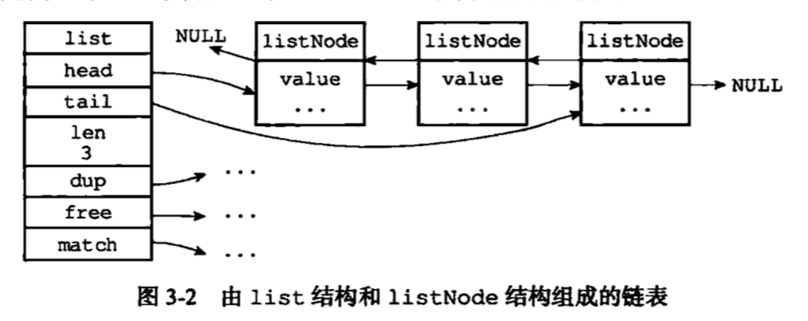

## list定义
```c
/*
 * 双端链表节点
 */
typedef struct listNode {

    // 前置节点
    struct listNode *prev;

    // 后置节点
    struct listNode *next;

    // 节点的值
    void *value;

} listNode;

/*
 * 双端链表迭代器
 */
typedef struct listIter {

    // 当前迭代到的节点
    listNode *next;

    // 迭代的方向
    int direction;

} listIter;

/*
 * 双端链表结构
 */
typedef struct list {

    // 表头节点
    listNode *head;

    // 表尾节点
    listNode *tail;

    // 节点值复制函数
    void *(*dup)(void *ptr);

    // 节点值释放函数
    void (*free)(void *ptr);

    // 节点值对比函数
    int (*match)(void *ptr, void *key);

    // 链表所包含的节点数量
    unsigned long len;

} list;
```

## list常用函数

### listCreate-创建新链表
```c
/**
 * 创建一个新的链表
 * @return  创建成功返回链表，失败返回 NULL
 * T = O(1)
 */
list *listCreate(void)
{
    struct list *list;

    // 分配内存
    if ((list = zmalloc(sizeof(*list))) == NULL)
        return NULL;

    // 初始化属性
    list->head = list->tail = NULL;
    list->len = 0;
    list->dup = NULL;
    list->free = NULL;
    list->match = NULL;

    return list;
}
```

### listRelease-释放整个链表
```c
/**
 * 释放整个链表，以及链表中所有节点
 * @param list
 * T = O(N)
 */
void listRelease(list *list)
{
    unsigned long len;
    listNode *current, *next;

    // 指向头指针
    current = list->head;
    // 遍历整个链表
    len = list->len;
    while(len--) {
        next = current->next;

        // 如果有设置值释放函数，那么调用它
        if (list->free) list->free(current->value);

        // 释放节点结构
        zfree(current);

        current = next;
    }

    // 释放链表结构
    zfree(list);
}
```
### listAddNodeHead-添加新节点到链表头
```c
/**
 * 将一个包含有给定值指针 value 的新节点添加到链表的表头
 * @param list
 * @param value
 * @return 如果为新节点分配内存出错，那么不执行任何动作，仅返回 NULL，如果执行成功，返回传入的链表指针
 * T = O(1)
 */
list *listAddNodeHead(list *list, void *value)
{
    listNode *node;

    // 为节点分配内存
    if ((node = zmalloc(sizeof(*node))) == NULL)
        return NULL;

    // 保存值指针
    node->value = value;

    // 添加节点到空链表
    if (list->len == 0) {
        list->head = list->tail = node;
        node->prev = node->next = NULL;
    // 添加节点到非空链表
    } else {
        node->prev = NULL;
        node->next = list->head;
        list->head->prev = node;
        list->head = node;
    }

    // 更新链表节点数
    list->len++;

    return list;
}
```
### listAddNodeTail-添加新节点到链表尾
```c
/**
 * 将一个包含有给定值指针 value 的新节点添加到链表的表尾
 * @param list
 * @param value 新节点
 * @return 如果为新节点分配内存出错，那么不执行任何动作，仅返回 NULL，如果执行成功，返回传入的链表指针
 * T = O(1)
 */
list *listAddNodeTail(list *list, void *value)
{
    listNode *node;

    // 为新节点分配内存
    if ((node = zmalloc(sizeof(*node))) == NULL)
        return NULL;

    // 保存值指针
    node->value = value;

    // 目标链表为空
    if (list->len == 0) {
        list->head = list->tail = node;
        node->prev = node->next = NULL;
    // 目标链表非空
    } else {
        node->prev = list->tail;
        node->next = NULL;
        list->tail->next = node;
        list->tail = node;
    }

    // 更新链表节点数
    list->len++;

    return list;
}
```
### listInsertNode-将新节点添加到老节点之前或之后
```c
/**
 * 创建一个包含值 value 的新节点，并将它插入到 old_node 的之前或之后
 * 如果 after 为 0 ，将新节点插入到 old_node 之前。
 * 如果 after 为 1 ，将新节点插入到 old_node 之后。
 * @param list 链表
 * @param old_node 老节点
 * @param value 值
 * @param after
 * @return 如果为新节点分配内存出错，那么不执行任何动作，仅返回 NULL，如果执行成功，返回传入的链表指针
 * T = O(1)
 */
list *listInsertNode(list *list, listNode *old_node, void *value, int after) {
    listNode *node;

    // 创建新节点
    if ((node = zmalloc(sizeof(*node))) == NULL)
        return NULL;

    // 保存值
    node->value = value;

    // 将新节点添加到给定节点之后
    if (after) {
        node->prev = old_node;
        node->next = old_node->next;
        // 给定节点是原表尾节点
        if (list->tail == old_node) {
            list->tail = node;
        }
    // 将新节点添加到给定节点之前
    } else {
        node->next = old_node;
        node->prev = old_node->prev;
        // 给定节点是原表头节点
        if (list->head == old_node) {
            list->head = node;
        }
    }

    // 更新新节点的前置指针
    if (node->prev != NULL) {
        node->prev->next = node;
    }
    // 更新新节点的后置指针
    if (node->next != NULL) {
        node->next->prev = node;
    }

    // 更新链表节点数
    list->len++;

    return list;
}
```
### listDelNode-删除指定节点
```c
/**
 * 从链表 list 中删除给定节点 node 
 * 对节点私有值(private value of the node)的释放工作由调用者进行。
 * @param list 
 * @param node 
 * T = O(1)
 */
void listDelNode(list *list, listNode *node)
{
    // 调整前置节点的指针
    if (node->prev)
        node->prev->next = node->next;
    else
        list->head = node->next;

    // 调整后置节点的指针
    if (node->next)
        node->next->prev = node->prev;
    else
        list->tail = node->prev;

    // 释放值
    if (list->free) list->free(node->value);

    // 释放节点
    zfree(node);

    // 链表数减一
    list->len--;
}

```
### listGetIterator-生成链表的迭代器
```c
/**
 * 为给定链表创建一个迭代器，
 * 之后每次对这个迭代器调用 listNext 都返回被迭代到的链表节点
 * @param list 链表
 * @param direction 迭代方向 
 *        AL_START_HEAD ：从表头向表尾迭代
 *        AL_START_TAIL ：从表尾想表头迭代
 * @return 迭代器
 * T = O(1)
 */
listIter *listGetIterator(list *list, int direction)
{
    // 为迭代器分配内存
    listIter *iter;
    if ((iter = zmalloc(sizeof(*iter))) == NULL) return NULL;

    // 根据迭代方向，设置迭代器的起始节点
    if (direction == AL_START_HEAD)
        iter->next = list->head;
    else
        iter->next = list->tail;

    // 记录迭代方向
    iter->direction = direction;

    return iter;
}
```
### listNext-返回迭代器当前所指向的节点
```c
/**
 * 返回迭代器当前所指向的节点。
 * 删除当前节点是允许的，但不能修改链表里的其他节点。
 * @param iter 迭代器
 * @return 函数要么返回一个节点，要么返回 NULL 
 * T = O(1)
 */
listNode *listNext(listIter *iter)
{
    listNode *current = iter->next;

    if (current != NULL) {
        // 根据方向选择下一个节点
        if (iter->direction == AL_START_HEAD)
            // 保存下一个节点，防止当前节点被删除而造成指针丢失
            iter->next = current->next;
        else
            // 保存下一个节点，防止当前节点被删除而造成指针丢失
            iter->next = current->prev;
    }

    return current;
}
```
### listDup-复制整个链表
```c
/**
 * 复制整个链表。
 * 无论复制是成功还是失败，输入节点都不会修改。
 * 如果链表有设置值复制函数 dup ，那么对值的复制将使用复制函数进行，
 * 否则，新节点将和旧节点共享同一个指针。
 * @param orig
 * @return 复制成功返回输入链表的副本，如果因为内存不足而造成复制失败，返回 NULL 。
 * T = O(N)
 */
list *listDup(list *orig)
{
    list *copy;
    listIter *iter;
    listNode *node;

    // 创建新链表
    if ((copy = listCreate()) == NULL)
        return NULL;

    // 设置节点值处理函数
    copy->dup = orig->dup;
    copy->free = orig->free;
    copy->match = orig->match;

    // 迭代整个输入链表
    iter = listGetIterator(orig, AL_START_HEAD);
    while((node = listNext(iter)) != NULL) {
        void *value;

        // 复制节点值到新节点
        if (copy->dup) {
            value = copy->dup(node->value);
            if (value == NULL) {
                listRelease(copy);
                listReleaseIterator(iter);
                return NULL;
            }
        } else
            value = node->value;

        // 将节点添加到链表
        if (listAddNodeTail(copy, value) == NULL) {
            listRelease(copy);
            listReleaseIterator(iter);
            return NULL;
        }
    }

    // 释放迭代器
    listReleaseIterator(iter);

    // 返回副本
    return copy;
}
```
### listSearchKey-查找值为key的节点
```c
/**
 * 查找链表 list 中值和 key 匹配的节点。
 * 对比操作由链表的 match 函数负责进行，如果没有设置 match 函数，
 * 那么直接通过对比值的指针来决定是否匹配。
 * @param list 链表
 * @param key 值
 * @return 如果匹配成功，那么第一个匹配的节点会被返回。
 *         如果没有匹配任何节点，那么返回 NULL 。
 */
listNode *listSearchKey(list *list, void *key)
{
    listIter *iter;
    listNode *node;

    // 迭代整个链表
    iter = listGetIterator(list, AL_START_HEAD);
    while((node = listNext(iter)) != NULL) {
        
        // 对比
        if (list->match) {
            if (list->match(node->value, key)) {
                listReleaseIterator(iter);
                // 找到
                return node;
            }
        } else {
            if (key == node->value) {
                listReleaseIterator(iter);
                // 找到
                return node;
            }
        }
    }
    
    listReleaseIterator(iter);

    // 未找到
    return NULL;
}
```
### listIndex-返回链表在指定索引上的值
```c
/**
 * 返回链表在给定索引上的值。
 * @param list 
 * @param index 索引以 0 为起始，也可以是负数， -1 表示链表最后一个节点，诸如此类。
 * @return 如果索引超出范围（out of range），返回 NULL 。
 * T = O(N)
 */
listNode *listIndex(list *list, long index) {
    listNode *n;

    // 如果索引为负数，从表尾开始查找
    if (index < 0) {
        index = (-index)-1;
        n = list->tail;
        while(index-- && n) n = n->prev;
    // 如果索引为正数，从表头开始查找
    } else {
        n = list->head;
        while(index-- && n) n = n->next;
    }

    return n;
}
```
### listRewind-设置正向迭代器
```c
/**
 * 将迭代器的方向设置为 AL_START_HEAD ，并将迭代指针重新指向表头节点。
 * @param list 链表
 * @param li 迭代器
 * T = O(1)
 */
void listRewind(list *list, listIter *li) {
    li->next = list->head;
    li->direction = AL_START_HEAD;
}
```
### listRewindTail-设置反向迭代器
```c
/**
 * 将迭代器的方向设置为 AL_START_TAIL, 并将迭代指针重新指向表尾节点。
 * @param list 链表
 * @param li 迭代器
 * T = O(1)
 */
void listRewindTail(list *list, listIter *li) {
    li->next = list->tail;
    li->direction = AL_START_TAIL;
}
```
### listRotate-将链表尾移动到表头
```c
/
 * 取出链表的表尾节点，并将它移动到表头，成为新的表头节点。
 * @param list 
 * T = O(1)
 */
void listRotate(list *list) {
    listNode *tail = list->tail;

    if (listLength(list) <= 1) return;

    // 取出表尾节点
    list->tail = tail->prev;
    list->tail->next = NULL;

    // 插入到表头
    list->head->prev = tail;
    tail->prev = NULL;
    tail->next = list->head;
    list->head = tail;
}
```