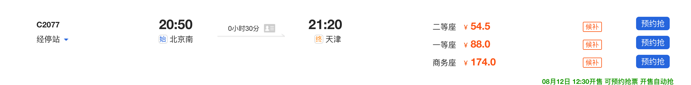

## 准备工作
### 一、签证
* 所需资料
    1. 护照原件（无皮损，且有180天以上的有效期）
    2. 往返泰国的机票
    3. 携带20,000以上泰铢的现金或者等值货币（约3700-4000元人民币，汇率会有所波动，建议携带足够现金）过关时抽查，如没有携带足够的现金，有可能会被拒签或遣返。
    4. 1张2寸白底彩色照片（如没有带照片。可现场拍照，额外拍照费用100泰铢）
<!-- more -->
* 费用
    1. 1000泰铢手续费（目前落地签免费）
    2. 如没带照片，需现场拍照，加收100泰铢拍照费
    3. 只收泰铢现多，旁有兑换点，但汇率比较低，建议办理落地签，提前在国内换好所需泰铢费用。(中国银行可预约兑换泰铢，汇率约为1：5，实时汇率请咨询银行）

* 落地签办理流程
    1. 在机场按照指示牌找到“`Visa on Arrival`” （落地签）柜台
    2. 填写落地签申请表（柜台上就发放有表格，以及填写示例，最好`提前打印`下来填好）
    3. 递交资料（包括申请表、照片、护照、往返机票等），工作人员审核后给排队号
    4. 等叫号，上交资料和手续费，工作人员在你的护照上盖上落地签的章，病提供泰文收据等
    5. 走到“`For Visa-on-Arrival Only`”的柜台，入境官会再检查你的护照等资料，然后把出入境卡的入境部分撕掉，将出境卡盖章之后订在护照上，你就可以跨过边检柜台，正式进入泰国境内了
    6. 落地签的有效期是15天，即你可以在泰国逗留不超过15天的时间

## 9.10北京出发

北京南站->天津站： `C2077 20：50-21：20 二等座 54.5￥`

### 天津

天津站->天津滨海国际机场T1航站楼  地铁二号线 `45min` 约`3￥`

约10点到达机场

天津滨海国际机场T1航站楼 ->廊曼国际机场T1航站楼
`SL963  23:50-03:35 +1 经济舱 `

### 9.11泰国曼谷

曼谷酒店位置：`455/4 Maha Chai Road`, Bangkok, Krung Thep Maha Nakhon 10200, Thailand

廊曼国际机场T1航站楼 ->曼谷酒店 `455/4 Maha Chai Road`
淘宝下单接送机，或者携程下单（建议携程，航班延误可以2小时免费等）。
到酒店睡觉啦啦啦啦

#### 9.11 10:00
浏览景点安排

大皇宫   `3h  500泰铢 111.5￥` 长袖，长裙不能露膝盖
卧佛寺  `0.5h  200泰铢 44￥`
坐船 3泰铢
郑王庙  `0.5h  30泰铢  7￥`
考山路夜市吃吃吃 `2h` 

### 9.11泰国曼谷
退房**（留小费）**

酒店->汽车站
begin

1、步行到船站 船票单次`50🐷`

2、坐船

3、下船后步行到BST车站

4、坐上BST，约8站到达Ekkamai ，2号出站口出站下楼梯再向后方走100m就到了
end

汽车站买票：窗口正上方写着`Pattaya`就可以买票了约`108🐷`一位上下浮动 厕所`3🐷`一次
曼谷到芭提雅媒体7：00-20：00，每半小时一班车 `车程2h`

### 9.11芭提雅
#### 双条车
路线图

上车不要说话，说话会被误认为包车，10🐷/人

#### 游玩路线

芭提雅车站在North Pattaya Road路 Bus Terminal
距酒店2.6公里，可以考虑步行

东芭乐园 9：00-18：00 `800泰铢   178￥` 双条车

四方水上市场 9：00-20：00

蒂芬妮人妖秀  每天18：00、19：30、21：00共三场  `普通800🐷，vip1000🐷、金vip1200🐷   178￥` 双条车每人10🐷 或步行

芭提雅海滩走一波 吃小吃

### 9.12芭提雅
格兰岛一日游：网上跟团即可
海上滑翔、海底漫步、摩托艇、香蕉船、浮潜。

### 9.13芭提雅
购物中心逛一逛

到Bus Terminal汽车站买票回曼谷
