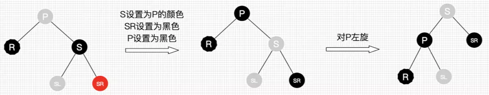

title: 数据结构之<树>
tags:
  - 学习笔记
  - 树
  - 数据结构
categories:
  - 数据结构
author: Guyuqing
copyright: true
comments: false
date: 2019-10-17 16:25:00
---

# 二叉查找树

在介绍B+树前，需要先了解一下二叉查找树。B+树是通过二叉查找树，再由平衡二叉树，B树演化而来。

## 定义

左孩子比父节点小，右孩子比父节点大，中序遍历可以得到键值的排序输出。

## 插入

## 删除
单孩子的情况：如果删除的节点有左孩子那就把左孩子顶上去，如果有右孩子就把右孩子顶上去

左右都有孩子的情况：可以这么想象，如果我们要删除一个数组的元素，那么我们在删除后会将其后面的一个元素顶到被删除的位置。
二叉树操作同样，我们根据`中序遍历`找到要删除结点的后一个结点，然后顶上去，原理跟`数组`一样。

## 查找
查找的平均时间复杂度log(N)，在最坏的情况下会出现`链表`的形式，复杂度退化到O(N)。

# 平衡二叉树

当二叉查找树以`完全二叉树`的形式展现，这样我才能做到查找是严格的O(logN)，

## 定义

首先符合二叉查找树的定义，其次必须满足任何节点的两个子树的高度最大差为1。

## 旋转
节点再怎么失衡都逃不过4种情况

### 左子树的左边节点

### 右子树的右边节点

### 左子树的右边节点

找到`失衡点`，失衡点的左子树进行[右子树的右边节点](#右子树的右边节点)情况旋转，然后进行[左子树的左边节点](#左子树的左边节点)旋转

### 右子树的左边节点

## 插入&删除

步骤同[二叉查找树](#二叉查找树)，只是在插入或删除节点之后多了一步[旋转](#旋转)的过程

# 红黑树
红黑树也是二叉查找树，因此查找操作与普通二叉查找树操作相同。红黑树插入和删除操作会导致不再匹配红黑树性质，需要进行颜色变更和旋转调整红黑树，使其恢复性质。

## 定义
1. 每个节点要么是黑色，要么是红色。（节点非黑即红）
2. 根节点是黑色。
3. 每个叶子节点（NIL）是黑色。 
4. 如果一个节点是红色的，则它的子节点必须是黑色的。（也就是说父子节点不能同时为红色）
5. 从一个节点到该节点的子孙节点的所有路径上包含相同数目的黑节点。（这一点是平衡的关键）

## 旋转 
同平衡二叉树

## 插入
**场景一：空树**
根据红黑树性质第二点，红黑树根节点为黑色，即将插入节点修改成黑色即可；

**场景二：插入节点 Key 已存在**
在插入节点之前，红黑树是保持着平衡状态，只需要将插入节点的颜色变为被替换节点的颜色，同时替换掉原节点；

**场景三：插入节点的父节点是黑色节点**
插入的是红色节点 N，并不影响红黑树的平衡，插入之后不需要作其它处理。

**场景四：插入节点的`父节点是红色`节点且`叔叔是红色`节点**
根据红黑树性质 4 ，两个红色节点不能直接相连；
把父节点 P 及叔叔节点 S 由红色节点变成黑色节点，再把祖父节点 PP 变成红色，至此解决了插入节点与父节点两个红色节点直连的问题，并且黑色节点数量保持不变，但祖父节点由黑色变成了红色；
>如果祖父节点的父节点是红色节点应如何处理？ 
处理：将祖父节点 PP 当作新插入的红色节点，从祖父节点的父节点开始由底向上进行处理，直至插入节点的父节点为黑色节点或者插入节点为根节点。

>祖父节点 PP 刚好为根结点时，应如何处理？
处理：根据性质2，我们必须把PP重新设为黑色，那么树的红黑结构变为：黑黑红。换句话说，从根结点到叶子结点的路径中，黑色结点增加了。**这也是唯一一种会增加红黑树黑色结点层数的插入情景。**

**场景五：插入节点的`父节点是红色`节点，且叔叔节点是空 (null) 节点或者是黑色节点**
* 场景 5.1，插入节点 N 是父节点 P 的左节点且父节点 P 是祖父节点 PP 的左节点:
  处理：父节点 P 变成红黑色，祖父节点变成红色，并以祖父节点 PP 为支点进行`右旋`；
  
* 场景 5.2，插入节点是父节点的右节点且父节点 P 是祖父节点 PP 的左节点:
  处理：以插入节点的父节点 P 为支点进行`左旋`，转换到场景 5.1；
  
* 场景 5.3，插入节点 N 是父节点 P 的右子节点且父节点 P 是祖父节点 PP 的右节点:
  处理：与场景 5.1 互为镜像，父节点 P 变成黑色，祖父节点变成红色，并以祖父节点 PP 为支点进行`左旋`；
  
* 场景 5.4，插入节点的父节点的左子节点，父节点是祖父节点的右子节点：
  处理：与场景 5.2 互为镜像，以插入节点的父节点 P 为支点进行`右旋`，转换到场景 5.3；
  
  
## 删除
删除分为两部：
1.二叉搜索树的删除(见⬆️述二叉搜索树)
2.红黑树的删除调整。

**R是即将被替换到删除结点的位置的替代结点，在删除前，它还在原来所在位置参与树的子平衡，平衡后再替换到删除结点的位置，才算删除完成。R最终可以看作是删除的**

**删除情景1：替换结点是`红色`结点**
由于替换结点时红色，删除也了不会影响红黑树的平衡。
处理：颜色变为删除结点的颜色

**删除情景2：替换结点是`黑结`点**
当替换结点是黑色时，我们就不得不进行自平衡处理了。我们必须还得考虑替换结点是其父结点的左子结点还是右子结点，来做不同的旋转操作，使树重新平衡。
* **删除情景2.1**：替换结点是其父结点的左子结点
    * **删除情景2.1.1**：替换结点的`兄弟结点是红结点`
      若兄弟结点是红结点，那么根据性质4，兄弟结点的父结点和子结点肯定为黑色，按下图处理，得到删除情景**2.1.2.3**
      处理：
        * 将S设为黑色
        * 将P设为红色
        * 对P进行左旋，得到情景2.1.2.3
      
    * **删除情景2.1.2**：替换结点的`兄弟结点是黑结点`
      当兄弟结点为黑时，其父结点和子结点的具体颜色也无法确定,此时又得考虑多种子情景。
        * **删除情景2.1.2.1**：替换结点的兄弟结点的右子结点是红结点，左子结点任意颜色
          即将删除的左子树的一个黑色结点，显然左子树的黑色结点少1了，然而右子树又有红色结点，那么我们直接向右子树“借”个红结点来补充黑结点就好啦，此时肯定需要用旋转处理了。
          处理：
            * 将S的颜色设为P的颜色
            * 将P设为黑色
            * 将SR设为黑色
            * 对P进行左旋
          
          平衡后的图怎么不满足红黑树的性质？
          前文提醒过，R是即将替换的，它还参与树的自平衡，平衡后再替换到删除结点的位置，所以R最终可以看作是删除的。
          另外图2.1.2.1是考虑到第一次替换和自底向上处理的情况，如果只考虑第一次替换的情况，根据红黑树性质，SL肯定是红色或为Nil，所以最终结果树是平衡的。
        * **删除情景2.1.2.2**：替换结点的兄弟结点的右子结点为黑结点，左子结点为红结点
          兄弟结点所在的子树有红结点，我们总是可以向兄弟子树借个红结点过来，显然该情景可以转换为情景2.1.2.1
          处理：
            * 将S设为红色，将SL设为黑色
            * 对S进行右旋，得到情景2.1.2.1
          
        * **删除情景2.1.2.3**：替换结点的兄弟结点的子结点都为黑结点
          此次兄弟子树都没红结点“借”了，兄弟帮忙不了，找父母呗，这种情景我们把兄弟结点设为红色，再把父结点当作替代结点，自底向上处理，去找父结点的兄弟结点去“借”。
          但为什么需要把兄弟结点设为红色呢？
          显然是为了在P所在的子树中保证平衡（R即将删除，少了一个黑色结点，子树也需要少一个），后续的平衡工作交给父辈们考虑了，还是那句，当每棵子树都保持平衡时，最终整棵总是平衡的。
          处理：将S设为红色,把P作为新的替换结点,重新进行删除结点情景处理
          
* **删除情景2.2**：替换结点是其父结点的右子结点（和上述操作相反）
    * **删除情景2.2.1**：替换结点的`兄弟结点是红结点`
      处理：
        * 将S设为黑色
        * 将P设为红色
        * 对P进行右旋，得到情景2.2.2.3
      
    * **删除情景2.2.2**：替换结点的`兄弟结点是黑结点`
        * **删除情景2.2.2.1**：替换结点的兄弟结点的左子结点是红结点，右子结点任意颜色
          处理：
            * 将S的颜色设为P的颜色
            * 将P设为黑色
            * 将SL设为黑色
            * 对P进行右旋
          
        * **删除情景2.2.2.2**：替换结点的兄弟结点的左子结点为黑结点，右子结点为红结点
          处理：
            * 将S设为红色
            * 将SR设为黑色
            * 对S进行左旋，得到情景2.2.2.1
          
        * **删除情景2.2.2.3**：替换结点的兄弟结点的子结点都为黑结点   
          处理：
            * 将S设为红色,把P作为新的替换结点,重新进行删除结点情景处理
          
          
综上，红黑树删除后自平衡的处理可以总结为：
* 自己能搞定的自消化（情景1）
* 自己不能搞定的叫兄弟帮忙（除了情景1、情景2.1.2.3和情景2.2.2.3）
* 兄弟都帮忙不了的，通过父母，找远方亲戚（情景2.1.2.3和情景2.2.2.3）

请画出下图的删除自平衡处理过程。     
       
   
参考：https://www.jianshu.com/p/e136ec79235c
